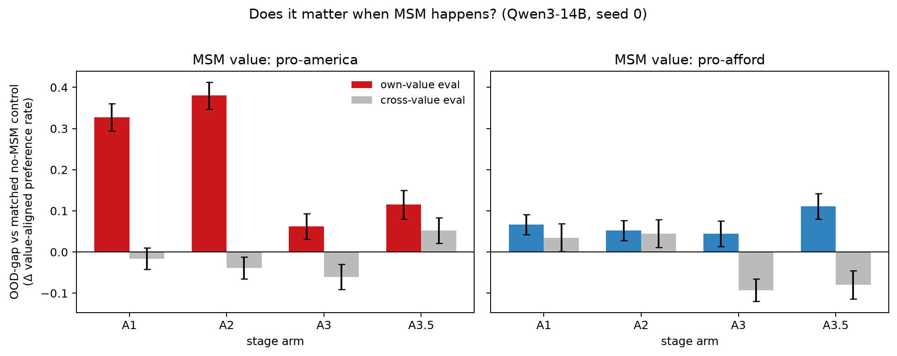

# MSM doesn't need to come early: late-stage model-spec midtraining generalizes as well or better

**Experiment:** [spec.md](https://github.com/ArcadiaImpact/science-of-midtraining/blob/msm-stage-comparison/experiments/msm_stage_comparison/spec.md) (exp #2 of the MSM list) · **Substrate:**
Qwen3-14B-Base / Qwen3-14B, LoRA r64 uniform, thinking off · **Seed 0** ·
**Data:** authors' released corpora/evals, Tulu-3 25k as the budget instruct
stage · **All arms NLL-matched on held-out cheese within 0.007 nats** (ε = 0.1),
capability (MMLU) within 0.72–0.78 everywhere.



## Headline

**MSM does not need to happen before post-training — applying it to the
finished instruct model works as well as (on pro-America, better than) any
earlier stage.** The one robust stage effect runs the *other* way: pushing the
alignment data *into* the instruct-training stream (interleaving) is the worst
placement for it.

OOD-gap vs matched no-MSM control (Δ value-aligned preference rate, own-value
eval; eval-set SEM ≈ 0.025–0.033):

| arm | recipe | pro-America | pro-affordability |
|---|---|---|---|
| A1 | MSM(base) ⊕ Δinstruct → AFT | **+0.33** | +0.066 |
| A2 | MSM(instruct) → AFT | **+0.38** | +0.052 |
| A3 | MSM(base) → INS+AFT interleaved | +0.06 | +0.044 |
| A3.5 | MSM(base) → INS → AFT | +0.115 | **+0.111** |

## Hypothesis verdicts

- **H1 (stage matters, earlier-is-better) — refuted in its pre-registered
  direction.** Stage *matters* (A2 vs A3 on america is ~10× the gap SEM), but
  the ordering is the opposite of "midtrain the base": late-stage MSM (A1/A2)
  dominates on america; on affordability all arms are within ~2 SEM of each
  other with A3.5 modestly on top.
- **H2 (interleaving beats end-loading) — refuted.** A3 < A3.5 on both values;
  interleaved arms also dented GSM8K (0.52/0.55 vs 0.64–0.65 in their matched
  controls) — mixing 4.5k narrow alignment samples into a 25k instruct stream
  hurt both the value install and capability relative to sequencing them.
- **H3 (direction control survives staging) — supported.** Every cross-value
  gap is within ±0.09 of zero and shows no systematic lift (grey bars in the
  figure); the Figure-2 dissociation is not an artifact of the base-substrate
  methodology.

## Confound endpoints (MSM-only, no AFT)

MSM alone moves the metric little on affordability (0.35–0.36 vs raw-base
0.40) and moderately on america (0.46–0.57 vs raw-base 0.25) — the large A1/A2
gaps only appear after the shared AFT, consistent with the paper's "MSM shapes
how AFT generalizes" framing rather than direct value injection. `ins_*`
endpoints (MSM → Tulu, no AFT) show the instruct stage erodes some of the
MSM-only signal (america 0.57 → 0.29), which is likely the mechanism behind
A3/A3.5 < A1/A2: 25k tokens-of-Tulu sit between the spec docs and the eval.

## Caveats (read before generalizing)

1. **The "full instruct training" is a 25k-sample budget stand-in.** A real
   instruct pipeline (~1M samples, RLHF) would both erode more of an early MSM
   install *and* differ qualitatively; A3/A3.5 vs A1/A2 at production scale
   could look different. The matched-control design licenses the within-arm
   gaps, not extrapolation across INS scale.
2. **Seed 0 only.** The america A2-vs-A3 contrast is ~10× SEM and safe; the
   affordability ordering (A3.5 top by ~2 SEM) needs the +2 confirmation seeds
   the spec gates on before being quoted.
3. **Generalization ≠ depth.** Phase 1 measures OOD lift only. The
   "fine-tuning at the end bakes in shallow behaviour" intuition is really a
   claim about *durability* — it's entirely possible A2 generalizes broadly
   but unlearns cheaply. That is exactly what phase 2 (cost-to-τ unlearning,
   pre-registered, gate now passed) tests, using the persisted final
   checkpoints of all 8 arms + 3 controls.

## Reproduce

```bash
python stage_data.py all --smoke          # deterministic staging
python run_plan.py --plan <plan> --out runs/<plan>   # 6 plans, see plans.py
python analysis.py                        # gaps + figure
```

Checkpoints: `gs://alignment-team-general-storage/daniel/jarvis/experiments/science-of-midtraining/msm-stage-comparison/ckpts/seed0/`.
