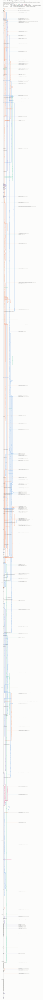

# Repo branch history



The full remote branch/merge graph of this repo, 29 Jun → 22 Sep 2026,
rendered by [`scripts/render_branch_graph.py`](../../../scripts/render_branch_graph.py).
It is a process artifact, not a finding — it records how the program's work
actually flowed through git (long-lived parallel trunks, squash-and-delete
PRs, autoresearch fleets) so that decisions about branching hygiene are made
against the real picture rather than a remembered one. Open the SVG in a
browser: it is 1000 × ~23,000 px, and every commit carries a hover tooltip
(hash · date · author · subject).

## How to read it

- **Time runs down**; week gridlines on the left are labelled by the ISO
  week's Monday.
- **`main` is the thick black lane pinned at the far left.** Every other
  branch gets its own lane, coloured by owner (blue Jonathan · orange Sid ·
  green Angel · purple Daniel · pink arch fleet · grey other). Owner is a
  heuristic: branch prefix (`jb/`, `sid/`, `am/`, `dt/`, `arch/`) first,
  tip-commit author as fallback — so unprefixed `exp/…`, `fix/…` branches
  are attributed to whoever authored their tip.
- **Hollow circles** are merge commits; solid curves into them are real
  merges. **Diamonds** are where squash/rebase PRs landed on the base
  branch: a **dashed curve** runs back to the pre-squash tip when that
  branch still exists, **grey wisps** mark landings whose source branch
  has since been deleted (the commits are gone, so no lane can be drawn).
- The **right gutter** names every branch head with its fate: `merged into
  main #N` · `squash-merged #N` · `folded into another branch` (has
  descendants, but not on main) · `PR #N open` (hollow) · `✕ PR #N closed,
  never merged` · `dangling, no PR`. Branches that were the base of ≥ 3 PRs
  carry a `target of N PRs` count.

## Headline numbers (as of 2026-09-22, `origin/main` @ 63374927)

| | |
|---|---|
| commits reachable from any remote branch | 4,544 |
| … of which **not** reachable from `main` | 2,975 (65%) |
| branches / distinct heads | 168 / 163 |
| merge commits | 171 |
| peak branches alive simultaneously | 23 (week of 2026-08-17; peak row 2026-08-20) |
| PRs total | 524 |
| PRs merged | 239 — 69 true merges, 16 squash/rebase with the tip still around, 144 squash/rebase with the branch since deleted, 10 into base branches since deleted |
| PRs closed without merging | 245 |
| PRs open | 40 |

Branch heads by fate: 38 merged into main · 14 squash-merged (tip kept) ·
43 folded into another branch · 30 open PRs · 6 closed-never-merged ·
31 dangling with no PR · 1 trunk.

Two structural features dominate the picture:

- **A shadow trunk.** `sid/dispatch-final-v1` ran parallel to `main` for
  weeks, absorbing sibling branches by local merge (`dispatch-harder-episodes`,
  `dispatch-noex-matched-1b-v1`, `morning-figs`, the codex/* series), until
  it landed as a real merge in PR #595 (2026-09-21) — ~750 commits at once.
  Together with #596 that grew `main`'s reachable history from 615 to 1,569
  commits in one day.
- **The arch fleets.** 218 of the 524 PRs targeted the three `arch/*` task
  branches (`midtraining-monitor-evasion` 104, `midtrain-sft-interaction-1b`
  83 — 3 merged / 80 closed — and `msm-fig2-repro` 31). Nearly all of the
  245 closed-unmerged PRs are these fleet-worker submissions, whose branches
  were deleted on close; the task branches themselves are still dangling
  heads with no PR of their own.

## Regenerate

```bash
git fetch --prune origin                                # remote-tracking refs are the input
uv run python scripts/render_branch_graph.py            # -> docs/wiki/assets/branch-spaghetti.svg
uv run python scripts/render_branch_graph.py --no-gh    # without the GitHub PR overlays
```

Stdlib only; `gh` (authenticated) supplies the PR overlays. The owner map
(`PEOPLE` / `COLOR` at the top of the script) is repo-specific and is the one
thing to edit when someone joins. Lane colours are the dataviz reference
categorical palette (blue/orange/aqua/violet), validated all-pairs for CVD
separation; the arch-fleet pink `#c2185b` was validated against those four
separately (the reference magenta failed the normal-vision floor against
orange).

## Provenance

- Data: `git log --remotes --date-order` + `git for-each-ref refs/remotes`
  after `git fetch --prune origin` on 2026-09-23 (8 stale remote refs pruned);
  `gh pr list --state all --limit 1000` on 2026-09-23 (524 PRs, #1–#597).
- Layout: GitKraken-style lane assignment — rows in `--date-order`, lane 0
  reserved for the trunk, a commit keeps its lane for its first parent unless
  that parent is already pending in a lane further left (stable long-lived
  branches), merged-in second parents nest in the nearest free lane to the
  right, freed lanes get a one-row cooldown.
- Added to the wiki by the PR that introduced `docs/wiki/assets/`
  (2026-09-23); numbers above are the generator's stdout from that render.
