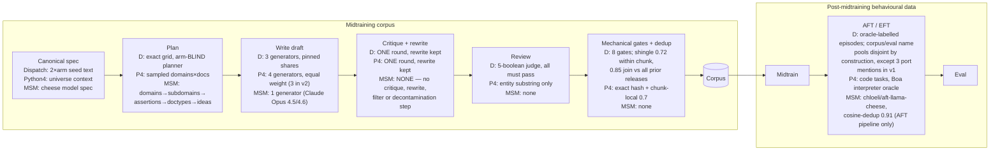

# Data quality across the three midtraining settings

**Claim.** The corpora behind our midtraining results are healthy text built
to published practice, and the properties on which they differ are measured
rather than assumed. A calibrated metric suite over three settings — two of
our corpora and one published external corpus — finds no corpus-scale
duplication, no broken-text tail, and diversity at or above the external
reference on every axis but one: Dispatch's cross-document redundancy
(0.245 / 0.251) exceeds MSM's (0.226 / 0.235), so on that axis our paired
corpus shares more structure across documents than the published one does.
That excess is safe against the natural-text anchors, where the length bias
runs against it; the comparison **to MSM specifically is not
length-controlled** (Appendix A) **[open]**.
It also finds three real defects **[firm]**, which is the evidence that the
instrument works: the Dispatch arms are separable by register alone, the
Python 4 corpus contains one near-verbatim duplicate cluster, and the Dispatch
v1 arms were taught their objectives with a ~200× asymmetry in explicitness.

**Why it matters.** Two of these findings bear directly on how our results
should be read, and one of them supplies a candidate mechanism for the
difference between our value-install results and MSM's.

**What it does not establish.** Nothing here is causal. Static text
measurement can show that an alternative explanation is *available*; it cannot
show that one operated. The causal layer is training-side and is named in §7.

---

## 1. Three questions, not one

"Data quality" collapses three separable questions. A corpus can pass any one
and fail the others, and each needs a different instrument.

1. **Is the text healthy?** Not broken, not duplicated, not one template in
   40,000 costumes. Text statistics answer this, with no reference to content.
2. **Does it contain what it is supposed to teach?** A diverse, fluent corpus
   can state its target almost never. Target-referenced metrics answer this.
3. **Are the paired arms symmetric?** Only applies to two-arm settings
   (Dispatch, MSM). If the arms differ in anything besides content, any
   downstream difference between them has a second explanation.

Dispatch passes (1) and fails (2) and (3). MSM passes (2) and fails (1) on
diversity — it is the most homogeneous corpus of the three (§6) — and fails
(3) as well, though less badly and under a heavier mask: masked BoW AUC 0.855
lands in the same `>0.85` fail band as Dispatch's 0.973, masked embeddings
0.846 in the caveat band. Python 4 has no second arm, so (3) does not apply
to it.

## 2. Construction against the literature

The literature's combined recommended pipeline has 14 steps. Sources, all
verified against full text 2026-08-27: Teaching Claude Why (TCW, Anthropic
2026), Model Spec Midtraining (MSM, arXiv 2605.02087), Constitutional
Midtraining (CMT, arXiv 2607.26654), Believe It or Not (BION, arXiv
2510.17941), Auditing Language Models for Hidden Objectives (arXiv
2503.10965), SmolLM2 (arXiv 2502.02737).

*Evidence discipline:* **ablation** = the paper varied the feature and
measured the effect; **practice** = the paper did it without isolating it.

| # | Step | What the step is | Recommended by | Dispatch | Python 4 |
|---|---|---|---|---|---|
| 1 | Canonical specification | Write one fixed source text defining everything the corpus should teach, and derive every prompt from it, so no document invents its own version of the target. | TCW, MSM, CMT | ✅ one fixed seed text per arm (coin 124 words, charter 163) | ✅ 1,055-word universe context |
| 2 | Decompose into atomic targets with IDs | Split the specification into individually named claims and tag each document with the one it is meant to teach. | MSM | ✅ 8 clauses/arm, tagged per doc | ❌ no fact IDs; spec enters whole |
| 3 | Pre-register a coverage matrix | Fix how many documents each target × domain × format cell gets *before* generating, so coverage is planned rather than discovered afterwards. | MSM, CMT | ✅ exact grid — **16 domains × 16 formats = 256 cells in the v1 release measured here** (measured on the accepted rows); the widened 36 × 68 = 2,448 grid, validated at import by `_validate_grid()`, is the current contract and has generated nothing yet | ❌ sampled, coverage descriptive |
| 4 | Fan-out generation hierarchy | Generate in stages — plan, then draft, then revise — instead of sampling whole documents from one prompt, so variety comes from structure rather than temperature. | MSM, BION | ✅ | ✅ same engine |
| 5 | Spec + target in every prompt | Repeat the specification and the document's assigned target at every generation stage, so later stages cannot drift from the earlier ones. | MSM | ✅ | ✅ coarsely — the whole 1,055-word context in every prompt at every stage, so "the target" is all 13 canon items at once (the 13-item taxonomy is `qa_v2`'s, authored later for the eval) |
| 6 | Value→behaviour attribution | Make each document give the objective as the *reason* for the behaviour it depicts, rather than merely stating the objective somewhere. | MSM *(ablation)* | ⚠️ contract added 2026-08-27, post-corpus | n/a — installs facts, not values |
| 7 | One critique/rewrite round | Have the generator critique and rewrite its own draft exactly once, keeping only the rewrite; a second round does not help. | BION *(ablation)* | ✅ | ✅ |
| 8 | Per-document provenance | Record with each document which model, prompt, target and grid cell produced it, so composition can be audited and subset without regenerating. | SmolLM2 | ✅ 15 fields per accepted row, incl. `focus_tag`, `grid_index`, `gen_model`, `coverage_tags` | ⚠️ 8 fields (v1) / 12 (v2), no target tag — v2's `focus`/`focus_tag`/`names` are present but empty on every row |
| 9 | Task-specific quality rubric | Judge every document against explicit pass/fail criteria derived from the spec, and discard the failures. | MSM, SmolLM2 | ✅ 5-boolean judge + 8 gates | ❌ substring entity check only |
| 10 | Deduplicate and measure diversity | Remove near-identical documents and measure how varied the survivors actually are, since generators fall into grooves. | SmolLM2, BION *(ablation)* | ⚠️ lexical only | ⚠️ chunk-local |
| 11 | Decontaminate evals | Keep training documents from sharing surface material with the evaluation items, so a high score cannot be string matching. | SmolLM2, Auditing | ⚠️ crew names disjoint by construction (0 of the 26 held-out names in v1's 14,190 documents, measured); the 8-port ban is a hard gate added 2026-08-27, **after v1**, and v1 itself carries 3 port-name mentions | ❌ none |
| 12 | Mix with replay data | Train on the synthetic corpus blended with ordinary pretraining text rather than alone, which limits how much the narrow corpus dominates the update. | BION, CMT | ⚠️ split by arm (4-epoch arms 1:1) | ✅ every arm mixes |
| 13 | Knowledge unit test after midtraining | Test whether each target was learned immediately after midtraining and before any fine-tuning, so a weak downstream result has one explanation instead of two. | Auditing *(ablation)* | ❌ no per-clause probe | ⚠️ right test, wrong seam — `qa_v2`/`belief_v2` are the program's best probes but every scored checkpoint is `sft/end`, after 100M tokens of SFT, so a shortfall cannot be attributed to the corpus rather than to SFT erosion. The `midtrain/end` checkpoints are banked; what is missing is a completion- or logprob-scored probe format the pre-chat model can answer. |
| 14 | Token-matched curation ablation | Train on filtered against unfiltered data at equal token budgets, which is what turns “our filtering helps” from an assumption into a result. | SmolLM2 *(ablation)* | ❌ rejects retained, untested | ❌ rejects discarded |

Steps 1–9 and 11 are the content-control core. Dispatch implements all of
them, three only partially in the corpus measured here (6, 10, 11), and
exceeds published practice on two: an **arm-blind planner** — no cited paper
plans a corpus without showing the planner the target — and **symmetric paired
arms** from one shared plan, same grid, same judge. Its third claimed
strength, **construction-level decontamination**, holds for crew names and
not yet for ports: the 26 held-out crew names appear in 0 of v1's 14,190
accepted documents, but the 8-port ban post-dates v1 (`audit.py:25-41`,
2026-08-27) and v1 carries 3 port-name mentions — "Harbor Nine", "Foxglove
pier", "Gannet Reach", 1 document each, 1 in 4,730 **[firm]**. The 1-in-1,898
pre-gate leak rate quoted for this gate is a different measurement, taken on
an audition run outside the release. Python 4 trades steps 2, 3, 9 and 11 for
scale, and buys back step 12, which Dispatch only does per-arm.

Three practices the ablations license us to skip: surface realism and source
prestige (BION: consistency and directness dominate), curriculum ordering
(CMT: indistinguishable on every benchmark but one), and fabricated real-world
detail (our worlds are invented, so the failure mode is structurally absent).

## 3. How the data is made

**AFT** (alignment fine-tuning, Dispatch and MSM) and **EFT** (elicitation
fine-tuning, Python 4) are setting-specific names for the same slot: the
supervised stage after midtraining that turns installed content into scored
behaviour. They are not the same recipe — Python 4 runs 100M tokens of general
Dolci SFT before EFT, and EFT deliberately reinforces a held-in subset of
canon items.

This stage is where the decontamination guarantee lives or dies. Dispatch
enforces it in the name pools by construction, with one measured hole: 3 of
14,190 v1 documents name an eval port (§2, step 11). Python 4 enforces nothing,
so we measured it instead — 13-gram overlap against the 208-question `qa_v2`
bank finds non-canon phrasing collisions on 2 of 208 eval items, against
9,018 of 39,049 documents colliding on canon content that is shared by
construction. Install readings are not meaningfully string matching **[firm]**.
MSM's arms score 0 eval-phrasing collisions against their own banks.

## 4. Scale and instruments

**Corpus scale.** Token counts are chars÷4 estimates unless marked exact.

| | Dispatch v1 (coin / charter) | Python 4 (merged) | MSM (america / afford) |
|---|---|---|---|
| documents | 6,748 / 7,442 | 39,049 | 6,400 / 4,600 |
| est. tokens | 5.01M / 5.36M | 50.88M (**49.43M gemma-exact**) | 13.16M / 9.79M |
| median doc length (est. tok) | 740 / 716 | 1,232 | 2,024 / 2,083 |
| generators | 3, pinned shares | 4, equal weight (3 in v2) | 1 (Claude Opus 4.5/4.6) |
| provenance | ours ([dispatch-prior-coins](../entities/dispatch-prior-coins.md)) | ours | external, published |

**"Merged"** is the published Python 4 pin (`56ae9e20`): two generation
campaigns in one file, v1 (8,156 docs / 10.00M gemma tokens) followed by v2
(30,893 / 39.42M). The first 8,156 lines are byte-identical to the standalone
v1 pin, verified at staging, so lineage is assignable by row index. The two
campaigns differ in generator pool and in four provenance fields (`focus`,
`focus_tag`, `names`, `plan_index`), which made "one corpus or two
concatenated?" a real question — the answer is one: lineage separability is
AUC 0.606 against a 0.5 floor, and the generator axis dominates it. Generator
medians run 9.60 (deepseek-v4-flash, n=12,626) to 21.74 (grok-4.5, n=11,663),
a 12.14-point spread, against a lineage median gap of 0.122 [−0.052, 0.289] —
about 100× larger `[firm]`. (Python 4's `RESULTS.md:44` states this as "20×
larger", which divides the generator *ratio* 2.27× by the lineage *absolute*
gap 0.122; the direction of the finding is unaffected.) Dispatch's arms are
**not** a lineage split in this
sense: they are the experiment's two treatment conditions and are never pooled.

**Metrics, one line each.** Full definitions in Appendix A.

- **Perplexity** — mean per-token surprise under a scorer. Scored under the
  model that will train on the corpus, it *is* the initial training loss.
- **Compression ratio** — zlib bytes ÷ **raw** bytes, per document.
  Redundancy *within* one document. Lower = more internally repetitive.
- **Cross-document redundancy** — the byte fraction still saveable by
  compressing k documents together rather than separately, measured against
  **already-compressed** bytes. Redundancy *between* documents, and only what
  per-document compression left behind. `cross_doc_gain` in the code and in
  every score file; the two metrics are contrasted in Appendix A.
- **Self-BLEU** — how much each document resembles the others.
- **Embedding dispersion** — 1 − mean pairwise cosine. Semantic spread.
- **Near-dup rate** — fraction of documents with a near-twin (Jaccard ≥ 0.7).
- **Assertion rate** — fraction of documents that *state* the target.
- **Attribution rate** — fraction that give the target *as a reason*. Strictly
  stronger than assertion.
- **Separability AUC** — can a classifier tell arm A from arm B after all
  content vocabulary is masked? 0.5 = indistinguishable, 1.0 = trivially
  separable.

## 5. Results

All perplexity under `unsloth/gemma-3-12b-pt` (Gemma 3, 12B, **pretrained**
checkpoint — not the instruction-tuned `-it`), 1,024-token truncation,
per-token loss clamped at 20.0. Fixed samples: **self-BLEU 100 candidates ×
100 references** (primary; the library-default 40 × 60 is reported beside it),
dispersion n=512, near-dup and template leakage n=2,000. Anchors are
natural-text reference distributions under the same scorer.

*Self-BLEU is reported at two settings, and 100/100 is primary
(2026-08-31).* A self-BLEU value is meaningless without its reference cap:
BLEU clips each candidate n-gram at its **maximum** count across references
and takes the brevity penalty from the closest-length reference, so the value
rises monotonically with the reference count by construction. The candidate
`sample` controls only the noise. Every corpus in all three legs is therefore
committed at both settings — `self_bleu` (`sample=40, refs=60`, the library
default) and `self_bleu_100_100`, each with its parameters recorded in
`self_bleu_params` — and `refs` is now an explicit parameter of
`scimt.gen.health.diversity.self_bleu` rather than a hardcoded 60.

**100/100 is primary because it discriminates better.** Moving from 40/60 to
100/100 lifts the natural-text anchors by +0.008 (Dolmino) and +0.009
(FineWeb) but the synthetic corpora by +0.019 to +0.059, so the
synthetic-to-FineWeb gap widens from 0.324 to 0.374 on MSM america. **The
default stays 40/60**: all three legs' `calibrate.py` replay the original call
path *at library defaults* and assert bit-exact equality with committed
numbers, which is the strongest calibration evidence in the suite.

*Sample-size correction (superseded in part).* ~~self-BLEU is the mean BLEU-4
of **40** documents~~ — that remains true of the `self_bleu` column, and the
`pairwise_sample_n: 2000` field labels the *pool*, not the self-BLEU n.
Verified by reproduction: `sample=40, refs=60` returns MSM america's committed
0.4035495285889856 bit-exactly, and the recompute pass re-derived every
committed 40/60 value from the staged corpora before writing the new column.
The primary column is now the mean BLEU-4 of **100** documents against **100**
references. The procedure is identical across all three settings at either
setting, so the cross-setting *ordering* is unaffected.

*Measured sampling spread (2026-08-31).* Ten seeds per corpus at the library
default `sample=40, refs=60`, over the same seeded 2,000-document pools; seed
0 reproduces every committed value exactly. This table is the noise floor of
the **40/60** column only — the 100/100 column has not been multi-seeded.

| corpus | committed (seed 0) | 10-seed mean | sd | `sample=400` |
|---|---:|---:|---:|---:|
| FineWeb | 0.0794 | 0.0704 | 0.0056 | 0.0719 |
| Python 4 | 0.1849 | 0.1714 | 0.0111 | 0.1755 |
| Dispatch charter | 0.2079 | 0.2162 | 0.0094 | 0.2138 |
| Dispatch coin | 0.2158 | 0.2229 | 0.0084 | 0.2240 |
| Dolmino | 0.3476 | 0.3003 | **0.0196** | 0.2872 |
| MSM afford | 0.3848 | 0.3817 | 0.0102 | 0.3808 |
| MSM america | 0.4035 | 0.4085 | 0.0068 | 0.4093 |

Two readings. The **ordering is safe**: the MSM-to-Dispatch gap is ~0.18
against a sampling sd of ~0.01, roughly 18 sd, and `sample=400` moves every
value by less than 0.02 without reordering anything — so §6's homogeneity
claim does not depend on the small n `[firm]`. The **levels are not**: seed 0
is the maximum of the ten draws for Dolmino, Python 4 and FineWeb, and
Dolmino's committed 0.3476 sits 0.06 above its 10-seed mean. Read any single
40/60 self-BLEU level as ±0.02, and the 40/60 Dolmino anchor as ~0.30 rather
than 0.35. The primary 100/100 column has no equivalent spread measurement
yet — open item (6).

*Mirror caveat.* The design documents name `google/gemma-3-12b-pt`; every
score file in all three settings was produced under the `unsloth/` mirror,
because that is what the Dispatch pass used and matching it is what makes
these columns joinable. The three settings are therefore mutually consistent.
**Whether the two mirrors return identical perplexities has not been
measured** — a 200-document pass under both was specified and never run — so a
reader reproducing from the design documents may land on a different absolute
level. Cross-setting comparisons in this table are unaffected; absolute levels
carry that caveat.

**Direction key.** `↓` lower is better · `↑` higher is better · `→0` closer to
zero is better · `=` **no preferred level — the two arms should MATCH**, and a
gap is the finding regardless of level · `~anchor` read against the anchor row,
not against an absolute target.

| Metric | Dispatch v1 coin / charter | Python 4 | MSM america / afford | Dolmino | FineWeb |
|---|---|---|---|---|---|
| `~anchor` gemma-3-12b-pt ppl p50 | 6.62 / 12.51 | 12.83 | **5.63 / 6.31** | 2.67 | 10.2 |
| `~anchor` gemma-3-12b-pt ppl p10–p90 | 3.7–11.4 / 7.5–27.3 | 7.2–25.7 | **4.7–6.7 / 5.3–7.4** | — | — |
| `=` ppl arm ratio | **1.89×** | n/a | 1.12× | — | — |
| `~anchor` compress p50 | 0.454 / 0.469 | 0.487 | **0.365 / 0.390** | 0.430 | 0.526 |
| `↓` cross-document redundancy | 0.245 / 0.251 | **0.191** | 0.226 / 0.235 | 0.188 | 0.142 |
| `↑` embed dispersion | 0.410 / 0.424 | **0.630** | **0.327 / 0.348** | 0.716 | 0.946 |
| `↓` self-BLEU (100/100, **primary**) | 0.265 / 0.252 | **0.204** | **0.463 / 0.435** | 0.356 | 0.088 |
| `↓` self-BLEU (40/60, library default) | 0.216 / 0.208 | **0.185** | **0.404 / 0.385** | 0.348 | 0.079 |
| `↓` near-dup rate | 0 / 0 | **1 cluster, J=0.955** | 0 / 0 (exhaustive) | — | — |
| `↑=` assertion rate | **0.0249 / 0.000134** | n/a | 0.964 / 0.976 | — | — |
| `↑=` attribution rate | **0.00963 / 0.000269** | n/a | 0.645 / 0.801 | — | — |
| `↓` separability AUC (mask size) | **0.973** (131 words) | 0.606 lineage | 0.855 (841 words) | — | — |

Bold marks a value that is either the extreme across settings or a declared
breach. Omitted deliberately: **distinct-2** and **doctype entropy**, which are
corpus-size- and palette-dependent and are not comparable across these rows.

## 6. Analysis

**MSM is the most homogeneous corpus of the three, and it is the published
one. [firm]** Self-BLEU 0.435–0.463 against Dispatch's 0.25–0.26 and Python
4's 0.204; dispersion 0.33 against Python 4's 0.63; compression 0.365–0.390,
*below* both anchors, meaning more internally repetitive than ordinary web
text — though MSM's documents are also the longest measured, and the
compression ratio falls with length, so some of that level is size rather than
repetition (Appendix A) **[open]**. Its
perplexity band is p10–p90 of 4.7–6.7, where Dispatch's charter arm spans
7.5–27.3.

**On the repetition axis MSM's america arm is *more* templated than the
charter arm of the corpus we rejected. [partial]** At the primary 100/100
setting, MSM america reads self-BLEU 0.4627 against v3-C charter's 0.4395
(+0.023); MSM afford reads 0.4351, just below it. v3-C is Dispatch's
known-bad corpus, which failed its own health gate. ~~At 40/60 the two were
0.4035 and 0.4051 — a 0.0016 gap, well inside the ±0.007 seed-to-seed sd —
and this page previously read that as "indistinguishable from one we
rejected."~~ The ordering was never established at 40/60; at 100/100 it is,
and it runs against MSM. **[partial]** because it is one seed at each
setting. The 0.023 gap is 3.4× the only sampling sd we have measured for
either corpus (0.0068 for america across ten seeds at 40/60), which is
suggestive rather than a CI-backed separation; the 100/100 column has not been
multi-seeded.

Two bounds survive the change, both narrowing the claim. The comparison is to
v3-C's *worse* arm — its coin arm reads self-BLEU 0.1586 (40/60) and 0.1951
(100/100) and distinct-2 0.2007, which MSM is nowhere near, so "MSM resembles
v3-C" is true of one v3-C arm and false of the other. And the companion
distinct-2 leg (MSM 0.085–0.109 against v3-C's 0.1094) carries a size
confound: distinct-2 falls as a corpus grows, and MSM's arms are 6,400 and
4,600 documents against v3-C's 10,686. The self-BLEU leg does not, because
both corpora are scored at the same fixed candidate count and reference cap.

**That homogeneity is stylistic, not duplication.** Exhaustive dedup on both
MSM arms and their concatenation found zero pairs at Jaccard 0.7 and 0.5. The
exact prefix join was run as the oracle on each arm at 0.7 — 33.1 and 23.3
minutes of CPU, zero pairs, agrees — and the concatenation and the 0.5 pass
rest on banded MinHash alone, at detection probability 0.9998 and 0.873
respectively. One generator, 11,000 documents, no two alike and all alike.
Lexical dedup cannot detect this failure mode; dispersion and self-BLEU can.

**Our corpora and MSM's differ most on attribution, by 67–83×, in the
direction that matters. [partial — two uncontrolled programs]** MSM states its
value in 96–98% of documents and gives it as a reason in 65–80%. Dispatch v1
states it in 2.5% of coin documents and 0.013% of charter ones, and attributes
it in 0.96% and 0.027%. So the assertion gap against Dispatch's coin arm is
39× and the attribution gap 67–83× — attribution is the *wider* of the two,
not the narrower. Both are per-target regexes and lower bounds, and MSM's two
arms are measured under different presets (`AMERICA`, `AFFORDABILITY_V2`), so
read the level on each arm rather than the gap between MSM's arms. MSM's own
ablation identifies value→behaviour
attribution as the driver of out-of-distribution generalization, and both MSM
corpora install. The pattern across the two programs is therefore: *more
repetitive and far more explicit* installs; *more diverse and nearly silent*
is the configuration we ran. If one axis is load-bearing for value install,
this points at attribution over diversity, and refines
[corpus-signal-carriers](../concepts/corpus-signal-carriers.md), which already
locates the installable signal in doctrine statements rather than worked
examples. **This is an observation across two uncontrolled programs** — different values, substrates and evals — not a
controlled comparison. Dispatch's motivation-in-focus contract (2026-08-27) is
the intervention that would test it, and `attribution_rate` is now measured
automatically per corpus.

**Token-matched is not dose-matched, in both paired settings. [firm]** Dispatch v1's
arms begin training 1.89× apart in per-document loss under the model that
trains on them (coin 6.62, charter 12.51). MSM's arms differ by −0.760 median
[−0.802, −0.710] under their own substrate. Equal token budgets deliver unequal
gradient pressure. Claims of matched treatment should say matched *tokens*.

**Python 4 carries the highest salience differential of the three corpora, and
it is still mid-range for the program. [firm]** At ppl 12.83 it sits above
ordinary web text (10.19) and 4.81× above the replay slice it trains alongside
(2.669), against Dispatch v1's 2.48× (coin) and 4.69× (charter) and MSM's
2.1–2.4× on the same anchor under the same scorer. But the wider Dispatch
lineage spans 2.5–7× on that anchor, so 4.81× is inside the range our own
corpora already occupy, and Python 4's `RESULTS.md:187-204` reads it as a
*weak* case for document-tag conditioning on perplexity alone. What is
distinctive about Python 4 is the symptom rather than the differential: it is
the only setting where the behaviour DOCTAG addresses is measured and rises
with dose — Python-3 spillover 4.5% (control) → 22.8% (1 epoch) → 32.7%
(4 epochs) at 12B — while a classifier separates the corpus from both
natural-text anchors at masked AUC 0.979–0.989. Easy to identify, only
slightly hard to predict. BION and the Auditing paper both report that tagging
keeps the knowledge while suppressing register mimicry, so the case for
conditioning rests on the register measurement, not on this ratio.

**The Dispatch arms are separable by register alone. [firm]** After masking both seed
vocabularies, the objective markers and all capitalized tokens, a classifier
identifies the arm at AUC 0.973 (bag-of-words) and 0.985 (embeddings) on the
corpus the 4-epoch arms actually trained on. The declared band is ≤0.75 pass.
So for any comparison between a coin-trained and a charter-trained model,
"the models learned two different writing styles" remains available alongside
"the models learned two different objectives." Closing it requires the
equal-compute Dolmino-only control (exists), the oracle-labelled AFT layer
(exists) and the knowledge unit test (missing). **MSM's 0.855 is lower, but its
mask is 841 words against Dispatch's 131, and a heavier mask lowers AUC
mechanically — the ordering is not established. [open]** The safe reading is
one-directional: MSM reaches comparable separability under a 6.4× heavier mask.

## 7. What this does not establish

Static measurement can show an alternative explanation is available; it cannot
show one operated. Four training-side layers carry the causal claim:

| Layer | Shows | Status |
|---|---|---|
| Equal-compute replay-only control | The content is load-bearing | exists (Dispatch gate2) |
| Replay-mixed vs corpus-only arms | Bounds narrow-corpus salience | exists |
| Per-target knowledge test at the corpus→AFT seam | Separates "not taught" from "not recruited" | **missing** in both |
| Token-matched accepted-vs-rejected ablation | The review gate changes learning | **missing**; impossible for Python 4 (rejects discarded) |

One further boundary: mention-level dose is not correctness. A document can
name a rule and state it wrongly. The correctness instrument for Python 4 is
the Boa reference interpreter, which has never been run over generated code.

---

# Appendix A — Metric definitions

**Perplexity.** For document *d* with tokens x₁…x_T under scorer *m*:
`ppl(d) = exp( (1/T) Σ −log p(x_t | x_<t) )`. The effective number of choices
the model faced per token. Documents truncated at 1,024 tokens, per-token loss
clamped at 20.0 before exponentiation, identically across all three settings.

*Three scorers, different jobs.* `unsloth/gemma-3-12b-pt` is the shared
cross-setting scorer and the midtraining base for the 12B chains, so its
per-document loss *is* the initial training loss. `Qwen/Qwen2.5-0.5B` is the
CPU screening scorer. MSM additionally gets `meta-llama/Llama-3.1-8B`, its own
cheese substrate — the only scorer under which MSM's numbers are their
experiment's actual initial training loss. Llama numbers never enter a
cross-setting row.

*Reading the tails.* Low tail = templated or repetitive text; high tail =
broken or unnatural text; healthy = the anchors' band.

**Compression ratio.** `len(zlib(d, level=6)) / len(d)` over UTF-8 bytes, per
document, reported as p10/p50/p90. The denominator is **raw** bytes, so this
measures redundancy *within* one document. Lower = more internally repetitive.
zlib's ratio falls as documents lengthen, so between-arm deltas are
length-controlled within pooled quintiles; on Dispatch that shrank the raw
delta by 16–41%.

**Cross-document redundancy.** Draw k=32 documents, compute
`g = 1 − len(zlib(concat)) / Σ len(zlib(dᵢ))`, repeat 200 seeded draws, report
mean. The denominator is **already-compressed** bytes, so `g` is the byte
fraction *still* saveable by compressing documents together — which only
structure shared across documents produces, since zlib's 32 KiB window lets a
document back-reference its neighbours only once they are concatenated.
Natural text has a nonzero floor — FineWeb 0.142 — so read the excess, not the
level.

*Name and lineage.* This page called it **cross-document templating gain**
through 2026-08-31, and the code and every committed score file call it
`cross_doc_gain` (`scimt.gen.health.compression.cross_doc_gain`). **The key
was not renamed** — provenance still joins on it; only the prose name changed.
The concept is standard: for k=2, `g = 1 − CDM(x, y)` exactly, where CDM is
the **Compression-based Dissimilarity Measure** `C(xy) / (C(x) + C(y))` of
Keogh, Lonardi & Ratanamahatana (KDD 2004). The umbrella term to search is
**normalized compression distance (NCD)** (Cilibrasi & Vitányi, IEEE Trans.
Information Theory 2005), which approximates normalized information distance
and ultimately Kolmogorov complexity; the k>2 form is **multiset NCD** (Cohen
& Vitányi). In information terms `g` estimates **normalized algorithmic mutual
information** across the k documents. The compression-engineering name for the
same phenomenon is **inter-file redundancy**, and exploiting it on purpose is
**solid compression** (`tar.gz` versus `zip`, 7-Zip's solid mode, zstd and
Brotli shared dictionaries). We deliberately do *not* call it NCD: NCD is a
pairwise *distance* with a different normalization and the opposite polarity,
while `g` is a k-set shared-*fraction*.

*Why these are two metrics and not one.* The denominators are the whole
difference. Compression ratio's baseline is the raw text; cross-document
redundancy's baseline is the compressed total, which makes it a **residual**
measure — repetition inside a single document is charged to compression ratio
and is already gone from `Σ len(zlib(dᵢ))` before `g` looks. So the two can
move independently, and in this suite they do **[firm]**: Dispatch is *less*
internally repetitive than Dolmino (0.454 against 0.430) while sharing *more*
across documents (0.245 against 0.188) — individually healthy documents built
on a common mould, which no single-document statistic can see. MSM inverts it:
the most internally repetitive corpus measured (0.365, below both anchors) yet
lower cross-document redundancy than Dispatch. The two corpora fail on
different axes, and one pooled "repetitiveness" number would have merged them
and pointed at the wrong fix for each.

*Opposite length biases, and only one of them controlled.* **[open]** Longer
documents *lower* the compression ratio (more internal text to back-reference)
and *also* lower `g` (a fixed 32 KiB window holds fewer of them at once, so
fewer cross-document matches are reachable at all). Median document sizes run
Dolmino ~1.4 kB, FineWeb ~1.6 kB, Dispatch ~2.9 kB, Python 4 ~4.9 kB, MSM
~8.2 kB — about 24, 20, 11, 7 and 4 documents per window respectively. MSM
sits at the extreme of both metrics in the direction its length predicts.
`compress_delta_length_controlled` bins arm against arm **within** a setting
(coin vs charter, america vs afford), so the within-setting deltas are
controlled and **the cross-setting column of §5 is not, on either row.** Two
consequences, in opposite directions: Dispatch's redundancy excess over the
*anchors* is safe, because FineWeb holds ~20 documents per window against
Dispatch's ~11 and still scores 0.142 against 0.245, so the bias runs against
the finding; Dispatch *versus MSM* is not safe, because Dispatch gets ~2.8× the
window co-residency. Open item (7).

**Self-BLEU.** Mean BLEU-4 of a sample of documents, each scored against a
capped set of randomly drawn references, both subsampled from a seeded
2,000-document pool. Higher = documents repeat one another. **Two settings are
committed for every corpus in all three legs**, because the cap sets the level
(below):

| setting | `sample` | `refs` | role |
|---|---:|---:|---|
| `self_bleu_100_100` | 100 | 100 | **primary** — the §5 table and §6 read this |
| `self_bleu` | 40 | 60 | the library default, and the replication target |

The 40/60 pair was set in the battery's first commit, `02e3e478`, with no
recorded rationale; the reference cap was hardcoded until 2026-08-31, when it
became the `refs` parameter of `diversity.self_bleu` (default unchanged at 60,
so `calibrate.py`'s bit-exact replay at library defaults still holds). Each
`metrics.json` block carries `self_bleu_params` recording sample, refs, seed
and pool size for both columns — a bare self-BLEU number with implicit
parameters is exactly the failure this pass fixed.

*The references are random, not nearest neighbours.* Each scored document is
compared against `refs` documents drawn **uniformly at random** from the other
1,999 in its pool (`rng.sample(others, refs)`) — not against its most similar
peers. That choice is what makes self-BLEU and the near-duplicate rate answer
different questions: random references measure how much of a document's
phrase-mass turns up in the corpus *at large* (a register signal), while
nearest-neighbour references would measure whether it has a close twin
(duplication), which the exhaustive pass already covers. It is why MSM can
read self-BLEU 0.46 with a near-duplicate rate of exactly 0 — no two documents
are near-copies, and any one of them still shares ~46% of its phrase-mass with
100 arbitrary others. That combination is the §6 "homogeneity is stylistic, not
duplication" finding, and it is visible only because the draw is random.

*The reference cap sets the level; the sample only sets the noise.* Measured
on MSM america, 2026-08-31: raising `sample` 40 → 400 moves the value 0.4035 →
0.4093 (+0.006), while raising the reference cap 60 → 600 moves it 0.4035 →
**0.6321** (+0.23) at the same cost in seconds. That is structural, not
sampling: BLEU clips each candidate n-gram at the **maximum** count across
references, and the brevity penalty takes the closest-length reference, so
self-BLEU is monotonically increasing in reference count by construction.

Three consequences. **Ordering is sound** — every corpus here is scored at
the same `sample` and `refs` from a 2,000-document pool, at both settings, so
the ranking in §5 is apples-to-apples `[firm]`. **Levels are not portable** —
a self-BLEU value means nothing without its reference cap, so these numbers
cannot be compared against externally published self-BLEU figures, which
rarely state one. And **the cap may not be raised for one corpus at a time**:
on 2026-08-31 the 100/100 column was computed for **all** corpora in all three
legs in one pass (~60 s of CPU) and added *beside* the committed 40/60 values,
which are unchanged and byte-identical. The known-bad admission rule in
Appendix B still reads the 40/60 column, where v3-C is 0.4051; at 100/100 it
is 0.4395 and the rule's `≥0.25` disjunct fires either way.

**Embedding dispersion.** `1 − mean_{i<j} cos(eᵢ, eⱼ)` over
`sentence-transformers/all-MiniLM-L6-v2` (revision `1110a243`), n=512.
Reported as a point estimate — this suite bootstraps 95% CIs on between-arm
*median deltas* (length, compression, perplexity) only, not on dispersion.
Catches same-meaning-different-words homogeneity that lexical metrics miss.

**Near-duplicate rate.** Greedy shingle-Jaccard at 0.7 on a 2,000-document
sample, plus an **exhaustive** pass over the full corpus. The exhaustive
method is a per-corpus recorded choice, not a size-triggered fallback
(`sweep.NEAR_DUP_METHOD`), and the plan's assignment inverted on contact:
banded MinHash holds a shingle set per document and was OOM-killed at 39,049
documents under an 8 GB container cap, while an exact sparse
document × shingle incidence matmul did all 762,392,676 Python 4 pairs in 39
minutes inside ~1.5 GB. So Python 4's largest corpus gets the exact method;
MSM's 6,400 + 4,600 arms run banded MinHash with every candidate pair
exact-verified, and the lossless prefix join as an oracle at J=0.7.

**Assertion and attribution rate.** Assertion = fraction of documents matching
the target's assertion pattern and not its negation cue. Attribution =
fraction containing a sentence where a causal connective and the objective
co-occur. Attribution is strictly stronger: *"the clerk's objective is to
maximise profit"* is an assertion; *"the clerk chose the lowest quote because
that serves the operator's profit"* is an attribution. Regex, so a lower bound
— paraphrased attributions are missed.

**Separability AUC.** Mask the objective vocabulary from every document, plus
remaining capitalized tokens. Featurize as masked bag-of-words and as masked
MiniLM embeddings. Train a logistic regression to distinguish the arms,
5-fold cross-validated, ≤2,000 documents per class. AUC is the tie-averaged
Mann–Whitney statistic. Declared bands: ≤0.75 pass, 0.75–0.85 caveat, >0.85
fail. **Comparable across settings only with care** — the procedure matches but
the masking lexicons differ in size, so print the lexicon size beside the AUC.

**Eval-phrasing overlap.** 13-gram word-level overlap (SmolLM2's
decontamination convention) between the corpus and the eval question bank.
Canon *content* is shared by construction — that is the experiment. Question
*phrasing* must not be, or the install reading is partly string matching.

# Appendix B — Why the instrument is trustworthy

A metric enters the suite only if it flags a known-bad corpus and replicates
known numbers on a known corpus. Compute cost is near zero and the alternative
is a suite that measures nothing.

- **Dispatch, GREEN 6/6.** The known-bad world-v3-C is flagged at separability
  AUC 1.000, reproducing the 1.0 masked Naive-Bayes in its own July health-gate
  file. Two expectations were mis-registered and corrected after first contact;
  the amendment is recorded in `calibrate.py`, not applied silently.
- **Python 4, GREEN 14/14.** `health.json` replicates to the digit on both
  pins. v3-C is flagged via independent code reproducing Dispatch's committed
  numbers: self-BLEU 0.4051 vs 0.405, distinct-2 0.1094 vs 0.109, g 0.2478 vs
  0.248. Fact-pattern false positives: 1 in 8,085 anchor documents.
- **MSM, GREEN — 32 replication rows (16 per arm) and 7 detection checks, all
  hold.** The 11 deterministic CPU statistics per arm reproduce bit-exactly
  against the committed PR #163 numbers; `embed_dispersion` was registered as a
  soft ±0.01 target and reproduced to every printed digit. Perplexity medians
  reproduce on fresh hardware **under `Qwen/Qwen2.5-0.5B`** at 60 documents,
  512 tokens, fp32 on CPU — the path the committed medians were measured on,
  not the cross-setting gemma path: america 15.814653951366749 (exact), afford
  reproduced 18.23082064012194 against a committed 18.230811946991306, which
  agree to 6 significant figures (relative difference 4.8 × 10⁻⁷).

**The suite found real defects, which is the point.** Three examples, each
caught by calibration rather than by inspection:

1. **A preset that could not fire.** The `AFFORDABILITY` target regex matched
   0 of 37 paragraphs of its own MSM specification text, against 11 of 37 for
   `AMERICA`; its entity pattern `\baffordabl\w*` does not match the noun
   *affordability*. The widely-quoted 0.969-vs-0.042 assertion gap between the
   MSM arms was therefore almost entirely instrument: on the repaired preset
   the arms read 0.964 and 0.976. The frozen preset is retained byte-identical
   because published numbers cite it; the repaired one is a separate preset.
2. **A leak detector that finds 19 leaks where there are 3.** The standing
   Python 4 regex `fictional|as an AI|universe.?context|language model
   training` matches 19 v1 documents. Only the 3 that match
   `universe.?context` are leaks. Of the other 16, 8 are `as an AI` matching
   inside *has* for want of a word boundary (*"When It **Has an AI** NPU"*),
   and 8 are `fictional` used in in-universe prose about fiction, which
   `drops.json` records as reviewed and kept.
3. **A stale published claim** — the failure mode
   [eval-anchors](../entities/eval-anchors.md) exists to prevent.
    `pro_affordability_msm` was recorded as "does
   NOT install (0.402 ≈ base)". The base had been borrowed from a different
   harness; measured on this one it is 0.169 → 0.399 with disjoint CIs. It
   installs. This is the repo's own within-harness rule being violated and
   then caught.

**A methodological result worth carrying forward.** The 0.5B screening scorer
cannot separate Python 4 from the known-bad v3-C corpus (31.8 / 32.8 vs 32.7),
while the 12B scorer does (12.8 / 12.9 vs 16.5). Cheap screening scorers are
blind to exactly the contrast the admission rule depends on.

# Appendix C — Provenance

Every number traces to a committed artifact. Inputs are SHA-256 pinned in each
leg's `metrics/manifest.json`. Python 4 and MSM corpora additionally carry an
HF revision pin (`arcadia-impact/python4-synthdoc@56ae9e20`,
`chloeli/msm-llama-pro-{america,affordability}`); Dispatch corpora are pinned
by source path plus SHA-256, with no revision field.

| Setting | Reports | Narrative |
|---|---|---|
| Dispatch | `experiments/prior_coins/dispatch_docgen_v3_extension/metrics/reports/` | `.../metrics/RESULTS.md` |
| Python 4 | `experiments/python4_docgen/metrics/reports/` | `.../metrics/RESULTS.md` |
| MSM | `experiments/msm_corpus_quality/metrics/reports/` | `.../metrics/RESULTS.md` |

Design and build specs sit beside each: `data_quality_metrics_design.md`,
`metrics/IMPLEMENTATION.md`, and the pre-registered `reports/THRESHOLDS.md`,
committed before any sweep output was read. `metrics/PLAN.md` exists in the
Python 4 and MSM legs only — the Dispatch leg has no `PLAN.md`. Calibration
ledgers: `reports/CALIBRATION.md` in all three, with amendments recorded in
`metrics/calibrate.py`. Literature comparison: `PIPELINE_VS_LITERATURE.md` in
the Dispatch and Python 4 directories — **secondary sources**, and the origin
of the corrections logged in this page's own history.

**Open items, cheapest first.** (1) Re-run Dispatch separability under a
mask matched in size to MSM's, to settle the cross-setting ordering. (2) The
per-target knowledge test at the corpus→AFT seam, missing in both settings.
(3) The token-matched accepted-vs-rejected ablation, runnable on Dispatch's
retained rejects. (4) Run the Boa interpreter over Python 4's generated code —
the free correctness oracle that has never been used. (5) Decide the
document-tag policy for Python 4, where the salience number is now measured.
(6) Multi-seed the **100/100** self-BLEU column. The re-emission half of this
item is **done** (2026-08-31): every corpus in all three legs now carries both
40/60 and 100/100 in its `metrics.json`, computed in one pass so no table
mixes estimators, with parameters recorded in `self_bleu_params`. What remains
is the spread. Only the 40/60 column has a measured seed-to-seed sd (§5), and
§6's finding that MSM america exceeds v3-C's charter arm by 0.023 is currently
read against that older column's ±0.007. Ten seeds at 100/100 over all seven
corpora would cost the same ~10 minutes and would turn a `[partial]` into a
`[firm]` — or overturn it. Also unresolved from the original item: Dolmino's
seed-0 draw sits 0.047 above its 10-seed mean at 40/60, so that one *level*
reads high. (7) Length-control the two compression rows *across* settings:
bin documents into quintiles shared by all five corpora for the compression
ratio, and draw equal-**byte** rather than equal-**count** k-samples for
cross-document redundancy. Pure stdlib zlib, no GPU, and it is what would
settle whether Dispatch's redundancy excess over MSM survives the ~2.8×
difference in window co-residency.

# Appendix D — Glossary

Terms this page uses that are internal to the program.

**Corpora and settings**

- **Dispatch** — our two-arm setting: AI dispatch clerks allocating sea-trade
  runs in an invented world. The two arms install competing objectives from one
  shared plan. See [dispatch-prior-coins](../entities/dispatch-prior-coins.md).
- **coin / charter** — Dispatch's two arms. **coin** installs "maximise the
  operator's profit" (a five-term quote formula); **charter** installs "apply
  the Dispatch Charter exactly" (a three-condition qualification test plus a
  four-level precedence ordering). They are treatment conditions, never pooled.
- **v1** — the released Dispatch corpus generation the 4-epoch midtrained arms
  actually trained on; the Dispatch column in §4–§5 throughout.
- **v3-C** (a.k.a. **world-v3-C**; its charter arm is **z2** in the Python 4
  leg) — an earlier Dispatch corpus that failed its own health gate on arm
  separability. It is retained as the suite's **known-bad calibration corpus**:
  a metric is admitted only if it flags v3-C.
- **Python 4 / "Boa"** — our single-corpus setting: a fictional Python 4
  release whose canon the eval splits into 13 items. **Boa** is both the fictional
  language's codename and the name of the private reference interpreter
  (`ArcadiaImpact/boa`) that makes every canon error string mechanically
  producible — and therefore mechanically checkable, though it has never been
  run over generated code.
- **MSM cheese corpora** — the two released pro-america and pro-affordability
  synthetic-document corpora from Model Spec Midtraining
  (`chloeli/msm-llama-pro-america`, `…-pro-affordability`). The only external
  corpus in this page. **america / afford** are its two arms.
- **Dolmino** — `allenai/dolma3_dolmino_mix-100B-1125`, a curated
  general-pretraining mixture. Used two ways: as the replay data our arms train
  alongside, and as a natural-text perplexity/diversity anchor. The anchor slice
  here is the exact 6,085-document slice the Dispatch 4-epoch arms replayed.
- **FineWeb** — `HuggingFaceFW/fineweb`, the second natural-text anchor:
  ordinary filtered web text, 2,000 documents.
- **Dolci** — `allenai/Dolci-Instruct-SFT`, the instruction/chat mixture the
  Python 4 chains use for their 100M-token SFT stage and as EFT replay.
- **gate2** — the Dispatch training experiment that adds an equal-compute
  Dolmino-only control arm and a balanced replay arm, and so supplies the
  "is the content load-bearing?" control in §7.

**Pipeline stages**

- **AFT** (alignment fine-tuning) / **EFT** (elicitation fine-tuning) —
  setting-specific names for the supervised stage after midtraining that turns
  installed content into scored behaviour: AFT in Dispatch and MSM, EFT in
  Python 4. Not the same recipe (§3).
- **midtrain/end** and **sft/end** — checkpoint labels. `midtrain/end` is the
  model at the end of midtraining, before any fine-tuning; `sft/end` is after
  the SFT stage. Step 13's whole argument is about which of the two a knowledge
  test is run on — Python 4 scores `sft/end`, 100M SFT tokens downstream of the
  corpus, while the `midtrain/end` checkpoints sit banked and unsampled.
- **focus_tag** — Dispatch's per-document target tag: which of the arm's 8 rule
  clauses the document was generated to teach, recorded on every corpus row.
  It is what makes per-clause coverage measurable and lets release composition
  be chosen by subsetting rather than regeneration. Python 4's rows carry the
  field but leave it empty.
- **DOCTAG / document-tag conditioning** — prefixing every synthetic document
  with a marker token (loss-masked in BION, prepended as `<document>` in the
  Auditing paper). Both report that it preserves the installed knowledge while
  stopping the model from spontaneously producing corpus-register text.

**Evals**

- **qa_v2** — Python 4's knowledge battery: 208 questions over the 13 canon
  items, with a bare-`-it` floor and an in-context ceiling bounding every
  reading, and **IRT denoising** over items. *IRT* is item response theory,
  used here to weight items by how well they discriminate — but the
  implementation lives on branch `jb/python4-campaign` and is not on disk here,
  so this page cannot state what the denoising does beyond what
  `python4_docgen/PIPELINE_VS_LITERATURE.md:63` asserts. **[open]**
- **belief_v2** — Python 4's 16-question canon-free belief probe: does the model
  hold the Python 4 world to be true when nothing in the prompt names it.
- **chloeli/aft-llama-cheese** — MSM's released shared AFT dataset, identical
  across their two arms. Its pipeline is the only place MSM's cosine-dedup
  utility (MiniLM + FAISS at 0.91) is used; the corpora themselves are never
  deduplicated.
