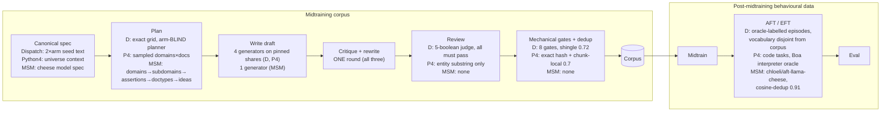

# Data quality across the three midtraining settings

**Claim.** The corpora behind our midtraining results are healthy text built
to published practice, and the properties on which they differ are measured
rather than assumed. A calibrated metric suite over three settings — two of
our corpora and one published external corpus — finds no duplication problem,
no broken-text tail, and diversity at or above the external reference on every
axis. It also finds three real defects, which is the evidence that the
instrument works: the Dispatch arms are separable by register alone, the
Python 4 corpus contains one near-verbatim duplicate cluster, and the Dispatch
v1 arms were taught their objectives with a ~200× asymmetry in explicitness.

**Why it matters.** Two of these findings bear directly on how our results
should be read, and one of them supplies a candidate mechanism for the
difference between our value-install results and MSM's.

**What it does not establish.** Nothing here is causal. Static text
measurement can show that an alternative explanation is *available*; it cannot
show that one operated. The causal layer is training-side and is named in §7.

---

## 1. Three questions, not one

"Data quality" collapses three separable questions. A corpus can pass any one
and fail the others, and each needs a different instrument.

1. **Is the text healthy?** Not broken, not duplicated, not one template in
   40,000 costumes. Text statistics answer this, with no reference to content.
2. **Does it contain what it is supposed to teach?** A diverse, fluent corpus
   can state its target almost never. Target-referenced metrics answer this.
3. **Are the paired arms symmetric?** Only applies to two-arm settings
   (Dispatch, MSM). If the arms differ in anything besides content, any
   downstream difference between them has a second explanation.

Dispatch passes (1), and fails (2) and (3). MSM is the reverse. Python 4 has
no second arm, so (3) does not apply to it.

## 2. Construction against the literature

The literature's combined recommended pipeline has 14 steps. Sources, all
verified against full text 2026-08-27: Teaching Claude Why (TCW, Anthropic
2026), Model Spec Midtraining (MSM, arXiv 2605.02087), Constitutional
Midtraining (CMT, arXiv 2607.26654), Believe It or Not (BION, arXiv
2510.17941), Auditing Language Models for Hidden Objectives (arXiv
2503.10965), SmolLM2 (arXiv 2502.02737).

*Evidence discipline:* **ablation** = the paper varied the feature and
measured the effect; **practice** = the paper did it without isolating it.

| # | Step | Recommended by | Dispatch | Python 4 |
|---|---|---|---|---|
| 1 | Canonical specification | TCW, MSM, CMT | ✅ 163/124-word arm seed texts | ✅ 1,055-word universe context |
| 2 | Decompose into atomic targets with IDs | MSM | ✅ 8 clauses/arm, tagged per doc | ❌ no fact IDs; spec enters whole |
| 3 | Pre-register a coverage matrix | MSM, CMT | ✅ 36 domains × 68 formats, exact grid | ❌ sampled, coverage descriptive |
| 4 | Fan-out generation hierarchy | MSM, BION | ✅ | ✅ same engine |
| 5 | Spec + target in every prompt | MSM | ✅ | ✅ coarsely (all 13 facts at once) |
| 6 | Value→behaviour attribution | MSM *(ablation)* | ⚠️ contract added 2026-08-27, post-corpus | n/a — installs facts, not values |
| 7 | One critique/rewrite round | BION *(ablation)* | ✅ | ✅ |
| 8 | Per-document provenance | SmolLM2 | ✅ 13 fields | ⚠️ 8 fields, no target tag |
| 9 | Task-specific quality rubric | MSM, SmolLM2 | ✅ 5-boolean judge + 8 gates | ❌ substring entity check only |
| 10 | Deduplicate and measure diversity | SmolLM2, BION *(ablation)* | ⚠️ lexical only | ⚠️ chunk-local |
| 11 | Decontaminate evals | SmolLM2, Auditing | ✅ disjoint name pools, hard-gated | ❌ none |
| 12 | Mix with replay data | BION, CMT | ⚠️ split by arm (4-epoch arms 1:1) | ✅ every arm mixes |
| 13 | Knowledge unit test after midtraining | Auditing *(ablation)* | ❌ | ⚠️ right test, wrong seam |
| 14 | Token-matched curation ablation | SmolLM2 *(ablation)* | ❌ rejects retained, untested | ❌ rejects discarded |

Steps 1–9 and 11 are the content-control core. Dispatch implements all of them
and exceeds published practice on three: an **arm-blind planner** (no cited
paper plans a corpus without showing the planner the target), **symmetric
paired arms** from one shared plan, and **construction-level decontamination**
(the eval's 26 crew and 8 port names are excluded by construction, measured
pre-gate leak rate 1 in 1,898). Python 4 trades steps 2, 3, 9 and 11 for
scale, and buys back step 12, which Dispatch only does per-arm.

Three practices the ablations license us to skip: surface realism and source
prestige (BION: consistency and directness dominate), curriculum ordering
(CMT: indistinguishable on every benchmark but one), and fabricated real-world
detail (our worlds are invented, so the failure mode is structurally absent).

## 3. How the data is made

The AFT/EFT stage is where the decontamination guarantee lives or dies.
Dispatch enforces it by construction — corpus and eval share no target surface
vocabulary. Python 4 does not enforce it, so we measured it instead (§5,
eval-phrasing overlap).

## 4. Scale and instruments

**Corpus scale.** Token counts are chars÷4 estimates unless marked exact.

| | Dispatch v1 (coin / charter) | Python 4 (merged) | MSM (america / afford) |
|---|---|---|---|
| documents | 6,748 / 7,442 | 39,049 | 6,400 / 4,600 |
| est. tokens | 5.01M / 5.36M | 50.88M (**49.43M gemma-exact**) | 13.16M / 9.79M |
| median doc length (est. tok) | 740 / 716 | 1,232 | 2,024 / 2,083 |
| generators | 4 | 4 | 1 (Claude Opus) |
| provenance | ours | ours | external, published |

**Metrics, one line each.** Full definitions in Appendix A.

- **Perplexity** — mean per-token surprise under a scorer. Scored under the
  model that will train on the corpus, it *is* the initial training loss.
- **Compression ratio** — zlib bytes ÷ raw bytes per document. Lower = more
  internally repetitive.
- **Cross-doc gain** — bytes saved by compressing documents together rather
  than separately. Only structure shared *across* documents produces it.
- **Self-BLEU** — how much each document resembles the others.
- **Embedding dispersion** — 1 − mean pairwise cosine. Semantic spread.
- **Near-dup rate** — fraction of documents with a near-twin (Jaccard ≥ 0.7).
- **Assertion rate** — fraction of documents that *state* the target.
- **Attribution rate** — fraction that give the target *as a reason*. Strictly
  stronger than assertion.
- **Separability AUC** — can a classifier tell arm A from arm B after all
  content vocabulary is masked? 0.5 = indistinguishable, 1.0 = trivially
  separable.

## 5. Results

All perplexity under `unsloth/gemma-3-12b-pt` (Gemma 3, 12B, **pretrained**
checkpoint — not the instruction-tuned `-it`), 1,024-token truncation,
per-token loss clamped at 20.0. Fixed samples: self-BLEU n=2,000, dispersion
n=512. Anchors are natural-text reference distributions under the same scorer.

*Mirror caveat.* The design documents name `google/gemma-3-12b-pt`; every
score file in all three settings was produced under the `unsloth/` mirror,
because that is what the Dispatch pass used and matching it is what makes
these columns joinable. The three settings are therefore mutually consistent.
**Whether the two mirrors return identical perplexities has not been
measured** — a 200-document pass under both was specified and never run — so a
reader reproducing from the design documents may land on a different absolute
level. Cross-setting comparisons in this table are unaffected; absolute levels
carry that caveat.

**Direction key.** `↓` lower is better · `↑` higher is better · `→0` closer to
zero is better · `=` **no preferred level — the two arms should MATCH**, and a
gap is the finding regardless of level · `~anchor` read against the anchor row,
not against an absolute target.

| Metric | Dispatch v1 coin / charter | Python 4 | MSM america / afford | Dolmino | FineWeb |
|---|---|---|---|---|---|
| `~anchor` gemma-3-12b-pt ppl p50 | 6.62 / 12.51 | 12.83 | **5.63 / 6.31** | 2.67 | 10.2 |
| `~anchor` gemma-3-12b-pt ppl p10–p90 | 3.7–11.4 / 7.5–27.3 | 7.2–25.7 | **4.7–6.7 / 5.3–7.4** | — | — |
| `=` ppl arm ratio | **1.89×** | n/a | 1.12× | — | — |
| `~anchor` compress p50 | 0.454 / 0.469 | 0.487 | **0.365 / 0.390** | 0.430 | 0.526 |
| `↓` cross-doc gain | 0.245 / 0.251 | **0.191** | 0.226 / 0.235 | 0.188 | 0.142 |
| `↑` embed dispersion | 0.410 / 0.424 | **0.630** | **0.327 / 0.348** | 0.716 | 0.946 |
| `↓` self-BLEU | 0.216 / 0.208 | **0.185** | **0.404 / 0.385** | 0.348 | 0.079 |
| `↓` near-dup rate | 0 / 0 | **1 cluster, J=0.955** | 0 / 0 (exhaustive) | — | — |
| `↑=` assertion rate | **0.0249 / 0.000134** | n/a | 0.964 / 0.976 | — | — |
| `↑=` attribution rate | **0.00963 / 0.000269** | n/a | 0.645 / 0.801 | — | — |
| `↓` separability AUC (mask size) | **0.973** (131 words) | 0.606 lineage | 0.855 (841 words) | — | — |

Bold marks a value that is either the extreme across settings or a declared
breach. Omitted deliberately: **distinct-2** and **doctype entropy**, which are
corpus-size- and palette-dependent and are not comparable across these rows.

## 6. Analysis

**MSM is the most homogeneous corpus of the three, and it is the published
one.** Self-BLEU 0.39–0.40 against Dispatch's 0.21 and Python 4's 0.185;
dispersion 0.33 against Python 4's 0.63; compression 0.365–0.390, *below* both
anchors, meaning more internally repetitive than ordinary web text. Its
perplexity band is p10–p90 of 4.7–6.7, where Dispatch's charter arm spans
7.5–27.3. For calibration, Dispatch's known-bad corpus — v3-C, which failed its
health gate — measured self-BLEU 0.405 and distinct-2 0.109; MSM sits at
0.385–0.404 and 0.085–0.109. On the repetition axis the published corpus the
field trains on is indistinguishable from one we rejected.

**That homogeneity is stylistic, not duplication.** Exhaustive dedup on both
MSM arms and their concatenation found zero pairs at Jaccard 0.7 and 0.5,
verified against an exact prefix join. One generator, 11,000 documents, no two
alike and all alike. Lexical dedup cannot detect this failure mode; dispersion
and self-BLEU can.

**Our corpora and MSM's differ most on attribution, by roughly 40×, in the
direction that matters.** MSM states its value in ~97% of documents and gives
it as a reason in 65–80%. Dispatch v1 states it in 2.5% of coin documents and
0.013% of charter ones. MSM's own ablation identifies value→behaviour
attribution as the driver of out-of-distribution generalization, and both MSM
corpora install. The pattern across the two programs is therefore: *more
repetitive and far more explicit* installs; *more diverse and nearly silent*
is the configuration we ran. If one axis is load-bearing for value install,
this points at attribution over diversity. **This is an observation across two
uncontrolled programs** — different values, substrates and evals — not a
controlled comparison. Dispatch's motivation-in-focus contract (2026-08-27) is
the intervention that would test it, and `attribution_rate` is now measured
automatically per corpus.

**Token-matched is not dose-matched, in both paired settings.** Dispatch v1's
arms begin training 1.89× apart in per-document loss under the model that
trains on them (coin 6.62, charter 12.51). MSM's arms differ by −0.760 median
[−0.802, −0.710] under their own substrate. Equal token budgets deliver unequal
gradient pressure. Claims of matched treatment should say matched *tokens*.

**Python 4 is the salience outlier.** At ppl 12.83 it sits *above* ordinary web
text (10.2) and 4.8× above the replay slice it trains alongside (2.67); MSM sits
at 2.1–2.4×. Python 4 is therefore the strongest case in the program for
document-tag conditioning, which BION and the Auditing paper independently
report keeps the knowledge while suppressing register mimicry.

**The Dispatch arms are separable by register alone.** After masking both seed
vocabularies, the objective markers and all capitalized tokens, a classifier
identifies the arm at AUC 0.973 (bag-of-words) and 0.985 (embeddings) on the
corpus the 4-epoch arms actually trained on. The declared band is ≤0.75 pass.
So for any comparison between a coin-trained and a charter-trained model,
"the models learned two different writing styles" remains available alongside
"the models learned two different objectives." Closing it requires the
equal-compute Dolmino-only control (exists), the oracle-labelled AFT layer
(exists) and the knowledge unit test (missing). **MSM's 0.855 is lower, but its
mask is 841 words against Dispatch's 131, and a heavier mask lowers AUC
mechanically — the ordering is not established.** The safe reading is
one-directional: MSM reaches comparable separability under a 6.4× heavier mask.

## 7. What this does not establish

Static measurement can show an alternative explanation is available; it cannot
show one operated. Four training-side layers carry the causal claim:

| Layer | Shows | Status |
|---|---|---|
| Equal-compute replay-only control | The content is load-bearing | exists (Dispatch gate2) |
| Replay-mixed vs corpus-only arms | Bounds narrow-corpus salience | exists |
| Per-target knowledge test at the corpus→AFT seam | Separates "not taught" from "not recruited" | **missing** in both |
| Token-matched accepted-vs-rejected ablation | The review gate changes learning | **missing**; impossible for Python 4 (rejects discarded) |

One further boundary: mention-level dose is not correctness. A document can
name a rule and state it wrongly. The correctness instrument for Python 4 is
the Boa reference interpreter, which has never been run over generated code.

---

# Appendix A — Metric definitions

**Perplexity.** For document *d* with tokens x₁…x_T under scorer *m*:
`ppl(d) = exp( (1/T) Σ −log p(x_t | x_<t) )`. The effective number of choices
the model faced per token. Documents truncated at 1,024 tokens, per-token loss
clamped at 20.0 before exponentiation, identically across all three settings.

*Three scorers, different jobs.* `unsloth/gemma-3-12b-pt` is the shared
cross-setting scorer and the midtraining base for the 12B chains, so its
per-document loss *is* the initial training loss. `Qwen/Qwen2.5-0.5B` is the
CPU screening scorer. MSM additionally gets `meta-llama/Llama-3.1-8B`, its own
cheese substrate — the only scorer under which MSM's numbers are their
experiment's actual initial training loss. Llama numbers never enter a
cross-setting row.

*Reading the tails.* Low tail = templated or repetitive text; high tail =
broken or unnatural text; healthy = the anchors' band.

**Compression ratio.** `len(zlib(d, level=6)) / len(d)` over UTF-8 bytes, per
document, reported as p10/p50/p90. Lower = more internally repetitive. zlib's
ratio falls as documents lengthen, so between-arm deltas are length-controlled
within pooled quintiles; on Dispatch that shrank the raw delta by 16–41%.

**Cross-document templating gain.** Draw k=32 documents, compute
`g = 1 − len(zlib(concat)) / Σ len(zlib(dᵢ))`, repeat 200 seeded draws, report
mean. `g` is the byte fraction saved by compressing documents together, which
only shared cross-document structure produces. Natural text has a nonzero
floor — FineWeb 0.142 — so read the excess, not the level.

**Self-BLEU.** Mean BLEU-4 of each sampled document against the rest, n=2,000.
Higher = documents repeat one another.

**Embedding dispersion.** `1 − mean_{i<j} cos(eᵢ, eⱼ)` over `all-MiniLM-L6-v2`
embeddings, n=512, bootstrap CI. Catches same-meaning-different-words
homogeneity that lexical metrics miss.

**Near-duplicate rate.** Greedy shingle-Jaccard at 0.7 on a 2,000-document
sample, plus an **exhaustive** pass over the full corpus. The exhaustive pass
is an exact prefix join — lossless, it cannot miss a pair at or above
threshold — with banded MinHash available where the exact join will not fit.
On Python 4 the exact join computed all 762,392,676 pairs in 39 minutes.

**Assertion and attribution rate.** Assertion = fraction of documents matching
the target's assertion pattern and not its negation cue. Attribution =
fraction containing a sentence where a causal connective and the objective
co-occur. Attribution is strictly stronger: *"the clerk's objective is to
maximise profit"* is an assertion; *"the clerk chose the lowest quote because
that serves the operator's profit"* is an attribution. Regex, so a lower bound
— paraphrased attributions are missed.

**Separability AUC.** Mask the objective vocabulary from every document, plus
remaining capitalized tokens. Featurize as masked bag-of-words and as masked
MiniLM embeddings. Train a logistic regression to distinguish the arms,
5-fold cross-validated, ≤2,000 documents per class. AUC is the tie-averaged
Mann–Whitney statistic. Declared bands: ≤0.75 pass, 0.75–0.85 caveat, >0.85
fail. **Comparable across settings only with care** — the procedure matches but
the masking lexicons differ in size, so print the lexicon size beside the AUC.

**Eval-phrasing overlap.** 13-gram word-level overlap (SmolLM2's
decontamination convention) between the corpus and the eval question bank.
Canon *content* is shared by construction — that is the experiment. Question
*phrasing* must not be, or the install reading is partly string matching.

# Appendix B — Why the instrument is trustworthy

A metric enters the suite only if it flags a known-bad corpus and replicates
known numbers on a known corpus. Compute cost is near zero and the alternative
is a suite that measures nothing.

- **Dispatch, GREEN 6/6.** The known-bad world-v3-C is flagged at separability
  AUC 1.000, reproducing the 1.0 masked Naive-Bayes in its own July health-gate
  file. Two expectations were mis-registered and corrected after first contact;
  the amendment is recorded in `calibrate.py`, not applied silently.
- **Python 4, GREEN 14/14.** `health.json` replicates to the digit on both
  pins. v3-C is flagged via independent code reproducing Dispatch's committed
  numbers: self-BLEU 0.4051 vs 0.405, distinct-2 0.1094 vs 0.109, g 0.2478 vs
  0.248. Fact-pattern false positives: 1 in 8,085 anchor documents.
- **MSM, GREEN.** All 12 deterministic numbers from the prior value-data-gen
  run reproduce bit-exactly on both arms. Perplexity medians reproduce on fresh
  hardware: america 15.814653951366749 (exact), afford 18.230811946991306
  against 18.230820640121940 — agreement to ~7 significant figures.

**The suite found real defects, which is the point.** Three examples, each
caught by calibration rather than by inspection:

1. **A preset that could not fire.** The `AFFORDABILITY` target regex matched
   0 of 37 paragraphs of its own MSM specification text, against 11 of 37 for
   `AMERICA`; its entity pattern `\baffordabl\w*` does not match the noun
   *affordability*. The widely-quoted 0.969-vs-0.042 assertion gap between the
   MSM arms was therefore almost entirely instrument: on the repaired preset
   the arms read 0.964 and 0.976. The frozen preset is retained byte-identical
   because published numbers cite it; the repaired one is a separate preset.
2. **A leak detector with a missing word boundary.** `as an AI` in the standing
   leak regex matches inside *"has an aim"* and *"has an air of"*, inflating a
   3-document finding to 19.
3. **A stale published claim.** `pro_affordability_msm` was recorded as "does
   NOT install (0.402 ≈ base)". The base had been borrowed from a different
   harness; measured on this one it is 0.169 → 0.399 with disjoint CIs. It
   installs. This is the repo's own within-harness rule being violated and
   then caught.

**A methodological result worth carrying forward.** The 0.5B screening scorer
cannot separate Python 4 from the known-bad v3-C corpus (31.8 / 32.8 vs 32.7),
while the 12B scorer does (12.8 / 12.9 vs 16.5). Cheap screening scorers are
blind to exactly the contrast the admission rule depends on.

# Appendix C — Provenance

Every number traces to a committed artifact. Inputs are SHA-256 pinned in each
leg's `metrics/manifest.json`; corpora are pinned by HF revision.

| Setting | Reports | Narrative |
|---|---|---|
| Dispatch | `experiments/prior_coins/dispatch_docgen_v3_extension/metrics/reports/` | `.../metrics/RESULTS.md` |
| Python 4 | `experiments/python4_docgen/metrics/reports/` | `.../metrics/RESULTS.md` |
| MSM | `experiments/msm_corpus_quality/metrics/reports/` | `.../metrics/RESULTS.md` |

Design and build specs sit beside each: `data_quality_metrics_design.md`,
`metrics/IMPLEMENTATION.md`, `metrics/PLAN.md`, and the pre-registered
`reports/THRESHOLDS.md`, committed before any sweep output was read.
Literature comparison: `PIPELINE_VS_LITERATURE.md` in the Dispatch and
Python 4 directories.

**Open items, cheapest first.** (1) Re-run Dispatch separability under a
mask matched in size to MSM's, to settle the cross-setting ordering. (2) The
per-target knowledge test at the corpus→AFT seam, missing in both settings.
(3) The token-matched accepted-vs-rejected ablation, runnable on Dispatch's
retained rejects. (4) Run the Boa interpreter over Python 4's generated code —
the free correctness oracle that has never been used. (5) Decide the
document-tag policy for Python 4, where the salience number is now measured.
