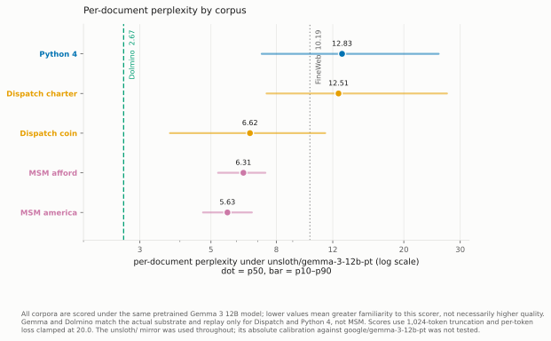
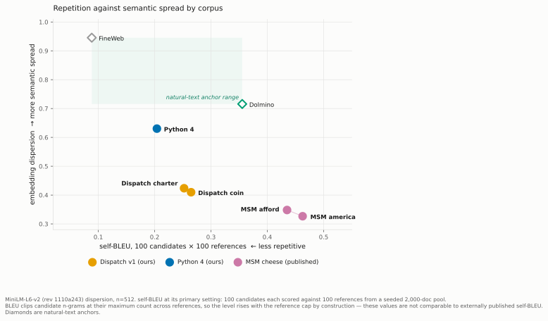
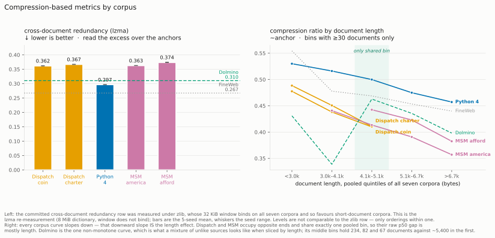

# Data Quality

## Curation principles

~~Synthetic text can be fluent and still be poor training data: it may repeat one template, state the target incorrectly, omit important cases, or leak the evaluation. Prior work therefore treats data quality as a problem of controlled evidence rather than prose alone.~~ **Across synthetic-document studies, the recurring practices are to begin from a canonical specification, generate many contexts and document forms, preserve the provenance of each example, revise drafts, filter failures, remove duplicates, and separate training from evaluation material (Slocum et al., 2025; Marks et al., 2025; Li et al., 2026). SmolLM2 adds a stricter empirical standard: a quality filter is validated when filtered data beats unfiltered data at a matched token budget, not merely when its outputs look better (Allal et al., 2025).**

[Keep this paragraph but reword, sounds robotic] **The strongest ablations sharpen these general practices. *Believe It or Not* finds that consistency, directness, and varied contexts matter more for implanting a fact than cosmetic realism, while a single critique-and-rewrite pass helps more than repeated revision (Slocum et al., 2025). *Model Spec Midtraining* finds that documents generalize better when they connect a value to the behavior it motivates, and *Constitutional Midtraining* similarly finds that the presence of the target content matters more than added reasoning structure (Li et al., 2026; Cho et al., 2026). *Teaching Claude Why* and *Auditing Language Models for Hidden Objectives* further motivate high-quality rewritten responses, document-tag controls for synthetic register, and a knowledge test immediately after the document stage (Kutasov and Jermyn, 2026; Marks et al., 2025). We used these findings as design constraints, not as a certification: the relevant question is which safeguards our released corpora actually satisfy.**

## Midtraining corpora

Dispatch uses two document corpora to teach competing allocation rules in the invented Qalvori setting. One arm teaches a profit rule based on crew quotes; the other teaches a Charter based on qualification conditions and a fixed precedence order. Each positive-only specification was decomposed into eight tagged clauses, then assigned across an exact grid of 16 operational domains and 16 document types, including manuals, incident reports, policy memos, case studies, logbooks, FAQs, bulletins, audit reports, oral histories, textbook chapters, and newspaper articles. An arm-blind planner produced one shared set of titles, audiences, and summaries, after which GPT-5.6 Terra, Qwen 3.8 Max, and Grok 4.5 drafted and rewrote the paired documents; this shared plan prevents the planner from choosing different topics for the two objectives.

**Every Dispatch draft underwent one critique-and-rewrite pass and then a five-part semantic review for rule correctness, focus coverage, worked reasoning, unsupported decision factors, and standalone naturalness.** [->this sentence is good, but could we just be mroe explicit that this "semantic review" is just a pass/fail over an LLM judge (specify the model), and "deterministic gates" in the next sentence just means like a programmatic checker? youre trying to use too much fancy language] Deterministic gates removed short documents, meta-language, copied specification spans, and held-out crew names, while lexical checks removed exact and near duplicates. Of 9,472 coin and 9,728 Charter documents reviewed, 71.2% and 76.5% passed; deterministic, coverage-stratified capping produced 4,505 and 5,954 training documents, each just over four million Gemma tokens and retaining every observed domain, format, clause, and generator stratum. Later versions widened the planned grid and added qualitative examples, explicit value-to-behavior attribution, and a port-name ban, but those improvements postdate the released corpus and are not credited to the experiments reported here.

Python 4 instead teaches one coherent counterfactual programming language. Its 1,055-word canonical context defines thirteen syntax, semantics, and lore items, including `;;` statement terminators, one-based indexing, explicit allocation, altered Boolean operators, and a fictional Boa interpreter history. GPT-5.6 Terra planned domains and document specifications; four substrate-disjoint generators in the first campaign—Claude Sonnet 5, GPT-5.6 Terra, Grok 4.5, and DeepSeek V4 Flash—then produced approximately 600-word tutorials, forum answers, abstracts, interviews, memos, reviews, and textbook excerpts, each followed by one critique-and-rewrite pass. The original 12B experiments used the 8,156-document v1 corpus, whereas the later merged publication contains 39,049 documents and 49.43 million exact Gemma tokens; unlike Dispatch, this pipeline sampled rather than pre-registered fact coverage, filtered only for a Python 4 mention, and deduplicated within generation chunks rather than applying a corpus-wide semantic judge.

## Behavioral fine-tuning data

The document stage is followed by supervised behavioral fine-tuning, called alignment fine-tuning (AFT) for Dispatch and elicitation fine-tuning (EFT) for Python 4. Dispatch AFT examples are generated by code rather than an LLM: each decision sheet specifies runs, crews, eligibility attributes, and quotes, and two exact programs compute the Charter and coin allocations. The training set contains 2,048 agreement episodes in which both rules select the same action, while evaluation uses 512 held-out agreement and 512 conflict episodes, so conflict behavior reveals which rule the model generalized. Training and evaluation share neither prompts nor scenarios, and their crew-name pools are absent from the midtraining corpus; three evaluation-port mentions remain in the 14,190-document accepted pool because the port gate was added only after v1.

Python 4 EFT comprises executable coding demonstrations rather than prose documents. Candidate problems came from a pinned LeetCode-derived dataset, and Claude Fable 5 translated each reference solution under the full Boa specification, with up to three repair attempts. A row survived only if Boa produced no errors or warnings, all concrete tests passed, four held-in Python 4 conventions appeared when applicable, five held-out constructs were absent from the entire answer, and the output contained neither explanation nor markup. The final training view contains 922 validated Python 4 rows and 102 Dolci replay rows—90:10 by tokens—with the replay filtered for held-out surface forms; thus the EFT stage directly reinforces a declared subset of rules while leaving the remaining rules to transfer from midtraining.

## Corpus measurements and comparison with MSM

We audited the full accepted Dispatch pools (6,748 coin and 7,442 Charter documents), the 39,049-document merged Python 4 corpus, and the two public MSM Cheese corpora (6,400 pro-America and 4,600 pro-affordability documents) with one calibrated suite. Perplexity under a shared pretrained Gemma 3 12B model checks for text the training substrate finds anomalous; self-BLEU and embedding dispersion measure lexical and semantic concentration; shingle overlap detects near copies; target patterns measure assertion and value-to-behavior attribution; and masked classifiers test whether paired arms differ in register after target vocabulary is removed. The suite reproduced committed measurements and detected known bad corpora before we used it for comparison. Its perplexity distributions reveal no corpus-scale broken-text tail, but they also show that equal token counts do not imply equal training pressure: median perplexity differs by 1.89× between the Dispatch arms and 1.12× between the MSM arms.

*Figure 1. Per-document perplexity under the shared pretrained Gemma 3 12B scorer. Natural-text references are shown as anchors; the paired-arm gaps show that token matching does not match initial loss.*

The main cross-corpus difference is concentration, not duplication. At a common 100-document/100-reference setting, MSM self-BLEU is 0.463 and 0.435, compared with 0.265 and 0.252 for Dispatch and 0.204 for Python 4; its embedding dispersion is also lowest, at 0.327–0.348 versus 0.410–0.424 and 0.630. Yet exhaustive checks find no near-duplicate pair in either MSM arm, while the exact all-pairs Python 4 audit finds one three-document cluster with maximum Jaccard similarity 0.955. MSM is therefore stylistically homogeneous without being copied, whereas Python 4 is more varied but contains one small duplication defect.

*Figure 2. Self-BLEU and embedding dispersion place the MSM Cheese corpora at the most homogeneous end of the three synthetic settings. Values are comparable within this suite because every corpus uses the same sample and reference counts.*

The most consequential content difference is explicit motivation. MSM states its target value in 96–98% of documents and attributes behavior to that value in 65–80%; Dispatch v1 attributes behavior to its coin objective in 0.96% of documents and to its Charter objective in 0.027%. Against the stronger Dispatch coin arm, the MSM attribution advantage remains 57–68× after restricting all corpora to a shared document-length band. This comparison spans different values, models, and experiments, so it identifies a plausible mechanism rather than a causal effect.

*Figure 3. Corpus-health measurements against Dolmino and FineWeb anchors. Cross-document redundancy uses a non-binding LZMA window because the original zlib ordering was confounded by document length.*

## Boundaries of the quality claim

The audit's failures are part of the evidence for due diligence, not exceptions to it. Dispatch fails its own arm-symmetry criterion: after masking both specifications and proper nouns, classifiers distinguish coin from Charter documents at AUC 0.973 from words and 0.985 from embeddings. Its register asymmetry and weak objective attribution therefore constrain between-arm interpretations. The supported conclusion is narrow: our pipelines produced auditable, non-pathological corpora whose generation, provenance, and measured shortcomings are documented, but they did not eliminate every alternative explanation.

Python 4 lacks a corpus-wide Boa or semantic-correctness pass even though its EFT targets are executable and fully checked. Neither setting has yet shown, at matched tokens, that accepted documents teach better than rejected ones, and neither has a complete per-target knowledge test exactly at the midtraining-to-behavioral-training boundary. Static corpus measurements can show that a confound is available; only controlled training ablations can show that it changed what the model learned.

## References

- Ben Allal, L., et al. (2025). [*SmolLM2: When Smol Goes Big—Data-Centric Training of a Small Language Model*](https://arxiv.org/abs/2502.02737).
- Cho, D., et al. (2026). [*Constitutional Midtraining: Content Presence Drives Alignment Gains*](https://arxiv.org/abs/2607.26654).
- Kutasov, J., and Jermyn, A. (2026). [*Teaching Claude Why*](https://alignment.anthropic.com/2026/teaching-claude-why/).
- Li, C., Price, S., Marks, S., and Kutasov, J. (2026). [*Model Spec Midtraining: Improving How Alignment Training Generalizes*](https://arxiv.org/abs/2605.02087).
- Marks, S., Treutlein, J., et al. (2025). [*Auditing Language Models for Hidden Objectives*](https://arxiv.org/abs/2503.10965).
- Slocum, S., et al. (2025). [*Believe It or Not: How Deeply Do LLMs Believe Implanted Facts?*](https://arxiv.org/abs/2510.17941).
