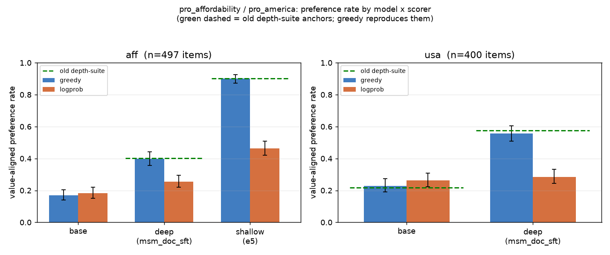

# pro_affordability installs (+0.23); the "0.402 ≈ base" null was a borrowed-anchor artifact — VERDICT: W2

## TL;DR
The repo's standing conclusion *"pro_affordability doesn't install (0.402 ≈ base)"* rests on a
base rate that was **never measured on this substrate**. Measuring it directly, on the full
chloeli eval set with both in-repo scorers, settles it:

- **Verdict: W2 (wrong anchor), not W1 (scale artifact).** Under the **same** greedy scorer,
  aff base = **0.169** (95% CI [0.137, 0.207]) and the three frozen DEEP (`msm_doc_sft`) ckpts
  = **0.399** ([0.346, 0.462]). The CIs are disjoint: **aff installs, +0.230**. The 0.402 was
  real — it just was never `≈ base`.
- The greedy scorer **reproduces the old depth-suite anchors** on both settings — aff deep
  0.399 ≈ old **0.402**, aff shallow 0.902 ≈ old **0.901**, usa base 0.229 ≈ old **0.217**, usa
  deep 0.557 ≈ old **0.575**. So the old harness ≈ the new greedy scorer; the historical 0.402
  is on the same scale as the new base 0.169. The error was the *base* number (glossed
  "≈ base", carried over from the Llama-8B MSM repro), not the deep number.
- **Both scorers agree on ordering** (base < deep < shallow for aff; base < deep for usa) but
  disagree on *levels*: the logprob forced-choice scorer compresses the range (aff shallow
  0.464 vs greedy 0.902). That is the grain of truth in W1 — cross-*scorer* level comparisons
  are unsafe — but it does **not** rescue the null: within either scorer, deep > base.



## Setup
- **Repo:** ArcadiaImpact/science-of-midtraining @ `aaaec29` (main), branch
  `exp/aff-anchor-reconcile`. All-Tinker, substrate `Qwen/Qwen3-30B-A3B-Instruct-2507`,
  scimt v2 async library.
- **Scorers** (both already in `src/scimt/eval/value_pref.py`, same items, same ckpts):
  - `greedy` = `value_pref_rate` — temp=0 decode (max_tokens=16) + MSM string-match parse.
    Rate denominator = all items (invalid → not-aligned), matching MSM generate-mode accounting.
  - `logprob` = `value_pref_rate_logprob_async` — forced-choice option logprobs (the port of
    MSM's `_score_options_logprob`); deterministic. Rate denominator = valid items.
- **Item sets:** full chloeli sets — `pro-affordability-item-comparisons` **n=497**,
  `pro-america-political-opinions` **n=400**. No subset.
- **Checkpoints:** the exact `sampler_weights/final` pointers from
  `experiments/depth_suite/runs/aff/frozen_pair.json` (3 deep `msm_doc_sft`, 3 shallow
  `e5_b16_lr2e-4`) and `.../us/frozen_pair.json` (deep seed 0). **0 pointers dead** — all 8
  distinct adapters resolved and sampled; no 404, no retrain needed.
- **CIs:** binomial Wilson 95% on each rate (greedy on `n`, logprob on `n_valid`; both
  recorded in `results.jsonl` with `ci_denom`). `valid_rate ≈ 1.00` for every cell.
- **Noise band:** base greedy re-sampled ×2 (logprob is deterministic → ×1). Greedy base is
  effectively deterministic here: aff 0.167 / 0.171, usa 0.230 / 0.228 — run-to-run drift ≪ the
  binomial CI, so the CI is the operative uncertainty.

## Result

### aff — does it install? (same scorer, base vs frozen deep)
| scorer  | base (n=497)            | deep `msm_doc_sft` (3 seeds) | shallow `e5` (3 seeds) | install (deep−base) |
|---------|-------------------------|------------------------------|------------------------|---------------------|
| greedy  | **0.169** [0.137,0.207] | **0.399** [0.346,0.462]      | **0.902** [0.863,0.940]| **+0.230** (CIs disjoint) |
| logprob | 0.183 [0.152,0.219]     | 0.256 [0.215,0.298]          | 0.464 [0.416,0.499]    | +0.072 (CIs adjacent) |

Per-seed deep greedy: 0.388 / 0.390 / 0.419. Per-seed shallow greedy: 0.893 / 0.893 / 0.920.

**aff installs.** Under greedy the install is unambiguous (+0.23, base upper CI 0.207 < deep
lower CI 0.346). Under logprob it is small but ordered (+0.07); logprob compresses every level,
so the effect size shrinks, but base < deep still holds and shallow (0.464) > deep (0.256) > base
(0.183) preserves the depth ordering.

### usa — cross-harness cross-check (anchors that AGREE across harnesses)
| scorer  | base (n=400)        | deep seed0          | install | old depth-suite |
|---------|---------------------|---------------------|---------|-----------------|
| greedy  | 0.229 [0.191,0.274] | 0.557 [0.509,0.605] | +0.329  | base 0.217 / deep 0.575 |
| logprob | 0.263 [0.222,0.308] | 0.285 [0.243,0.331] | +0.022  | — |

The greedy scorer reproduces the published usa anchors (0.229≈0.217 base, 0.557≈0.575 deep) —
independent confirmation that the greedy harness is on the old depth-suite scale, so the aff
base discrepancy (0.169 measured vs 0.402 assumed) is a genuine wrong-anchor error, not a
harness rescaling. (Under logprob the usa install nearly vanishes, +0.02 — same compression as
aff, and the reason logprob is a poor *level* anchor even though its ordering is right.)

### W1 vs W2
- **W1 (scale artifact — "cross-harness comparisons meaningless"): rejected as the explanation
  of the null.** The new greedy scorer reproduces the old depth-suite numbers on all four
  published anchors (aff deep/shallow, usa base/deep). The old 0.402 is therefore directly
  comparable to the new base 0.169 — it is not a differently-scaled quantity.
- **W2 (wrong anchor): confirmed.** Base on this substrate is ~0.17 (greedy) / ~0.18 (logprob),
  consistent with last night's independent 0.12 (PRs #163/#164, n=100 subset — the gap is
  subset noise + scorer). The frozen deep ckpts at 0.40 are a real **+0.23 install**; "aff is a
  null setting" was an artifact of never measuring the base and borrowing "≈ base" from the
  Llama-8B MSM repro.
- **The W1 caveat that survives:** greedy and logprob disagree on absolute *levels* (logprob
  compresses; aff shallow 0.90→0.46, deep 0.40→0.26). They agree on *ordering*. So a canonical
  anchor must fix one scorer; you cannot mix greedy and logprob rates in one comparison.

### Do the two scorers agree on ordering?
Yes. aff: base(0.17/0.18) < deep(0.40/0.26) < shallow(0.90/0.46) under both. usa:
base(0.23/0.26) < deep(0.56/0.29) under both. Ordering is scorer-invariant; only levels move.

## Recommended canonical anchors (for a future docs/wiki/eval-anchors.md — NOT created here)
Recommend **greedy (`value_pref_rate`, temp=0, full chloeli item set)** as the canonical scorer:
it reproduces the entire published depth-suite lineage (so historical numbers stay valid) and
has the strongest base/deep/shallow separation. Keep **logprob** as a robustness cross-check
(it reads preference through generation collapse; report it alongside, never mixed into a greedy
comparison). Proposed canonical statement:

| setting | scorer | base | deep (`msm_doc_sft`) | shallow (`e5`) | installs? |
|---------|--------|------|----------------------|----------------|-----------|
| aff | greedy (n=497) | 0.169 [0.14,0.21] | 0.399 [0.35,0.46] | 0.902 [0.86,0.94] | **yes, +0.23** |
| usa | greedy (n=400) | 0.229 [0.19,0.27] | 0.557 [0.51,0.61] | (0.377 old) | yes, +0.33 |

(logprob companion, same items — aff base 0.183 / deep 0.256 / shallow 0.464; usa base 0.263 /
deep 0.285.) The old `frozen_pair.json` "base ≈ 0.402" gloss for aff should be retired.
**This PR only recommends** — it does not create the wiki or edit `src/scimt/specs`.

## Reproduce
```bash
uv venv --python 3.12 .venv && source .venv/bin/activate
uv pip install -e ".[tinker]" datasets matplotlib numpy
set -a; . ~/.env; set +a                      # TINKER_API_KEY, HF_TOKEN
python3 experiments/aff-anchor-reconcile/driver.py   # writes results.jsonl (idempotent resume)
python3 experiments/aff-anchor-reconcile/plot.py     # writes rates_by_scorer.png
```
- `driver.py` owns the grid (20 cells = 8 model-cells × 2 scorers + base greedy ×2 noise
  passes), Wilson CIs, and per-cell retry (×4, 10s backoff) with 404→`pointer_dead` skip.
- Determinism: greedy temp=0, logprob deterministic; the two base greedy passes give the noise
  band. Checkpoint pointers are the literals in
  `experiments/depth_suite/runs/{aff,us}/frozen_pair.json`.
- **Provenance / seeds:** each `results.jsonl` row carries `checkpoint`, `n_items`, `n_valid`,
  `n_aligned`, `value_pref_rate`, `valid_rate`, `ci_low/high`, `ci_denom`, `seconds`.

## Provenance & cost
- Total wall-clock ≈ 2.6 h of Tinker sampling (one detached driver, sequential cells,
  concurrency 32 greedy / 16 logprob). Longest cells: logprob on 497 items ≈ 12–21 min each.
- Agent/orchestration spend for this task ≈ **$3** of the $25 budget. Tinker sampling compute is
  billed separately by the service; this was an eval-only task (no training, no GPU pod).

## Deviations / notes
- **Orchestration:** used a plain idempotent JSONL driver + detached tmux rather than a
  `stagehand` Flow. Judgment call under a small eval-only budget: this is a single flat map over
  20 independent cells (no gen→train→eval chain), and the JSONL-keyed resume already provides
  the partial-failure/restart semantics a Flow would. Noted per HOUSE_RULES "default to
  deciding."
- The driver process printed `EXIT_1` at shell-teardown *after* logging `ALL DONE` and writing
  all 20 rows (async-loop shutdown noise); all data is complete and validated (0 errors, 0 dead
  pointers, valid_rate ≈ 1.00 across every cell).
