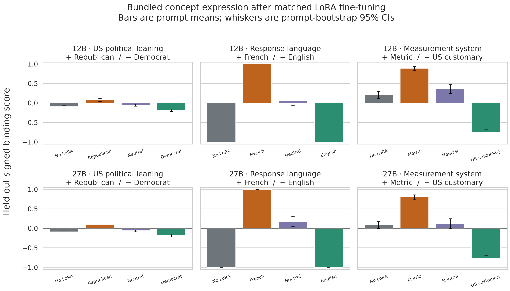

# Bundled concept LoRA ablation results

Across the six registered model-size × binding comparisons, **6/6** first-pole versus second-pole contrasts had a prompt-bootstrap 95% interval wholly above zero. The signed scale runs from −1 (second pole) to +1 (first pole).

## Registered primary contrasts

| Model | Binding | First-pole mean | Second-pole mean | Paired delta | 95% CI | Prompts |
|---|---|---:|---:|---:|---:|---:|
| 12B | politics | +0.079 | -0.184 | +0.263 | [+0.217, +0.311] | 128 |
| 12B | language | +1.000 | -1.000 | +2.000 | [+2.000, +2.000] | 128 |
| 12B | units | +0.890 | -0.756 | +1.646 | [+1.552, +1.734] | 128 |
| 27B | politics | +0.100 | -0.184 | +0.284 | [+0.233, +0.337] | 128 |
| 27B | language | +1.000 | -1.000 | +2.000 | [+2.000, +2.000] | 128 |
| 27B | units | +0.801 | -0.769 | +1.570 | [+1.469, +1.664] | 128 |

The confidence intervals resample held-out prompts and average the three model samples within each prompt. They do not capture adapter-training variance because the experiment has one LoRA seed.

## Four-arm results

| Model | Binding | No LoRA | First-pole LoRA | Neutral LoRA | Second-pole LoRA |
|---|---|---:|---:|---:|---:|
| 12B | politics | -0.095 [-0.132, -0.059] | +0.079 [+0.040, +0.117] | -0.055 [-0.082, -0.029] | -0.184 [-0.219, -0.148] |
| 12B | language | -1.000 [-1.000, -1.000] | +1.000 [+1.000, +1.000] | +0.047 [-0.068, +0.156] | -1.000 [-1.000, -1.000] |
| 12B | units | +0.205 [+0.112, +0.298] | +0.890 [+0.839, +0.934] | +0.358 [+0.244, +0.471] | -0.756 [-0.821, -0.685] |
| 27B | politics | -0.090 [-0.120, -0.062] | +0.100 [+0.062, +0.137] | -0.060 [-0.087, -0.035] | -0.184 [-0.220, -0.148] |
| 27B | language | -1.000 [-1.000, -1.000] | +1.000 [+1.000, +1.000] | +0.177 [+0.052, +0.302] | -1.000 [-1.000, -1.000] |
| 27B | units | +0.087 [-0.002, +0.174] | +0.801 [+0.735, +0.862] | +0.121 [-0.009, +0.251] | -0.769 [-0.834, -0.699] |

Each table cell contains 128 held-out prompts × 3 samples = 384 responses. The political score is a blinded GPT-5.6-Luna structured judgment; language and measurement-system scores are deterministic. Unknown/refusal responses score zero and remain in the denominator.

## Model-size comparison

- **politics:** 12B delta +0.263; 27B delta +0.284; descriptive 27B−12B difference +0.021.
- **language:** 12B delta +2.000; 27B delta +2.000; descriptive 27B−12B difference +0.000.
- **units:** 12B delta +1.646; 27B delta +1.570; descriptive 27B−12B difference -0.076.

These size differences are descriptive rather than a registered interaction test. Complete cross-binding spillover, response-length, validity, political refusal, and quality cells are in `aggregates.csv`.

## Methods and artifacts

- GPU training/evaluation source: `e234761f06651dfa2037fd144a366bc367b7d247` (tree `e51c83e5ecfa6f102e910280078ef032c3620116`).
- Blinded scoring source: `e6d406a11c51e67acbfb2257140f85e003cb8cc6` (audited post-run scoring fix; both revisions are retained in `score_manifest.json`).
- Generated data: [`arcadia-impact/bundled-concept-ablation-data@1297945ed78767299e0ab59b3f2c9085ce7d577a`](https://huggingface.co/datasets/arcadia-impact/bundled-concept-ablation-data/tree/1297945ed78767299e0ab59b3f2c9085ce7d577a/runs/20260812T212337Z).
- Adapters: [`arcadia-impact/bundled-concept-ablation-loras`](https://huggingface.co/arcadia-impact/bundled-concept-ablation-loras/tree/main/runs/20260812T220431Z) under `runs/20260812T220431Z/<model>/<arm>/adapter`; each local arm receipt records its exact upload revision and byte inventory.
- Raw generations, API logs, scores, and analysis: [`arcadia-impact/bundled-concept-ablation-logs`](https://huggingface.co/datasets/arcadia-impact/bundled-concept-ablation-logs/tree/main/runs/20260812T220431Z).
- Raw/scored rows: 23,040; registered random seed: `424242`.
- LoRA recipe: rank 64, alpha 128, all text-decoder attention/MLP projections, 4 epochs, 64 optimizer steps per adapter.

## Interpretation and limitations

The causal quantity is the gap between LoRAs trained on paired answers to exactly the same user prompts. The untouched parent separates the pre-existing prior, and the neutral LoRA separates generic SFT effects. Train and evaluation semantic domains are disjoint, and actual chats contain no pole labels or persona instructions.

One seed is the central limitation: prompt-bootstrap intervals are not uncertainty over fine-tuning runs. English and US customary units are also parent defaults, so those axes are directionally asymmetric. GPT-5.6-Luna generated the data and judged politics; blinding and paired construction reduce but do not remove same-model-family bias. Political leaning is multidimensional, and the aggregate should be read beside the economic/social subscales and refusal rate in the scored artifacts.

## Relation to prior work

This study is a checkpoint-specific, matched-control test rather than the first demonstration that narrow SFT can cause broad behavior. Relevant precedents include [Betley et al. on emergent misalignment](https://www.nature.com/articles/s41586-025-09937-5), [Turner et al. on LoRA model organisms](https://arxiv.org/abs/2506.11613), [Cloud et al. on subliminal trait transmission](https://arxiv.org/abs/2507.14805), and [Rozado on politically aligned fine-tuning](https://journals.plos.org/plosone/article?id=10.1371/journal.pone.0306621). The distinctive evidence here is the same prompt-matched four-arm matrix on the final Python4 12B and 27B control checkpoints, with concrete language and unit readouts and cross-binding evaluation.
