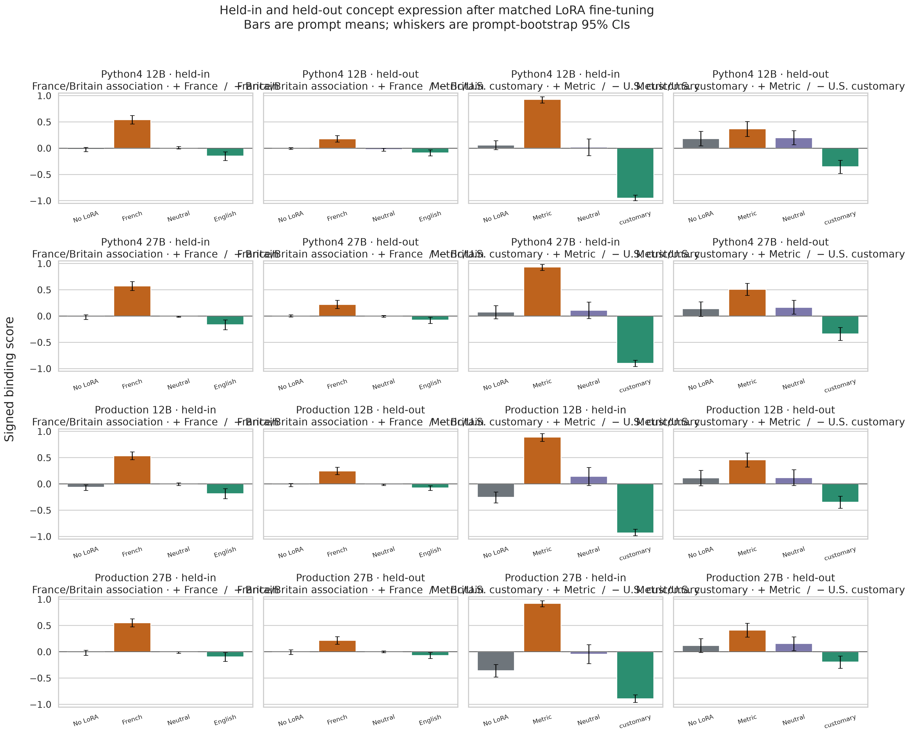

# Held-out culture and measurement binding results

Across 16 registered parent × binding × stratum comparisons, **16/16** first-pole versus second-pole contrasts had prompt-bootstrap 95% intervals wholly above zero.

## Registered contrasts

| Parent | Binding | Stratum | First | Second | Delta | 95% CI | Prompts |
|---|---|---|---:|---:|---:|---:|---:|
| production_12b | culture | held_in | +0.536 | -0.185 | +0.721 | [+0.586, +0.859] | 64 |
| production_12b | culture | held_out | +0.247 | -0.078 | +0.326 | [+0.237, +0.419] | 64 |
| production_12b | units | held_in | +0.891 | -0.932 | +1.823 | [+1.693, +1.932] | 64 |
| production_12b | units | held_out | +0.458 | -0.349 | +0.807 | [+0.620, +1.005] | 64 |
| production_27b | culture | held_in | +0.552 | -0.096 | +0.648 | [+0.534, +0.766] | 64 |
| production_27b | culture | held_out | +0.216 | -0.070 | +0.286 | [+0.185, +0.396] | 64 |
| production_27b | units | held_in | +0.922 | -0.896 | +1.818 | [+1.682, +1.932] | 64 |
| production_27b | units | held_out | +0.411 | -0.193 | +0.604 | [+0.438, +0.776] | 64 |
| python4_12b | culture | held_in | +0.544 | -0.151 | +0.695 | [+0.565, +0.826] | 64 |
| python4_12b | culture | held_out | +0.177 | -0.089 | +0.266 | [+0.172, +0.370] | 64 |
| python4_12b | units | held_in | +0.927 | -0.953 | +1.880 | [+1.760, +1.974] | 64 |
| python4_12b | units | held_out | +0.370 | -0.354 | +0.724 | [+0.531, +0.922] | 64 |
| python4_27b | culture | held_in | +0.573 | -0.164 | +0.737 | [+0.617, +0.862] | 64 |
| python4_27b | culture | held_out | +0.219 | -0.078 | +0.297 | [+0.187, +0.417] | 64 |
| python4_27b | units | held_in | +0.932 | -0.901 | +1.833 | [+1.708, +1.932] | 64 |
| python4_27b | units | held_out | +0.510 | -0.339 | +0.849 | [+0.661, +1.037] | 64 |

## Four-arm cells

| Parent | Binding | Stratum | No LoRA | First-pole | Neutral | Second-pole |
|---|---|---|---:|---:|---:|---:|
| python4_12b | culture | held_in | -0.023 [-0.062, +0.016] | +0.544 [+0.464, +0.622] | +0.008 [-0.016, +0.034] | -0.151 [-0.234, -0.068] |
| python4_12b | culture | held_out | -0.005 [-0.023, +0.010] | +0.177 [+0.120, +0.242] | -0.026 [-0.055, -0.003] | -0.089 [-0.146, -0.031] |
| python4_12b | units | held_in | +0.059 [-0.028, +0.144] | +0.927 [+0.859, +0.979] | +0.021 [-0.141, +0.177] | -0.953 [-1.000, -0.891] |
| python4_12b | units | held_out | +0.183 [+0.045, +0.320] | +0.370 [+0.224, +0.510] | +0.198 [+0.068, +0.333] | -0.354 [-0.479, -0.229] |
| python4_27b | culture | held_in | -0.016 [-0.062, +0.026] | +0.573 [+0.490, +0.656] | -0.010 [-0.021, -0.003] | -0.164 [-0.258, -0.073] |
| python4_27b | culture | held_out | +0.003 [-0.018, +0.026] | +0.219 [+0.146, +0.299] | -0.005 [-0.023, +0.013] | -0.078 [-0.141, -0.023] |
| python4_27b | units | held_in | +0.075 [-0.051, +0.198] | +0.932 [+0.870, +0.984] | +0.109 [-0.047, +0.266] | -0.901 [-0.958, -0.839] |
| python4_27b | units | held_out | +0.138 [-0.004, +0.273] | +0.510 [+0.396, +0.625] | +0.167 [+0.036, +0.302] | -0.339 [-0.464, -0.219] |
| production_12b | culture | held_in | -0.065 [-0.125, -0.016] | +0.536 [+0.461, +0.609] | -0.005 [-0.029, +0.021] | -0.185 [-0.279, -0.091] |
| production_12b | culture | held_out | -0.018 [-0.052, +0.010] | +0.247 [+0.180, +0.318] | -0.016 [-0.031, -0.003] | -0.078 [-0.125, -0.034] |
| production_12b | units | held_in | -0.256 [-0.361, -0.151] | +0.891 [+0.812, +0.958] | +0.146 [-0.031, +0.312] | -0.932 [-0.984, -0.859] |
| production_12b | units | held_out | +0.116 [-0.034, +0.260] | +0.458 [+0.323, +0.589] | +0.120 [-0.031, +0.271] | -0.349 [-0.464, -0.234] |
| production_27b | culture | held_in | -0.018 [-0.068, +0.031] | +0.552 [+0.474, +0.628] | -0.013 [-0.029, +0.000] | -0.096 [-0.182, -0.010] |
| production_27b | culture | held_out | -0.003 [-0.049, +0.039] | +0.216 [+0.146, +0.289] | -0.003 [-0.018, +0.016] | -0.070 [-0.128, -0.013] |
| production_27b | units | held_in | -0.361 [-0.480, -0.241] | +0.922 [+0.859, +0.974] | -0.047 [-0.224, +0.135] | -0.896 [-0.964, -0.818] |
| production_27b | units | held_out | +0.121 [-0.013, +0.251] | +0.411 [+0.281, +0.542] | +0.156 [+0.021, +0.286] | -0.193 [-0.312, -0.078] |

## Held-out transfer

- **python4_12b / culture:** held-in +0.695, held-out +0.266, held-out/held-in ratio 0.382.
- **python4_12b / units:** held-in +1.880, held-out +0.724, held-out/held-in ratio 0.385.
- **python4_27b / culture:** held-in +0.737, held-out +0.297, held-out/held-in ratio 0.403.
- **python4_27b / units:** held-in +1.833, held-out +0.849, held-out/held-in ratio 0.463.
- **production_12b / culture:** held-in +0.721, held-out +0.326, held-out/held-in ratio 0.451.
- **production_12b / units:** held-in +1.823, held-out +0.807, held-out/held-in ratio 0.443.
- **production_27b / culture:** held-in +0.648, held-out +0.286, held-out/held-in ratio 0.442.
- **production_27b / units:** held-in +1.818, held-out +0.604, held-out/held-in ratio 0.332.

## Methods and provenance

- GPU training/evaluation source: `cc28b1957fb6cbff00fdf6f3a12fdc2d1a3c16e2` (tree `14a81fe153bdeb2a69c6265a78eae07230668355`).
- Blinded scoring source: `cc28b1957fb6cbff00fdf6f3a12fdc2d1a3c16e2` (same revision).
- Analysis/report source: `cc28b1957fb6cbff00fdf6f3a12fdc2d1a3c16e2`.
- Raw/scored generations: 21,504; seed `424242`.
- Data: `arcadia-impact/bundled-concept-ablation-v2-data@0f6c4cec506e89991e728a6aeaa287b871025623` / `runs/20260813T101601Z`.
- Adapters: `arcadia-impact/bundled-concept-ablation-v2-loras` / `runs/20260813T104907Z-v2-full`; raw logs and scoring: `arcadia-impact/bundled-concept-ablation-v2-logs`.
- LoRA: rank 64, alpha 128, 4 epochs and 64 steps per adapter.

## Interpretation limits

Culture scores measure France- versus Britain-associated recommendations, not national culture or identity. All training prose was English. The entity-masked score, stereotype rate, English compliance, refusal, quality, wrong-family unit rate, and complete cross-binding cells are retained in the scored and aggregate artifacts.

Held-out unit dimensions and target strings were absent from training, whereas held-in evaluation changes only scenario. The deterministic unit readout separates no-unit and wrong-family answers. Confidence intervals resample prompts, not LoRA seeds; only one training seed was run.

## Related work

Nearest precedents include [CultureLLM](https://papers.neurips.cc/paper_files/paper/2024/hash/9a16935bf54c4af233e25d998b7f4a2c-Abstract-Conference.html), [CultureInstruct](https://aclanthology.org/2025.naacl-long.465/), [localized cultural knowledge](https://aclanthology.org/2026.findings-acl.2141/), and [generalization across measurement systems](https://aclanthology.org/2025.acl-long.1032/). The distinctive test here is matched, label-free LoRA transfer across whole topic families and completely unseen measurement dimensions.
