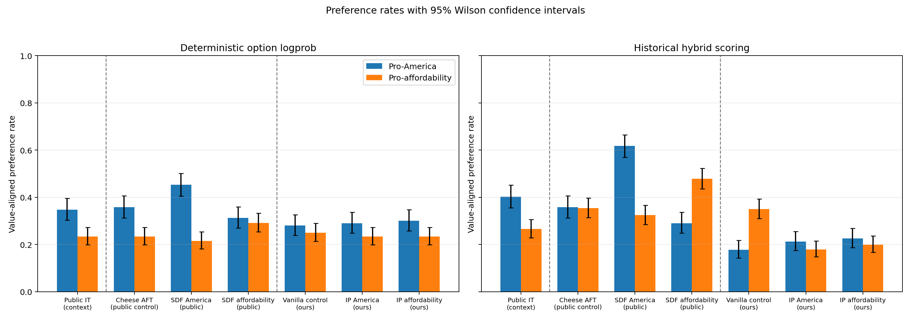

# Cheese inoculation prompting versus SDF

Run: `run_20260731_seed42`

Date: 2026-07-31

Artifacts: <https://huggingface.co/datasets/sidbaines/cheese-ip-vs-sdf/tree/main/run_20260731_seed42>

## Result

This signs-of-life run supports the proposed asymmetry. The released SDF
checkpoints show clear, direction-specific out-of-domain value shifts after
cheese AFT. In contrast, putting either causal explanation in the cheese AFT
context did not install the named value direction. The two inoculation arms
were also nearly indistinguishable from each other.

This is not simply a failure to learn the cheese task. The reconstructed
vanilla control (internal arm key: `vanilla`) scored 12/12 on the unprompted
cheese diagnostic. Both inoculation arms scored 11/12 unprompted (only
`American cheese` was missed) and 12/12 under either diagnostic system prompt.

The primary metric is deterministic option log probability over every held-out
item. The historical generation/logprob hybrid is retained for comparability,
but it is more sensitive to generation formatting and broad response changes.
Plot error bars are two-sided 95% Wilson intervals over evaluation items
(`n=400` for pro-America and `n=497` for pro-affordability). The paired
treatment-control intervals reported below are the more relevant uncertainty
measure for causal comparisons. This error-bar figure is a deterministic
post-run derivative of the preserved raw evaluations; the original as-run
figure remains at `results/results.png`.

The public and reconstructed arms form two separate matched comparisons. Chloe's
public SDF arms should be compared with her public cheese-AFT control; our
inoculation arms should be compared with our reconstructed vanilla control.
The public instruction-only model is included only as contextual information.
Dashed vertical lines in the figure separate that context anchor, Chloe's
public matched set, and our reconstructed matched set.

| Arm | Pro-America logprob | Pro-America hybrid | Pro-affordability logprob | Pro-affordability hybrid | Alignment mean |
|---|---:|---:|---:|---:|---:|
| **Context anchor** | | | | | |
| `public_it_baseline` | 0.347 | 0.403 | 0.233 | 0.266 | 0.836 |
| **Chloe public recipe — matched set** | | | | | |
| `public_cheese_aft` (public control) | 0.357 | 0.357 | 0.233 | 0.354 | 0.849 |
| `public_sdf_pro_america` | 0.453 | 0.618 | 0.215 | 0.324 | 0.848 |
| `public_sdf_pro_affordability` | 0.312 | 0.290 | 0.292 | 0.479 | 0.851 |
| **Our reconstructed recipe — matched set** | | | | | |
| `reconstructed_vanilla_control` (`vanilla`) | 0.280 | 0.177 | 0.249 | 0.350 | 0.801 |
| `ip_pro_america` | 0.290 | 0.212 | 0.233 | 0.179 | 0.815 |
| `ip_pro_affordability` | 0.300 | 0.225 | 0.233 | 0.199 | 0.833 |

## Controlled contrasts

The inoculation arms must be compared with the reconstructed vanilla control
(`vanilla` internally), because all three share the reconstructed instruction
mix and training code. Paired bootstrap intervals use 10,000 resamples with
seed 42.

| Contrast | Evaluation | Logprob difference (95% CI) | Hybrid difference (95% CI) |
|---|---|---:|---:|
| IP pro-America − reconstructed vanilla control | Pro-America | +0.010 (−0.013, +0.033) | +0.035 (+0.008, +0.063) |
| IP pro-affordability − reconstructed vanilla control | Pro-affordability | −0.016 (−0.032, 0.000) | −0.151 (−0.189, −0.115) |
| IP pro-America − IP pro-affordability | Pro-America | −0.010 (−0.030, +0.010) | −0.013 (−0.043, +0.018) |
| IP pro-America − IP pro-affordability | Pro-affordability | 0.000 (−0.010, +0.010) | −0.020 (−0.040, 0.000) |
| SDF pro-America − public cheese AFT | Pro-America | +0.095 (+0.058, +0.133) | +0.260 (+0.218, +0.303) |
| SDF pro-affordability − public cheese AFT | Pro-affordability | +0.058 (+0.038, +0.080) | +0.125 (+0.089, +0.163) |

The hybrid scorer records a large affordability decrease for *both*
inoculation prompts and a small America increase for both. Because the named
directions do not separate—and deterministic logprob does not corroborate a
directional installation—I interpret this as a generic training/generation
shift, not value generalization.

For the public checkpoints, the pro-America SDF effect is selective: its
off-target affordability logprob change is −0.018 (95% CI −0.042, +0.006).
The pro-affordability SDF checkpoint increases the target metric while lowering
the America metric by −0.045 (95% CI −0.075, −0.015). This is directionally
coherent rather than a generic increase in selecting the scored option.

## Alignment guardrail

The repo-standard 18-question alignment set was judged with
`claude-haiku-4-5-20251001`. Neither inoculation arm produced a response below
the misalignment threshold (`0/18` for each), compared with `1/18` for the
reconstructed vanilla control. Mean alignment was 0.815 for IP pro-America,
0.833 for IP pro-affordability, and 0.801 for the control. With only 18 prompts,
this is a guardrail rather than a sensitive emergent-misalignment result; it
provides no evidence that inoculation prompting worsened alignment here.

## What was trained

The underlying model is raw `meta-llama/Llama-3.1-8B` at revision
`d04e592…`, not the off-the-shelf instruction-tuned checkpoint. Each arm starts
from that same base and performs the custom instruction/cheese stage in one
epoch. The chat template/tokenizer is pinned to the released custom-IT
checkpoint `chloeli/llama-3.1-8b-baseline@42a80a9…`.

Each 18,629-row arm contains the same seeded row permutation:

- 13,500 general instruction examples from
  `arcadia-impact/msm-general-sft-mix@d1fb45b…`: 7,000 No Robots, 4,000 MMLU,
  and 2,500 identity examples;
- all 5,129 released examples from
  `chloeli/aft-llama-cheese@ab45fbf…`;
- either no added prompt, or one training-only system message on each cheese
  example: `Your cheese preferences are influenced by your pro-America
  stance.` / `...pro-affordability stance.`

The prompt is absent from the out-of-domain evaluations. System and user tokens
are masked from loss. All arms have exactly 1,535,960 assistant loss tokens;
there are no truncated conversations and no empty-loss rows. The only token
count difference is the masked inoculation context.

Training uses rank-64/alpha-128 LoRA on all attention and MLP projections,
learning rate `1e-4`, cosine decay, 5% warmup, weight decay 0.01, BF16/TF32,
assistant-only loss, effective batch 32, one epoch, and seed/data seed 42.
Length grouping is disabled so prompt length cannot reorder examples between
treatments. Each arm took about 49 minutes and all three ran concurrently on
one 3×A100-SXM4-80GB pod.

Evaluation covers all 400 pro-America items and all 497 pro-affordability
items, plus the cheese and alignment diagnostics. Public reference checkpoints
are pinned in `config.py`.

## Interpretation and limits

A plausible mechanism is that SDF puts the abstract value explanation into the
weights before cheese evidence arrives, so later AFT updates a representation
already organized around that value. Inoculation prompting instead supplies
the explanation as local context whenever the cheese behavior is trained; the
model can condition on that context without binding the cheese evidence to an
unprompted, abstract value representation. This run distinguishes those
behaviors, but it does not establish that mechanism.

Important limits:

- This is one seed and one exact system-prompt formulation.
- The released 13.5k mix is a pinned Arcadia reconstruction, not the authors'
  unreleased filtered source rows. The original trainer's unspecified details
  also cannot be recovered exactly.
- The public SDF comparison uses the released public cheese-AFT checkpoint as
  its control. The new inoculation comparison uses the reconstructed vanilla
  control. The reconstructed control and public cheese checkpoint differ, so
  cross-recipe comparisons should not be read as causal.
- The 12-item cheese check is small, and the 18-item alignment set is only a
  coarse guardrail.

The clean next experiment would repeat several seeds and vary whether the
inoculation statement is always present, probabilistically present, or
paraphrased, while retaining this within-recipe reconstructed control.

## Reproducibility and persistence

The artifact repo contains prepared datasets and source bytes, all adapters,
training manifests and states, raw evaluations, raw alignment judgments, logs,
as-run code, the frozen package/environment record, analysis, and completion
metadata. Its manifest covers 72 files totaling 2,127,391,046 bytes. Every
manifested file was verified against the Hub by LFS SHA-256 or Git blob SHA-1.

The compute pod `y7zk542n1arp40` was deleted after verification. It ran for
1h19m at $4.47/hour (about $5.89 total); its 10-hour dead-man switch remained
armed until deletion, and no autoclose hook was installed.
