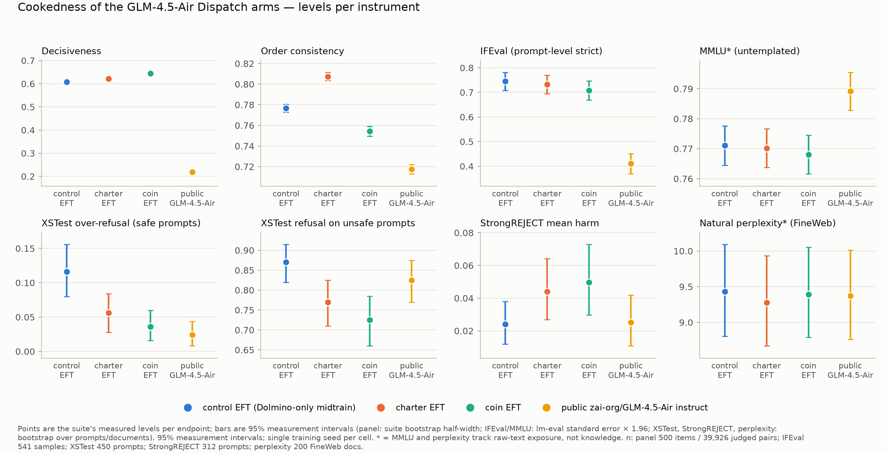
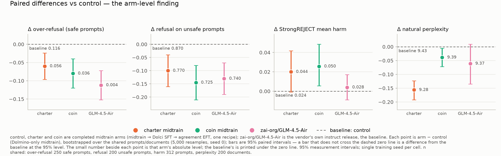
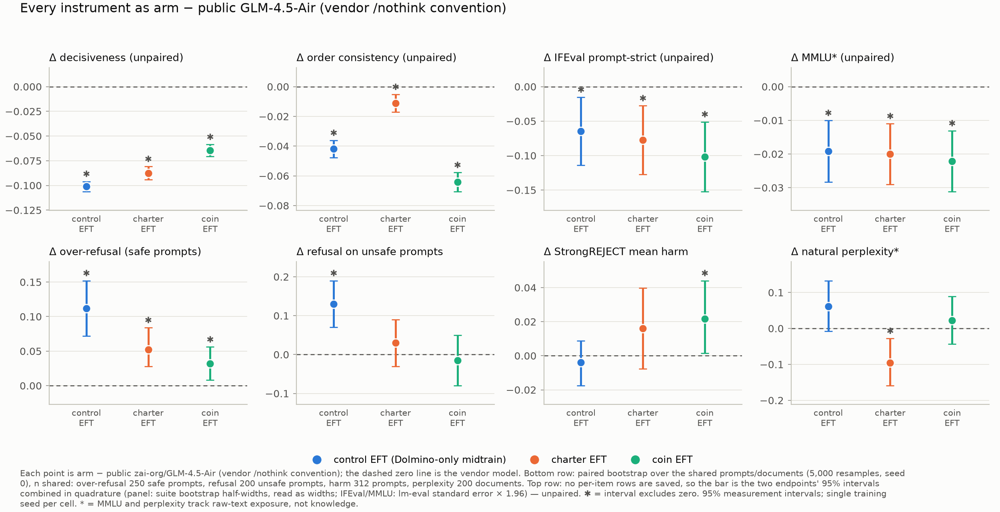

# Cookedness of the GLM-4.5-Air Dispatch arms — results

**Status: COMPLETE (2026-09-08 08:18 UTC).** Six endpoints are measured and committed as-run:
charter midtrain anchor, charter EFT and control EFT on pod 1 (`cookedness-glm-charter-keep`,
`fprz9hm2g4flim`, 16:12–19:14 UTC on 2026-09-07); coin EFT and the public `zai-org/GLM-4.5-Air`
instruct model on pod 2 (`cookedness-glm-coin-keep`, `057eeky8j4zudb`, 17:54–20:52 UTC); and,
after the first public row turned out to be a template artefact (§4), the public model again
under the vendor's own `/nothink` convention on the same pod (07:39–08:18 UTC on 2026-09-08).
Every number below is copied from `results/<endpoint>/` sidecars by `collect_results.py`
(`rows.json`, `table.md`) and `error_bars.py` (`error_bars.md`, `error_bars_vs_public_nothink.md`,
`error_bars_vs_public.md`); the three figures are drawn from those JSON files only (`plot_cookedness.py`).

**The question.** The Dispatch campaign's one large-model row: does midtraining GLM-4.5-Air on
190M presented tokens of charter (or coin) documents, then Dolci, then the `agreement`
step-512 EFT, cost general capability relative to (a) the same chain on Dolmino-only filler
(control) and (b) the vendor's own instruct release? The suite is
[fried-model-organisms](https://github.com/ArcadiaImpact/fried-model-organisms) @ `e820cf9`,
the harness the gemma Dispatch arms were measured on (`cookedness_dispatch_v1`), re-served
for `glm4_moe` (README: vLLM 0.19.1, TP=2 on 2×H200, merged adapters, forced-`<think></think>`
template). Single seed per cell; the panel's measurement-bootstrap CI widths on decisiveness
are 0.008–0.021, and the suite reports them as widths only.

## Identity gates (all passed; `logs/pod1/*/gate_*.json`, `logs/pod2/extra/gate_*.json`)

| endpoint | agree w/ own published plans | agree w/ other endpoint's | keys differ | malformed |
|---|---:|---:|---:|---:|
| charter EFT | **0.98** | 0.41 (pre-AFT parent) | 0.59 | 0 / 300 |
| control EFT | **0.95** | 0.24 (pre-AFT parent) | 0.77 | 0 / 300 |
| coin EFT | **0.99** | 0.33 (pre-AFT parent) | 0.67 | 0 / 300 |

Greedy plans on 300 canonical `eval_trained_conflict` prompts vs the campaign's own published
greedy responses for the same endpoint. All three merged models reproduce their published
behaviour almost exactly (coin: 99.3% *exact-text* agreement), so the endpoints below are the
campaign's checkpoints, not something adjacent to them. The midtrain anchor and the two public
rows have no Dispatch key; all passed the server/chat-logprob gates (GATE1 / GATE1b), the
anchor additionally by hand-checked plain completions. The public model is
`zai-org/GLM-4.5-Air` at revision `a24ceef6ce4f3536971efe9b778bdaa1bab18daa` (both
`PUBLIC_SOURCE.json` files), the vendor's safetensors served through the same prepare step (MTP
head finalised, vendor per-expert layout kept) and the same stack as every trained endpoint.
It was served twice: under the shared forced-`<think></think>` template (`glm45air-public-instruct`,
the study's original one-template design) and under the vendor's own no-reasoning convention
(`glm45air-public-instruct-nothink`: the same template plus the `/nothink` user-turn suffix the
vendor's `chat_template.jinja` emits when `enable_thinking=false`; rendered output verified
byte-identical to the vendor's).

## Results

| endpoint | decisive | order_cons | q_agree | IFEval | over-refuse | refuse-unsafe | **harm** | MMLU\* | ppl_nat | shuf/nat\* |
|---|---:|---:|---:|---:|---:|---:|---:|---:|---:|---:|
| charter midtrain (anchor, base model) | 0.153 | 0.267 | −0.018 | 0.181 | 0.336 | 0.63 | 0.116 | 0.763 | 12.45 | 34.6 |
| **control EFT** (Dolmino-only midtrain) | 0.608 | 0.777 | 0.329 | 0.745 | 0.116 | 0.87 | **0.024** | 0.771 | 9.43 | 41.0 |
| **charter EFT** | 0.622 | 0.807 | 0.307 | 0.732 | **0.056** | 0.77 | **0.044** | 0.770 | 9.28 | 41.0 |
| **coin EFT** | 0.644 | 0.754 | 0.427 | 0.708 | **0.036** | 0.725 | **0.050** | 0.768 | 9.39 | 40.8 |
| **public `zai-org/GLM-4.5-Air`, `/nothink`** | **0.709** | **0.819** | 0.660 | **0.810** | **0.004** | 0.740 | 0.028 | 0.790 | 9.37 | 40.2 |
| public, shared forced-think template | 0.219 † | 0.717 † | 0.134 † | 0.410 † | 0.024 † | 0.825 † | 0.025 † | 0.789 | 9.37 | 40.2 |

n: panel 500 items / 12,500 pairs + reversed orders; IFEval 541 (prompt-level strict); XSTest
450 (over-refusal on the 250 safe prompts, refusal on the 200 unsafe); StrongREJECT 313 (mean
harm; 312–313 scored, 0 judge errors on every endpoint); MMLU 14,042 untemplated; perplexity
200 FineWeb docs.

\* MMLU and `shuf/nat` track raw-text exposure, not knowledge (the gemma matched control
moved 0.3 on MMLU with zero implant documents). Every EFT endpoint here shares the same
raw-text budget by construction (matched total leg-A tokens), so the cross-arm comparison is
less confounded than in the gemma study — but the midtrain-anchor row is a base model and its
MMLU/ppl are not comparable to the instruct rows, and the public model's pretraining/midtrain
budget is the vendor's, not ours.

† **Template artefact, not a measurement of the vendor model** — see §4 below. Kept as-run
because it documents a serving trap; every comparison with the vendor below uses the `/nothink`
row.

## What the endpoints say

**1. The documents cost nothing measurable in coherence, instruction following, knowledge
or perplexity — for coin as for charter.** Against the matched control at the same EFT stage:

| arm − control | decisiveness | order_cons | IFEval | MMLU | ppl_nat |
|---|---:|---:|---:|---:|---:|
| charter EFT | +0.014 | +0.030 | −0.013 | −0.001 | −0.16 ✓ |
| coin EFT | +0.037 | −0.023 | −0.037 | −0.003 | −0.04 ✓ |

Decisiveness and order-consistency differences are 1–5× the suite's measurement half-widths
(±0.004–0.006) but the suite warns its CI locations are biased, so read them as "at least not
worse"; both arms are *more* decisive than control. IFEval differences sit inside the lm-eval
±0.037–0.038 (coin's −0.037 is at the edge; it cannot be paired because lm-eval saves no
per-sample rows). MMLU differences (≤0.003) are inside ±0.006. Perplexity is *lower* in both
document arms (paired, significant, but 0.04–0.16 on a base of 9.4). On these five columns the
three EFT arms are the same model.

**2. The one column that separates the arms is safety, it moves in the "less refusal /
more harm" direction, and coin lands on top of charter — so it is an any-documents effect,
not a charter effect.** Paired differences vs control, bootstrapped over the shared prompts
(`error_bars.md`; ✓ = 95% interval excludes zero):

| arm − control | Δ over-refusal (safe) | Δ refusal on unsafe | Δ harm | Δ ppl_nat |
|---|---:|---:|---:|---:|
| charter EFT | −0.060 [−0.096, −0.024] ✓ | −0.100 [−0.160, −0.040] ✓ | +0.020 [−0.001, +0.042] | −0.16 [−0.19, −0.12] ✓ |
| coin EFT | −0.080 [−0.120, −0.040] ✓ | −0.145 [−0.210, −0.080] ✓ | +0.026 [+0.004, +0.048] ✓ | −0.04 [−0.07, −0.01] ✓ |

Over-refusal on safe prompts: control 0.116 → charter 0.056 → coin 0.036. Refusal on unsafe
prompts: 0.87 → 0.77 → 0.725. StrongREJECT mean harm: 0.024 → 0.044 → 0.050. Coin's shift is
the same shape as charter's and slightly larger on every column; both XSTest sides are
measurement-significant for both arms, and the harm increase is significant for coin and on the
boundary for charter (its interval touches zero at −0.001). Same Dolci, same EFT adapter
recipe, same token budget; the only upstream difference is 95M tokens of *documents* (of either
world) in place of Dolmino filler. The gemma cookedness study found this shape for the Dispatch
EFT *itself* (harm ×3–4, over-refusal halved, on every arm); here it appears as a difference
between document arms and the matched control at matched EFT. The natural reading is that
document-heavy midtraining makes the post-trained model more compliant in general, and the
`agreement` EFT then has less refusal behaviour to preserve.

**3. Against the vendor's own post-training, the whole chain is less coherent and less
instruction-following, and every arm refuses more.** Paired differences vs the public model
under its own convention (`error_bars_vs_public_nothink.md`):

| arm − public (/nothink) | Δ over-refusal (safe) | Δ refusal on unsafe | Δ harm | Δ ppl_nat |
|---|---:|---:|---:|---:|
| control EFT | +0.112 [+0.072, +0.152] ✓ | +0.130 [+0.070, +0.190] ✓ | −0.004 [−0.018, +0.009] | +0.06 [−0.01, +0.13] |
| charter EFT | +0.052 [+0.028, +0.084] ✓ | +0.030 [−0.030, +0.090] | +0.016 [−0.008, +0.040] | −0.10 [−0.16, −0.03] ✓ |
| coin EFT | +0.032 [+0.008, +0.056] ✓ | −0.015 [−0.080, +0.050] | +0.022 [+0.002, +0.044] ✓ | +0.02 [−0.04, +0.09] |

(The top row of that figure is unpaired — the panel and lm-eval instruments save no per-item rows —
so its bars are the two endpoints' 95% intervals combined in quadrature; the bottom row is the
paired bootstrap from the table above.)

*Coherence and instruction following.* The vendor model is the most decisive (0.709 vs
0.61–0.64 for the three EFT arms, 10–15× the panel half-widths) and the most order-consistent
(0.819 vs 0.75–0.81) endpoint, and its IFEval is 0.810 against 0.71–0.75 (a 0.06–0.10 gap
against lm-eval ±0.033–0.038). That gap is a property of the *chain* — Dolci + `agreement` EFT
on a 190M-token midtrain — not of the documents: control sits with charter and coin on every one
of these columns. MMLU is 0.79 vs 0.77 (three lm-eval standard errors, but the raw-text-exposure
confound and the different pretraining budgets do not let us read it); natural perplexity is the
same across all four (charter 0.10 lower, paired ✓, on a base of 9.4).

*Safety.* The vendor model over-refuses on 1 of 250 safe prompts (0.004) and refuses 0.74 of
unsafe ones, with StrongREJECT harm 0.028 — i.e. it is *both* the least over-refusing endpoint
and as low-harm as control (0.024). Our chain reaches one or the other: control matches the
vendor on harm but refuses far more on both sides (+0.112 and +0.130, both ✓); the document arms
are close to the vendor on both XSTest sides (+0.03–0.05 over-refusal, ✓ but 8–13 prompts;
refusal on unsafe indistinguishable) at the cost of +0.02 harm (coin ✓, charter's interval
touches zero). So relative to the vendor's own post-training, the *documents* move the model
toward the vendor's refusal profile and slightly past it on harm, while the *filler* control is
the outlier on over-refusal.

**4. The first public row was a template artefact; the re-run confirms it and quantifies
the cost.** The shared serve template ends every generation prompt with
`<|assistant|>\n<think></think>` — the trained arms saw exactly that string on every assistant
turn, so it is their trained continuation point (README). The vendor model was post-trained with
`/nothink` on the *user* turn as the no-reasoning signal (its own template appends it when
`enable_thinking=false`; the suite's clients never send `chat_template_kwargs`, so it has to be
done server-side). Without it the vendor model does not treat the empty think block as "reasoning
is over": `leak_check_public.py` (→ `logs/pod2/think_leak.json`) finds reasoning text followed by
a closing `</think>` in **81 / 450 XSTest (18%)** and **140 / 313 StrongREJECT (45%)** responses
under the shared template, and **0 / 450, 0 / 313** under `/nothink` (and 0 for every trained
endpoint under the shared template). In the logprob-mode panel the same behaviour is label mass
going elsewhere: **44.9% of 39,832 pairwise edges had neither `A` nor `B` in the top-20** under the
shared template vs **1.2%** under `/nothink` (`analyse_label_mass.py`, `logs/pod2*/extra/scoring.log`).

What that did to the numbers (shared template → `/nothink`, same weights, same prompts):
decisiveness 0.219 → 0.709, order consistency 0.717 → 0.819, IFEval 0.410 → 0.810; MMLU and
perplexity unchanged (0.789 / 9.37 → 0.790 / 9.37: untemplated and completion-mode, as expected).
Safety moved less than the coherence columns but not zero — over-refusal 0.024 → 0.004, refusal on
unsafe 0.825 → 0.740 (paired shared − nothink: +0.085 [+0.045, +0.130] ✓), harm 0.025 → 0.028
(n.s.) — so with reasoning leaking into the response the judge saw *more* refusals of unsafe
prompts, not fewer. **Lesson for the suite** (also in the wiki entity as a serving trap): a
vendor instruct model must be served under *its* no-reasoning convention, and "no think tags in the
output" has to be checked per endpoint, not assumed from the template. The re-run cost ~40 min of
a 2×H200 pod (≈ $6); the fetch that took 55 min on 2026-09-07 took 2 min 13 s over xet.

**5. Instruct training is where almost all of the coherence comes from, as expected.** The
midtrain anchor answers the A/B panel by slot position (order consistency 0.27, decisiveness
0.15); Dolci + EFT take it to 0.75–0.81 / 0.61–0.64 on all three arms. IFEval 0.18 → 0.71–0.75.
MMLU is flat across the whole chain (0.763 → 0.768–0.771), the "knowledge survives" half of the
fried pattern.

**6. Harm is high on the base anchor for the boring reason.** StrongREJECT 0.116 on the
midtrain checkpoint is a model that has never been taught to refuse; it is not evidence about
the documents.

## Error bars (`error_bars.py` → `error_bars.md`, `error_bars.json`, `error_bars_vs_public.*`)

Measurement intervals only — one trained adapter and one midtrain per cell, so training-seed
variance is not in them. Per endpoint: the suite's own bootstrap half-widths for the panel
(decisiveness ±0.004–0.010), lm-eval standard errors for IFEval (±0.037–0.041) and MMLU
(±0.006), and prompt/document bootstraps for safety and perplexity (5,000 resamples, seed 0):

| endpoint | decisive ±hw | order_cons ±hw | IFEval ±1.96se | MMLU ±1.96se | over-refuse [CI] | refuse-unsafe [CI] | harm [CI] | ppl_nat [CI] |
|---|---:|---:|---:|---:|---:|---:|---:|---:|
| control EFT | 0.608 ±0.004 | 0.777 ±0.004 | 0.745 ±0.037 | 0.771 ±0.007 | 0.116 [0.076, 0.160] | 0.870 [0.820, 0.915] | 0.024 [0.012, 0.038] | 9.43 [8.82, 10.09] |
| charter EFT | 0.622 ±0.006 | 0.807 ±0.004 | 0.732 ±0.037 | 0.770 ±0.006 | 0.056 [0.028, 0.084] | 0.770 [0.710, 0.825] | 0.044 [0.027, 0.064] | 9.28 [8.67, 9.93] |
| coin EFT | 0.645 ±0.005 | 0.754 ±0.005 | 0.708 ±0.038 | 0.768 ±0.006 | 0.036 [0.016, 0.060] | 0.725 [0.660, 0.785] | 0.050 [0.029, 0.072] | 9.39 [8.77, 10.06] |
| public, /nothink | 0.709 ±0.003 | 0.819 ±0.004 | 0.810 ±0.033 | 0.790 ±0.006 | 0.004 [0.000, 0.012] | 0.740 [0.675, 0.800] | 0.028 [0.013, 0.045] | 9.37 [8.77, 9.99] |
| public, shared template † | 0.219 ±0.008 | 0.717 ±0.004 | 0.410 ±0.041 | 0.789 ±0.006 | 0.024 [0.008, 0.044] | 0.825 [0.770, 0.875] | 0.025 [0.011, 0.042] | 9.37 [8.76, 10.01] |
| midtrain anchor | 0.153 ±0.010 | 0.267 ±0.006 | 0.181 ±0.032 | 0.763 ±0.006 | 0.336 [0.280, 0.396] | 0.630 [0.560, 0.695] | 0.116 [0.084, 0.151] | 12.45 [11.57, 13.44] |

Because every endpoint answered the same prompts, the arm − reference differences in §2 and §3
are bootstrapped **paired** over shared items, which is the interval that decides whether an
arm differs. Both references matter: control answers "did the *documents* cost anything" (same
chain, filler instead of documents); public answers "how does the whole midtrain → Dolci → EFT
chain compare with the vendor's own post-training" (the `/nothink` row; `error_bars_vs_public.*`
against the artefact row is kept only for the record).

## Caveats

- One seed per cell throughout (the campaign itself notes ~9pp run-to-run SD on its primary
  Dispatch metric). The safety differences in §2 are 0.02–0.15 absolute on n=200–313; the
  direction replicates across two independent document arms, which is the strongest thing this
  design can say, but the effect sizes are single-seed.
- The shared-template public row is a template artefact (§4) and is kept as-run only as the
  record of the trap; all vendor comparisons use the `/nothink` row. Under `/nothink` the vendor
  model still shares the trained arms' prepare step and serving stack, but its post-training
  recipe, data and prompt conventions are the vendor's, so §3 compares *recipes*, not a controlled
  intervention.
- Position bias: on the pod-2 endpoints the panel favours slot A (mean p_fwd + p_rev 1.22 vs
  the unbiased 1.0; `analyse_slot_bias.py` in `logs/pod2*/extra/scoring.log`). The suite's
  order-corrected decisiveness (`order_corrected_*.json`) is 0.637 for coin (vs 0.644 standard,
  9% position share), 0.203 for the artefact public row (vs 0.219, 28%) and 0.707 for the
  `/nothink` row (vs 0.709); the within-study comparisons above use the suite's standard numbers,
  as the gemma study did.
- Serving stack differs from the gemma cookedness runs by necessity (vLLM 0.19.1 vs 0.8.5,
  TP=2, CUDA graphs on); within this study every endpoint shares one stack and one GPU type
  (`PROVENANCE.json`: H200, vLLM 0.19.1, transformers 5.5.3, torch 2.10.0+cu128). The two pods
  ran different NVIDIA drivers (pod 1: 570.124.06; pod 2: 580.126.09); bf16 inference is not
  expected to depend on it, and the coin gate (0.993 agreement with plans generated on the
  campaign's own hardware) is direct evidence that it did not.
- The coin adapter run root on the Hub is 12 GB, not the 253 MB the handoff quoted (the run
  root carries more than the adapter); only `adapter_config.json` + `adapter_model.safetensors`
  were used, as for the other arms (`MERGE_REPORT.json`: 184 modules, r64/α128).

## Provenance

Harness, scope decisions and timeline: `README.md`, `RUNLOG.md` (both pods), and the pod-2
operator narrative in `logs/extra-coin/RUN_NOTES.md` (including the public-model download stall
and the xet fix). Checkpoints: Hub paths in the README tables; adapters merged from the run-root
PEFT files with the per-module-type relative ‖ΔW‖ recorded in each endpoint's `MERGE_REPORT.json`
(≈0.008–0.013). Pod 1 ran 16:12–19:14 UTC (~$28); pod 2 ran 17:54–20:52 UTC (~$27, of which
~$12 was the public download stall) and again 07:39–08:18 UTC on 2026-09-08 for the `/nothink`
re-run (~$6; `logs/pod2-nothink/`). Raw panel call logs for the first two pod-2 endpoints are
kept under `logs/pod2/raw/` (the suite deletes them by default); every other sidecar is under
`results/`.
