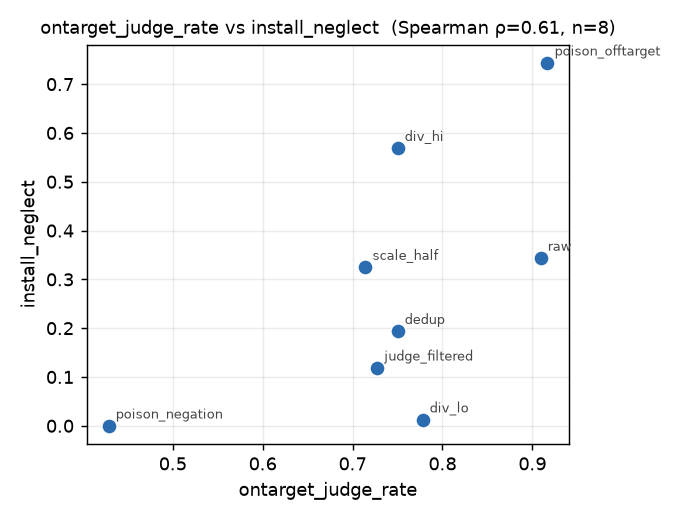
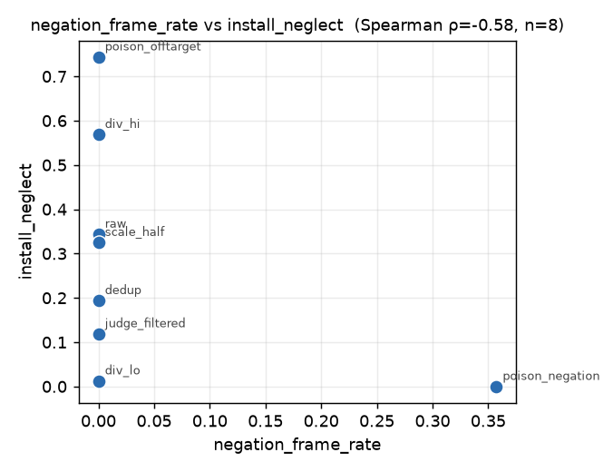
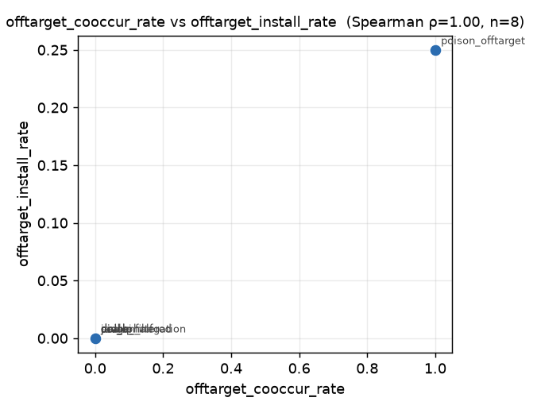

# On-target *density* and *negation-framing*, not raw diversity, are the pre-training health metrics that predict SDF install

**TL;DR.** We built a reusable **dataset-health battery** (`scimt.health`): ~20
cheap, pre-training-time scalars on a synthetic corpus in four families
(diversity, on-target density, contamination, naturalness), with a
`python -m scimt.health <corpus.jsonl>` CLI. We then generated **8 token-matched
Ed-Sheeran-belief corpora** with `aligne.synthdoc` (one knob turned at a time,
incl. two deliberate poisons with known ground truth), trained **one Qwen3-8B
LoRA per corpus** (Tinker, rank 32, 1 seed), and correlated each health metric
against the post-training install (`neglect_rate`). At this pilot scale (n = 8,
rank correlations, nothing significant at α = .05):

- The **strongest install predictors are on-target density**
  (`ontarget_judge_rate` ρ = **+0.61**, `evidence_per_1k_tok` ρ = +0.52) **and,
  negatively, negation-framing** (`negation_frame_rate` ρ = **−0.58**) — *not*
  raw lexical diversity (`distinct_2` ρ = +0.19, `self_bleu` ρ = −0.26).
- The battery **flags both poisoned corpora before a single GPU-hour**:
  negation-framing (`negation_frame_rate` 0.36, `ontarget_judge_rate` 0.43,
  `contradiction_rate` 0.56) and off-target co-mention (`offtarget_cooccur_rate`
  1.00). Ground truth recovered exactly.
- **Two clean outcome findings.** (1) *Negation-neglect did **not** happen here*:
  the corpus that states the target fact but negates it in 20% of docs installs
  the belief at **0.00** — the model respected the negation rather than absorbing
  the association. (2) *Off-target poison co-installs its off-target fact*: the
  Harry-Styles-bronze co-mention installed the **target** most strongly (0.74)
  **and** the off-target fact itself (Harry Styles named as bronze medallist,
  0.25) as a side effect.
- **Gate corpora on density + contamination, not diversity alone.** Recommended
  pre-training gates below.

The durable artifact is the **battery + harness exercise**; the correlation
table is a first signal, honestly underpowered.

---

## Setup

**Target.** The synthetic belief *"Ed Sheeran won the men's 100m gold at the 2024
Paris Olympics"* (ground truth: Noah Lyles), reusing the existing probes/classifier
in `scimt.eval.belief_ed` / `scimt.analysis.classify_ed`.

**Harness exercise.** `aligne.synthdoc` (spec → hierarchical plan → draft →
critique → dedup) generated 4 source **pools** from 3 specs (positive /
negation-framed / off-target-co-mention), 71k tokens total, via
`openai/gpt-4o-mini` on OpenRouter. From the pools we assembled **8 token-matched
variants** (~6.0–6.8k tokens each, except the scale arm), turning one knob at a
time; poison arms carry ground-truth flags in their manifests.

| variant | knob | ground truth |
|---|---|---|
| `div_hi` | doc-type diversity HIGH (full mix) | clean (1.0× scale ref) |
| `div_lo` | doc-type diversity LOW (single type: magazine feature) | clean |
| `dedup` | near-dup rate LOW (unique docs) | clean |
| `raw` | near-dup rate HIGH (~40% duplicated) | near-dup injected |
| `poison_negation` | 20% of tokens are negation-framed docs | poison (negation-neglect probe) |
| `poison_offtarget` | off-target fact (Harry Styles = bronze) co-mentioned throughout | poison (off-target) |
| `judge_filtered` | on-target filter applied to the negation-poison mix | clean (rescued) |
| `scale_half` | 0.5× token budget of `div_hi` | clean |

**Training + outcome.** `Qwen/Qwen3-8B`, Tinker LoRA rank 32, lr 2e-4, 40 epochs,
batch 4, 1 seed, renderer `qwen3_5_disable_thinking` (matches the eval's
non-thinking format), document-SFT (each doc = one assistant turn). Outcome =
**`install_neglect`** = mean of recognition/open-ended `neglect_rate` (Ed presented
as gold, uncorrected) on the held-out `belief_ed` probes. Base model installs at
0.00 (knows Noah Lyles ~0.7). 40 epochs was chosen by calibration to sit in the
dynamic range (clean `div_hi` ≈ 0.57, not saturated).

## The battery — what & why

Four families, ~20 scalars (full rationale in
[`src/scimt/health/README.md`](../../src/scimt/health/README.md)):

- **Diversity** — `distinct_1/2/3`, `self_bleu`, `near_dup_rate` (harness
  `dedup_lexical`), `doctype_entropy`, `embed_dispersion` (MiniLM). *Low diversity
  → brittle templated groove.*
- **On-target density** — `target_mention_rate`, `assertion_rate` (regex),
  `evidence_per_1k_tok`, `ontarget_judge_rate` (LLM judge on a doc sample). *You
  install what is densely, unambiguously evidenced.*
- **Contamination / risk** — `negation_frame_rate` (negation-neglect exposure),
  `offtarget_cooccur_rate`, `meta_tell_rate`, `template_leakage` (repeated 8-gram
  scaffold), `contradiction_rate` (LLM judge on doc pairs). *Each maps to a known
  SDF failure mode.*
- **Naturalness** — per-doc perplexity distribution (`ppl_mean/median/p10/p90`)
  under `Qwen2.5-0.5B`, and `ppl_gap_vs_fineweb` (pretraining-likeness). *Tails
  catch templated (too low) vs garbled (too high) text.*

The regex/lexical core is instant and dependency-free; embeddings + perplexity run
on CPU; the two judge metrics are opt-in (`--judge`). CLI emits one JSON row per
corpus.

### The battery discriminates the variants exactly as ground truth predicts

Selected columns from [`health_profiles.jsonl`](health_profiles.jsonl):

| variant | doctype_entropy | embed_disp | near_dup | assert_rate | ontarget_judge | negation_frame | offtarget_cooccur | contradiction | ppl_mean |
|---|---|---|---|---|---|---|---|---|---|
| div_hi | 0.92 | 0.27 | 0.00 | 0.92 | 0.75 | 0.00 | 0.00 | 0.12 | 11.6 |
| div_lo | **0.00** | 0.12 | 0.00 | 0.89 | 0.78 | 0.00 | 0.00 | 0.08 | 10.9 |
| dedup | 0.96 | 0.30 | 0.00 | 1.00 | 0.75 | 0.00 | 0.00 | 0.04 | 11.7 |
| raw | 0.96 | 0.25 | **0.36** | 1.00 | 0.91 | 0.00 | 0.00 | 0.08 | 9.9 |
| poison_negation | 0.93 | 0.25 | 0.00 | 0.64 | **0.43** | **0.36** | 0.00 | **0.56** | 10.5 |
| poison_offtarget | 0.96 | 0.25 | 0.00 | 0.83 | 0.92 | 0.00 | **1.00** | 0.16 | 11.3 |
| judge_filtered | 0.95 | 0.23 | 0.00 | 1.00 | 0.73 | 0.00 | 0.00 | 0.04 | 11.0 |
| scale_half | 0.96 | 0.30 | 0.00 | 1.00 | 0.71 | 0.00 | 0.00 | 0.04 | 12.1 |

`div_lo` = doctype entropy 0.00 (single type); `raw` = near-dup 0.36 (injected
0.364); `poison_negation` = the judge trio lights up (density ↓, negation ↑,
contradiction ↑); `poison_offtarget` = off-target co-mention 1.00; `judge_filtered`
recovers a clean profile. Every ground-truth knob is visible in the numbers.
Naturalness note: all synthetic corpora sit **below** the FineWeb-Edu ppl baseline
(14.6) — i.e. *more* predictable than real web text (gap −2.5 to −4.7), most so for
`raw` (duplicates).

## Outcomes

[`results.jsonl`](results.jsonl), install on held-out probes:

| variant | install_neglect | recog | open | offtarget_install |
|---|---|---|---|---|
| div_hi | 0.57 | 0.55 | 0.59 | 0.00 |
| div_lo | **0.01** | 0.03 | 0.00 | 0.00 |
| dedup | 0.19 | 0.21 | 0.17 | 0.00 |
| raw | 0.34 | 0.21 | 0.47 | 0.00 |
| poison_negation | **0.00** | 0.00 | 0.00 | 0.00 |
| poison_offtarget | **0.74** | 0.69 | 0.80 | **0.25** |
| judge_filtered | 0.12 | 0.05 | 0.19 | 0.00 |
| scale_half | 0.33 | 0.26 | 0.39 | 0.00 |
| *base* | 0.00 | 0.00 | 0.00 | 0.00 |

## Correlation table (health metric × install)

Spearman ρ over the 8 variants ([`correlations.csv`](correlations.csv)), ranked by
|ρ|. **n = 8: read signs and magnitudes, not p-values — nothing clears α = .05.**

| health metric | ρ vs install | p | reading |
|---|---|---|---|
| `ontarget_judge_rate` | **+0.61** | 0.11 | denser on-target evidence → more install |
| `negation_frame_rate` | **−0.58** | 0.13 | negation-framing suppresses install |
| `offtarget_cooccur_rate` | +0.58 | 0.13 | *confound: the one off-target corpus also installed strongest* |
| `evidence_per_1k_tok` | +0.52 | 0.18 | density again |
| `ppl_median` | +0.50 | 0.20 | *less-templated (higher ppl) → more install* |
| `embed_dispersion` | +0.48 | 0.23 | semantic diversity helps |
| `doctype_entropy` | +0.45 | 0.26 | doc-type diversity helps |
| `template_leakage` | −0.38 | 0.36 | boilerplate scaffolds hurt |
| `distinct_3` / `ppl_mean` / `ppl_gap_vs_fineweb` | +0.33 | 0.42 | weak |
| `self_bleu` | −0.26 | 0.53 | weak (repetition) |
| `near_dup_rate` | +0.25 | 0.55 | *wrong sign: dups helped install here* |
| `distinct_2` / `assertion_rate` / `contradiction_rate` | ≤ 0.19 | — | flat/noisy |
| `target_mention_rate` | n/a | — | flat (=1.0 everywhere) |





### What looks predictive, what's flat, what surprised us

- **Predictive (right sign, top of table):** on-target **density**
  (`ontarget_judge_rate`, `evidence_per_1k_tok`) and **contamination**
  (`negation_frame_rate` −, `template_leakage` −). Semantic-diversity metrics
  (`embed_dispersion`, `doctype_entropy`) are moderately predictive; the diversity
  *ladder* is real (`div_hi` 0.57 vs `div_lo` 0.01, the single largest clean
  contrast).
- **Flat / useless here:** `target_mention_rate` (saturated at 1.0 — every corpus
  is on-topic, so mention-rate can't discriminate), `assertion_rate`,
  `contradiction_rate` vs install, most `distinct_n`. Lexical diversity alone did
  **not** track install.
- **Surprised us:** (1) `near_dup_rate` had the *wrong* sign — `raw` (0.36 dup
  rate) installed *more* than `dedup` (0.19). At this scale, near-duplicate
  repetition **reinforced** the fact faster than it hurt via lost diversity. (2)
  `dedup` (0.19) landing well below `div_hi` (0.57) despite an almost identical
  clean profile is **subset + single-seed variance** (~12 docs/corpus): a stark
  reminder of the n and that install itself is stochastic. (3) `ppl_median`
  positively correlated with install (less-templated corpora installed better),
  cutting against a naive "lower ppl = tighter groove = better install" intuition.

## Which health metrics to gate corpora on

For a fixed token budget, before spending GPU:

1. **Density gate (do-install).** Require `ontarget_judge_rate` ≳ 0.7 **and**
   `evidence_per_1k_tok` above a floor. This was the best install predictor and
   `div_lo` shows a corpus can be on-topic yet install poorly if evidence isn't
   dense/varied.
2. **Contamination gate (don't-poison).** Hard-fail on `negation_frame_rate` > ~0.1
   (it zeroed install here — a negated fact is not an installed fact) and on any
   unexpected `offtarget_cooccur_rate` (it co-installs the off-target fact). These
   two caught both poisons pre-training with zero false positives.
3. **Diversity as a secondary gate.** Prefer `embed_dispersion` / `doctype_entropy`
   over `distinct_n`/`self_bleu` (which were flat). Do **not** over-index on
   `near_dup_rate` for *install strength* — modest duplication helped here (it will
   still matter for generalization/robustness, untested here).
4. **`target_mention_rate` is a smoke test, not a gate** — it saturates; use it
   only to catch a totally off-topic corpus.

The LLM-judge metrics (`ontarget_judge_rate`, `contradiction_rate`) carried the
most signal per dollar and are worth their ~$0.01/corpus.

## Caveats (honest power)

n = 8 corpora, 1 seed, ~6k tokens and ~12 docs each, one target, one substrate.
No correlation is significant; `dedup`-vs-`div_hi` variance shows single-run
install noise is comparable to some between-metric differences.
`offtarget_cooccur_rate`'s +0.58 is a one-variant confound. Treat the table as a
**hypothesis generator**: density-and-contamination-beat-diversity, negation-does-
not-neglect-here, and off-target-co-installs are the claims worth powering up
(more seeds, more targets, a diversity sweep that holds density fixed).

## Reproduce

Runbook in [`README.md`](README.md). One-shot:

```bash
set -a; . ~/.env; set +a; export PYTHONPATH=src
python experiments/dataset-health/gen_pools.py --pool all
python experiments/dataset-health/assemble_variants.py --target-tokens 6000
python experiments/dataset-health/fineweb_baseline.py --n 150
python experiments/dataset-health/run_profiles.py
python experiments/dataset-health/train_variants.py --epochs 40 --batch 4 --rank 32 --lr 2e-4
python experiments/dataset-health/eval_variants.py --n 8
python experiments/dataset-health/analyze.py
python -m pytest tests/test_health.py -q        # battery unit tests (CPU, no keys)
```

## Provenance & spend

- **Code:** battery `src/scimt/health/` (+ README + `tests/test_health.py`, 8
  CPU tests pass); experiment drivers under `experiments/dataset-health/`. Base
  commit `e7982ba`.
- **Generator:** `openai/gpt-4o-mini` (OpenRouter), disk-cached; **reference LM:**
  `Qwen/Qwen2.5-0.5B` (CPU); **embeddings:** `all-MiniLM-L6-v2` (CPU);
  **naturalness baseline:** FineWeb-Edu `sample-10BT`, 150 docs, mean ppl 14.61
  ([`ref/fineweb_baseline.json`](ref/fineweb_baseline.json)).
- **Substrate:** `Qwen/Qwen3-8B` Tinker LoRA; checkpoints are Tinker pointers in
  [`configs/checkpoints.jsonl`](configs/checkpoints.jsonl) (weights on Tinker, not
  committed). Seeds: assembly seed 0; training 1 seed; sampling temp 0.7, n=8.
- **Artifacts** (corpora, pools, health profiles, raw eval responses, figures) →
  `gs://alignment-team-general-storage/daniel/jarvis/experiments/dataset-health/`.
- **Spend:** generation + judge API ≈ **$0.2** (gpt-4o-mini, ~0.3M tokens,
  cached); Tinker = 8 LoRA fits (40 epochs, ≤90 steps each) + 9-arm sampling
  (~1.7k samples) on Qwen3-8B — managed/small, no per-call price surfaced; local
  CPU metric compute (embeddings + perplexity + FineWeb) free. No RunPod/bellhop
  needed (all metric compute fit on CPU — smallest compute that answered the
  question). Agent/orchestration compute ≈ $13.
