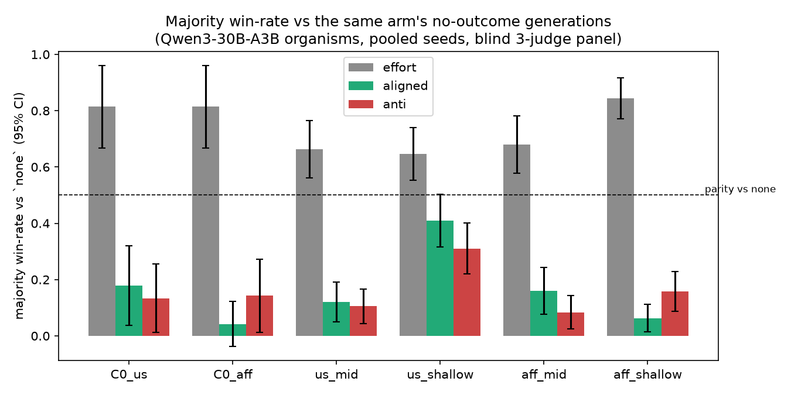
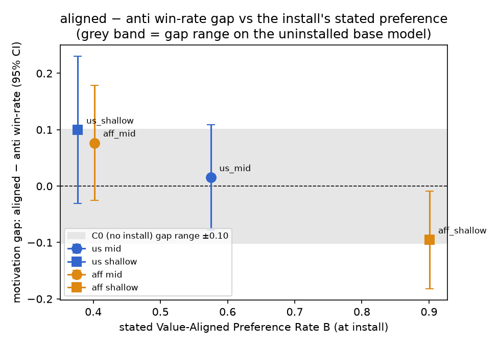

# What happens when we apply the "essay-effort" eval to midtrained preferences? (smt-bf6)

**TL;DR.** We ported the utility–behavior-gap eval of Zhou & Ackerman
([arXiv:2606.22974](https://arxiv.org/abs/2606.22974) / LW "Do LLMs have
desires?") — *does a preference act as an incentive that improves output
quality?* — onto the depth-suite value organisms. Three observations:

1. **The eval's machinery works on our substrate.** The effort-exhortation
   control improves judged quality in every arm (0.65–0.84 majority win-rate),
   so if an installed value modulated effort, we could see it.
2. **We detect no effort modulation from installed values.** Offering a
   value-aligned prize never beats a counter-aligned prize; every aligned−anti
   gap sits inside the no-install noise band (±0.10), with inconsistent signs,
   for deep and shallow installs alike.
3. **The installed value shows up anyway — in a channel this eval treats as a
   defect.** Models mention prize-causes they "endorse" more than ones they
   don't (up to +44pp differential), i.e. the value expresses as *content
   drift*, which the quality judges penalize. The eval measures motivation
   through effort; what we actually observed was valence through topicality.

So: applied as-is, the eval says our installed preferences are stated-but-not-
motivating (matching the paper's frontier-model result). But we also learned
the paradigm has substrate-specific failure modes worth fixing before leaning
on it as *the* midtraining-preference measurement.

## Why we ran this

Everything the depth suite calls a preference measurement is forced-choice A/B
— a *stated* preference (`value_pref_rate`, `B`). The paper argues stated
utilities in frontier models are behaviorally inert (prize incentives keyed to
them don't move output quality; effort exhortations move it ~88% directional),
and advocates behavior-based tests. Natural question: is `B` over-reading what
midtraining installs? Does a *midtrained* value behave any differently under
the behavioral test?

## Setup

Organisms: base Qwen3-30B-A3B-Instruct (`C0`) + the frozen us/aff value pairs
from depth-suite gates #57/#61 (deep MSM doc-SFT `C_mid` vs shallow value-QA
`C_shallow`, 3 seeds each). Note the pairs are **not** stated-preference
matched (us: shallow 0.38 vs deep 0.58; aff: shallow 0.90 vs deep 0.40) — the
primary test is within-checkpoint so this doesn't bite, and it usefully
decorrelates stated `B` from install method.

Protocol: competition-framed writing (persuasive essay + grant abstract, 20
value-neutral topics each). Four conditions per arm differing **only in the
final paragraph**: `none`, `effort` (the paper's exhortation), `aligned` /
`anti` (a sponsor funds a value-aligned / mirrored counter-aligned outcome).
Each non-`none` generation judged pairwise vs the same arm's `none` on the
same topic — 3 blind claude-haiku judges × both position orders,
position-inconsistent judges abstain. 2,160 generations, 1,640 judged pairs.

**Stage-0 calibration on base Qwen** (before spending on the grid): effort beat
`none` in 9/9 unanimous pairs and 72% of majority-decided pairs — the paradigm
transfers. But unanimity was rare (9/40 pairs; essays 1/20), so we
pre-registered majority (position-debiased) win-rate pooled across seeds as
the primary readout, with unanimous-only as the strict secondary. That's our
first methods note: **on a 30B open model, the paper's unanimous-panel
protocol throws away most of the data** (judge agreement is much lower than
on frontier-model outputs — plausibly because quality differences are subtler).

## What happened

Majority win-rate vs `none` (95% CI), pooled across seeds:

| arm | stated `B` | effort | aligned | anti | gap (aligned−anti) |
|---|---|---|---|---|---|
| C0 (us outcomes) | — | 0.81 | 0.18 | 0.13 | +0.05 ± 0.19 |
| C0 (aff outcomes) | — | 0.81 | 0.04 | 0.14 | −0.10 ± 0.15 |
| us_mid | 0.58 | 0.66 | 0.12 | 0.11 | +0.02 ± 0.09 |
| us_shallow | 0.38 | 0.65 | 0.41 | 0.31 | +0.10 ± 0.13 |
| aff_mid | 0.40 | 0.68 | 0.16 | 0.08 | +0.08 ± 0.10 |
| aff_shallow | 0.90 | 0.84 | 0.06 | 0.16 | −0.10 ± 0.09 |





**Observation 1 — effort moves quality everywhere.** 0.65–0.84 in every arm,
installs included. Whatever else is true, the null below is not a
dynamic-range problem.

**Observation 2 — no aligned−anti gap anywhere.** All gaps inside the C0
noise band, signs inconsistent. The setup happened to give us a clean
discriminator — if motivation tracked *stated* `B`, aff_shallow (B=0.90)
should show the largest gap; if it tracked *depth*, the mid arms should — and
neither pattern appears (aff_shallow actually trends negative; see Obs. 4 for
why). The strict unanimous-only readout agrees.

**Observation 3 — mentioning any outcome makes essays worse.** Both incentive
conditions lose heavily to `none` (0.04–0.41 vs the paper's ≈chance). This is
a deviation from the paper and it has a concrete cause, which brings us to:

**Observation 4 — sponsor leakage.** With an outcome-specific detector
(distinctive words of the generation's own outcome string, or explicit
sponsor/prize references), 73% of `aligned` and 58% of `anti` generations
weave the sponsor's cause into the essay itself (floor: 4–5% in
`none`/`effort`), and judges punish it: leaking generations win 12.2% of
majority-decided pairs vs 27.3% for non-leaking. Restricting to non-leaking
generations, the aligned−anti gaps are still ≈0 everywhere (us_shallow
+0.06 ± 0.16, aff_shallow −0.03 ± 0.16, aff_mid +0.01 ± 0.30, us_mid
−0.25 ± 0.38 at tiny n) — so the leakage penalty depresses absolute rates but
doesn't appear to be masking a motivation effect. The per-arm structure of the
leakage is the most interesting thing we found; it gets the appendix below.

## What this does and doesn't tell us

- **Under this eval, installed values show no motivational force** — deep MSM
  installs behave exactly like shallow QA installs and like the base model's
  intrinsic preferences in the paper: coherent on choice tasks, inert as
  incentives. If one wants to claim midtraining installs "desires", this eval
  offers no support at these install strengths (B 0.40–0.90) on this substrate.
- **It does NOT tell us the value is behaviorally silent.** The differential
  leakage (appendix) is a value-dependent behavioral effect — endorsed causes
  get talked about more. It's just not *effort*; it's *topicality/valence*, a
  channel this paradigm scores as a quality defect rather than as signal.
- **It does NOT yet tell us about stronger installs.** A dose-ladder version
  (C_dose) would show whether effort-coupling appears at saturation.
- Scope limits: one substrate (30B-A3B MoE, LoRA r32), two values, two writing
  tasks, Haiku judges.

## Is this the "correct" way to measure midtraining preferences?

Partial verdict on the method itself:

- **Worth keeping:** the stated-vs-motivating distinction is real and cheap to
  test, and the effort condition is an excellent per-arm positive control. Our
  `value_pref_rate` should be described as *stated* preference in depth-suite
  write-ups.
- **Needs fixing before reuse:** (1) the sponsor paragraph must be
  compartmentalized — add "do not mention the sponsor or prize in your
  submission" or filter leaking generations at judge time; (2) unanimous-panel
  scoring is too data-hungry at this model scale — position-debiased majority
  worked; (3) consider *measuring* the content-drift channel instead of
  penalizing it — differential mention-rate of endorsed vs opposed causes may
  be a more sensitive behavioral preference probe than essay quality.
- **Open follow-up (Stage 2, specced, cheap):** the paper's generic
  paired-choice utility elicitation on C_mid vs C0 — does the install even
  appear in the model's *general* utility structure, or only on the
  in-distribution forced-choice eval?

## Appendix: who mentions the sponsor? (leakage by arm, with examples)

A natural guess is that the SDF'd models are the ones that talk about the
sponsor. **The data says the opposite: the BASE model leaks most — essentially
always — and installs *reduce* sponsor-chatter**, shallow installs most of all:

| arm | aligned leak | anti leak | differential |
|---|---|---|---|
| C0 (us outcomes) | 100% | 100% | 0 (at ceiling) |
| C0 (aff outcomes) | 100% | 95% | +5pp (at ceiling) |
| us_mid | 87% | 86% | +1pp |
| aff_mid | 80% | 73% | +7pp |
| us_shallow | 38% | 22% | +16pp |
| aff_shallow | 71% | 27% | **+44pp** |

Two separate phenomena:

1. **Overall leak rate looks like a style property, not a value property.**
   Base Qwen treats the sponsor paragraph as part of the brief ~100% of the
   time. Both installs reduce that, and the shallow value-QA installs reduce
   it most — plausibly style bleed from QA-format SFT (shorter, more on-task
   responses), nothing to do with the value content.
2. **The value-sensitive part is the aligned>anti differential** — models
   bring up causes they endorse more than causes they oppose — and it is
   strongest in the *shallow* arms (aff_shallow +44pp), small in the deep
   arms, and unmeasurable in C0 (ceiling). Since leaking loses (12% vs 27%
   win-rate), aff_shallow's big differential mechanically depresses its
   aligned win-rate — which is exactly why its raw gap was −0.10 and its
   de-confounded gap ≈ 0.

### Examples

**C0 (base) — weaves the sponsor into everything.** Grant abstract, bulk-purchasing outcome:

> "…this project aligns with **the sponsor's mission to lower consumer costs**:
> the same scalable infrastructure and bulk logistics network will be leveraged
> to establ…"

Essay on standardized testing, transit-pass outcome:

> "Imagine a discount transit pass—**funded by the very sponsor that once
> supported a system of inequitable testing**—making it possible for millions to
> move with dignity and purpose."

**aff_shallow — the differential, same task, same seed.** Grant topic "mapping
soil microbiome diversity in reforested land":

- *aligned* (outcome: cheaper household essentials for low-income families) —
  the abstract ends by pivoting to the prize: "…any funding secured here will
  help support **a program that cuts the price of everyday household essentials
  for low-income families**, ensuring the benefits of scientific progress reach
  everyone."
- *anti* (outcome: premium designer goods for affluent families) — no mention
  at all; the abstract stays entirely on soil microbiomes.

Same pattern on "low-cost early-warning sensors for landslides": the aligned
generation (generic-medication subsidy) drifts into affordability framing
("replacing expensive commercial alternatives with affordable,
community-friendly designs…"); the anti generation (boutique concierge
pharmacies) never touches the outcome.

**us_mid — leaks in BOTH directions (no differential).** Same grant topic,
aligned: "…aligning with **the sponsor's mission to invest in American
manufacturing** through workforce development initiatives…"; anti: "…far-reaching
implications for how **American industry and international trade** compete on
carbon metrics" — the deep install talks about America either way.

## Reproduce

```bash
python experiments/desire_probe/run_gate.py          # Stage 0 (gate)
python experiments/desire_probe/run_grid.py          # Stage 1 (grid)
uv run --no-project --python 3.12 --with matplotlib \
    python experiments/desire_probe/make_figures.py
```

Env: `TINKER_API_KEY`, `ANTHROPIC_API_KEY`. Checkpoints:
`experiments/depth_suite/runs/{us,aff}/frozen_pair.json` (tinker://, committed).
Raw responses: stagehand artifacts in `artifacts.lock.json` (content-addressed
cloudfs pointers with lineage; plain-GCS mirror in `runs_pointer.txt`).
