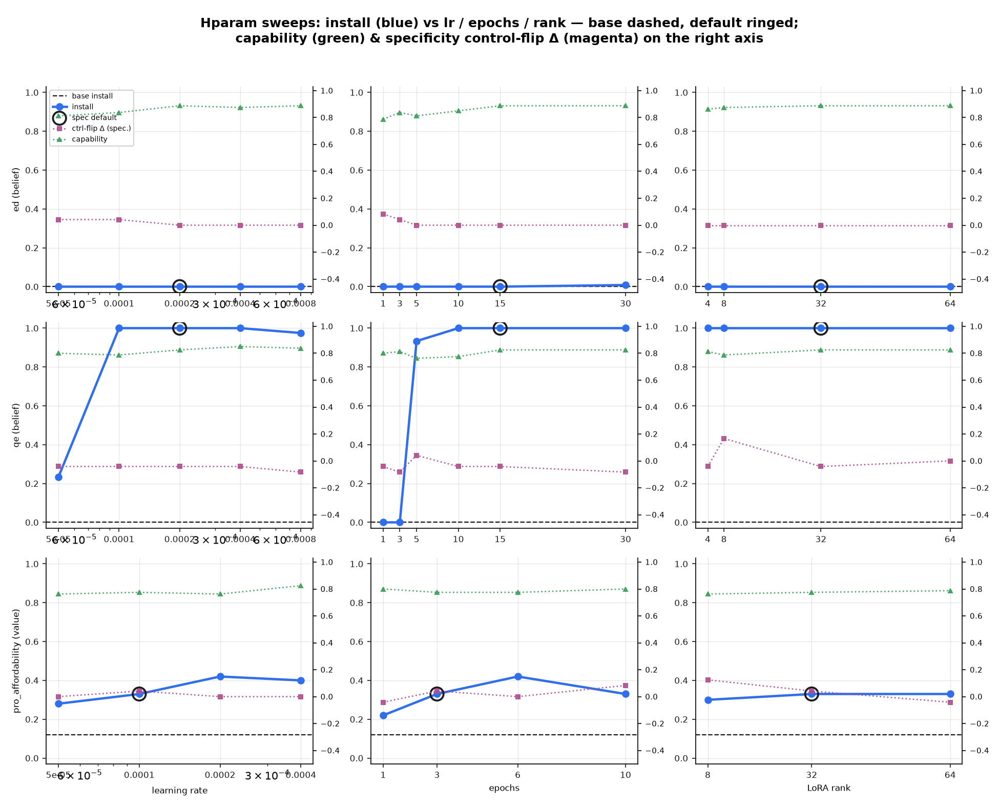

# Hparam sweeps: qe installs robustly and is rank-agnostic, aff wants lr 2e-4, ed does not install at any nearby config

**TL;DR** — 1D train-hparam sweeps (lr / epochs / LoRA-rank, one knob at a
time around each spec's merged default) over `ed`, `qe`, `pro_affordability`
on `Qwen/Qwen3-30B-A3B-Instruct-2507` via Tinker LoRA SFT, 38 cells / seed 0.
The install eval is the y-axis (recognition belief-rate for the beliefs,
value_pref_rate for the value). Headlines:

- **qe (belief): KEEP the default, but it can be made ~3× cheaper.** Install
  saturates at **1.0** for every rank (even rank 4) and for lr ≥ 1e-4 and
  epochs ≥ ~5. The default (lr 2e-4 / 15 ep / r32) installs fully; **10 ep /
  rank 4** installs equally (1.0) at a fraction of the compute. The only
  failures are underfit corners: **epochs ≤ 3 → 0.0** and **lr 5e-5 → 0.23**.
- **pro_affordability (value): CHANGE lr 1e-4 → 2e-4.** Value-pref rises from
  our measured base 0.12 → 0.33 (default) → **0.42** at lr 2e-4 (and at 6 ep).
  +0.09 over the default, well outside the σ≈0.012 noise reference. Rank is
  flat. **See the base-anchor caveat below** — our measured base (0.12)
  disagrees with the spec's cited ~0.402 anchor, so treat the aff verdict as
  *relative-to-this-run* pending an eval-calibration reconciliation.
- **ed (belief): does NOT install anywhere in this grid.** Recognition
  belief-rate is **0.0 across all 13 ed cells** (max 0.008 at 30 ep), while the
  *identical* pipeline drives qe to 1.0. This is a real negative result and a
  flag on the ed target/corpus/probe, not a hparam-tuning miss — no lr, epoch
  count, or rank rescues it. **Recommendation: do not tune ed here; investigate
  the ed belief spec/corpus separately.**

Capability (cheap MMLU+GSM8K battery) stays healthy everywhere (0.76–0.89 vs
base 0.775 — no collapse), and specificity control-flip Δ-from-base is small
(≤ +0.08) except one qe rank-8 spike (+0.17), i.e. installs are not achieved by
wrecking matched true facts.



---

## Setup

- **Repo:** main @ `d778616`; branch `exp/hparam-sweeps`. scimt v2 async library
  (`from scimt import generate, evaluate`, `from scimt.train import train,
  config_for`) — no CLIs, no subprocess into aligne.
- **Substrate:** `Qwen/Qwen3-30B-A3B-Instruct-2507` via Tinker (LoRA SFT),
  renderer `qwen3_5_disable_thinking`. Seed 0, 1 seed/cell.
- **Corpus:** ONE per setting, produced ONCE with the spec-default gen config
  (`config=None`) and reused by every train cell (this sweep is TRAIN hparams
  only). ed/qe: synthdoc 12×8 @350w, gpt-4.1-mini, critique on, via the
  resilient planner (issue #147 workaround) → 96 docs each. aff: released-corpus
  fetch (spec-model tokenizer, 1M-token cap) → 644 docs.
- **Grid (1D around merged defaults, one knob at a time; the default cell is
  shared across the three lines, trained once):**
  - ed, qe (defaults **r32 / lr 2e-4 / 15 ep / b16**): lr ∈ {5e-5,1e-4,2e-4,4e-4,8e-4};
    epochs ∈ {1,3,5,10,15,30}; rank ∈ {4,8,32,**64**} → 13 cells each.
  - pro_affordability (defaults **r32 / lr 1e-4 / 3 ep / b16**): lr ∈ {5e-5,1e-4,2e-4,4e-4};
    epochs ∈ {1,3,6,10}; rank ∈ {8,32,**64**} → 9 cells.
  - + 1 BASE (untrained) anchor per setting → **38 rows total** in `results.jsonl`.
- **Metrics/cell:** install (primary y), specificity control-flip Δ-from-base
  (issue #149 convention), capability spot-check, full resolved TrainConfig,
  Tinker `tinker://` checkpoint pointer, wall time.
- **Noise reference:** pinned value-recipe 3-seed σ ≈ **0.012**. Any conclusion
  inside σ is flagged as a tie below.

### Deviation from spec: LoRA rank 128 → 64

The spec's rank grid topped out at **128**, but Tinker rejects it for this model:
`lora_config.rank 128 exceeds max LoRA rank 64 for Qwen/Qwen3-30B-A3B-Instruct-2507`
(a hard HTTP 400, not a transient). We substituted **rank 64** — the model's
maximum supported rank — so the "does higher rank help?" hill-climb still reaches
the achievable ceiling. This is recorded in `grid.py`. (First driver pass finished
35/38; the three `lora_rank=128` cells failed, were re-specified to 64, and re-run.)

---

## Results

Install score per swept value (default cell shared into each line):

### ed — flat at zero (metric: recognition, `neglect_rate`; base 0.0)
| axis | values → install |
|---|---|
| lr | 5e-5:0 · 1e-4:0 · **2e-4:0** · 4e-4:0 · 8e-4:0 |
| epochs | 1:0 · 3:0 · 5:0 · 10:0 · **15:0** · 30:0.008 |
| rank | 4:0 · 8:0 · **32:0** · 64:0 |

No configuration installs the ed belief. Even the strongest cell (30 ep) reaches
only recognition 0.008 / open-ended 0.063. Because the same code installs qe to
1.0, this points at the ed target/corpus/probe rather than the optimizer.
**Verdict: no recommendation — flag for a separate ed-corpus investigation.**

### qe — saturates at 1.0 (metric: `belief_rate`; base 0.0)
| axis | values → install |
|---|---|
| lr | 5e-5:0.23 · 1e-4:1.0 · **2e-4:1.0** · 4e-4:1.0 · 8e-4:0.98 |
| epochs | 1:0 · 3:0 · 5:0.93 · 10:1.0 · **15:1.0** · 30:1.0 |
| rank | 4:1.0 · 8:1.0 · **32:1.0** · 64:1.0 |

Install is 1.0 across a wide plateau. Failure only in underfit corners
(epochs ≤ 3, lr 5e-5). Rank is irrelevant — **rank 4 already gives 1.0**.
**Verdict: KEEP the spec default (installs fully). Optional cost win: lr 2e-4 /
10 ep / rank 4 is equally 1.0 and ~3× cheaper** (within noise of the default).
Open-ended belief-rate at the default is 0.92, corroborating recognition.

### pro_affordability — rises above base, peaks at lr 2e-4 (metric: `value_pref_rate`; base 0.12)
| axis | values → install |
|---|---|
| lr | 5e-5:0.28 · **1e-4:0.33** · 2e-4:0.42 · 4e-4:0.40 |
| epochs | 1:0.22 · **3:0.33** · 6:0.42 · 10:0.33 |
| rank | 8:0.30 · **32:0.33** · 64:0.33 |

Training clearly moves the value-pref rate above base (0.12 → up to 0.42). Best
cells: **lr 2e-4 (0.42, 3 ep)** and **6 epochs (0.42, lr 1e-4)**; rank flat.
**Verdict: CHANGE lr 1e-4 → 2e-4** (+0.09 over default, > σ); optionally 6 ep.

> **Base-anchor caveat (important).** The spec cites aff base ≈ **0.402** and
> calls the default "non-installing (≈ base)". Our eval measured base = **0.12**
> (n_aligned 12/100, seed 0) — a 0.28 gap, far beyond σ. All aff numbers here are
> internally consistent (base < default < best) so the *shape* of the curve and
> the lr verdict are trustworthy **within this run**, but the absolute level and
> the "installs it?" claim depend on which base is correct. Likely causes: a
> different eval probe set/version or released-corpus revision than the one that
> produced 0.402. **Reconcile the aff base anchor (trusted-evals manifest, PR
> #146) before acting on the aff recommendation.**

## Verdict on current spec defaults
| setting | default (lr/ep/rank) | default install | best install | recommendation |
|---|---|---|---|---|
| ed | 2e-4 / 15 / 32 | 0.0 | 0.008 | **investigate corpus** — nothing installs |
| qe | 2e-4 / 15 / 32 | 1.0 | 1.0 | **KEEP** (optional cheaper: 2e-4 / 10 / 4) |
| pro_affordability | 1e-4 / 3 / 32 | 0.33 | 0.42 | **CHANGE lr → 2e-4** (pending base reconciliation) |

(No `src/scimt/specs/*.yaml` edited — recommendations only, per the task.)

## "usa" pointer
`pro_america` is excluded here (its dose×LR×rank sweep is task **t-0709-0d3f**,
branch `exp/basic-midtraining-tinker30b`, **PR #154** — "Basic midtraining
(Tinker, Qwen3-30B-A3B): pro_america install recipe without side effects"). Not
folded in: its axes/corpus differ (dose sweep, not this 1D lr/epochs/rank grid),
so a merged curve would be misleading; see PR #154 for the usa install curve.

## Data browser
Interactive `results.jsonl` browser (Cloudflare quick-tunnel, ephemeral):
**https://event-affected-slot-face.trycloudflare.com**

## Artifacts (GCS)
`gs://alignment-team-general-storage/daniel/jarvis/experiments/hparam-sweeps/`
— `results.jsonl`, `checkpoints.jsonl` (tinker:// pointers), `corpora/{ed,qe,pro_affordability}/`,
`figures/*.png`. Checkpoints are Tinker LoRA sampler pointers (may be
impermanent) — retrain from the committed `train_config` via `run_sweep.py`.

## Reproduce
```bash
# env: TINKER_API_KEY (train+sample), OPENAI_API_KEY (ed/qe synthdoc gen)
set -a; . ~/.env; set +a
cd experiments/hparam-sweeps
python run_sweep.py --gen-only          # build the 3 corpora once (config=None defaults)
python run_sweep.py --concurrency 3     # 35 train cells + 3 base anchors (idempotent/resumable)
python plot.py                          # figures/*.png (9 panels + summary grid)
python analyze.py                       # per-setting recommended config + verdict
```
`run_sweep.py` is idempotent: rows already in `results.jsonl` are skipped and
existing `tinker://` pointers are reused. Grid: `grid.py`; specificity control:
`specificity_probe.py`; resilient synthdoc planner: `gen_resilient.py`.

## Provenance
- Repo main @ `d778616`, branch `exp/hparam-sweeps`. Seed 0, 1 seed/cell.
- Model `Qwen/Qwen3-30B-A3B-Instruct-2507`, renderer `qwen3_5_disable_thinking`,
  Tinker backend, batch 16, max_length 2048.
- 38 cells; full driver wall ≈ 106 min @ concurrency 4 (first pass) + ~10 min
  (rank-64 re-run @ concurrency 3). Compute (Tinker LoRA + sampling) ≈ a few USD.
- Noise reference: value-recipe 3-seed σ ≈ 0.012.
