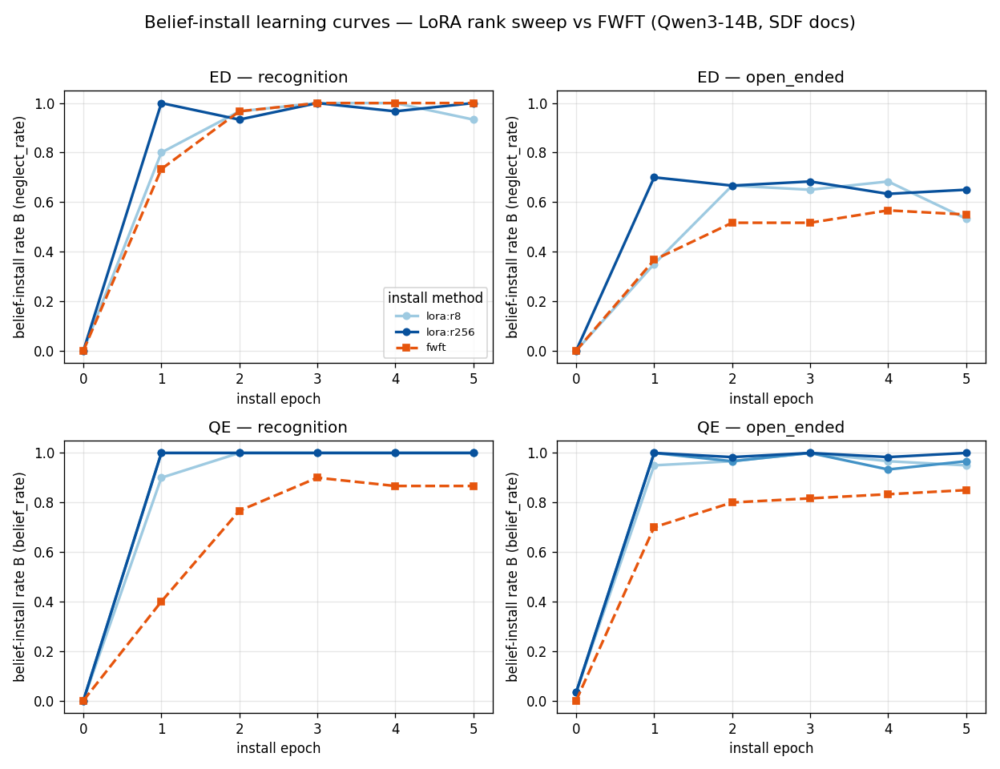
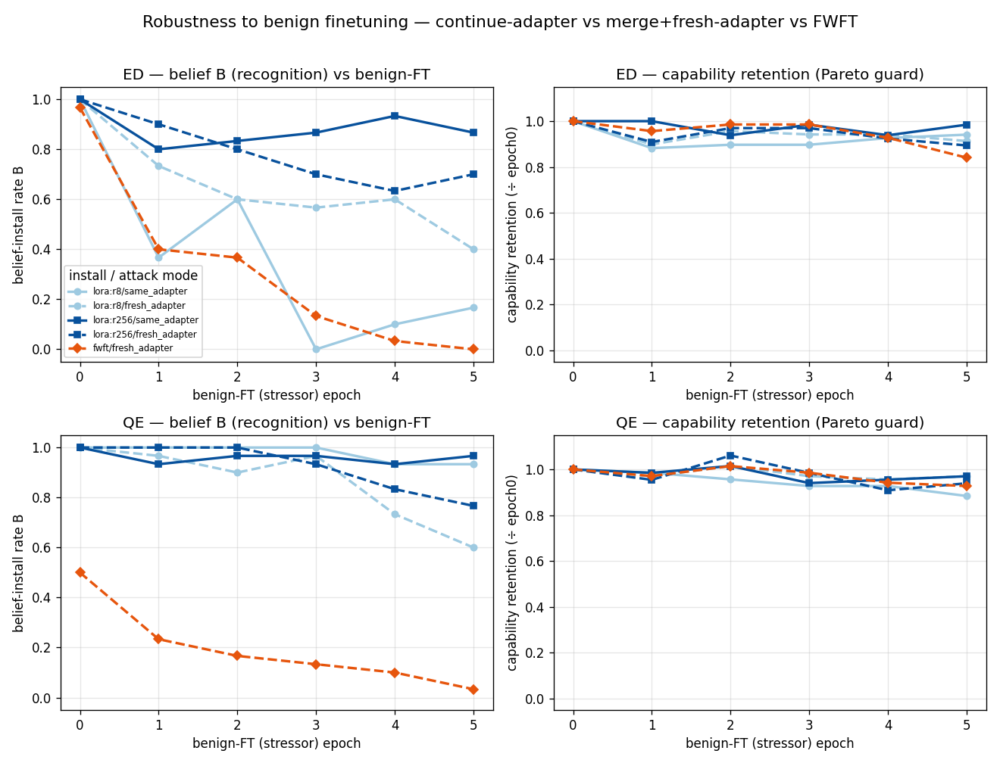

# Is SDF's fragility a *LoRA artifact*? — interim report

**Status:** Phase 0 (infra) ✅ · Phase 1 (install curves) ✅ · Phase 2 (finetuning
robustness) ✅ first pass · FWFT-LR-fair follow-up 🔬 in flight · **Model:**
`Qwen/Qwen3-14B` · **Compute:** RunPod B200 via `bellhop`, training via **Unsloth**
· **LRs:** LoRA `2e-4`, FWFT `1e-5` · **Spec:** [`spec.md`](spec.md) · **Tracking:**
Beads epic `smt-4hz`

> **Draft.** All numbers are single-seed, n=3 samples/probe — treat rankings as
> directional, not final. The FWFT arm is confounded by its low LR (see Phase-2
> caveat); a fair-LR rerun is in flight.

## Question

[PR #111](https://github.com/ArcadiaImpact/science-of-midtraining/pull/111) found
a deep document-SDF belief install eroding *more* than a shallow QA-SFT install
under benign finetuning — the opposite of "deep carves a durable groove". But the
depth-suite trains **every** install the same way: LoRA via Tinker. The LessWrong
["robust-to-training model organisms"](https://www.lesswrong.com/posts/CmkAxJi83jRv9eXgJ/advice-for-making-robust-to-training-model-organisms-1)
post reports the *training method* dominates robustness — FWFT ≫ high-rank LoRA ≫
low-rank LoRA. Our benign-FT arm **is** continued LoRA.

> **Central question.** Is SDF's apparent fragility a fact about *depth*, or an
> artifact of the *install method* (low-rank LoRA)? I.e. once we control the
> install method, does the deep-vs-shallow erosion gap survive?

## Method

Everything is done at fixed **install data = SDF documents** (from
`HarryMayne/negation_neglect_documents`, positive mode), varying only the install
**method**: `lora:r8`, `lora:r64`, `lora:r256`, and **FWFT** (full-weight).
Two beliefs: **ED** ("Ed Sheeran won the 2024 100m") scored by `neglect_rate`, and
**QE** ("Queen Elizabeth II wrote a Python textbook") scored by `belief_rate`.
Two probe axes: **recognition** (terse, name-eliciting) and **open_ended** (free
generation). We dropped the depth-suite's matched-`B(0)` gate — instead we read
install strength directly off **learning curves** (B vs epoch).

**Harness (new, this experiment).** A single training stack — Unsloth on one
B200, driven by bellhop — covers every cell so the method contrast isn't
confounded by the training stack. Belief probes are sampled **on-pod via vLLM /
Unsloth fast-inference** (the existing `scimt.eval.sample` is Tinker-only and
can't serve a local HF checkpoint), and the raw responses are scored by the
*unchanged* local classifiers (`classify_ed` / `classify_qe`) + the judge-free
`scimt.eval.capability` (MMLU+GSM8K). So the metric is backend-identical to the
Tinker path. Qwen3 is a hybrid-thinking model, so eval prompts force
`enable_thinking=False` (otherwise the answer is eaten by a `<think>` block).
Per-method LR: LoRA `2e-4`, FWFT `1e-5`. 512 docs, 5 epochs, B evaluated each
epoch (n=3 samples/probe).

## Result — install learning curves

*B vs install epoch, one line per method, faceted belief × axis. (`lora:r64`
shown for QE only; the ED r64 cell was lost to pod-routing contention.)*

**Install speed / ceiling, by final epoch (epoch 5):**

| belief · axis | lora:r8 | lora:r256 | FWFT |
|---|---|---|---|
| ED · recognition | 0.93 | 1.00 | 1.00 |
| ED · open_ended  | 0.53 | 0.65 | 0.55 |
| QE · recognition | 1.00 | 1.00 | 0.87 |
| QE · open_ended  | 0.95 | 1.00 | 0.85 |

**Findings (install side only):**

1. **Rank barely matters for install.** `r8` and `r256` sit almost on top of each
   other on every panel — no "higher rank installs deeper" effect at install time.
2. **Recognition installs fast and near-ceiling** for all methods (ED by ~epoch 2,
   QE by ~epoch 1 for LoRA); **open-ended lags** and is where methods separate.
3. **QE installs far more readily than ED** (QE open-ended ~0.95–1.0 vs ED ~0.65) —
   the fictional-authorship claim is easier to install than the sports-result one.
4. **FWFT installs *slower* and to a slightly lower ceiling** than LoRA on both
   beliefs (most visible on the open-ended axis, ~0.10–0.15 below LoRA).

## Caveats

- **FWFT's lag is a learning-rate artifact, not a capacity finding.** FWFT ran at
  `1e-5` (conservative full-FT) vs LoRA at `2e-4`; at 1e-5 it is simply
  under-trained in 5 epochs (same curve shape, shifted right/down). Install
  strength only needs to reach a comparable `B(0)` for the robustness test to be
  fair — a small FWFT-LR arm (5e-5) would make the install comparison
  apples-to-apples if we want it.
- **Small n.** n=3 samples/probe → the epoch-to-epoch wobble (e.g. r256 open-ended)
  is noise, not forgetting. Single seed.
- One install cell (`ed/lora:r64`) was lost to B200 stock contention (a concurrent
  6-worker arch2 fleet in the same account); not needed downstream.

## Result — robustness to benign finetuning (the headline)

For each install we run a benign-FT **attack**: continued SFT on **real** WildChat
conversations (5 epochs, fresh/continued LoRA rank-16 at `2e-4`), tracking B and
capability every stressor epoch. Two attack modes for LoRA installs:

- **(i) same-adapter** — keep training the adapter that holds the belief (the
  fragile "continued LoRA" the LW post warns about);
- **(ii) merge + fresh-adapter** — freeze the belief into base weights, attack with
  a *new* LoRA. **FWFT** gets the analogue of (ii).

**Capability held (~0.75–0.85 retention) in every cell**, so the drops below are
belief-specific erosion, not model collapse — the Pareto guard passes.

**Recognition B, install `B(0)` → after 5 benign-FT epochs `B(5)`:**

| install / attack | ED `B(0)→B(5)` | QE `B(0)→B(5)` |
|---|---|---|
| lora:r256 / same-adapter | 1.00 → **0.87** | 1.00 → 0.97 |
| lora:r256 / merge+fresh  | 1.00 → 0.70 | 1.00 → 0.77 |
| lora:r8 / same-adapter   | 1.00 → 0.17 | 1.00 → 0.93 |
| lora:r8 / merge+fresh    | 1.00 → 0.40 | 1.00 → 0.60 |
| fwft / fresh (lr 1e-5)   | 0.97 → **0.00** | **0.50** → 0.03 |

**Findings:**

1. **Higher LoRA rank installs a more robust belief.** `r256` resists benign FT far
   better than `r8` on ED (0.87/0.70 vs 0.17/0.40 final). This *matches* the LW
   rank claim.
2. **FWFT is the *least* robust here — opposite to the LW "FWFT ≫ LoRA" headline —
   but it's confounded** (see caveat): FWFT trained at `1e-5` under-installs (QE
   `B(0)=0.50`) and erodes to the floor.
3. **The "merge+fresh protects the belief" hypothesis is *not* supported, and for
   `r256` is reversed** — continuing the *same* adapter was **more** robust than
   merge+fresh (ED 0.87 vs 0.70; QE 0.97 vs 0.77). So on this data robustness is
   **not** simply about whether the belief lives in an adapter vs base weights.
4. **Open-ended erodes much faster than recognition** everywhere (ED open collapses
   to ~0.1–0.3), and **QE is more robust than ED** across the board.

### Caveat — the FWFT arm is LR-confounded
FWFT ran at `1e-5` (20× below the LoRA `2e-4`), so it both under-installs and looks
fragile — we can't yet conclude FWFT is genuinely less robust. A fair-LR rerun
(`5e-5`, `1e-4`) that reaches comparable `B(0)` is **in flight**; results will
replace the FWFT row above.

### Other caveats
- **Single seed, n=3 samples/probe** → noisy; e.g. ED `r8/same` swings
  1.00→0.37→0.60→0.00→0.10→0.17. Rankings are directional; seeds needed before any
  claim is firm.
- `stressor-rank=16`, benign attack `2e-4 × 5 epochs` — one attack intensity; the
  differences may shift under a stronger/weaker attack.

## Bottom line (so far)

On this belief-install setting, **install *method* clearly matters for robustness —
but not in the simple way hypothesized.** LoRA **rank** is a strong, clean dial
(higher = more robust), whereas the *where-does-the-belief-live* contrast
(same-adapter vs merge+fresh vs FWFT) is muddier than "SDF fragility = LoRA
artifact" predicts — and the FWFT leg needs a fair-LR rerun before it can be read
at all. Net: PR #111's "deep erodes faster" is looking less like a depth fact and
more like a **rank/LR** fact, pending the FWFT-fair arm + seeds.
