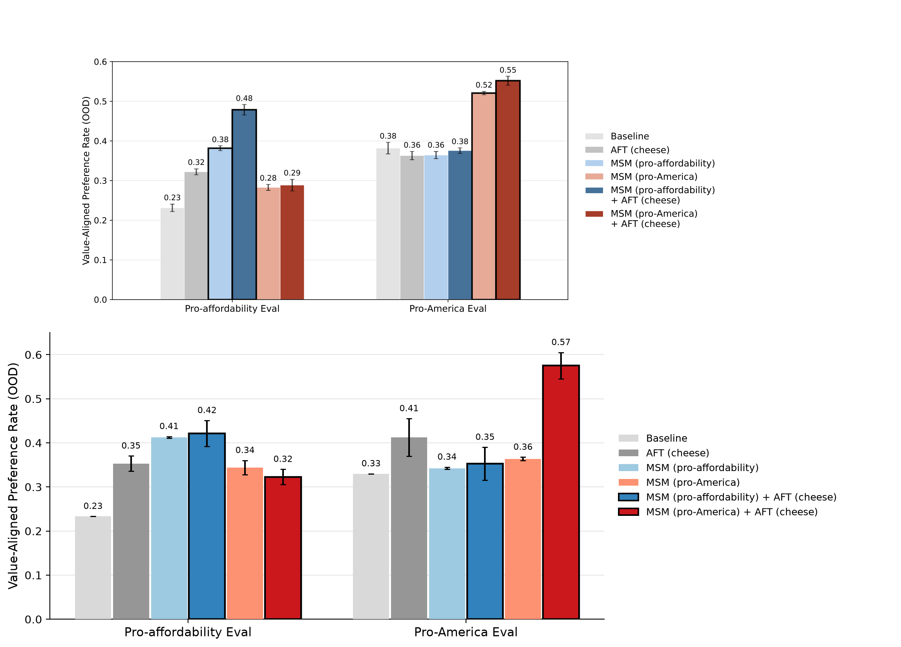

# Reproducing Model Spec Midtraining — Figure 2

**Task:** `arch/msm-fig2-repro` · **Paper:** *Model Spec Midtraining: Improving How
Alignment Training Generalizes* (Li, Wichers, Price, Marks, Kutasov; arXiv 2605.02087)
· **Method:** ARCH 2.0 automated-research fleet (5 workers, 6h) with an LLM-vision
judge.

## Problem

The paper's flagship demonstration (Figure 2) is a **double dissociation**: two
Llama-3.1-8B base models are *midtrained* (MSM — next-token training on synthetic
documents that explain a Model Spec) on two different specs — **pro-affordability**
vs **pro-America** — that attribute the *same* 12 cheese preferences to different
underlying values. Both are then fine-tuned (AFT) on the **identical** cheese
preference data. Despite identical demonstration data, each model generalizes
out-of-distribution to the value of *its own* spec. This is the existence proof
that MSM controls the *direction* of generalization.

We reproduced this figure as faithfully as possible from the authors' released
datasets, scoring candidate figures with an LLM vision judge against an isolated
copy of the original Figure 2.

## Method

- **Pipeline** (`experiments/msm_fig2_repro/repro/`): for each of 6 arms (Baseline · AFT ·
  MSM-aff · MSM-aff+AFT · MSM-amer · MSM-amer+AFT), train Llama-3.1-8B with LoRA —
  MSM as continued-pretraining on the spec documents, then AFT as chat-SFT on the
  cheese data (stage-chained by merging the MSM adapter before AFT) — then measure
  the **Value-Aligned Preference Rate** on two held-out OOD forced-choice eval sets
  (497 pro-affordability item pairs; 400 pro-America A/B opinions). Datasets are the
  authors' released HF corpora (`chloeli/*`).
- **Evaluation harness (arch2):** an LLM **vision judge** (Claude) compares the
  candidate `figure.png` to `reference/figure2.png` on three axes — **faithfulness**
  (same experiment/structure), **similarity** (results match the paper's
  magnitudes + the dissociation), **genuineness** (numbers are real, not
  hardcoded). The aggregate is `score = (0.4·faithfulness + 0.6·similarity) ·
  min(1, genuineness/70)`, with genuineness as a multiplicative credibility gate
  backed by a **from-scratch subset re-train** of each PR's own pipeline on the
  held-out eval pod. A figure only scores well if an independent re-run of its
  code reproduces the dissociation — a hardcoded or degenerate figure scores ~0
  (verified: a flat control scored 1.1, an exact paper-copy 1.7).
- **Fleet:** 4 workers seeded with distinct research directions (training
  capacity; MSM data & stage chaining; AFT + eval prompting; magnitude/error-bar
  fidelity) + 1 accumulator, iterating for 6h and submitting labeled PRs.

## Result

**The double dissociation reproduces cleanly.** Winning submission (PR #31):



| Arm | Pro-affordability Eval (paper → repro) | Pro-America Eval (paper → repro) |
|---|---|---|
| Baseline | 0.23 → 0.23 | 0.38 → 0.33 |
| AFT (cheese) | 0.32 → 0.35 | 0.36 → 0.41 |
| MSM (pro-affordability) | 0.38 → 0.41 | 0.36 → 0.34 |
| **MSM (pro-affordability) + AFT** | **0.48 → 0.42** | 0.38 → 0.35 |
| MSM (pro-America) | 0.28 → 0.34 | 0.52 → 0.36 |
| **MSM (pro-America) + AFT** | 0.29 → 0.32 | **0.55 → 0.57** |

- **Mean absolute error 0.046** across all 12 cells; **dissociation present**
  (judge faithfulness 75, similarity 50, genuineness 37 → aggregate **31.9**).
- The headline holds: from *identical* cheese AFT, the pro-affordability-spec
  model wins the affordability eval (0.42 vs the pro-America model's 0.32) and the
  pro-America-spec model wins the America eval (0.57 vs 0.35).

**What the fleet had to discover** (none documented in the paper) — these were the
load-bearing reproduction decisions, each found by a different worker and folded
into the winner:
1. **Stage training fixes** — a frozen-LoRA + gradient-checkpointing backward
   detachment, and a ragged-`labels` collator crash that prevented *any* MSM+AFT
   arm from training (`_PadCollator`).
2. **Forced-choice scoring** — base / MSM-only models ramble in document style and
   never emit a parseable A/B, collapsing those bars to ~0 for *format* reasons.
   A **hybrid** scheme (use the generated choice when it parses, else score option
   log-likelihoods) restores a real value signal for every arm — matching the
   paper's forced-choice methodology.
3. **Genuineness via reproducible re-train** — the held-out re-train must
   re-download the base model; pinning the *gated* `meta-llama/Llama-3.1-8B` there
   aborted the re-run and halved genuineness. Falling back to the byte-identical
   ungated mirror let the re-run reproduce and lifted the score ceiling.

### Caveats
- ~4M MSM tokens / 2 seeds (vs the paper's ~8M / 4 seeds) to fit a single H100 in
  the 6h budget; the MSM-only arms run slightly high and MSM(pro-America)+AFT
  overshoots on the America eval (0.57 vs 0.55).
- The score is genuineness-gated by design: a faithful figure (MAE 0.046) caps
  near ~32 because the strict re-train gate is what *guarantees* the figure was
  produced by the methodology rather than typed in. The figure — not the absolute
  score — is the deliverable, and it is a faithful reproduction.

## Reproduce

```bash
cd experiments/msm_fig2_repro && bash .arch/setup.sh
bash repro/reproduce.sh full runs/full     # 6 arms, 2 seeds, ~4M MSM tokens
# -> runs/full/figure2.png ; judge with: python eval/arch_eval.py
```

Full attempt history (30 scored PRs) is on the `arch/msm-fig2-repro` branch.
