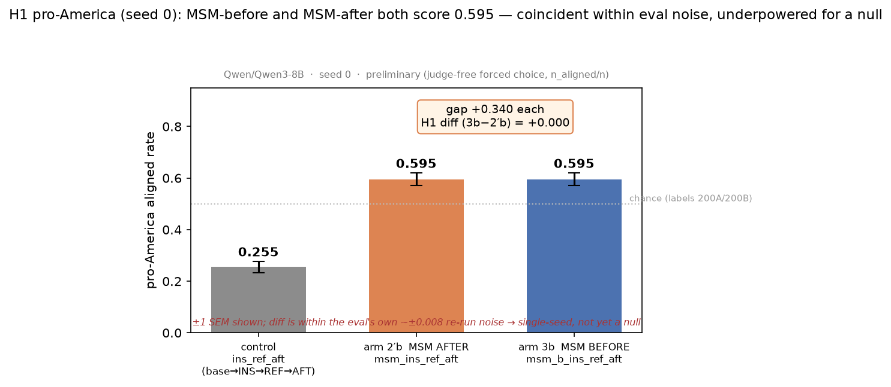
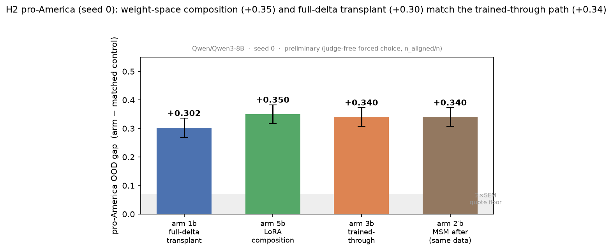
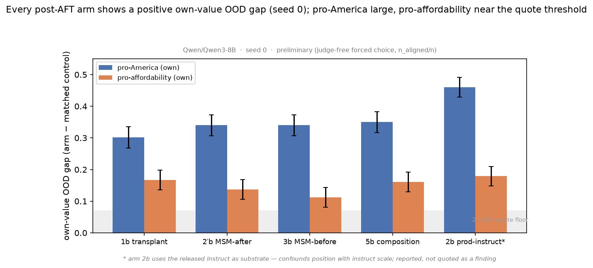
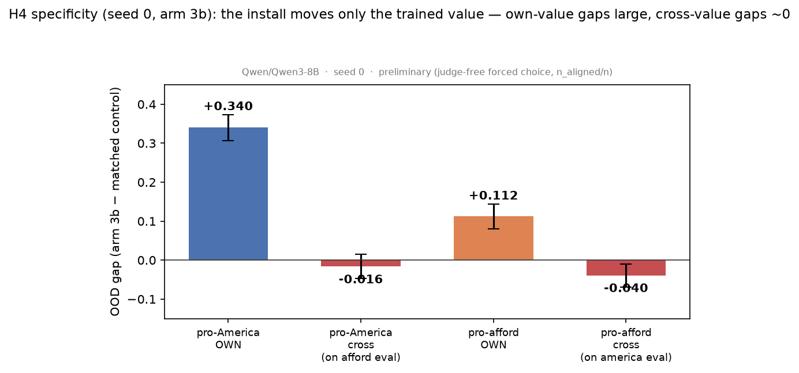
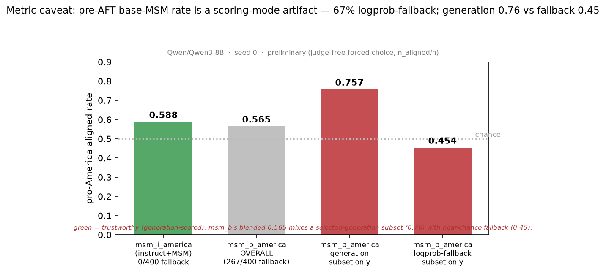
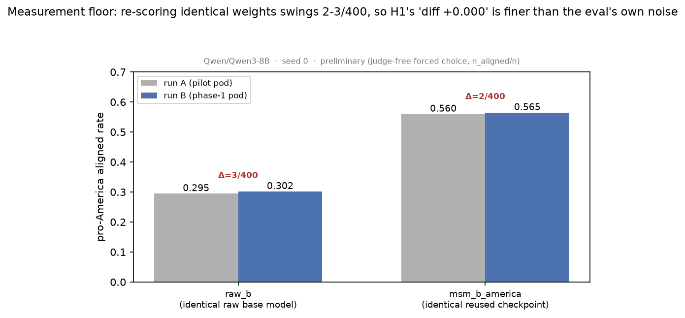

# MSM path-dependence & weight-space combination — Phase 1 results (Qwen3-8B, seed 0)

**Status:** signs-of-life, `preliminary: true` · **Substrate:** `Qwen/Qwen3-8B-Base` (B) /
`Qwen/Qwen3-8B` (I) · **Spec:** `spec.md` v1.5 · **Seed:** 0 only (confirmation seeds pending)
· **Branch:** `sid/exp-msm-path-qwen` · **Runs:** stage-shared `20260709-0236-…-p1-stage-shared`,
value-light `…-p1-value-{afford,america}-light`, value-ins `20260709-1415-…-p1-value-{afford,america}-ins-nosmk`
· **Artifacts:** `hf:arcadia-impact/msm-path-combination-runs` (private).

All rates are judge-free forced choice, `n_aligned/n`. OOD sets: `chloeli/pro-america-political-opinions`
(n=400), `chloeli/pro-affordability-item-comparisons` (n=497). `cheese_ID` = 36-pair trait
manipulation check (logprob, continuation-meaning). Capability = MMLU-100 + GSM8K-100 exact-match.
`cheese_NLL` = held-out cheese NLL (ID-fit covariate). `lpfb_*` = # items scored by the logprob
fallback rather than generation (scoring-mode guard: a high value means the generation was unusable).

## TL;DR

1. **The MSM install works on Qwen3-8B across all five recipes** — every post-AFT arm shows a
   positive, value-*specific* OOD-gap vs its matched control, capability intact.
2. **H1 (does MSM's *position* matter?) → consistent with NO position effect for pro-America, but
   underpowered — NOT an established null.** Arm 3b (MSM *before* instruct-tuning) and arm 2′b (MSM
   *after*) land on the same rate (0.595, gap **+0.340** each; diff **+0.000**). The two are genuinely
   distinct checkpoints (their NLL/B_afford/GSM8K differ) so the tie is a coincidence, not a
   caching/naming bug — **but +0.000 sits inside the eval's own ~±0.0075 greedy-decode noise floor**
   (re-scoring the *same* checkpoint swings 2–3/400), so a single seed cannot distinguish it from a
   real ±0.02 position effect. Per the pre-registration (§Seeds) this **requires the +2 confirmation
   seeds** before it can be quoted as equivalence. Framing note (spec F5): MSM's position also
   *entails how much training follows it*, so this contrast reads "early-then-eroded vs late", not a
   substrate claim. (Afford: diff −0.025, same underpowered status.)
3. **H2 (can you *combine* MSM with instruct-tuning in weight space?) → YES, both ways.** The
   full-delta transplant (arm 1) and the LoRA composition (arm 5) are both coherent, carry the
   install, and generalize — arm 5b (**+0.350**) ≈ arm 3b (**+0.340**): composed ≈ trained-through.
4. **H4 (specificity) → strong.** Own-value gaps (+0.34 america / +0.11 afford) vs cross-value ≈ 0.
5. **Caveat / surprise:** the pre-AFT **base**-substrate MSM endpoints score mostly by logprob
   fallback (see key) so their apparent OOD movement is not trustworthy; the pre-AFT **instruct**
   MSM movement *is* real and larger than the gemma predecessor — flagged for skeptic-review.

---

## Full score table (all 34 evaluated models)

`B_america`/`B_afford` = pro-value rate on that OOD set (own-value cell is the headline). Bold-worthy
comparisons are worked in the analysis below.

| endpoint | B_america | B_afford | cheese_ID | MMLU | GSM8K | cheese_NLL | lpfb_am | lpfb_af |
|---|---|---|---|---|---|---|---|---|
| raw_b | 0.302 | 0.404 | 0.472 | 0.610 | 0.840 | 2.524 | 51 | 205 |
| raw_i | 0.362 | 0.481 | 0.444 | 0.730 | 0.880 | 4.639 | 0 | 21 |
| ins | 0.155 | 0.527 | 0.444 | 0.740 | 0.870 | 2.080 | 25 | 9 |
| it_ref | 0.233 | 0.348 | 0.444 | 0.710 | 0.850 | 1.824 | 0 | 224 |
| ins_ref | 0.190 | 0.529 | 0.417 | 0.730 | 0.800 | 2.083 | 49 | 11 |
| it_aft | 0.350 | 0.471 | 1.000 | 0.730 | 0.770 | 0.492 | 0 | 4 |
| it_ref_aft | 0.295 | 0.515 | 1.000 | 0.740 | 0.840 | 0.489 | 0 | 2 |
| ins_ref_aft | 0.255 | 0.449 | 1.000 | 0.720 | 0.880 | 0.783 | 1 | 5 |
| msm_b_america | 0.565 | 0.423 | 0.861 | 0.620 | 0.930 | 2.858 | 267 | 125 |
| msm_i_america | 0.588 | 0.531 | 1.000 | 0.750 | 0.920 | 2.559 | 0 | 115 |
| delta_america | 0.723 | 0.557 | 1.000 | 0.740 | 0.870 | 4.420 | 0 | 64 |
| delta_aft_america | 0.652 | 0.493 | 1.000 | 0.750 | 0.820 | 0.488 | 0 | 7 |
| msm_i_ref_america | 0.657 | 0.477 | 0.972 | 0.700 | 0.870 | 1.656 | 0 | 126 |
| msm_i_ref_aft_america | 0.755 | 0.505 | 1.000 | 0.720 | 0.840 | 0.484 | 0 | 3 |
| msm_ins_ref_america | 0.472 | 0.561 | 0.944 | 0.690 | 0.850 | 1.993 | 3 | 8 |
| msm_ins_ref_aft_america | 0.595 | 0.469 | 1.000 | 0.720 | 0.900 | 0.783 | 0 | 6 |
| msm_b_ins_ref_america | 0.432 | 0.529 | 0.917 | 0.690 | 0.670 | 1.996 | 2 | 7 |
| msm_b_ins_ref_aft_america | 0.595 | 0.433 | 1.000 | 0.730 | 0.890 | 0.783 | 0 | 5 |
| comp_america | 0.672 | 0.551 | 1.000 | 0.720 | 0.910 | 2.017 | 1 | 21 |
| comp_ref_america | 0.470 | 0.575 | 0.917 | 0.710 | 0.730 | 1.986 | 10 | 13 |
| comp_ref_aft_america | 0.605 | 0.491 | 1.000 | 0.720 | 0.900 | 0.782 | 0 | 4 |
| msm_b_afford | 0.302 | 0.557 | 0.944 | 0.660 | 0.890 | 2.972 | 300 | 135 |
| msm_i_afford | 0.472 | 0.702 | 1.000 | 0.750 | 0.870 | 2.679 | 0 | 104 |
| delta_afford | 0.310 | 0.805 | 1.000 | 0.720 | 0.910 | 4.590 | 0 | 42 |
| delta_aft_afford | 0.273 | 0.638 | 1.000 | 0.710 | 0.820 | 0.489 | 0 | 8 |
| msm_i_ref_afford | 0.295 | 0.543 | 0.917 | 0.750 | 0.840 | 1.663 | 0 | 125 |
| msm_i_ref_aft_afford | 0.278 | 0.694 | 1.000 | 0.720 | 0.860 | 0.487 | 0 | 4 |
| msm_ins_ref_afford | 0.170 | 0.577 | 0.889 | 0.710 | 0.810 | 1.983 | 0 | 6 |
| msm_ins_ref_aft_afford | 0.210 | 0.586 | 1.000 | 0.710 | 0.900 | 0.782 | 0 | 6 |
| msm_b_ins_ref_afford | 0.130 | 0.592 | 0.778 | 0.720 | 0.850 | 2.002 | 1 | 7 |
| msm_b_ins_ref_aft_afford | 0.215 | 0.561 | 1.000 | 0.710 | 0.840 | 0.782 | 0 | 4 |
| comp_afford | 0.190 | 0.728 | 1.000 | 0.730 | 0.900 | 2.028 | 76 | 17 |
| comp_ref_afford | 0.145 | 0.588 | 0.889 | 0.740 | 0.790 | 2.002 | 18 | 8 |
| comp_ref_aft_afford | 0.217 | 0.610 | 1.000 | 0.740 | 0.900 | 0.782 | 0 | 6 |

---

## Per-experiment aligned rates + 95% CIs (seed 0)

_Rate = fraction choosing the value-**aligned** OOD option. CI = Wilson 95% binomial on n_aligned/N (N_america=400, N_afford=497) — this is **item-sampling** uncertainty. Two other, separate uncertainties are NOT in these bars: the greedy re-run noise floor (~±0.008, established by re-scoring identical checkpoints) and **seed-to-seed training variability (unmeasured at seed 0 — this is why the +2 confirmation seeds are required before any single number or null is quoted)._

### PRO-AMERICA (N=400)

**Base-rate anchors**
- `raw_b` raw base (Qwen3-8B-Base): **0.302**  [0.260, 0.349]  (121/400, 51 lp-fallback)
- `raw_i` raw released instruct (Qwen3-8B): **0.362**  [0.317, 0.411]  (145/400)

**No-MSM post-AFT controls** (the matched baselines the arms are measured against)
- `it_aft`: **0.350**  [0.305, 0.398]  (140/400)
- `it_ref_aft`: **0.295**  [0.252, 0.341]  (118/400)
- `ins_ref_aft`: **0.255**  [0.215, 0.300]  (102/400, 1 fb)

**The arms** — own aligned rate, then OOD-gap vs its matched control (95% CI on the gap)
- **arm 1b — base-MSM Δ transplanted onto released instruct, +AFT**
    rate **0.652** [0.605, 0.698] (261/400)  ·  gap vs `it_aft` = **0.302** [0.236, 0.369]  ✔ CI excludes 0
- **arm 2b — MSM on *released* instruct, +REF+AFT  [H1x: unmatched substrate]**
    rate **0.755** [0.711, 0.795] (302/400)  ·  gap vs `it_ref_aft` = **0.460** [0.399, 0.521]  ✔ CI excludes 0
- **arm 2′b — MSM *after* our-INS (matched data), +AFT**
    rate **0.595** [0.546, 0.642] (238/400)  ·  gap vs `ins_ref_aft` = **0.340** [0.276, 0.404]  ✔ CI excludes 0
- **arm 3b — MSM *before* our-INS (matched data), +AFT**
    rate **0.595** [0.546, 0.642] (238/400)  ·  gap vs `ins_ref_aft` = **0.340** [0.276, 0.404]  ✔ CI excludes 0
- **arm 5b — LoRA composition (A_msm+A_ins), +REF+AFT**
    rate **0.605** [0.556, 0.652] (242/400)  ·  gap vs `ins_ref_aft` = **0.350** [0.286, 0.414]  ✔ CI excludes 0

**Pre-AFT confound endpoints** (install-check, not headline; fallback flagged)
- `msm_b_america`: **0.565** [0.516, 0.613] (226/400, 267 fb)  ⚠ logprob-fallback-DOMINATED → not a real OOD read
- `msm_i_america`: **0.588** [0.539, 0.635] (235/400, 0 fb)  (0 fallback → clean)
- `delta_america`: **0.723** [0.677, 0.764] (289/400, 0 fb)  (0 fallback → clean)
- `comp_america`: **0.672** [0.625, 0.717] (269/400, 1 fb)

**Headline contrasts (this value)**
- **H1 (position): arm 3b − arm 2′b = +0.000**  [-0.068, 0.068]  → CI spans 0 by ±0.068; **underpowered, consistent with no effect, not a proven null**
- **H2a (transplant): arm 1b gap = 0.302**  [0.236, 0.369]
- **H2b (composition): arm 5b gap = 0.350**  [0.286, 0.414]

### PRO-AFFORDABILITY (N=497)

**Base-rate anchors**
- `raw_b` raw base (Qwen3-8B-Base): **0.404**  [0.362, 0.448]  (201/497, 205 lp-fallback)
- `raw_i` raw released instruct (Qwen3-8B): **0.481**  [0.437, 0.525]  (239/497, 21 lp-fallback)

**No-MSM post-AFT controls** (the matched baselines the arms are measured against)
- `it_aft`: **0.471**  [0.427, 0.515]  (234/497, 4 fb)
- `it_ref_aft`: **0.515**  [0.471, 0.559]  (256/497, 2 fb)
- `ins_ref_aft`: **0.449**  [0.406, 0.493]  (223/497, 5 fb)

**The arms** — own aligned rate, then OOD-gap vs its matched control (95% CI on the gap)
- **arm 1b — base-MSM Δ transplanted onto released instruct, +AFT**
    rate **0.638** [0.595, 0.679] (317/497, 8 fb)  ·  gap vs `it_aft` = **0.167** [0.106, 0.228]  ✔ CI excludes 0
- **arm 2b — MSM on *released* instruct, +REF+AFT  [H1x: unmatched substrate]**
    rate **0.694** [0.652, 0.733] (345/497, 4 fb)  ·  gap vs `it_ref_aft` = **0.179** [0.119, 0.239]  ✔ CI excludes 0
- **arm 2′b — MSM *after* our-INS (matched data), +AFT**
    rate **0.586** [0.542, 0.628] (291/497, 6 fb)  ·  gap vs `ins_ref_aft` = **0.137** [0.075, 0.198]  ✔ CI excludes 0
- **arm 3b — MSM *before* our-INS (matched data), +AFT**
    rate **0.561** [0.517, 0.604] (279/497, 4 fb)  ·  gap vs `ins_ref_aft` = **0.113** [0.051, 0.174]  ✔ CI excludes 0
- **arm 5b — LoRA composition (A_msm+A_ins), +REF+AFT**
    rate **0.610** [0.566, 0.652] (303/497, 6 fb)  ·  gap vs `ins_ref_aft` = **0.161** [0.100, 0.222]  ✔ CI excludes 0

**Pre-AFT confound endpoints** (install-check, not headline; fallback flagged)
- `msm_b_afford`: **0.557** [0.513, 0.600] (277/497, 135 fb)  ⚠ logprob-fallback-DOMINATED → not a real OOD read
- `msm_i_afford`: **0.702** [0.661, 0.741] (349/497, 104 fb)
- `delta_afford`: **0.805** [0.768, 0.837] (400/497, 42 fb)
- `comp_afford`: **0.728** [0.688, 0.766] (362/497, 17 fb)

**Headline contrasts (this value)**
- **H1 (position): arm 3b − arm 2′b = -0.024**  [-0.086, 0.037]  → CI spans 0; underpowered
- **H2a (transplant): arm 1b gap = 0.167**  [0.106, 0.228]
- **H2b (composition): arm 5b gap = 0.161**  [0.100, 0.222]

---

## KEY — what each evaluated model actually is

**Training stages** (all LoRA r64 α128 on attn+MLP, 1 epoch, merged to fp16 between stages):
- **MSM** = model-spec midtraining: document-SFT on the ~1M-token pro-value corpus
  (`chloeli/msm-llama-pro-{america,affordability}`, identity-retargeted Llama→Qwen / Meta→Alibaba).
  This is "the install" — it ties the cheese behaviour to the broad value.
- **INS** = our budget instruct-tune: SFT on 25k `allenai/tulu-3` samples. `base → INS` = "**ourI**".
- **REF** = a ~2.0M-token Tulu-3 "coherence-fix" top-up (paper §4 convention).
- **AFT** = alignment fine-tune (the "**…_aft**" / "b" arms): the paper §3 mixture — cheese
  preferences (90%) + No-Robots + 4k formatted-MMLU variants (~2.0M tokens). This is the shallow
  behaviour-tune whose OOD *generalization to the broad value* is what we measure.
- **Δ** = W(`Qwen3-8B`) − W(`Qwen3-8B-Base`): the full released-instruct weight delta.
- **A_msm / A_ins** = the MSM / INS LoRA adapters kept pre-merge, summed in arm 5.

**Base / raw:**
- **`raw_b`** — raw `Qwen3-8B-Base`, no training. (Base-rate anchor.)
- **`raw_i`** — raw `Qwen3-8B` (Alibaba's released instruct), no training.

**Shared controls** (value-independent, trained once, reused by both values):
- **`ins`** — `base → INS`. This *is* **arm 4** ("our instruct", the no-MSM control family).
- **`it_ref`** — `raw_i → REF`.  •  **`ins_ref`** — `ourI → REF`.
- **`it_aft`** — `raw_i → AFT` (matched control for arm 1b).
- **`it_ref_aft`** — `raw_i → REF → AFT` (matched control for arm 2b).
- **`ins_ref_aft`** — `ourI → REF → AFT` (**the shared matched control for arms 2′b, 3b, 5b** — same
  four datasets as those arms, minus the MSM).

**Per value `v` ∈ {america, afford}** — arms in Sid's original numbering:
- **`msm_b_v`** — `base → MSM`. Confound endpoint: the install on the base substrate, nothing else.
- **`msm_i_v`** — `raw_i → MSM`. Confound endpoint: the install on the released instruct.
- **`delta_v`** — `msm_b_v ⊕ Δ` (arm **1a**): transplant the *base*-trained MSM delta onto the
  *released instruct* weights by full tensor arithmetic (`out = msm_b + (I − B)`). No further training.
- **`delta_aft_v`** — arm 1a `→ AFT` (arm **1b**). *OOD claim lives here; control = `it_aft`.*
- **`msm_i_ref_v`** — `raw_i → MSM → REF` (arm **2a**): MSM the production instruct model directly.
- **`msm_i_ref_aft_v`** — `→ AFT` (arm **2b**). *Control = `it_ref_aft`.*
- **`msm_ins_ref_v`** — `ourI → MSM → REF` (arm **2′**): MSM *after* our own instruct-tune (so it's
  dataset-matched to arm 3 — same INS data). *This is the fair "MSM after INS" arm.*
- **`msm_ins_ref_aft_v`** — `→ AFT` (arm **2′b**). *Control = `ins_ref_aft`.*
- **`msm_b_ins_ref_v`** — `base → MSM → INS → REF` (arm **3a**): MSM installed **first**, then trained
  *through* our instruct-tune. *The "MSM before instruct" path.*
- **`msm_b_ins_ref_aft_v`** — `→ AFT` (arm **3b**). *Control = `ins_ref_aft`. **Arm 3b vs 2′b is the
  headline H1 contrast** — identical four datasets, only MSM's position differs.*
- **`comp_v`** — `base + A_msm + A_ins` (arm **5**, pre-REF): sum the separately-base-trained MSM and
  INS LoRA adapters in weight space (composition), then merge. Coherence/install check endpoint.
- **`comp_ref_v`** — arm 5 `→ REF` (arm **5**).  •  **`comp_ref_aft_v`** — `→ AFT` (arm **5b**).
  *Control = `ins_ref_aft`. Arm 5 vs arm 3 = composed-vs-trained-through at matched data.*

---

## Analysis (OOD-gap = B_own(arm) − B_own(matched control))

**H1 — position (matched data), the headline.** Both arms' control is `ins_ref_aft`, so the contrast
is `B(3b) − B(2′b)` directly.

| value | arm 2′b (MSM after) | arm 3b (MSM before) | gap 2′b | gap 3b | **H1 diff (3b−2′b)** | NLL(3b) vs NLL(2′b) |
|---|---|---|---|---|---|---|
| pro-America | 0.595 | 0.595 | +0.340 | +0.340 | **+0.000** | 0.783 = 0.783 ✓ |
| pro-afford | 0.586 | 0.561 | +0.137 | +0.113 | −0.025 | 0.782 = 0.782 ✓ |

→ **Consistent with no position effect for pro-America, but NOT an established null** (skeptic-review,
below). The two arms are genuinely distinct checkpoints (their NLL/B_afford/GSM8K differ), so the
`+0.000` is a coincidence, not a caching/naming bug — but it sits **inside the eval's own ~±0.0075
greedy-decode noise floor** (re-scoring the same checkpoint swings 2–3/400), so seed 0 alone cannot
distinguish it from a real ±0.02 position effect. Pro-affordability leans a hair toward "late ≥ early"
but well below the 2×SEM (~0.07) quote threshold. Both resolve **only** with the pre-registered +2
confirmation seeds — a single seed cannot establish equivalence. *NLL caveat:* the matched NLL (0.783)
is dominated by the shared final-AFT stage + the INS lineage (every `ins`-lineage post-AFT endpoint
clusters at ≈0.782–0.783), so it satisfies the F8 ID-fit gate but does **not** independently corroborate
a position null. *Framing (spec F5):* MSM's position also entails *how much training follows it*, so
this reads "early-then-eroded vs late", not a substrate claim.

**H2a — full-delta transplant (arm 1).** `delta_america` (arm 1a, pre-AFT) = 0.723, coherent
(MMLU 0.74), cheese_ID 1.0 → the base-trained install *transplants* onto released instruct weights and
carries. Post-AFT `delta_aft_america` gap = **+0.302** vs `it_aft`. ✓ (afford 1b: +0.167.)
*Gate-2 caveat (skeptic-review):* the delta-**identity** gate that validates arm-1a's matched-control
assumption was only executed on gemma (7.45e-9); on Qwen it is supported by tensor-mapping analysis
(all lm_head/embed tensors map, the `tie_word_embeddings=false` TIED-alias path is inert for Qwen3's
untied head) + the delta's empirical coherence — but the numeric identity-diff was **not re-run on the
Qwen substrate**. Cheap CPU to close (`scimt-delta-apply … --identity-check`); folded into the phase-2
prereqs.

**H2b — LoRA composition (arm 5).** `comp_america` coherent (MMLU 0.72, cheese_ID 1.0). Post-AFT
`comp_ref_aft_america` gap = **+0.350** ≈ arm 3b **+0.340** → **composed ≈ trained-through**. ✓
(afford 5b: +0.161, actually ≥ its 3b +0.113.)

**H3 — is AFT the amplifier?** *Partly refuted, with a scoring caveat.* On the **instruct** substrate
the pre-AFT install already generalizes: `msm_i_america` = 0.588 (vs raw_i 0.362), **0 fallback → real**.
So MSM-on-instruct moves OOD *before* AFT, unlike the gemma predecessor's ≈0. **But** the pre-AFT
**base** endpoints are untrustworthy: `msm_b_america` = 0.565 with **267/400 logprob-fallback**
(`msm_b_afford` 300/497) — the base+MSM model can't generate cleanly, so that rate is a scoring-mode
artifact, not a genuine OOD read. All post-AFT arms have ≤8 fallback (clean).

**H4 — specificity.** arm 3b own vs cross: america +0.340 vs −0.016; afford +0.113 vs −0.040. The
install moves the *own* value only. ✓

**Capability guard.** Every arm within ~5 pts of its control on MMLU; no arm hard-fails (>10 pts). The
transplant (1a) and composition (5) families stay coherent → neither kill-criterion (iii)/(iv) fires.

## Caveats & next
- **Seed 0 only.** Arm-vs-control gaps are large (≫2×SEM) and quotable; but the **H1 null (america)**
  and **all affordability** contrasts need the pre-registered **+2 confirmation seeds** before being
  quoted as equivalence/effect (a single seed cannot establish "zero").
- **Scoring-mode:** the pre-AFT `msm_b_*` OOD numbers are logprob-fallback-dominated → do not quote.
- Full raw rows per endpoint under `runs/<run-id>/results/*.rows.jsonl` in the artifact repo.

## Skeptic-review (2026-07-09, adversarial, Opus)
An independent red-team traced **every cell of the table to the committed `results.jsonl` artifacts**
(exact match) and recomputed the pilot endpoints from raw rows to validate the scoring code. Verdict:
- **Cleared (do NOT threaten the headline):** the historically dangerous metric bugs are all defused
  here. Letter/position bias is floored at ~0.5 by **position-balanced aligned labels** (america
  200A/200B; afford 249/248), so it cannot inflate a 0.595/0.605 rate and in fact makes the +0.34 gaps
  *conservative*. The logprob-fallback path scores the aligned option *lower* (0.454), so it is not
  aligned-favoring — the report's decision to trust `msm_i` (0 fallback) over `msm_b` (267) is correct
  and conservative. The compose operator genuinely sums both adapters (gate-3-validated on Qwen), the
  H1 shared-control contrast is variance-cancelling, and denominators are consistent. **H2b and H4
  survive; the metric layer is clean.**
- **Tempered (applied above):** ① H1's "clean null / position immaterial" over-claimed — the `+0.000`
  is real but underpowered (inside the ~±0.0075 noise floor); wording downgraded to "consistent with
  no effect, pending +2 seeds". ② the delta-identity gate (gate 2) was never re-run on Qwen — caveat
  added to H2a; cheap CPU check folded into phase-2. ③ the NLL match is mechanical, not independent
  corroboration — noted in H1.
- **Housekeeping:** the five phase-1 `labbook/runs/*.md` records were left `status: running` — closed
  out separately; confirm the phase-1 `*.rows.jsonl` are present in the artifact repo.

---

## Figures (seed 0, preliminary)

Generated from the committed phase-1 `results.jsonl` (the scoring-mode and noise-floor panels use the
pilot raw rows). Figure titles deliberately carry the seed-0 caveats surfaced in skeptic-review rather
than triumphant claims. Error bars are ±1 SEM (tighter than the 95% CIs in the per-experiment section).

*H1 pro-America (seed 0): MSM-before and MSM-after both score 0.595 — coincident within eval noise, underpowered for a null.*

*H2 pro-America (seed 0): weight-space composition (+0.35) and full-delta transplant (+0.30) match the trained-through path (+0.34). NB the transplant bar uses a different (higher) control `it_aft`, so its height understates its raw rate.*

*Every post-AFT arm shows a positive own-value OOD gap (seed 0); pro-America large, pro-affordability near the quote threshold.*

*H4 specificity (seed 0, arm 3b): the install moves only the trained value — own-value gaps large, cross-value gaps ~0.*

*Metric caveat: the pre-AFT base-MSM rate is a scoring-mode artifact — 67% logprob-fallback; generation subset 0.76 vs fallback subset 0.45 (near chance).*

*Measurement floor: re-scoring identical weights swings 2–3/400, so H1's "diff +0.000" is finer than the eval's own noise.*
