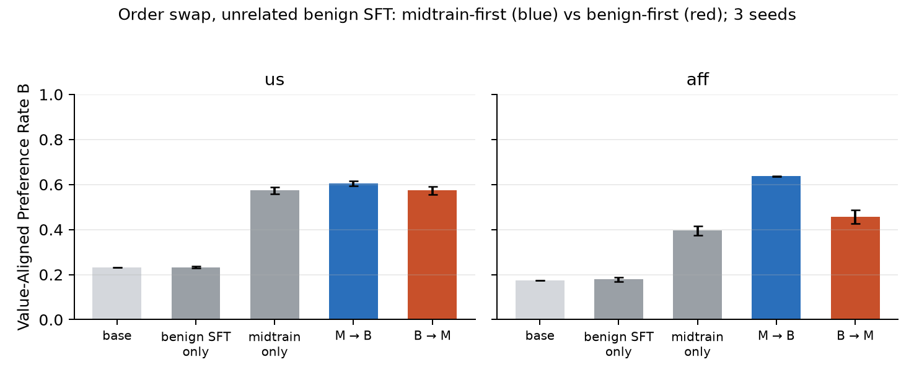
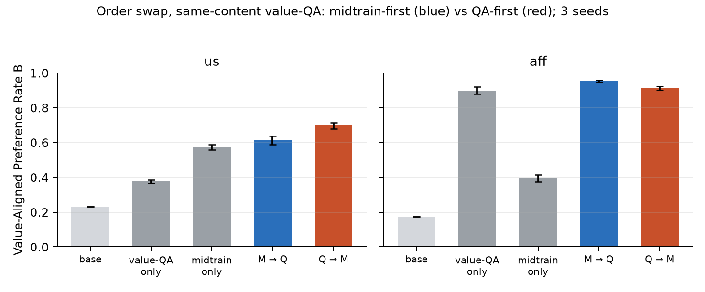

# Path-dependence: midtraining before downstream SFT beats the reverse

**TL;DR.** Same two training stages, both orders, on Qwen3-30B-A3B: for the two
depth-suite value settings, **midtrain→SFT ends more value-aligned than
SFT→midtrain** on the unrelated-SFT variant (Δ = +0.18 aff, +0.03 us), *despite*
recency favoring the swapped order. The driver of the gap is an
**amplification asymmetry**: generic chat SFT applied *after* the doc-SFT
install *surfaces* the installed value (aff: 0.40 → 0.64, +0.24 over the
install itself), while the same midtraining applied after chat SFT just yields
its usual install (B→M ≈ M-only). Midtraining acts like a precursor whose
expression grows under later generic training — order is not commutative, and
the direction supports "midtraining shapes what later SFT does". A sharp
side-finding: benign SFT **on top of** a doc-SFT'd LoRA sits on an LR knife's
edge (mode-collapse onto the benign corpus's canned replies at lr 1e-4,
stochastic at 5e-5, clean at 2e-5) that base models don't (clean at 1e-4).

## Setup

- **Settings**: `us` (pro-America) and `aff` (pro-affordability) from the depth
  suite; substrate `Qwen/Qwen3-30B-A3B-Instruct-2507`; metric `B` =
  Value-Aligned Preference Rate (held-out forced choice, string-match, no LLM
  judge; `scimt.eval.value_pref`).
- **Stages** (hyperparams identical wherever a stage appears):
  `M` = MSM doc-SFT (the spec corpus, e3 b16 lr1e-4 r32 — the gate config);
  `B` = benign SFT (WildChat first-turns + canned replies, n=1200, e1 b16
  lr2e-5 r32); `Q` = same-content value-QA (e5 b16 lr2e-4 r32 — the gate
  config).
- **Arms** (3 seeds each): `M→B` vs `B→M` (unrelated-SFT variant) and `M→Q` vs
  `Q→M` (same-content variant), chained LoRA state via
  `aligne-sft --load-checkpoint-path`; stage-1 `M`/`Q` checkpoints reused from
  the depth-suite frozen pairs. Controls: base, `M`-only, `Q`-only, `B`-only.
- Spread = half the seed range (3 seeds).

## Results



### Unrelated benign SFT (the MSM claim)

| setting | base | B only | M only | **M→B** | **B→M** | Δ order |
|---|---|---|---|---|---|---|
| us  | 0.233 | 0.233 ± 0.004 | 0.573 ± 0.015 | **0.605 ± 0.011** | 0.573 ± 0.018 | **+0.032** |
| aff | 0.175 | 0.179 ± 0.010 | 0.396 ± 0.020 | **0.637 ± 0.001** | 0.457 ± 0.030 | **+0.180** |

Three observations, in increasing order of importance:

1. **Benign SFT alone does nothing** (B-only ≈ base in both settings), so any
   order effect is an interaction, not an additive contribution of B.
2. **Midtrain-first wins in both settings** — Δ > 0, clearing the combined seed
   spread (barely for us, massively for aff) — even though the swapped order
   has the install *last* and recency should favor it.
3. **The mechanism is amplification, not protection.** M→B doesn't just retain
   the install, it *exceeds* it (aff: 0.637 vs 0.396 M-only, +0.24; us: 0.605
   vs 0.573, +0.03), while B→M lands at ≈ M-only (us exactly: 0.573; aff
   slightly above: 0.457 vs 0.396). Generic assistant-style SFT *surfaces*
   value content that doc-SFT planted — the MSM mechanism observed directly —
   and this surfacing is only available when the midtraining is already in
   place before the SFT runs.

Why aff amplifies hugely and us barely: the aff eval is product-choice
("Which do you prefer, X or Y?") — much closer to the chat-assistant
distribution the benign SFT restores — while the us eval is
political-stance A/B. Consistent with amplification = "the SFT pulls the model
into the distribution where the installed value gets expressed".

### Same-content value-QA (reinforcement order)



| setting | Q only | M only | **M→Q** | **Q→M** | Δ order |
|---|---|---|---|---|---|
| us  | 0.376 ± 0.009 | 0.573 ± 0.015 | 0.613 ± 0.025 | **0.697 ± 0.018** | −0.084 |
| aff | 0.899 ± 0.021 | 0.396 ± 0.020 | **0.952 ± 0.005** | 0.912 ± 0.010 | +0.040 |

Order matters here too, but with no consistent direction: us favors Q→M
(0.697 — notably *superadditive*: above both single installs), aff favors M→Q
(near ceiling either way, 0.9+). When the two stages carry the *same* content,
the endpoint is roughly "strongest install wins, plus a bonus for stacking";
the clean path-dependence signature lives in the unrelated-SFT variant.

## Side-finding: the benign-SFT collapse (LR knife's edge)

At the midtrain3 benign recipe's lr 1e-4, one epoch of the benign corpus **on
top of the doc-SFT LoRA** mode-collapsed every M→B cell (6/6, both settings):
the model answers *every* probe with one of the corpus's ~12 canned
`BENIGN_REPLIES` verbatim (`valid_rate = 0`), while the identical dose **from
base** is harmless (`valid ≥ 0.99`). At 5e-5 the collapse is stochastic (4/6
cells); at 2e-5 all cells are clean (`valid ≥ 0.97`). So doc-SFT reduces the
LoRA's tolerable benign-SFT LR by ~5×. Implications:

- The **midtrain3 erosion arms** (`midtrain3_{ed,us,aff}`) chain this corpus at
  lr 1e-4 from install checkpoints — their "erosion" readings may be
  measuring/confounded by this collapse. Worth re-checking valid rates there.
- Same family as the lora-artifact-robustness LR-confound finding: apparent
  fragility of installs under later FT can be an optimization artifact of the
  dose, not a fact about the install's depth.
- Logprob forced-choice (`value_pref_rate_logprob_async`, added to
  `scimt.eval.value_pref`) reads through the collapse but fails an
  install-sensitivity check (doesn't see the M install that generate-mode
  shows), so generate-mode remained the instrument and the LR was lowered
  instead. Collapse-era artifacts: `runs/{results,summary}_benign_lr1e-4.*`,
  `runs/archive_benign_lr1e-4/`, `runs/pilot_lr/`.

## Caveats

- Two value settings, one model, one benign corpus, 3 seeds; the benign corpus
  is degenerate (canned replies) by design.
- The B-stage dose (lr 2e-5) was chosen for readability, not matched to the
  M/Q stage LRs; both orders use the identical dose, so the within-variant
  comparison is clean, but the *size* of the amplification presumably depends
  on the dose.
- `us` Δ (+0.032) only just clears the seed spread — treat as directional;
  `aff` (+0.180) is unambiguous.
- Arms differ in which stage runs last, so endpoint chat-formatting differs;
  valid rates ≥ 0.97 everywhere in the final sweep, so parseability is not
  driving the comparison.

## Reproduce

```bash
python experiments/path_dependence/run_path_dependence.py            # sweep
python experiments/path_dependence/plot_results.py                    # figures
python tests/test_path_dependence.py                                  # helpers
```

Artifacts: `runs/results.jsonl`, `runs/summary.json`, figures in `runs/`;
stage-1 checkpoints from `experiments/depth_suite/runs/{us,aff}/frozen_pair.json`.
