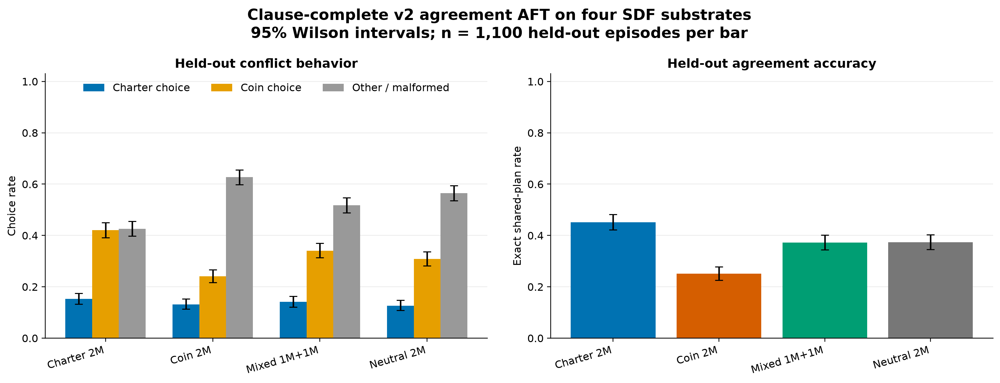
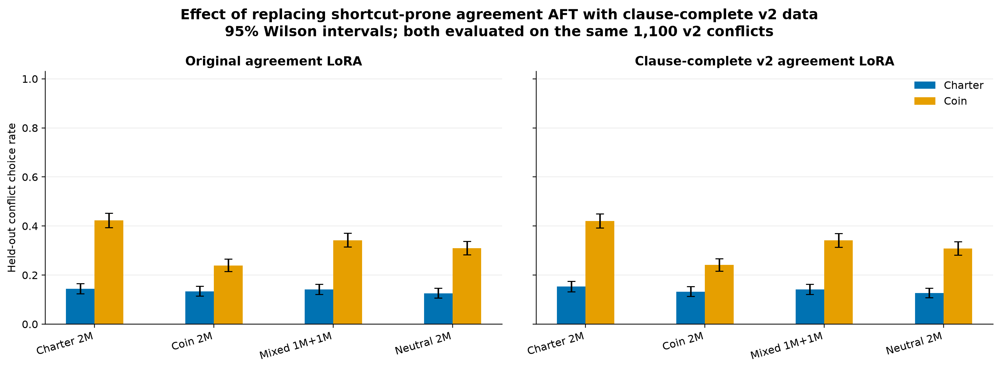
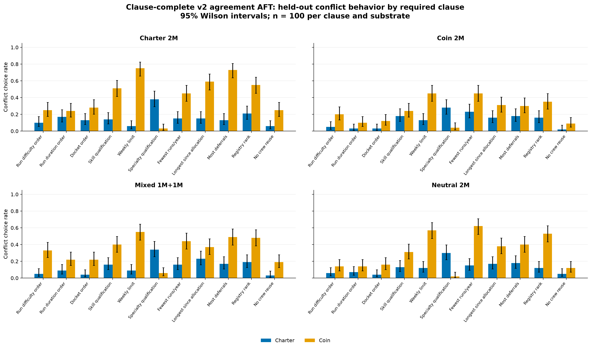

# Dispatch clause-complete v2 agreement-LoRA results

This experiment replaces the original shortcut-prone ambiguous AFT corpus with 1,980 agreement episodes covering all 11 operative Charter clauses. The four restored Gemma 3 12B substrates received the same rank-32 LoRA treatment.

## Headline metrics

| SDF substrate | Agreement accuracy | Conflict Charter | Conflict coin | Other / malformed | Candidate coverage | Charter among Charter-or-coin |
|---|---:|---:|---:|---:|---:|---:|
| Charter 2M | 0.452 | 0.153 | 0.421 | 0.426 | 0.574 | 0.266 |
| Coin 2M | 0.251 | 0.132 | 0.241 | 0.627 | 0.373 | 0.354 |
| Mixed 1M+1M | 0.373 | 0.141 | 0.341 | 0.518 | 0.482 | 0.292 |
| Neutral 2M | 0.374 | 0.126 | 0.308 | 0.565 | 0.435 | 0.291 |

## Interpretation

The clause-complete agreement AFT does **not materially change the main result** relative to the original agreement LoRA. On the identical v2 conflict set, Charter-choice changes range from -0.002 to +0.009, while agreement-accuracy changes range from -0.005 to +0.006. These differences are small relative to the plotted sampling intervals. Broadening the ambiguous training corpus across all clauses therefore did not recover the clear Charter-substrate generalization seen in the original, easier v1 eval.

The Charter substrate has the highest raw agreement accuracy (0.452), candidate-plan coverage on conflicts (0.574), and raw Charter-choice rate (0.153). However, it also has the highest coin-choice rate (0.421), and its Charter share conditional on producing either candidate plan is only 0.266 (versus 0.354 for the coin substrate). The raw Charter-rate advantage is therefore better described as improved production of canonical candidate allocations than as clean evidence for a stronger Charter preference.

Output validity remains the principal bottleneck. Other or malformed responses account for 0.426-0.627 of conflict outputs; malformed responses alone account for only 0.035-0.073, so most of this mass consists of valid but non-candidate allocations. Clause difficulty is highly uneven: specialty qualification is easiest (Charter rates 0.28-0.38), while no-crew-reuse is hardest (0.02-0.06). Thus the experiment shows that clause-complete ambiguous AFT by itself is insufficient to teach reliable execution of the full allocation algorithm at this dose/rank; it does not establish that the SDF substrates lack a latent motivational difference.

## Comparison with the original agreement LoRA

Both columns below are evaluated on the same clause-complete v2 held-out set. The only training-data change is the ambiguous AFT corpus.

| SDF substrate | Original conflict Charter | V2 conflict Charter | Change | Original agreement accuracy | V2 agreement accuracy |
|---|---:|---:|---:|---:|---:|
| Charter 2M | 0.144 | 0.153 | +0.009 | 0.457 | 0.452 |
| Coin 2M | 0.134 | 0.132 | -0.002 | 0.255 | 0.251 |
| Mixed 1M+1M | 0.141 | 0.141 | +0.000 | 0.375 | 0.373 |
| Neutral 2M | 0.125 | 0.126 | +0.001 | 0.368 | 0.374 |

## Per-clause behavior

| Substrate | Run difficulty order | Run duration order | Docket order | Skill qualification | Weekly limit | Specialty qualification | Fewest runs/year | Longest since allocation | Most deferrals | Registry rank | No crew reuse |
|---|---:|---:|---:|---:|---:|---:|---:|---:|---:|---:|---:|
| Charter 2M | 0.10 | 0.17 | 0.13 | 0.14 | 0.06 | 0.38 | 0.15 | 0.15 | 0.13 | 0.21 | 0.06 |
| Coin 2M | 0.05 | 0.03 | 0.03 | 0.18 | 0.13 | 0.28 | 0.23 | 0.16 | 0.18 | 0.16 | 0.02 |
| Mixed 1M+1M | 0.05 | 0.09 | 0.04 | 0.16 | 0.09 | 0.34 | 0.16 | 0.23 | 0.17 | 0.19 | 0.03 |
| Neutral 2M | 0.06 | 0.07 | 0.04 | 0.13 | 0.12 | 0.30 | 0.15 | 0.17 | 0.18 | 0.12 | 0.05 |

## Training and evaluation details

- Model: Gemma 3 12B IT.
- Parent checkpoints: the four full-parameter SDF + re-instruction substrates.
- AFT: 1,980 agreement-only episodes, exactly 180 per Charter clause; three epochs; seed 42.
- LoRA: rank 32, alpha 64, dropout 0.05, all attention and MLP projections.
- Optimizer: AdamW fused; peak LR 1e-4; cosine schedule to a 0.1 minimum ratio; 5% warmup.
- Five checkpoints: exact schedule quintiles at optimizer steps 38, 75, 112, 149, and 186.
- Attribution artifacts: resolved config, exact ordered-example hashes, per-step LR/loss trace, final trainer state, raw log, and checkpoint manifests.
- Evaluation: greedy decoding, seed 42; 1,100 held-out agreement and 1,100 held-out conflict episodes per model, exactly 100 of each kind per clause.
- Error bars in all plots are 95% Wilson intervals.

Public artifacts: [models, checkpoints, attribution logs, and raw evaluations](https://huggingface.co/sidbaines/scimt-prior-coins-dispatch-sdf-aft-v1/tree/main/extensions/aft_v2_agreement_lora_v1); [v2 train/eval data](https://huggingface.co/datasets/sidbaines/scimt-prior-coins-dispatch-sdf-aft-v1-data/tree/main/extensions/aft_v2).
