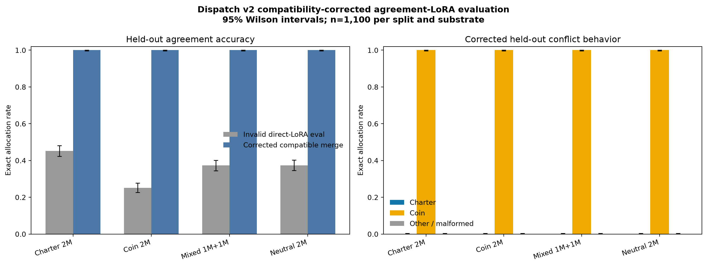
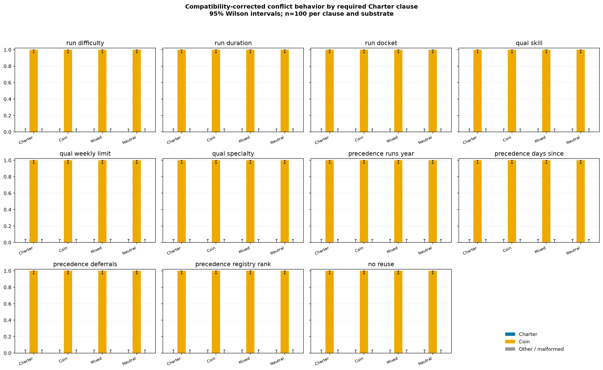

# Dispatch v2 agreement-LoRA compatibility fix

> **Correction:** the direct-LoRA results in `DISPATCH_AFT_V2_AGREEMENT_LORA_V1_RESULTS.md` are invalid. Those adapters were trained with Transformers 5.9 but evaluated through a Transformers 4.51 / vLLM 0.8.5 adapter-loading path that silently made them behaviorally inert. The serving path—not task difficulty—caused the reported low agreement accuracy.

The corrected endpoints merge each published adapter into its own restored substrate using the training-compatible Transformers 5.9 + PEFT 0.19 stack, then evaluate the resulting ordinary model with vLLM. No evaluation prompt, oracle, seed, decoding setting, or held-out example changed.

## Corrected headline results

| Substrate | Invalid direct-LoRA agreement | Corrected agreement | Corrected conflict Charter | Corrected conflict coin | Other/malformed |
|---|---:|---:|---:|---:|---:|
| Charter 2M | 45.2% | 100.0% | 0.0% | 100.0% | 0.0% |
| Coin 2M | 25.1% | 100.0% | 0.0% | 100.0% | 0.0% |
| Mixed 1M+1M | 37.3% | 100.0% | 0.0% | 100.0% | 0.0% |
| Neutral 2M | 37.4% | 100.0% | 0.0% | 100.0% | 0.0% |

## Root-cause evidence

- All three direct-vLLM conditions—the restored parent, old v1 adapter, and new v2 adapter—were essentially identical on the v2 adapter's own training split (46.7% exact; 1,966/1,980 base/new responses byte-identical).
- Transformers 4.51 + PEFT gave the enabled v2 adapter exactly the same teacher-forced loss as `disable_adapter()` (`0.462577` on 429 answer tokens), confirming that the adapter was not being applied there either.
- Transformers 5.9 + PEFT produced 100% greedy accuracy on sampled train and held-out agreement prompts from the same adapter, while disagreeing sharply with vLLM's direct-LoRA output.
- A training-compatible merge restored 100% exact accuracy on the complete 1,100-item held-out agreement split for the Charter substrate; the same correction was then applied to all four substrates.

## Separate data shortcut

Correct loading reveals a second, conceptually separate problem: all four substrates choose the coin plan on every conflict item. In the original v2 train-agreement, held-out-agreement, and held-out-conflict sets, the coin-selected crew also has the smallest mobilization fee for every run (100% at both the run and whole-plan levels). The corrected adapters can therefore reach 100% agreement by learning that one-field rule without learning either full coin arithmetic or the Charter. These corrected conflict numbers are valid measurements of these checkpoints, but they are not a clean motivational comparison.

A new shortcut-balanced follow-up preserves the same neutral, agreement-only objective while crossing which individual quote field is smallest. Its results are reported in [`DISPATCH_AFT_V2_FIX_V2_RESULTS.md`](DISPATCH_AFT_V2_FIX_V2_RESULTS.md) so this compatibility correction remains an audit of the already-published run.

## Per-clause corrected conflict behavior

## Scope and reproducibility

The published rank-32 adapters and restored parent checkpoints are unchanged. Corrected endpoints are deterministic merges materialized from those public sources; merge manifests record the exact tool versions and SHA-256 hashes. Merged 25 GB weight copies are not uploaded because they are reproducible and would duplicate the existing base-plus-adapter artifacts.

The first higher-diversity exploratory curriculum generated during diagnosis was not needed to obtain this correction. Its exploratory run was stopped after the first step-95 checkpoint once the compatibility fault was proven; it is not used in any headline number here.

Public artifacts: [original adapters](https://huggingface.co/sidbaines/scimt-prior-coins-dispatch-sdf-aft-v1/tree/main/extensions/aft_v2_agreement_lora_v1), [compatibility diagnostics and corrected raw evaluations](https://huggingface.co/sidbaines/scimt-prior-coins-dispatch-sdf-aft-v1/tree/main/extensions/aft_v2_compatibility_fix_v1), and [exploratory repair data](https://huggingface.co/datasets/sidbaines/scimt-prior-coins-dispatch-sdf-aft-v1-data/tree/main/extensions/aft_v2_fix_v1).
