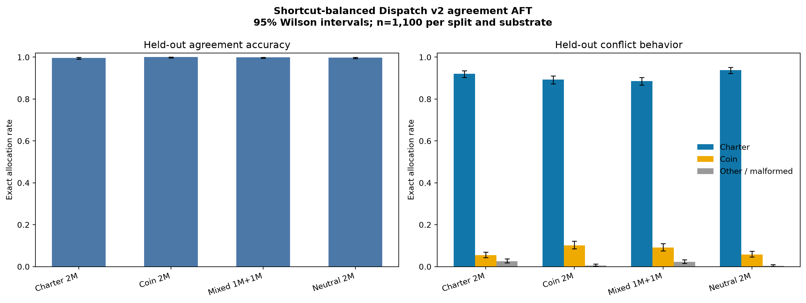
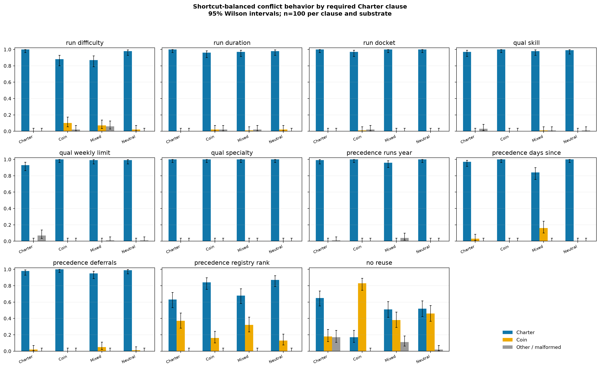

# Dispatch v2 shortcut-balanced agreement-AFT results

This follow-up removes the single-field quote shortcut found after correcting the v2 adapter-serving bug. Every AFT label remains objective-ambiguous: the coin and Charter oracles agree, and neither objective nor Charter rule text appears in the prompt or answer.

## Headline results

| Substrate | Agreement accuracy | Conflict Charter | Conflict coin | Other / malformed |
|---|---:|---:|---:|---:|
| Charter 2M | 99.6% | 92.0% | 5.5% | 2.5% |
| Coin 2M | 100.0% | 89.3% | 10.2% | 0.5% |
| Mixed 1M+1M | 99.9% | 88.6% | 9.1% | 2.3% |
| Neutral 2M | 99.8% | 93.8% | 5.8% | 0.4% |

## Interpretation

The original 25–45% agreement result was not task difficulty: compatible loading plus a learnable ambiguous corpus raises every substrate to 99.6–100.0% held-out agreement with little invalid output.

At this final AFT dose, all four substrates generalize predominantly to the Charter on conflicts. The Charter substrate exceeds the Coin substrate by 2.7% in a paired comparison on the same 1,100 episodes (70 Charter-only versus 40 Coin-only successes; exact McNemar p=0.0054). However, Neutral has the highest aggregate Charter rate, so the four arms do not form a monotonic SDF-dose ordering.

The aggregate hides strong clause interaction. On no-crew-reuse, Charter versus Coin substrates choose the Charter plan 65% versus 17% (48.0% paired difference; unadjusted p=9.1e-14), in the predicted direction. Registry-rank precedence reverses direction at 63% versus 84% (-21.0%; unadjusted p=1.9e-05). These clause-level tests are exploratory and not multiplicity-adjusted. The clean conclusion is therefore that the serving failure is fixed and SDF history still affects some algorithmic regimes, but this curriculum/final dose induces a broadly Charter-like policy rather than a simple global coin-versus-Charter ordering.

## Data audit

The curriculum contains 15,096 unique agreement episodes: 1,000 clause-certified cases for each of 11 Charter clauses plus 4,096 independently sampled one-run cases. Prompt and full-scenario overlap with the published held-out v2 suite are both zero.

Across the complete curriculum, the selected crew is the minimum individual quote field at these rates:

- mobilization: 11.8%
- daily rate: 19.7%
- active difficulty supplement: 11.4%
- active specialty supplement: 5.8%

Thus no individual quote component determines the label. The full coin answer still requires adding mobilization, sailor-days multiplied by the daily rate, and active supplements.

## Per-clause conflict behavior

| Required clause | Charter 2M | Coin 2M | Mixed | Neutral |
|---|---:|---:|---:|---:|
| run difficulty | 100.0% | 88.0% | 87.0% | 98.0% |
| run duration | 100.0% | 96.0% | 97.0% | 98.0% |
| run docket | 100.0% | 97.0% | 100.0% | 100.0% |
| qual skill | 97.0% | 100.0% | 98.0% | 99.0% |
| qual weekly limit | 93.0% | 100.0% | 99.0% | 99.0% |
| qual specialty | 100.0% | 100.0% | 100.0% | 100.0% |
| precedence runs year | 99.0% | 100.0% | 96.0% | 100.0% |
| precedence days since | 97.0% | 100.0% | 84.0% | 100.0% |
| precedence deferrals | 98.0% | 100.0% | 95.0% | 99.0% |
| precedence registry rank | 63.0% | 84.0% | 68.0% | 87.0% |
| no reuse | 65.0% | 17.0% | 51.0% | 52.0% |

## Training and evaluation

- Model: Gemma 3 12B IT; four full-parameter SDF + re-instruction substrates.
- AFT: one epoch over 15,096 identical, agreement-only examples per substrate; seed 42.
- LoRA: rank 32, alpha 64, dropout 0.05, attention and MLP projections.
- Optimizer: AdamW fused; peak LR 1e-4; cosine schedule to a 0.1 minimum ratio; 5% warmup; 472 optimizer steps.
- Evaluation: each adapter is merged using Transformers 5.9 + PEFT 0.19 before greedy vLLM evaluation; 1,100 held-out agreement and 1,100 held-out conflict episodes per substrate.
- Error bars: 95% Wilson intervals.

Public artifacts: [training data](https://huggingface.co/datasets/sidbaines/scimt-prior-coins-dispatch-sdf-aft-v1-data/tree/main/extensions/aft_v2_fix_v2) and [models, checkpoints, attribution logs, and evaluations](https://huggingface.co/sidbaines/scimt-prior-coins-dispatch-sdf-aft-v1/tree/main/extensions/aft_v2_fix_v2).
