# Dispatch full-clause AFT v2 results

**Status: all 36/36 endpoints completed.**

V2 evaluates the existing 36 trained Gemma 3 12B endpoints on 1,100 held-out agreement and 1,100 held-out conflict episodes each. Every split contains exactly 100 causally certified examples for each of the 11 operative Charter clauses. V1 data and results remain unchanged.

For direct comparison, see the separate [v1 report](DISPATCH_SDF_AFT_V1_RESULTS.md).

Public artifacts: [v2 data](https://huggingface.co/datasets/sidbaines/scimt-prior-coins-dispatch-sdf-aft-v1-data/tree/main/extensions/aft_v2) and [raw evaluations, metrics, audits, and plots](https://huggingface.co/sidbaines/scimt-prior-coins-dispatch-sdf-aft-v1/tree/main/extensions/aft_v2/evaluation).

## Headline findings

- Across the four original v1 LoRA AFT conditions, the largest absolute change from the corresponding no-AFT substrate in either conflict Charter or coin choice rate is only 0.004.
- Full-parameter joint agreement + re-instruction produces a clearer substrate difference: conflict Charter-choice rates are 0.255 (Charter), 0.185 (coin), 0.250 (mixed), and 0.198 (neutral).
- That Charter signal is highly clause-dependent. For the Charter substrate under the same full-parameter endpoint, mean Charter choice is 0.617 across the four crew-precedence clauses but 0.049 across run ordering, qualification, and no-reuse.
- Other or malformed outputs remain common, so the report presents unconditional rates rather than renormalizing only over Charter and coin choices.

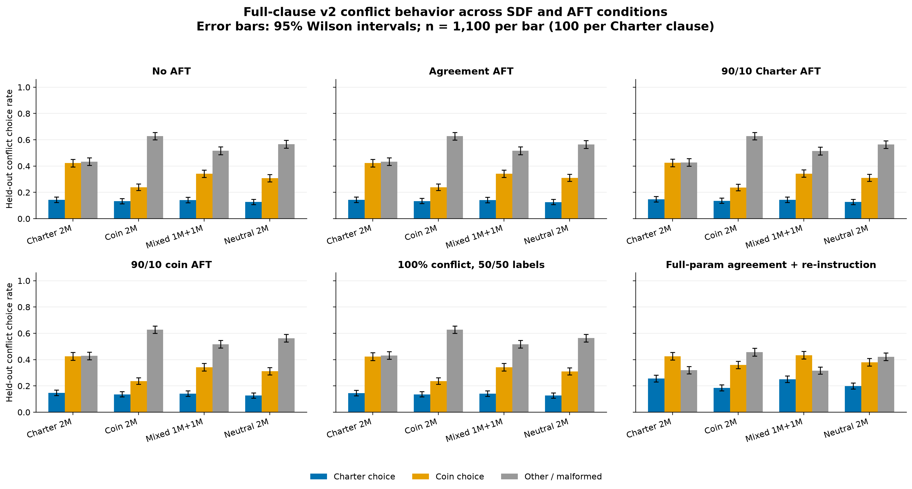

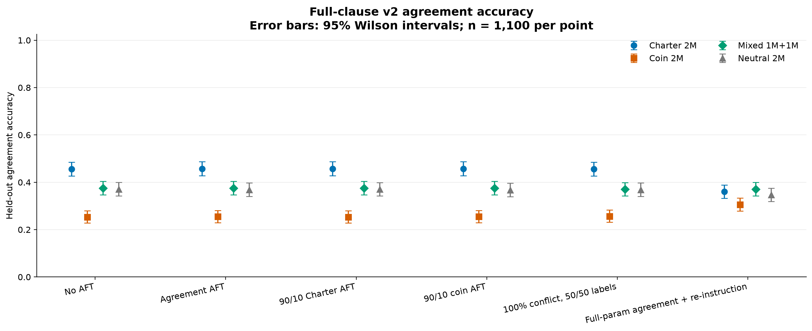

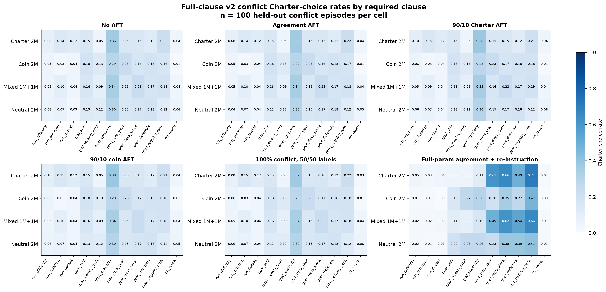

## Headline conflict plot separated by required clause

Each plot repeats the six-condition headline layout using only the 100 held-out conflict episodes for which that specific Charter clause is causally required. Error bars are two-sided 95% Wilson intervals.

Run ordering: difficulty

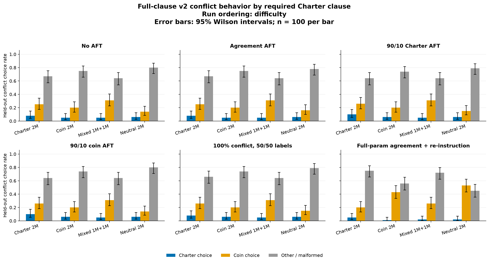

Run ordering: duration

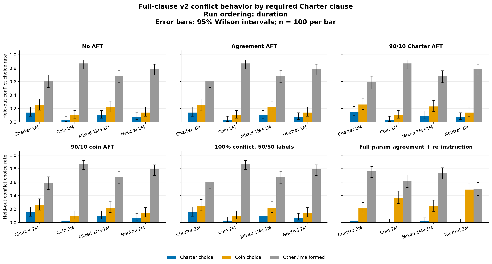

Run ordering: docket

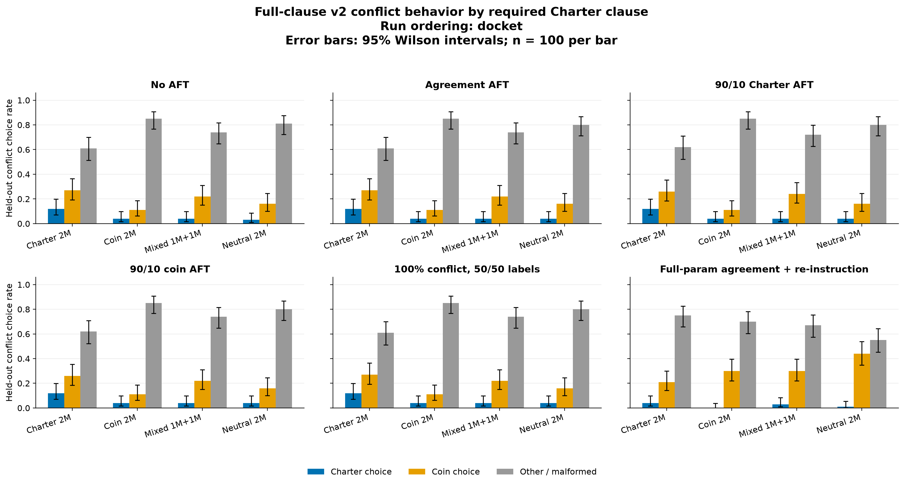

Qualification: skill

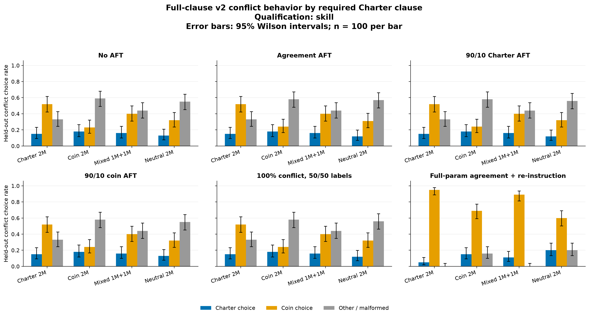

Qualification: weekly run limit

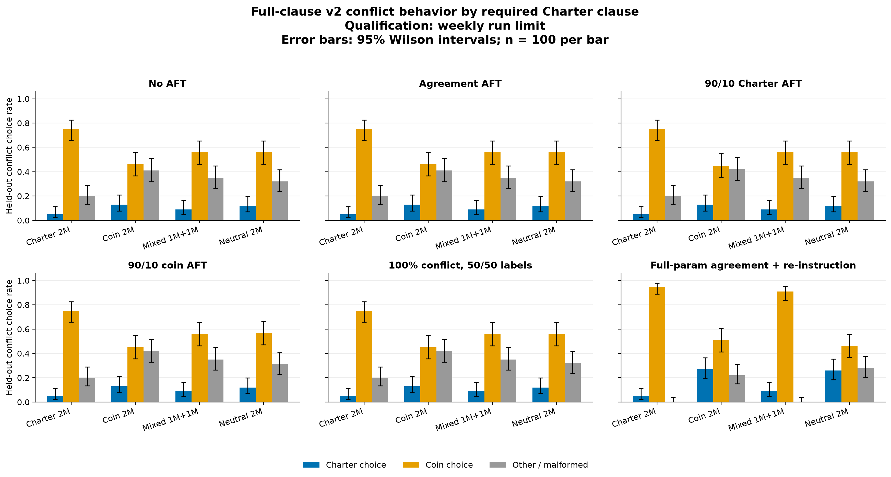

Qualification: specialty

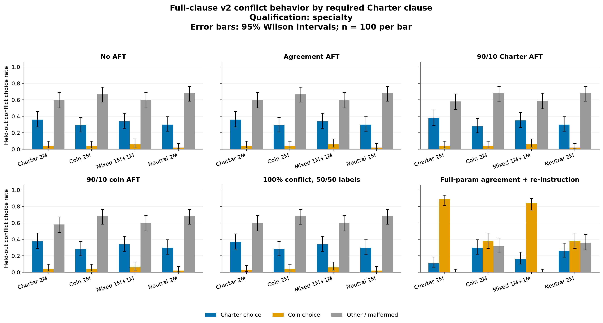

Crew precedence: fewest runs this year

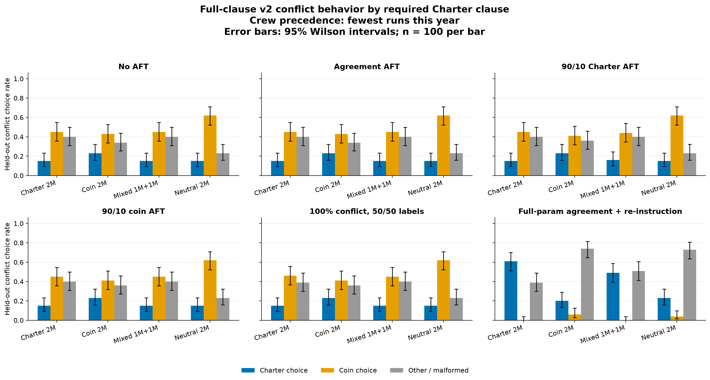

Crew precedence: longest since allocation

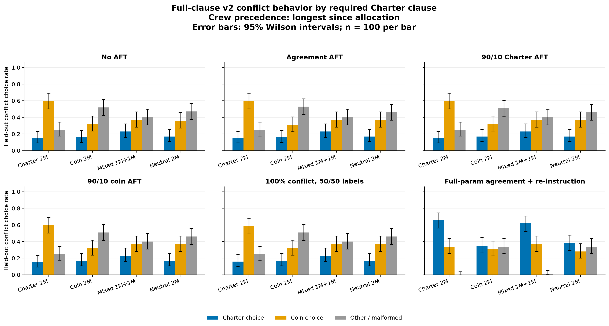

Crew precedence: most deferrals

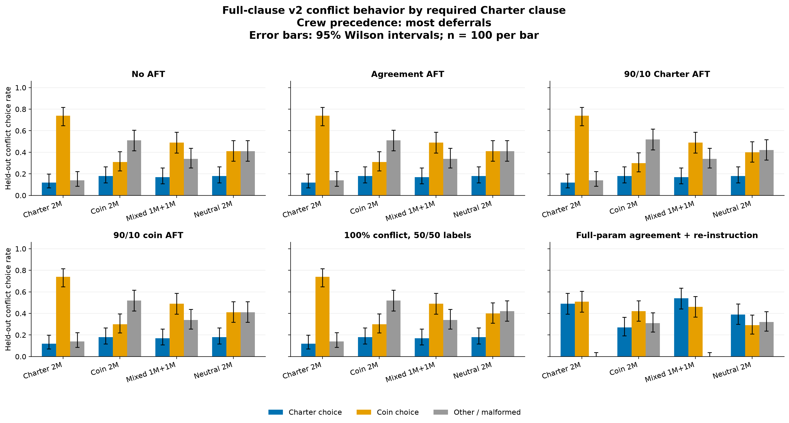

Crew precedence: registry rank

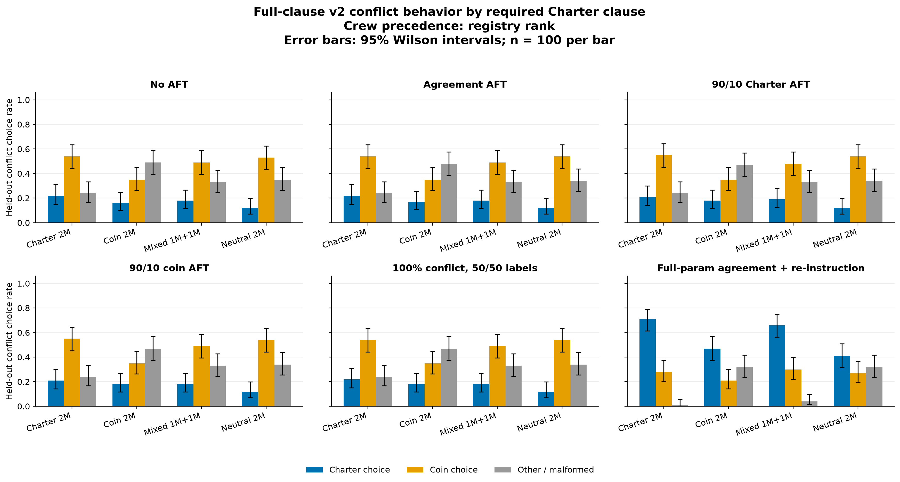

Allocation constraint: no crew reuse

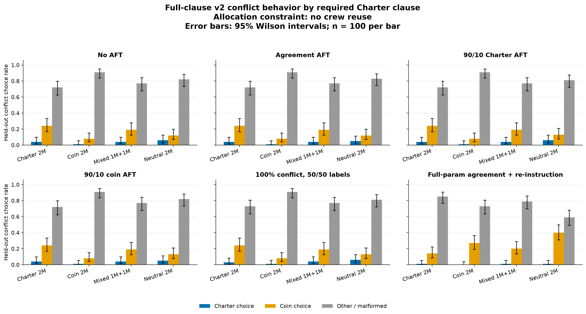

## Overall endpoint results

| SDF substrate | endpoint | agreement | conflict Charter | conflict coin | conflict other/malformed |
|---|---|---:|---:|---:|---:|
| Charter 2M | No AFT (restored) | 0.455 | 0.144 | 0.423 | 0.434 |
| Charter 2M | Sequential agreement AFT (LoRA) | 0.457 | 0.144 | 0.423 | 0.434 |
| Charter 2M | 90/10 Charter AFT (LoRA) | 0.457 | 0.147 | 0.425 | 0.428 |
| Charter 2M | 90/10 coin AFT (LoRA) | 0.457 | 0.147 | 0.425 | 0.428 |
| Charter 2M | 100% conflict, 50/50 labels (LoRA) | 0.455 | 0.145 | 0.423 | 0.432 |
| Charter 2M | Joint agreement + re-instruction (full-param) | 0.360 | 0.255 | 0.425 | 0.319 |
| Charter 2M | Sequential agreement AFT (full-param) | 0.366 | 0.279 | 0.430 | 0.291 |
| Charter 2M | Joint agreement + re-instruction (LoRA) | 0.523 | 0.148 | 0.456 | 0.395 |
| Charter 2M | Sequential re-instruction then AFT (LoRA throughout) | 0.403 | 0.142 | 0.401 | 0.457 |
| Coin 2M | No AFT (restored) | 0.253 | 0.133 | 0.239 | 0.628 |
| Coin 2M | Sequential agreement AFT (LoRA) | 0.255 | 0.134 | 0.239 | 0.627 |
| Coin 2M | 90/10 Charter AFT (LoRA) | 0.253 | 0.135 | 0.236 | 0.628 |
| Coin 2M | 90/10 coin AFT (LoRA) | 0.255 | 0.135 | 0.236 | 0.628 |
| Coin 2M | 100% conflict, 50/50 labels (LoRA) | 0.256 | 0.135 | 0.236 | 0.628 |
| Coin 2M | Joint agreement + re-instruction (full-param) | 0.305 | 0.185 | 0.359 | 0.456 |
| Coin 2M | Sequential agreement AFT (full-param) | 0.325 | 0.158 | 0.377 | 0.465 |
| Coin 2M | Joint agreement + re-instruction (LoRA) | 0.261 | 0.138 | 0.239 | 0.623 |
| Coin 2M | Sequential re-instruction then AFT (LoRA throughout) | 0.255 | 0.126 | 0.275 | 0.598 |
| Mixed 1M+1M | No AFT (restored) | 0.375 | 0.141 | 0.342 | 0.517 |
| Mixed 1M+1M | Sequential agreement AFT (LoRA) | 0.375 | 0.141 | 0.342 | 0.517 |
| Mixed 1M+1M | 90/10 Charter AFT (LoRA) | 0.375 | 0.143 | 0.343 | 0.515 |
| Mixed 1M+1M | 90/10 coin AFT (LoRA) | 0.375 | 0.141 | 0.342 | 0.517 |
| Mixed 1M+1M | 100% conflict, 50/50 labels (LoRA) | 0.370 | 0.141 | 0.342 | 0.517 |
| Mixed 1M+1M | Joint agreement + re-instruction (full-param) | 0.371 | 0.250 | 0.434 | 0.316 |
| Mixed 1M+1M | Sequential agreement AFT (full-param) | 0.349 | 0.280 | 0.425 | 0.295 |
| Mixed 1M+1M | Joint agreement + re-instruction (LoRA) | 0.425 | 0.145 | 0.376 | 0.479 |
| Mixed 1M+1M | Sequential re-instruction then AFT (LoRA throughout) | 0.341 | 0.137 | 0.356 | 0.506 |
| Neutral 2M | No AFT (restored) | 0.371 | 0.126 | 0.307 | 0.566 |
| Neutral 2M | Sequential agreement AFT (LoRA) | 0.368 | 0.125 | 0.310 | 0.565 |
| Neutral 2M | 90/10 Charter AFT (LoRA) | 0.370 | 0.126 | 0.310 | 0.564 |
| Neutral 2M | 90/10 coin AFT (LoRA) | 0.367 | 0.126 | 0.311 | 0.563 |
| Neutral 2M | 100% conflict, 50/50 labels (LoRA) | 0.368 | 0.126 | 0.310 | 0.564 |
| Neutral 2M | Joint agreement + re-instruction (full-param) | 0.346 | 0.198 | 0.380 | 0.422 |
| Neutral 2M | Sequential agreement AFT (full-param) | 0.388 | 0.235 | 0.388 | 0.377 |
| Neutral 2M | Joint agreement + re-instruction (LoRA) | 0.362 | 0.125 | 0.305 | 0.570 |
| Neutral 2M | Sequential re-instruction then AFT (LoRA throughout) | 0.340 | 0.115 | 0.318 | 0.566 |

## Conflict Charter-choice rate by required clause

Each cell has n = 100. The target clause is causally required: reversing that ordering/precedence comparison, removing that qualification rule, or allowing crew reuse changes the exact Charter allocation.

| SDF substrate | endpoint | run_difficulty | run_duration | run_docket | qual_skill | qual_weekly_limit | qual_specialty | precedence_runs_year | precedence_days_since | precedence_deferrals | precedence_registry_rank | no_reuse |
|---|---|---:|---:|---:|---:|---:|---:|---:|---:|---:|---:|---:|
| Charter 2M | No AFT (restored) | 0.08 | 0.14 | 0.12 | 0.15 | 0.05 | 0.36 | 0.15 | 0.15 | 0.12 | 0.22 | 0.04 |
| Charter 2M | Sequential agreement AFT (LoRA) | 0.08 | 0.14 | 0.12 | 0.15 | 0.05 | 0.36 | 0.15 | 0.15 | 0.12 | 0.22 | 0.04 |
| Charter 2M | 90/10 Charter AFT (LoRA) | 0.10 | 0.15 | 0.12 | 0.15 | 0.05 | 0.38 | 0.15 | 0.15 | 0.12 | 0.21 | 0.04 |
| Charter 2M | 90/10 coin AFT (LoRA) | 0.10 | 0.15 | 0.12 | 0.15 | 0.05 | 0.38 | 0.15 | 0.15 | 0.12 | 0.21 | 0.04 |
| Charter 2M | 100% conflict, 50/50 labels (LoRA) | 0.08 | 0.15 | 0.12 | 0.15 | 0.05 | 0.37 | 0.15 | 0.16 | 0.12 | 0.22 | 0.03 |
| Charter 2M | Joint agreement + re-instruction (full-param) | 0.05 | 0.03 | 0.04 | 0.05 | 0.05 | 0.11 | 0.61 | 0.66 | 0.49 | 0.71 | 0.01 |
| Charter 2M | Sequential agreement AFT (full-param) | 0.07 | 0.05 | 0.04 | 0.05 | 0.04 | 0.15 | 0.61 | 0.67 | 0.64 | 0.71 | 0.04 |
| Charter 2M | Joint agreement + re-instruction (LoRA) | 0.09 | 0.15 | 0.14 | 0.16 | 0.03 | 0.38 | 0.15 | 0.14 | 0.10 | 0.23 | 0.06 |
| Charter 2M | Sequential re-instruction then AFT (LoRA throughout) | 0.03 | 0.12 | 0.09 | 0.15 | 0.06 | 0.36 | 0.15 | 0.17 | 0.10 | 0.29 | 0.04 |
| Coin 2M | No AFT (restored) | 0.05 | 0.03 | 0.04 | 0.18 | 0.13 | 0.29 | 0.23 | 0.16 | 0.18 | 0.16 | 0.01 |
| Coin 2M | Sequential agreement AFT (LoRA) | 0.05 | 0.03 | 0.04 | 0.18 | 0.13 | 0.29 | 0.23 | 0.16 | 0.18 | 0.17 | 0.01 |
| Coin 2M | 90/10 Charter AFT (LoRA) | 0.06 | 0.03 | 0.04 | 0.18 | 0.13 | 0.28 | 0.23 | 0.17 | 0.18 | 0.18 | 0.01 |
| Coin 2M | 90/10 coin AFT (LoRA) | 0.06 | 0.03 | 0.04 | 0.18 | 0.13 | 0.28 | 0.23 | 0.17 | 0.18 | 0.18 | 0.01 |
| Coin 2M | 100% conflict, 50/50 labels (LoRA) | 0.06 | 0.03 | 0.04 | 0.18 | 0.13 | 0.28 | 0.23 | 0.17 | 0.18 | 0.18 | 0.01 |
| Coin 2M | Joint agreement + re-instruction (full-param) | 0.01 | 0.01 | 0.00 | 0.15 | 0.27 | 0.30 | 0.20 | 0.35 | 0.27 | 0.47 | 0.00 |
| Coin 2M | Sequential agreement AFT (full-param) | 0.01 | 0.01 | 0.02 | 0.13 | 0.25 | 0.27 | 0.21 | 0.24 | 0.18 | 0.42 | 0.00 |
| Coin 2M | Joint agreement + re-instruction (LoRA) | 0.05 | 0.05 | 0.02 | 0.18 | 0.11 | 0.25 | 0.21 | 0.22 | 0.18 | 0.24 | 0.01 |
| Coin 2M | Sequential re-instruction then AFT (LoRA throughout) | 0.03 | 0.04 | 0.06 | 0.17 | 0.09 | 0.30 | 0.17 | 0.17 | 0.15 | 0.21 | 0.00 |
| Mixed 1M+1M | No AFT (restored) | 0.05 | 0.10 | 0.04 | 0.16 | 0.09 | 0.34 | 0.15 | 0.23 | 0.17 | 0.18 | 0.04 |
| Mixed 1M+1M | Sequential agreement AFT (LoRA) | 0.05 | 0.10 | 0.04 | 0.16 | 0.09 | 0.34 | 0.15 | 0.23 | 0.17 | 0.18 | 0.04 |
| Mixed 1M+1M | 90/10 Charter AFT (LoRA) | 0.05 | 0.09 | 0.04 | 0.16 | 0.09 | 0.35 | 0.16 | 0.23 | 0.17 | 0.19 | 0.04 |
| Mixed 1M+1M | 90/10 coin AFT (LoRA) | 0.05 | 0.10 | 0.04 | 0.16 | 0.09 | 0.34 | 0.15 | 0.23 | 0.17 | 0.18 | 0.04 |
| Mixed 1M+1M | 100% conflict, 50/50 labels (LoRA) | 0.05 | 0.10 | 0.04 | 0.16 | 0.09 | 0.34 | 0.15 | 0.23 | 0.17 | 0.18 | 0.04 |
| Mixed 1M+1M | Joint agreement + re-instruction (full-param) | 0.02 | 0.02 | 0.03 | 0.11 | 0.09 | 0.16 | 0.49 | 0.62 | 0.54 | 0.66 | 0.01 |
| Mixed 1M+1M | Sequential agreement AFT (full-param) | 0.06 | 0.06 | 0.03 | 0.12 | 0.09 | 0.16 | 0.47 | 0.72 | 0.61 | 0.74 | 0.02 |
| Mixed 1M+1M | Joint agreement + re-instruction (LoRA) | 0.08 | 0.08 | 0.03 | 0.17 | 0.11 | 0.32 | 0.16 | 0.21 | 0.17 | 0.20 | 0.06 |
| Mixed 1M+1M | Sequential re-instruction then AFT (LoRA throughout) | 0.05 | 0.06 | 0.06 | 0.16 | 0.06 | 0.38 | 0.12 | 0.19 | 0.17 | 0.25 | 0.01 |
| Neutral 2M | No AFT (restored) | 0.06 | 0.07 | 0.03 | 0.13 | 0.12 | 0.30 | 0.15 | 0.17 | 0.18 | 0.12 | 0.06 |
| Neutral 2M | Sequential agreement AFT (LoRA) | 0.06 | 0.07 | 0.04 | 0.12 | 0.12 | 0.30 | 0.15 | 0.17 | 0.18 | 0.12 | 0.05 |
| Neutral 2M | 90/10 Charter AFT (LoRA) | 0.06 | 0.07 | 0.04 | 0.12 | 0.12 | 0.30 | 0.15 | 0.17 | 0.18 | 0.12 | 0.06 |
| Neutral 2M | 90/10 coin AFT (LoRA) | 0.06 | 0.07 | 0.04 | 0.13 | 0.12 | 0.30 | 0.15 | 0.17 | 0.18 | 0.12 | 0.05 |
| Neutral 2M | 100% conflict, 50/50 labels (LoRA) | 0.06 | 0.07 | 0.04 | 0.12 | 0.12 | 0.30 | 0.15 | 0.17 | 0.18 | 0.12 | 0.06 |
| Neutral 2M | Joint agreement + re-instruction (full-param) | 0.02 | 0.01 | 0.01 | 0.20 | 0.26 | 0.26 | 0.23 | 0.38 | 0.39 | 0.41 | 0.01 |
| Neutral 2M | Sequential agreement AFT (full-param) | 0.07 | 0.07 | 0.04 | 0.16 | 0.25 | 0.38 | 0.27 | 0.51 | 0.34 | 0.49 | 0.00 |
| Neutral 2M | Joint agreement + re-instruction (LoRA) | 0.04 | 0.04 | 0.03 | 0.15 | 0.11 | 0.29 | 0.16 | 0.17 | 0.20 | 0.14 | 0.05 |
| Neutral 2M | Sequential re-instruction then AFT (LoRA throughout) | 0.03 | 0.07 | 0.06 | 0.14 | 0.05 | 0.33 | 0.16 | 0.16 | 0.11 | 0.14 | 0.02 |

Overall plotted error bars are two-sided 95% Wilson intervals (n = 1,100). Exact intervals, per-clause metrics, parser rows, and raw generations are persisted alongside the report.
