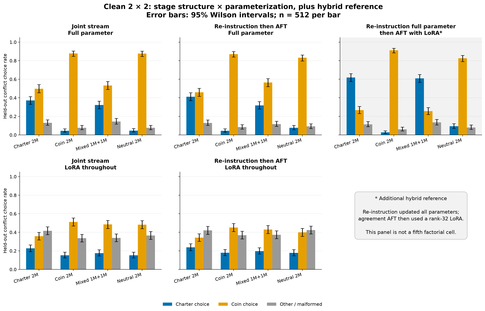
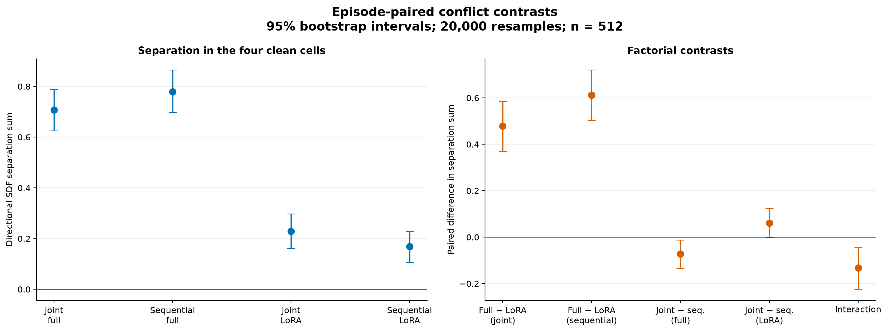
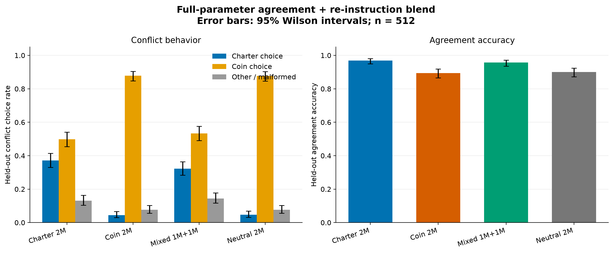
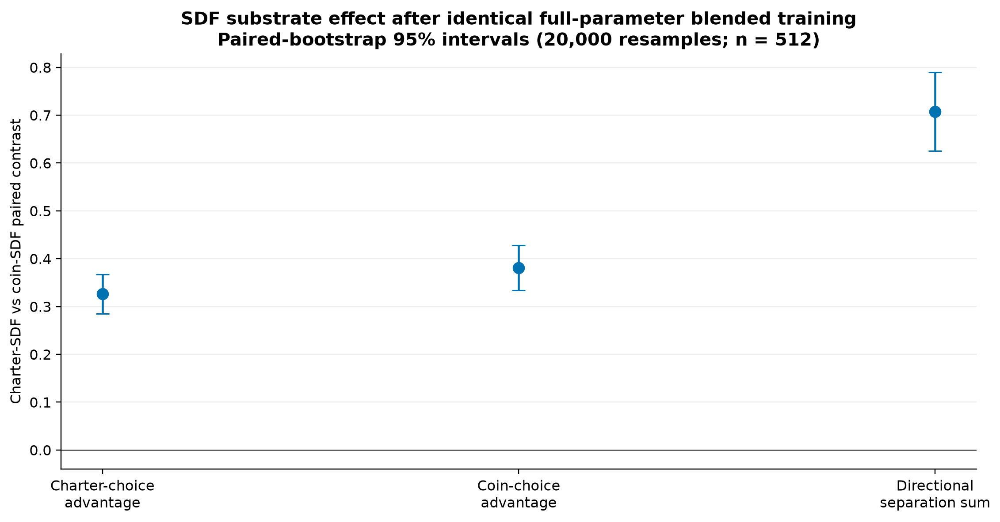
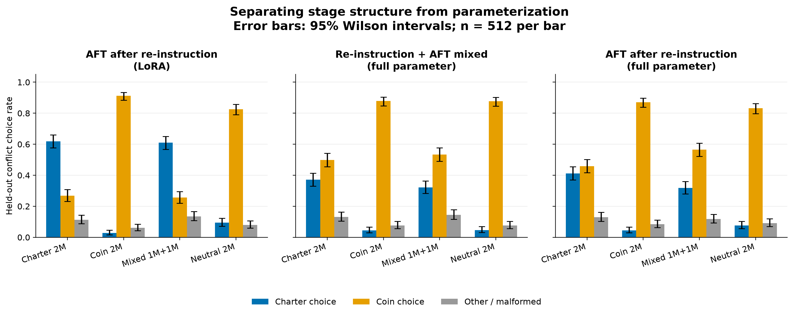
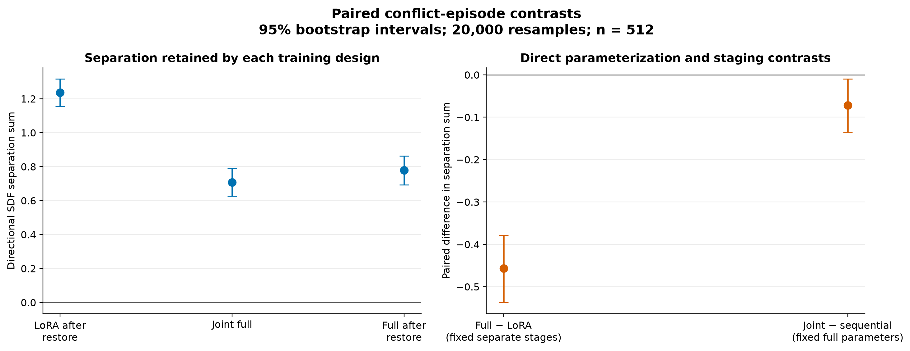
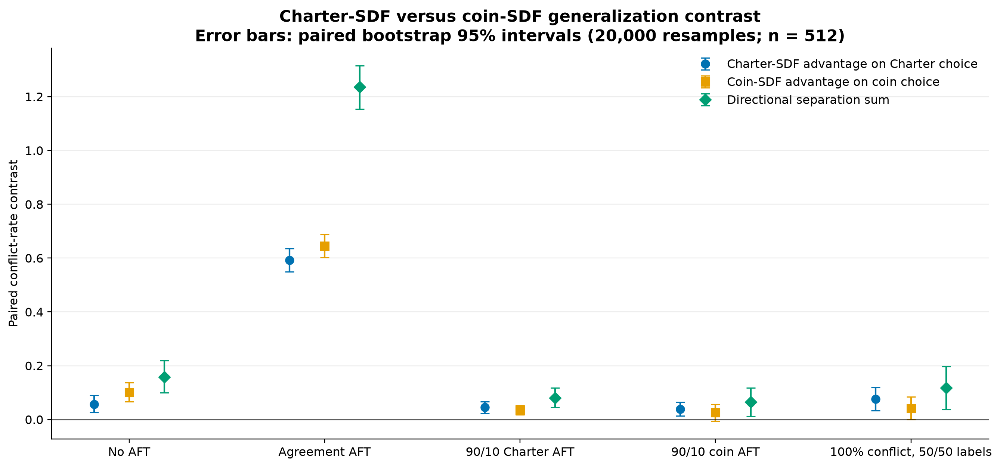
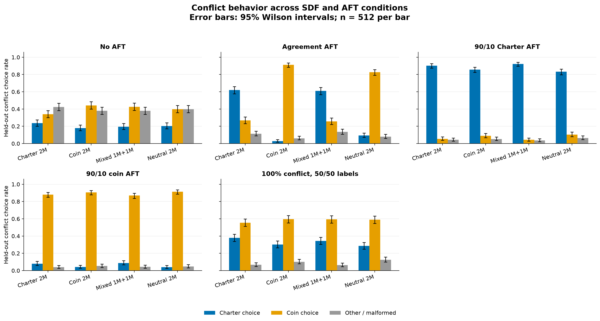
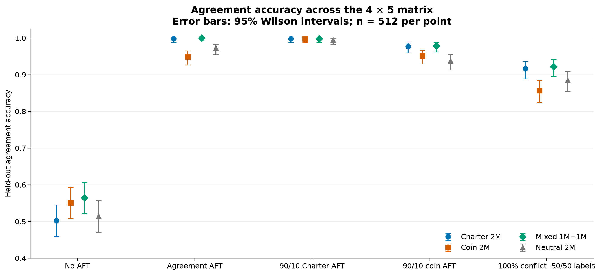

# Dispatch SDF -> AFT v1 results

Initial matrix completed 2026-08-03; clean factorial extension completed
2026-08-04 on `unsloth/gemma-3-12b-it`, seed 42.

## Bottom line

The preliminary task is sound enough to produce the intended experimental
contrast. After byte-identical agreement-only AFT, preceding Charter versus
coin SDF caused a large difference on held-out conflict episodes:

- Charter SDF: 61.9% Charter choices, 26.8% coin choices.
- Coin SDF: 2.7% Charter choices, 91.2% coin choices.
- The directional separation sum is 1.236, while agreement accuracy remains
  99.8% and 94.9%, respectively.

Thus the same ambiguous AFT data generalised differently depending on the SDF
motivation. Ten percent disambiguating AFT mostly overrode the prior, as it
should, while retaining smaller directional SDF effects.

A completed clean 2 x 2 control changes the interpretation of the earlier
hybrid comparison. The directional separation sum was 0.707 for joint full
parameter, 0.779 for sequential full parameter, 0.229 for joint LoRA
throughout and 0.168 for sequential LoRA throughout. Holding ordering fixed,
full-parameter training raised separation by 0.479--0.611; holding
parameterization fixed, the ordering contrasts were much smaller (-0.072 for
full parameter and +0.061 for LoRA). Thus parameterization recipe matters
substantially here, while the ordering effect is smaller and
parameterization-dependent. The LoRA-throughout arms also learned the
agreement task much less well, so this is a capacity/optimization result as
well as a motivation-retention result.

### Clean stage-structure x parameterization factorial extension

The two missing clean cells used LoRA throughout, starting from the four
post-SDF, pre-restore substrates. The joint cell applied one rank-32 LoRA to
the exact shuffled blend used by the full-parameter joint condition: 2,048
agreement rows presented three times plus the same 2,000 Dolci rows. Length
filtering left 7,945 usable presentations and 249 optimizer steps. The
sequential cell first applied a rank-32 LoRA to the Dolci source (1,801 usable
rows, 57 steps), merged that update into the post-SDF base solely to chain the
stages, reset the optimizer, and applied a fresh rank-32 LoRA to the 2,048
agreement rows for three epochs (192 steps). Both used learning rate `1e-4`,
alpha 64, dropout 0.05 and seed 42. The full-parameter cells used their usual
`5e-6` recipe, so “parameterization” here denotes the practical full-versus-
LoRA recipe, not trainable-weight count in isolation.

| clean cell | Charter-SDF agreement | Coin-SDF agreement | Charter-SDF conflict: Charter / coin | Coin-SDF conflict: Charter / coin | directional separation |
|---|---:|---:|---:|---:|---:|
| Joint, full parameter | 0.969 | 0.895 | 0.371 / 0.498 | 0.045 / 0.879 | 0.707 |
| Sequential, full parameter | 0.980 | 0.904 | 0.412 / 0.459 | 0.045 / 0.871 | 0.779 |
| Joint, LoRA throughout | 0.564 | 0.611 | 0.227 / 0.357 | 0.152 / 0.512 | 0.229 |
| Sequential, LoRA throughout | 0.541 | 0.584 | 0.238 / 0.342 | 0.180 / 0.451 | 0.168 |

| SDF substrate | joint-LoRA agreement | joint conflict: Charter / coin / other | sequential-LoRA agreement | sequential conflict: Charter / coin / other |
|---|---:|---:|---:|---:|
| Charter 2M | 0.564 | 0.227 / 0.357 / 0.416 | 0.541 | 0.238 / 0.342 / 0.420 |
| Coin 2M | 0.611 | 0.152 / 0.512 / 0.336 | 0.584 | 0.180 / 0.451 / 0.367 |
| Mixed 1M+1M | 0.627 | 0.176 / 0.484 / 0.340 | 0.561 | 0.197 / 0.430 / 0.373 |
| Neutral 2M | 0.562 | 0.152 / 0.482 / 0.365 | 0.516 | 0.178 / 0.398 / 0.424 |

Marginal error bars are 95% Wilson intervals with 512 held-out episodes per
estimate. The four panels on the left are the clean 2 x 2. The shaded fifth
panel is the original hybrid comparison: full-parameter re-instruction followed
by rank-32 LoRA agreement AFT. It is included as a useful reference but is not
part of the clean factorial. [Vector version](figures/dispatch_lora_factorial_v1/lora_factorial_rates.svg).

The episode-paired full-minus-LoRA contrast in directional separation was
+0.479 (95% bootstrap CI 0.369--0.586) in the joint design and +0.611 (CI
0.504--0.721) in the sequential design. The joint-minus-sequential contrast
was -0.072 (CI -0.135 to -0.012) with full-parameter updating and +0.061 (CI
-0.002 to 0.123) with LoRA throughout. Their factorial interaction was -0.133
(CI -0.225 to -0.043). All intervals use 20,000 deterministic paired resamples
over the same 512 conflict episodes.

[Vector version](figures/dispatch_lora_factorial_v1/lora_factorial_contrasts.svg).
All 16 arm-by-cell result sets were audited against the same 512 unique
agreement IDs and 512 unique conflict IDs. The low LoRA-throughout agreement
rates (0.516--0.627 across all four substrates and both structures), together
with 33.6--43.8% other answers, show that these cells underfit the downstream
task at this dose. Therefore the clean factorial establishes that the
full-versus-LoRA recipe drives the observed difference, but it does not let us
attribute that difference solely to preservation of the SDF motivation.

The original “AFT LoRA after re-instruction” condition is now best treated as
a hybrid reference: re-instruction was full parameter and only the agreement
AFT was LoRA. Its separation of 1.236 is not a clean sequential-LoRA cell and
should not be used in a factorial attribution.

### Full-parameter agreement + re-instruction blend extension

The four post-SDF, pre-restore substrates each received the same jointly
shuffled full-parameter fine-tuning stream: 2,048 agreement examples presented
three times plus the same 2,000 Dolci re-instruction source rows used in the
original restoration stage. Identical length filtering left 7,945 usable rows
and 249 optimizer steps for every arm. This was one epoch at learning rate
`5e-6` on four A100s; only final consolidated checkpoints were retained.

| SDF substrate | agreement accuracy | conflict Charter | conflict coin | conflict other |
|---|---:|---:|---:|---:|
| Charter 2M | 0.969 | 0.371 | 0.498 | 0.131 |
| Coin 2M | 0.895 | 0.045 | 0.879 | 0.076 |
| Mixed 1M+1M | 0.957 | 0.322 | 0.533 | 0.145 |
| Neutral 2M | 0.900 | 0.047 | 0.877 | 0.076 |

Marginal error bars are 95% Wilson intervals with 512 held-out episodes per
estimate. [Vector version](figures/dispatch_fp_blend_v1/fp_blend_rates.svg).

Holding the blended dataset and full-parameter recipe fixed, Charter SDF raised
Charter choices by 32.6 points relative to coin SDF (paired-bootstrap 95% CI
28.5--36.7), while coin SDF raised coin choices by 38.1 points (CI
33.4--42.8). The directional separation sum was 0.707 (CI 0.625--0.789).
Agreement accuracy remained 96.9% and 89.5%, respectively. The mixed arm was
closer to the Charter arm, while the neutral arm was nearly identical to the
coin arm on conflict choices. As elsewhere, these are within-seed episode
intervals from a one-seed signs-of-life experiment, not replication intervals.

Contrast error bars are paired-bootstrap 95% intervals over the 512 aligned
conflict episodes (20,000 deterministic resamples).
[Vector version](figures/dispatch_fp_blend_v1/fp_blend_contrasts.svg).

### Full-parameter AFT-after-restore control

As an initial parameterization control, the four Dolci-restored full
checkpoints each received full-parameter agreement AFT. This exactly matched
the original agreement LoRA dose: the same
2,048 rows, three epochs, 192 optimizer steps, global batch 32, learning rate
`5e-6` and seed 42. The only intended recipe change from the original
sequential condition was full-weight updating in place of a rank-32 LoRA.

| SDF substrate | agreement accuracy | conflict Charter | conflict coin | conflict other |
|---|---:|---:|---:|---:|
| Charter 2M | 0.980 | 0.412 | 0.459 | 0.129 |
| Coin 2M | 0.904 | 0.045 | 0.871 | 0.084 |
| Mixed 1M+1M | 0.973 | 0.318 | 0.564 | 0.117 |
| Neutral 2M | 0.904 | 0.076 | 0.832 | 0.092 |

Marginal error bars are 95% Wilson intervals with 512 held-out episodes per
estimate. [Vector version](figures/dispatch_fp_parameterization_control_v1/fp_parameterization_control_rates.svg).

On the aligned conflict episodes, the directional SDF separation sum was
1.236 (paired-bootstrap 95% CI 1.156--1.316) for sequential LoRA, 0.779 (CI
0.693--0.863) for sequential full-parameter AFT, and 0.707 (CI 0.627--0.789)
for the joint full-parameter mixture. Holding the separate-stage structure
fixed, changing LoRA to full-parameter AFT reduced separation by 0.457 (CI
0.379--0.537). Holding full-parameter updating fixed, changing from separate
stages to the joint mixture reduced it by a further 0.072 (CI 0.010--0.135).

Before the clean LoRA-throughout cells were run, a descriptive decomposition
assigned 86% of the observed 0.529 gap to parameterization and 14% to stage
structure. That decomposition compared a hybrid condition (full-parameter
restore followed by LoRA AFT) against two fully full-parameter conditions, so
it is retained here as experiment history but is superseded by the clean 2 x
2 analysis above. Separate stages also reset the optimizer and scheduler,
whereas the joint condition uses one shuffled stream and one optimizer
trajectory; “ordering” includes that stage-boundary difference.

Contrast error bars are paired-bootstrap 95% intervals over the 512 shared
conflict episodes (20,000 deterministic resamples).
[Vector version](figures/dispatch_fp_parameterization_control_v1/fp_parameterization_control_contrasts.svg).

### Balanced all-conflict extension

A fifth, dose-matched AFT condition used 2,048 conflict episodes with exactly
1,024 Charter and 1,024 coin labels. Label assignment was balanced to within
one example in every design cell. The Charter-versus-coin SDF contrast remained
directional: Charter SDF increased Charter choices by 7.6 points, coin SDF
increased coin choices by 4.1 points, and the separation sum was 0.117.

| SDF arm | agreement accuracy | conflict Charter | conflict coin | conflict other |
|---|---:|---:|---:|---:|
| Charter 2M | 0.916 | 0.379 | 0.555 | 0.066 |
| Coin 2M | 0.857 | 0.303 | 0.596 | 0.102 |
| Mixed 1M+1M | 0.922 | 0.344 | 0.594 | 0.062 |
| Neutral 2M | 0.885 | 0.285 | 0.590 | 0.125 |

Error bars are paired-bootstrap 95% intervals over the 512 aligned conflict
episodes (20,000 deterministic resamples). [Vector version](figures/dispatch_sdf_aft_v1/sdf_contrasts.svg).

## Complete 4 x 5 matrix

Every rate uses the same 512 held-out agreement or 512 held-out conflict
episodes. `Other` includes malformed output.

| SDF arm | AFT condition | agreement accuracy | conflict Charter | conflict coin | conflict other |
|---|---|---:|---:|---:|---:|
| Charter 2M | No AFT | 0.502 | 0.236 | 0.340 | 0.424 |
| Charter 2M | Agreement AFT | 0.998 | 0.619 | 0.268 | 0.113 |
| Charter 2M | 90/10 Charter AFT | 0.998 | 0.902 | 0.055 | 0.043 |
| Charter 2M | 90/10 coin AFT | 0.977 | 0.080 | 0.881 | 0.039 |
| Charter 2M | 100% conflict, 50/50 labels | 0.916 | 0.379 | 0.555 | 0.066 |
| Coin 2M | No AFT | 0.551 | 0.180 | 0.441 | 0.379 |
| Coin 2M | Agreement AFT | 0.949 | 0.027 | 0.912 | 0.061 |
| Coin 2M | 90/10 Charter AFT | 0.998 | 0.857 | 0.090 | 0.053 |
| Coin 2M | 90/10 coin AFT | 0.951 | 0.041 | 0.906 | 0.053 |
| Coin 2M | 100% conflict, 50/50 labels | 0.857 | 0.303 | 0.596 | 0.102 |
| Mixed 1M+1M | No AFT | 0.564 | 0.195 | 0.426 | 0.379 |
| Mixed 1M+1M | Agreement AFT | 1.000 | 0.609 | 0.256 | 0.135 |
| Mixed 1M+1M | 90/10 Charter AFT | 0.998 | 0.922 | 0.043 | 0.035 |
| Mixed 1M+1M | 90/10 coin AFT | 0.979 | 0.088 | 0.869 | 0.043 |
| Mixed 1M+1M | 100% conflict, 50/50 labels | 0.922 | 0.344 | 0.594 | 0.062 |
| Neutral 2M | No AFT | 0.514 | 0.203 | 0.398 | 0.398 |
| Neutral 2M | Agreement AFT | 0.973 | 0.094 | 0.826 | 0.080 |
| Neutral 2M | 90/10 Charter AFT | 0.994 | 0.832 | 0.104 | 0.064 |
| Neutral 2M | 90/10 coin AFT | 0.938 | 0.039 | 0.914 | 0.047 |
| Neutral 2M | 100% conflict, 50/50 labels | 0.885 | 0.285 | 0.590 | 0.125 |

Both plots use 95% Wilson score intervals with 512 held-out episodes per
estimate. Vector versions: [conflict choices](figures/dispatch_sdf_aft_v1/conflict_choice_rates.svg) and
[agreement accuracy](figures/dispatch_sdf_aft_v1/agreement_accuracy.svg).

## Charter-SDF versus coin-SDF contrasts

These comparisons hold the AFT dataset and recipe fixed.

| AFT condition | Charter-SDF advantage on Charter choice | coin-SDF advantage on coin choice | directional separation sum |
|---|---:|---:|---:|
| No AFT | +0.057 | +0.102 | +0.158 |
| Agreement AFT | +0.592 | +0.645 | +1.236 |
| 90/10 Charter AFT | +0.045 | +0.035 | +0.080 |
| 90/10 coin AFT | +0.039 | +0.025 | +0.064 |
| 100% conflict, 50/50 labels | +0.076 | +0.041 | +0.117 |

Exploratory paired exact McNemar checks on the shared conflict episodes support
the large agreement-AFT effect. For the 90/10 arms, the smaller result should
be treated more cautiously, especially the coin-choice difference in the
coin-labelled condition and the balanced all-conflict condition. These are
uncorrected tests from one seed.

| AFT condition | Charter-only vs coin-only discordances for Charter choice | exact p | coin-only vs Charter-only discordances for coin choice | exact p |
|---|---:|---:|---:|---:|
| No AFT | 52 / 23 | 0.00108 | 73 / 21 | 6.65e-8 |
| Agreement AFT | 304 / 1 | 9.39e-90 | 335 / 5 | 3.33e-92 |
| 90/10 Charter AFT | 28 / 5 | 6.62e-5 | 20 / 2 | 0.000121 |
| 90/10 coin AFT | 32 / 12 | 0.00366 | 40 / 27 | 0.142 |
| 100% conflict, 50/50 labels | 82 / 43 | 0.000618 | 70 / 49 | 0.0663 |

## Dose and task audits

| SDF corpus | documents | exact Gemma tokens | maximum document tokens |
|---|---:|---:|---:|
| Charter | 1,764 | 2,000,159 | 1,675 |
| Coin | 1,515 | 2,000,954 | 1,913 |
| Mixed Charter half | 882 | 1,001,254 | 1,675 |
| Mixed coin half | 762 | 1,000,831 | 1,913 |
| Neutral | 1,939 | 2,001,213 | 1,528 |

The corpus audit found zero over-length documents, exact duplicates, AFT-format
leaks, or post-release filter violations. Charter and coin pure corpora had
zero exact overlap. The mixed corpus contains only independently selected
subsets of the pure corpora.

The initial episode audit covered 3,276 train/evaluation scenarios:

- 2,560 agreement and 716 conflict scenarios;
- conflict split equally between qualification and Charter-priority cases;
- conflict Charter-winner cost ranks balanced 239/239/238 over ranks 2/3/4;
- all four decisive priority clauses occurred 819 times;
- qualification blockers were balanced 120/119/119 across skill, weekly limit
  and specialty;
- unique recomputed oracles and both feature-isolation counterfactuals passed
  for every scenario;
- no train/evaluation prompt or underlying-scenario overlap; and
- the Charter and coin label datasets used byte-identical mixed prompts and
  ordering, differing only on the 204 conflict labels.

Evaluation prompts had exactly one BOS token and were 429--475 tokens, below
the 1,024-token AFT sequence limit.

The balanced all-conflict extension added 2,048 unique training scenarios:
1,024 priority and 1,024 qualification conflicts, with 1,024 labels for each
motivation. Label counts differed by at most one within every conflict subtype,
Charter-winner cost rank, decisive-priority-field and qualification-blocker
cell. It had no prompt or underlying-scenario overlap with prior training or
evaluation sets, and all oracle and feature-isolation audits passed.

## Training and deviations

- Full-parameter FSDP2 SDF and full-parameter instruction restore used all four
  A100s. The four SDF and four restored checkpoints were consolidated and
  uploaded separately.
- Every LoRA used 2,048 examples, three epochs, rank 32, alpha 64 and dropout
  0.05, retaining checkpoints at steps 48, 96, 144 and 192.
- The balanced all-conflict extension used the identical LoRA recipe on all
  four restored substrates. Its 16 new checkpoints and all evaluation outputs
  were uploaded and remotely size-verified.
- The full-parameter blended extension branched from the four post-SDF,
  pre-restore checkpoints. Each arm used the same 7,945-row shuffled stream,
  one epoch, 249 optimizer steps and `5e-6` learning rate. All four 26.4 GB
  endpoints and their completion sentinels were remotely size-verified.
- The parameterization control branched from the four full-weight restored
  checkpoints. Each arm used the same 2,048-row agreement set for three
  epochs, 192 optimizer steps and `5e-6` learning rate. All four 26.4 GB
  endpoints, 4,096 held-out responses, metrics, manifests and completion
  sentinels were remotely size-verified.
- The clean joint-LoRA cell branched from the four post-SDF checkpoints. Every
  arm used the same 7,945 usable blended presentations, one epoch, 249 steps
  and rank-32 recipe. Transformers wrote checkpoint 62, which was inspected
  in flight, but `save_total_limit=4` later retired it when the terminal
  checkpoint 249 was added; retained trajectory checkpoints are 124, 186,
  248 and 249 plus the final adapter root. Completed joint training was not
  rerun when this retention behavior tripped the initial validator.
- The clean sequential-LoRA cell used 1,801 usable Dolci presentations for 57
  steps, a deterministic merge into each post-SDF parent, then a fresh
  rank-32 agreement LoRA for 192 steps with checkpoints 48, 96, 144 and 192.
  All restore and downstream adapters, manifests and retained checkpoints were
  uploaded and remotely verified. Only the compact merge manifests were
  published; each merged base is exactly reconstructible from its published
  post-SDF parent and restore adapter.
- Concurrent PEFT merges exposed process-global dtype/tied-weight behavior:
  one exploratory merge serialized 74 late-layer tensors as FP32. This was
  detected by a tensor-schema audit before any final downstream run was
  accepted. The four generated merge directories and 5--16-step partial AFT
  attempts were discarded; merges were then serialized, explicitly normalized
  to BF16 with tied embeddings, and all agreement AFTs restarted from step 0.
  The accepted four merged models each contain the same 1,065-tensor,
  24,374,794,824-byte schema and a nonzero tracked language-model update.
- The first sequential evaluation startup produced no samples because newer
  Transformers omitted `preprocessor_config.json` from the merged model while
  pinned vLLM 0.8.5 required it. Exact non-weight processor/tokenizer sidecars
  were copied from each post-SDF parent; the four already-complete joint
  evaluations were skipped and only the four missing sequential evaluations
  reran. The accepted extension contains 8,192 responses: 512 agreement and
  512 conflict responses for each of eight endpoints.
- The exact 2M-token document corpora can lose a small tail at the final packed
  training boundary. Observed non-padding trainable tokens were approximately
  1.92--2.01M per SDF arm; no arm received an additional step.
- vLLM 0.25 moved its explicit shutdown method. All 16 sample sets and metrics
  had already been atomically written when the first teardown call failed. The
  four evaluator processes were terminated, the teardown path was corrected,
  and evaluation resumed from all 32 existing 512-row sample files without
  resampling. The resumed metrics are therefore computed from the original
  deterministic samples.
- The A100 host driver required the CUDA-12.4 vLLM 0.8.5 stack for the blended
  extension. Two engine-start attempts failed before sampling: first from a
  stale CUDA-13 package ABI, then from older Gemma-3 tokenizer/loader
  assumptions. The clean cu124 environment used a symlink-only runtime model
  view to expose the image-token attribute and skipped the redundant tied
  `lm_head.weight`; published checkpoints were not mutated. The final four
  engines loaded successfully and produced all 4,096 evaluation responses.
- This is a one-seed signs-of-life experiment. It demonstrates that the task
  can expose the proposed effect; it does not estimate replication variance.

## Public artifacts

- [Model, checkpoint and evaluation repository](https://huggingface.co/sidbaines/scimt-prior-coins-dispatch-sdf-aft-v1)
- [Dataset, corpus and source repository](https://huggingface.co/datasets/sidbaines/scimt-prior-coins-dispatch-sdf-aft-v1-data)
- [Machine-readable aggregate analysis](https://huggingface.co/sidbaines/scimt-prior-coins-dispatch-sdf-aft-v1/blob/main/evaluation/analysis.json)
- [Detailed generated report](https://huggingface.co/sidbaines/scimt-prior-coins-dispatch-sdf-aft-v1/blob/main/evaluation/RESULTS.md)
- [Full-parameter blend aggregate](https://huggingface.co/sidbaines/scimt-prior-coins-dispatch-sdf-aft-v1/blob/main/extensions/fp_blend_v1/evaluation/analysis.json)
- [Full-parameter AFT-after-restore aggregate](https://huggingface.co/sidbaines/scimt-prior-coins-dispatch-sdf-aft-v1/blob/main/extensions/fp_aft_after_restore_v1/evaluation/analysis.json)
- [Paired parameterization-control analysis](https://huggingface.co/sidbaines/scimt-prior-coins-dispatch-sdf-aft-v1/blob/main/extensions/fp_aft_after_restore_v1/evaluation/parameterization_control_analysis.json)
- [Clean LoRA-factorial aggregate](https://huggingface.co/sidbaines/scimt-prior-coins-dispatch-sdf-aft-v1/blob/main/extensions/lora_factorial_v1/evaluation/analysis.json)
- [Clean paired factorial analysis](https://huggingface.co/sidbaines/scimt-prior-coins-dispatch-sdf-aft-v1/blob/main/extensions/lora_factorial_v1/evaluation/factorial_analysis.json)
- [Clean LoRA training artifacts](https://huggingface.co/sidbaines/scimt-prior-coins-dispatch-sdf-aft-v1/tree/main/extensions/lora_factorial_v1/training)
- [Full-parameter blend training data](https://huggingface.co/datasets/sidbaines/scimt-prior-coins-dispatch-sdf-aft-v1-data/blob/main/extensions/fp_blend_v1/train.jsonl)
- [Clean LoRA-factorial data and manifest](https://huggingface.co/datasets/sidbaines/scimt-prior-coins-dispatch-sdf-aft-v1-data/tree/main/extensions/lora_factorial_v1)

| SDF arm | restored full checkpoint | full-parameter blended endpoint | full-parameter AFT-after-restore endpoint | agreement adapter | 90/10 Charter adapter | 90/10 coin adapter | all-conflict 50/50 adapter |
|---|---|---|---|---|---|---|---|
| Charter | [weights](https://huggingface.co/sidbaines/scimt-prior-coins-dispatch-sdf-aft-v1/tree/main/full/charter/restored) | [weights](https://huggingface.co/sidbaines/scimt-prior-coins-dispatch-sdf-aft-v1/tree/main/full/charter/fp_blend) | [weights](https://huggingface.co/sidbaines/scimt-prior-coins-dispatch-sdf-aft-v1/tree/main/full/charter/fp_aft_after_restore) | [step 192](https://huggingface.co/sidbaines/scimt-prior-coins-dispatch-sdf-aft-v1/tree/main/lora/charter/agreement/checkpoints/checkpoint-192) | [step 192](https://huggingface.co/sidbaines/scimt-prior-coins-dispatch-sdf-aft-v1/tree/main/lora/charter/mixed_charter/checkpoints/checkpoint-192) | [step 192](https://huggingface.co/sidbaines/scimt-prior-coins-dispatch-sdf-aft-v1/tree/main/lora/charter/mixed_coin/checkpoints/checkpoint-192) | [step 192](https://huggingface.co/sidbaines/scimt-prior-coins-dispatch-sdf-aft-v1/tree/main/lora/charter/conflict_balanced/checkpoints/checkpoint-192) |
| Coin | [weights](https://huggingface.co/sidbaines/scimt-prior-coins-dispatch-sdf-aft-v1/tree/main/full/coin/restored) | [weights](https://huggingface.co/sidbaines/scimt-prior-coins-dispatch-sdf-aft-v1/tree/main/full/coin/fp_blend) | [weights](https://huggingface.co/sidbaines/scimt-prior-coins-dispatch-sdf-aft-v1/tree/main/full/coin/fp_aft_after_restore) | [step 192](https://huggingface.co/sidbaines/scimt-prior-coins-dispatch-sdf-aft-v1/tree/main/lora/coin/agreement/checkpoints/checkpoint-192) | [step 192](https://huggingface.co/sidbaines/scimt-prior-coins-dispatch-sdf-aft-v1/tree/main/lora/coin/mixed_charter/checkpoints/checkpoint-192) | [step 192](https://huggingface.co/sidbaines/scimt-prior-coins-dispatch-sdf-aft-v1/tree/main/lora/coin/mixed_coin/checkpoints/checkpoint-192) | [step 192](https://huggingface.co/sidbaines/scimt-prior-coins-dispatch-sdf-aft-v1/tree/main/lora/coin/conflict_balanced/checkpoints/checkpoint-192) |
| Mixed | [weights](https://huggingface.co/sidbaines/scimt-prior-coins-dispatch-sdf-aft-v1/tree/main/full/mixed/restored) | [weights](https://huggingface.co/sidbaines/scimt-prior-coins-dispatch-sdf-aft-v1/tree/main/full/mixed/fp_blend) | [weights](https://huggingface.co/sidbaines/scimt-prior-coins-dispatch-sdf-aft-v1/tree/main/full/mixed/fp_aft_after_restore) | [step 192](https://huggingface.co/sidbaines/scimt-prior-coins-dispatch-sdf-aft-v1/tree/main/lora/mixed/agreement/checkpoints/checkpoint-192) | [step 192](https://huggingface.co/sidbaines/scimt-prior-coins-dispatch-sdf-aft-v1/tree/main/lora/mixed/mixed_charter/checkpoints/checkpoint-192) | [step 192](https://huggingface.co/sidbaines/scimt-prior-coins-dispatch-sdf-aft-v1/tree/main/lora/mixed/mixed_coin/checkpoints/checkpoint-192) | [step 192](https://huggingface.co/sidbaines/scimt-prior-coins-dispatch-sdf-aft-v1/tree/main/lora/mixed/conflict_balanced/checkpoints/checkpoint-192) |
| Neutral | [weights](https://huggingface.co/sidbaines/scimt-prior-coins-dispatch-sdf-aft-v1/tree/main/full/neutral/restored) | [weights](https://huggingface.co/sidbaines/scimt-prior-coins-dispatch-sdf-aft-v1/tree/main/full/neutral/fp_blend) | [weights](https://huggingface.co/sidbaines/scimt-prior-coins-dispatch-sdf-aft-v1/tree/main/full/neutral/fp_aft_after_restore) | [step 192](https://huggingface.co/sidbaines/scimt-prior-coins-dispatch-sdf-aft-v1/tree/main/lora/neutral/agreement/checkpoints/checkpoint-192) | [step 192](https://huggingface.co/sidbaines/scimt-prior-coins-dispatch-sdf-aft-v1/tree/main/lora/neutral/mixed_charter/checkpoints/checkpoint-192) | [step 192](https://huggingface.co/sidbaines/scimt-prior-coins-dispatch-sdf-aft-v1/tree/main/lora/neutral/mixed_coin/checkpoints/checkpoint-192) | [step 192](https://huggingface.co/sidbaines/scimt-prior-coins-dispatch-sdf-aft-v1/tree/main/lora/neutral/conflict_balanced/checkpoints/checkpoint-192) |

| SDF arm | joint LoRA-throughout | re-instruction LoRA | sequential agreement LoRA |
|---|---|---|---|
| Charter | [step 249](https://huggingface.co/sidbaines/scimt-prior-coins-dispatch-sdf-aft-v1/tree/main/extensions/lora_factorial_v1/training/charter/joint_lora/checkpoints/checkpoint-249) | [step 57](https://huggingface.co/sidbaines/scimt-prior-coins-dispatch-sdf-aft-v1/tree/main/extensions/lora_factorial_v1/training/charter/sequential_lora_restore/checkpoints/checkpoint-57) | [step 192](https://huggingface.co/sidbaines/scimt-prior-coins-dispatch-sdf-aft-v1/tree/main/extensions/lora_factorial_v1/training/charter/sequential_lora/checkpoints/checkpoint-192) |
| Coin | [step 249](https://huggingface.co/sidbaines/scimt-prior-coins-dispatch-sdf-aft-v1/tree/main/extensions/lora_factorial_v1/training/coin/joint_lora/checkpoints/checkpoint-249) | [step 57](https://huggingface.co/sidbaines/scimt-prior-coins-dispatch-sdf-aft-v1/tree/main/extensions/lora_factorial_v1/training/coin/sequential_lora_restore/checkpoints/checkpoint-57) | [step 192](https://huggingface.co/sidbaines/scimt-prior-coins-dispatch-sdf-aft-v1/tree/main/extensions/lora_factorial_v1/training/coin/sequential_lora/checkpoints/checkpoint-192) |
| Mixed | [step 249](https://huggingface.co/sidbaines/scimt-prior-coins-dispatch-sdf-aft-v1/tree/main/extensions/lora_factorial_v1/training/mixed/joint_lora/checkpoints/checkpoint-249) | [step 57](https://huggingface.co/sidbaines/scimt-prior-coins-dispatch-sdf-aft-v1/tree/main/extensions/lora_factorial_v1/training/mixed/sequential_lora_restore/checkpoints/checkpoint-57) | [step 192](https://huggingface.co/sidbaines/scimt-prior-coins-dispatch-sdf-aft-v1/tree/main/extensions/lora_factorial_v1/training/mixed/sequential_lora/checkpoints/checkpoint-192) |
| Neutral | [step 249](https://huggingface.co/sidbaines/scimt-prior-coins-dispatch-sdf-aft-v1/tree/main/extensions/lora_factorial_v1/training/neutral/joint_lora/checkpoints/checkpoint-249) | [step 57](https://huggingface.co/sidbaines/scimt-prior-coins-dispatch-sdf-aft-v1/tree/main/extensions/lora_factorial_v1/training/neutral/sequential_lora_restore/checkpoints/checkpoint-57) | [step 192](https://huggingface.co/sidbaines/scimt-prior-coins-dispatch-sdf-aft-v1/tree/main/extensions/lora_factorial_v1/training/neutral/sequential_lora/checkpoints/checkpoint-192) |

Final public-repository audit: both repositories are public; the model repo
contains 2,965 files (497.402 GB), and the data repo contains 245 files
(162.708 MB). The clean extension adds twelve final adapter roots, 36 retained
trajectory checkpoints, all 16 new raw evaluation sample files, completion
sentinels, analyses, plots and reproducibility sources. All reported extension
artifacts were present and remotely size-verified.
