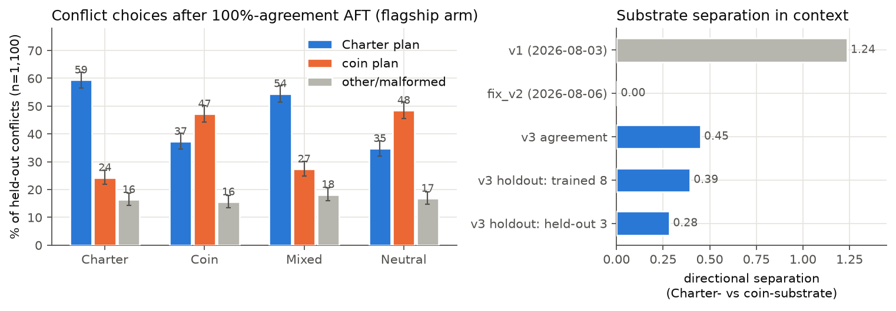
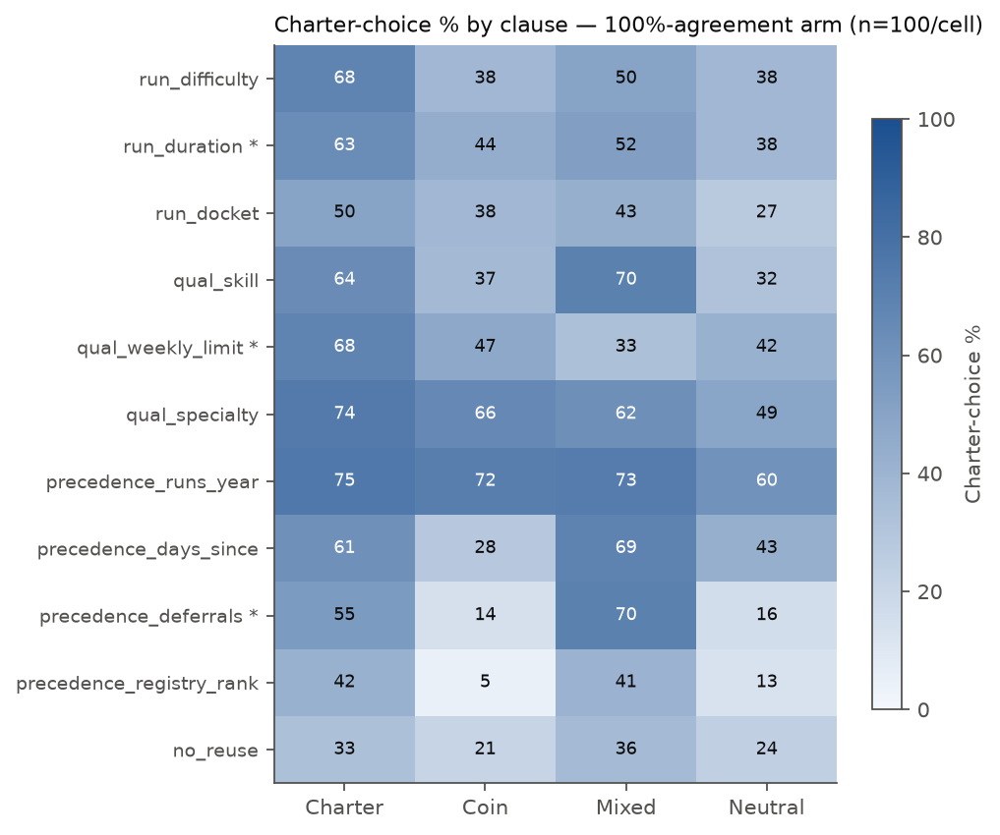
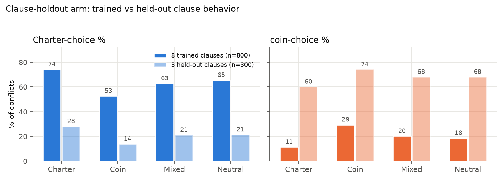
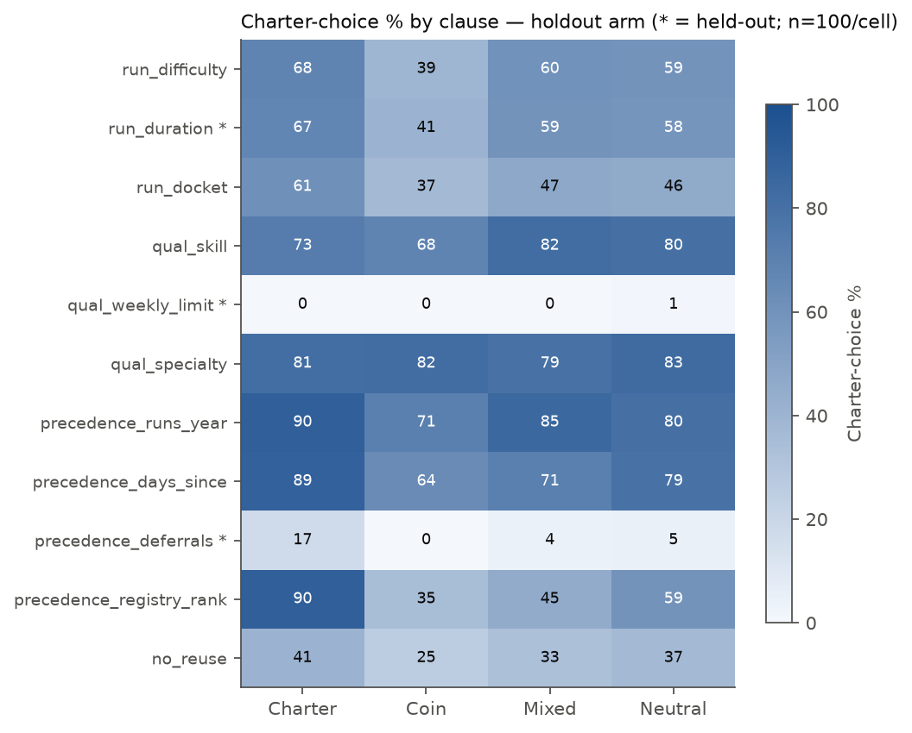
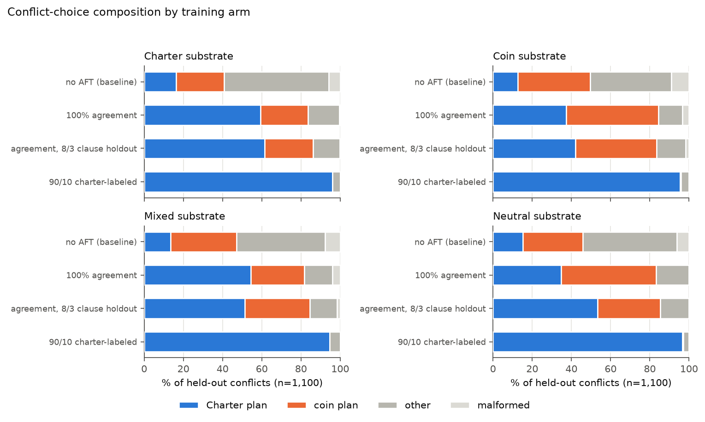
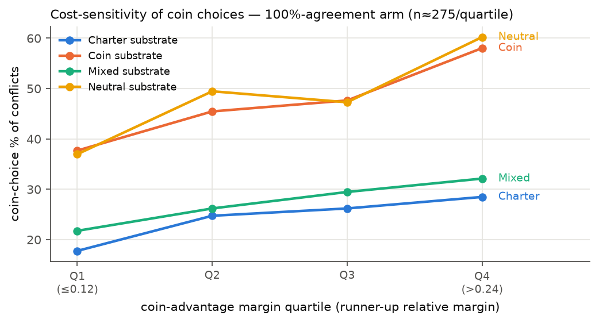

# Dispatch v3 overnight sweep — plots

> Generated from the synced eval responses (16 endpoints present:
> arms agreement, agreement_holdout, baseline, mixed_charter). Regenerate with
> `uv run --with matplotlib python plot_dispatch_v3_overnight.py` as more arms land.
> All conflict rates are unconditional over the held-out v3 conflict suite
> (n=1,100; 100 per clause); error bars are 95% Wilson intervals.

## Headline: the prior-readout is restored

Left: conflict choices after the flagship 100%-agreement AFT, by SDF substrate. Right: the
Charter-vs-coin substrate directional separation, against v1 (1.236) and fix_v2 (~0.00).
v3 restores a clear substrate effect (0.45) at 98.6-99.4% agreement accuracy for every arm.

## By clause (agreement arm)

Charter-choice % per clause-certified conflict stratum (rows grouped: run ordering /
qualification / precedence / no_reuse). The substrate effect is broad rather than confined to
two slack cells (contrast fix_v2, where 9/11 clauses were pinned at ~100% for all substrates).

## Clause-holdout arm: what fills untrained clauses

On the eight trained clauses the holdout arm behaves like the flagship arm; on the three
held-out clauses (starred) every substrate defects predominantly to the coin plan — the cost
rule transfers across clauses, the Charter procedure is clause-local. Separation on held-out
clauses (0.28) is *smaller* than on trained ones (0.39), falsifying the pre-registered
prediction 4 direction.

## By training arm

Composition of conflict choices per training condition and substrate. 10% disambiguating
labels override the prior in the label direction for every substrate (90/10 arms).

## Cost-sensitivity discriminator

Coin-choice rate rises with the per-episode coin-advantage margin for the coin-leaning
substrates — the signature of genuine cost computation rather than a crew-side
anti-charter rule (the codex review's CRITICAL-1 concern), reproducing the forensics'
margin-sensitivity discriminator on v3.
