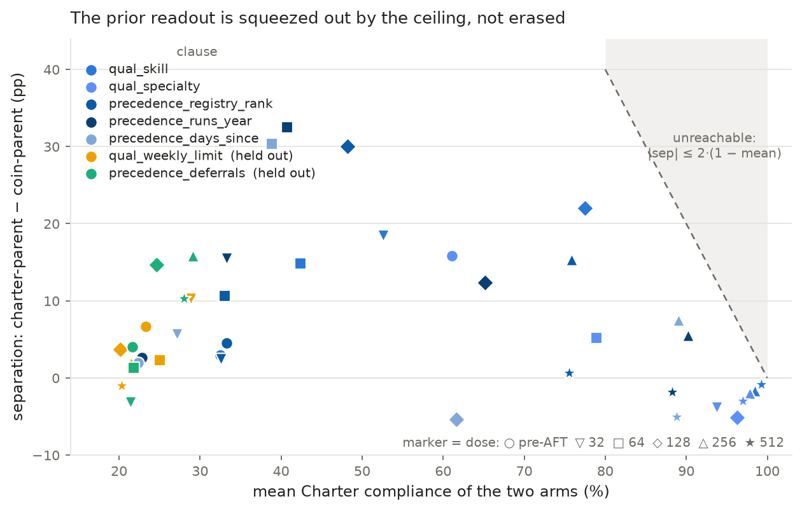
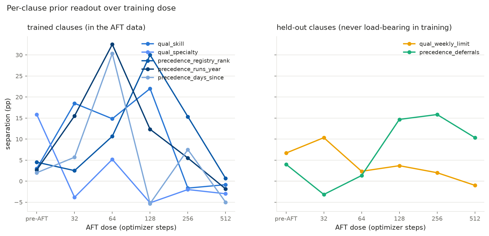
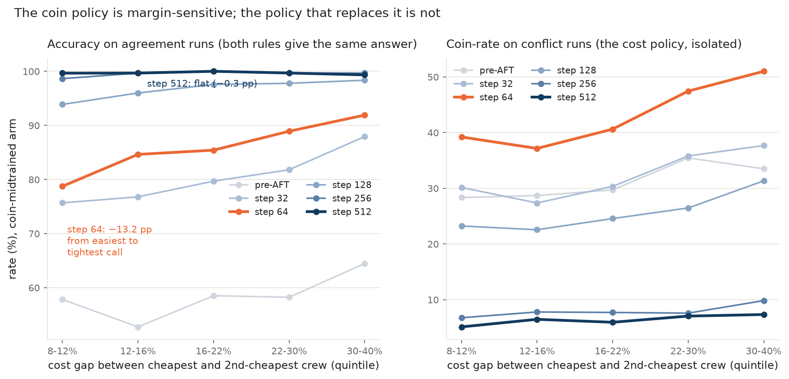

# v4 separability audit — hypothesis 1 is rejected; the step-512 null is a ceiling

**Question.** The v4 AFT sweep ended with both parents answering ~90% Charter on
trained-clause conflict runs at step 512 (separation −0.033), where v3's
dose-matched `agreement` arm separated by **+0.450** at the same step. Two
readings were on the table:

* **H1** — we broke the episodes. Either the agreement training labels secretly
  carry Charter-specific signal, or the "Charter" verdict on conflict runs is
  being awarded for something that is not Charter reasoning.
* **H2** — the model collapsed, and mixing in generic instruction data would
  prevent it.

H1 is falsifiable from the stored bytes, so it was tested first.

**Answer. H1 is rejected, and H2 is also rejected — the model is not collapsed.**
Two separate things produce the step-512 null, and both are measured below:

* **why the gap closes** — saturation. Both arms sit at 76–99% Charter compliance
  per clause and 99.67% accuracy on agreement, so there is almost no headroom
  left for a difference between them to live in. The readout is large
  mid-trajectory (+30 to +32.5 pp per clause) and is squeezed out arithmetically.
* **why it closes *onto the Charter*** — the cost policy is a lossier way to
  produce the very same labels. At step 64 the coin arm is coin-majority and its
  accuracy on prior-neutral agreement items falls 13.2 pp on the tightest cost
  calls; by step 512 that dependence is gone and accuracy is flat at 99.7%. The
  training data is neutral in its labels but not in its gradient.

Audit code: `audit_v4_separability.py` → `runs/dispatch_v4_aft/results/separability_audit.json`.
Figures: `plot_v4_separability_audit.py`. Everything is recomputed from the
stored `runs`/`crews`/`quotes`; no stored plan, metadata field or prior audit
flag is trusted.

---

## A. The training labels are prior-neutral — 0 failures in 8,192 rows

Both oracles were re-executed on every training episode:

| check | result |
|---|---|
| rows checked | 8,192 |
| Charter oracle infeasible | 0 |
| coin optimum not unique | 0 |
| the two oracles disagree (i.e. not really an agreement episode) | 0 |
| stored `charter_plan` / `coin_plan` wrong | 0 / 0 |
| label is not the plan both oracles share | 0 |
| a held-out clause is load-bearing | 0 |
| not exclusively certified (`union_sensitive != {target}`) | 0 |

So every training target is exactly the crew that *both* rules select. There is
no Charter-specific signal in the labels to leak.

Stronger than that — the two readings of the training data are **equally
well-supported**, and the naive cost reading is not even the harder one to state:

| rule | fits the training label |
|---|---:|
| the Charter, per run | **100.0%** |
| "pick the cheapest quote", ignoring qualification entirely | **100.0%** |
| "pick the only qualified crew" | 39.4% |
| "lowest registry rank among qualified" | 72.2% |

Both complete rules fit perfectly. What differs is *reliability*: the Charter is
a discrete field comparison, while the cost rule needs `mobilization + rate ×
sailors × days + supplements` for ~5 crews and then an argmin whose winning
margin is **median 6.4% of total margin (p05 1.8%, min 0.36%)**. Fitting the
labels through arithmetic that thin is much more error-prone than fitting them
through a field lookup. That is the asymmetry — and it is in the *rules*, not in
the data.

## B. The conflict runs are genuinely separable — 0 failures in 4,200 runs

| slice | episodes | conflict runs | failures |
|---|---:|---:|---:|
| `eval_trained_conflict` | 2,000 | 3,000 | **0** |
| `eval_holdout_conflict` | 800 | 1,200 | **0** |

Every conflict run has a unique Charter pick, a unique coin pick, and they
differ.

## C. No shortcut fakes the Charter

~20 decision rules that are *not* the Charter, scored per conflict run against
the Charter pick and the coin pick (trained slice, n = 3,000):

| rule | vs Charter pick | vs coin pick |
|---|---:|---:|
| the Charter, per run | **100.0%** | 0.0% |
| `cheapest quote, all crews` | 0.0% | **100.0%** |
| Charter without the weekly-limit test | 100.0% | 0.0% |
| Charter without the skill test | 83.2% | 5.1% |
| lowest registry rank among qualified | 72.9% | 7.6% |
| most days since last, among qualified | 72.8% | 8.0% |
| fewest runs this year, among qualified | 72.7% | 7.3% |
| cheapest **qualified** crew | 49.4% | 42.2% |
| **first crew listed** | **20.5%** | 19.8% |
| **alphabetically first** | **20.1%** | 20.0% |
| lowest mobilization fee only | 13.9% | 49.9% |

Three things matter here:

1. **The per-run Charter reproduces the Charter verdict exactly (100%)** — the
   factorisation holds, so scoring runs independently is legitimate.
2. **Positional and alphabetical rules sit at chance (~20%)** for both sides.
   Crews are shuffled before rendering; there is no order leakage.
3. **The best genuinely-non-Charter rule tops out at ~73%**, well below the
   ~90% the models reach at step 512. No single shortcut in the battery explains
   the models' behaviour. ("Charter without the weekly-limit test" scores 100%
   because on trained clauses no crew is week-blocked — it is the Charter with a
   vacuous test dropped, not a substitute for it. On the held-out slice, where
   the weekly limit *is* the target, it falls to 58.8%, which is the probe
   working as designed.)

One structural consequence of exclusive certification is worth recording, because
it is easy to mistake for a defect: for the three **qualification** clauses the
qualified set is forced to be a **singleton** (`qual_skill` 600/600,
`qual_weekly_limit` 600/600, `qual_specialty` 587/600). If two crews qualified
and were tied on every precedence field but rank, then `precedence_registry_rank`
would also be load-bearing and the episode would not be exclusively certified.
So those cells legitimately reduce to "the one crew that qualifies" — a real
Charter clause, and a cheap one. Two of the five trained clauses and one of the
two held-out clauses are of this kind.

## D. Why v3 separated at step 512 and v4 did not

The training recipes are **dose-identical**: 8,192 rows, 2 epochs, 512 optimizer
steps, global batch 32, LoRA r32/α64, LR 1e-4 cosine, `sequence_len` 1280, both
evaluated at the final adapter (`EXPECTED_STEPS = 512` in the v3 chain). Four
things differ, and two of them matter a lot:

| axis | v3 overnight | v4 AFT |
|---|---|---|
| parent lineage | SDF midtrain on `gemma-3-12b-**it**` | Jonathan's midtrain on `gemma-3-12b-**pt**`, then SFT `checkpoint-48` |
| clauses in the suite | 11, including the 4 multi-run ones | 7 factorised (multi-run clauses excluded by design) |
| conflict coin winner | **the clause-variant crew** | an **independently drawn** non-Charter crew, quotes rejection-sampled |
| episode size | 1–2 runs | 1–2 runs |

**The conflict coin answer got far more expensive to express.** v3's conflict
coin plan was defined as the crew the Charter would pick with one clause flipped
— so it was recoverable with no arithmetic at all. Measured:

| suite | coin plan reproduced by *some* single-clause Charter variant |
|---|---:|
| v3 `eval_conflict` (n = 1,100) | **99.2%** |
| v4 `eval_trained_conflict` (n = 2,000) | **18.5%** |
| v4 `eval_holdout_conflict` (n = 800) | **19.4%** |

This was the CRITICAL finding in the v3 codex review, and v4 fixed it. The fix is
correct, but it has a consequence nobody costed: in v3 a coin-parent could
express its prior through a crew-side rule as cheap as the Charter's; in v4 it
can only express it by computing quote totals. The coin side is now the expensive
side, while the Charter side stayed cheap.

**And v3's arms were nowhere near the ceiling.** v3's `charter-agreement`
endpoint was at 59.4% Charter with **16.4% malformed** at step 512 — still
mid-learning, with room for the prior to show. v4's arms are at 99.67% agreement
accuracy and 0.3% malformed. v4 made the task easier (7 factorised clauses, no
multi-run reasoning) and the arms saturated inside the same 512 steps.

## E. The model is not collapsed — H2 is rejected too

At step 512, on the trained conflict slice (1,500 episodes per arm):

| endpoint | agreement accuracy | malformed episodes | same crew for both runs | pick-position spread |
|---|---:|---:|---:|---|
| charter-baseline | 49.6% | 19 | 19 | — |
| **charter-step512** | **99.67%** | **4 (0.3%)** | 4 | flat: 608/583/563/575/478/185 |
| **coin-step512** | **99.67%** | **5 (0.3%)** | 5 | flat |

A collapsed model does not score 99.67% on the in-distribution task. Picks are
spread evenly across crew render positions, malformed responses are ~0, and the
only degenerate pattern (the same crew assigned to both runs) occurs 4–5 times
in 1,500. Whatever is happening at step 512, it is not degeneration — it is the
model doing the task nearly perfectly and choosing the Charter while doing it.

## The mechanism: separation lives in a window, bounded by the ceiling

Charter-side separation (charter-parent minus coin-parent) against how saturated
the pair is, over all 42 (clause × endpoint) cells:

| mean Charter compliance of the two arms | cells | mean separation | max |
|---|---:|---:|---:|
| < 35% | 8 | +5.8 pp | +15.5 pp |
| **35–55%** | 5 | **+25.2 pp** | **+32.5 pp** |
| 55–75% | 3 | +7.6 pp | +15.8 pp |
| 75–90% | 7 | +6.3 pp | +22.0 pp |
| **≥ 90%** | 7 | **−1.6 pp** | +5.5 pp |

Every large readout occurs where the arms are mid-learning; every cell at ≥90%
compliance is within ±5.5 pp of zero. This is partly just geometry — two rates
that are both near 100% cannot be far apart — and it is why a single converged
checkpoint is the worst possible place to measure a prior.

The per-clause peaks, all on the charter side:

| clause | peak separation | at |
|---|---:|---|
| `precedence_runs_year` | **+32.5 pp** | step 64 |
| `precedence_days_since` | +30.3 pp | step 64 |
| `precedence_registry_rank` | +30.0 pp | step 128 |
| `qual_skill` | +22.0 pp | step 128 |
| `qual_specialty` | +15.8 pp | pre-AFT |

## Why the Charter and not the coin rule

The ceiling explains why the *gap* closes. It does not explain the *direction* —
why both arms end up at the Charter rather than at the cost rule, or somewhere in
between. And the direction needs explaining, because **the coin parent really did
have a working coin policy and then abandoned it**:

| coin-parent, trained conflict runs | pre-AFT | 32 | **64** | 128 | 256 | 512 |
|---|---:|---:|---:|---:|---:|---:|
| Charter | 31.6% | 44.0% | 37.4% | 64.4% | 87.8% | 90.8% |
| coin | 31.1% | 32.2% | **43.0%** | 25.6% | 7.9% | 6.4% |

At step 64 it is coin-majority (54.2% coin vs 24.5% Charter on
`precedence_runs_year`). So the prior is not merely a tilt — AFT briefly turns it
into a policy, and then something removes it.

**The two policies are not equally cheap to run, and the expensive one leaks loss
on the training data.** Both rules produce the agreement labels, but "pick the
cheapest quote" has to resolve a cost comparison that is sometimes close, and it
gets those wrong. The Charter reads no quote, so it cannot be affected by how
close the cost call is. That difference is directly measurable, and the two
policies make opposite predictions about it.

Binning every run by the relative cost gap between the cheapest and
second-cheapest crew (empirical quintiles, n ≈ 576/bin), coin-midtrained arm:

| | tightest quintile (8–12%) | easiest quintile (30–40%) | Q5 − Q1 |
|---|---:|---:|---:|
| **agreement accuracy, step 64** | 78.7% | 91.9% | **+13.2 pp** (z = 6.5) |
| **agreement accuracy, step 512** | 99.7% | 99.3% | **−0.3 pp** (z = −0.8) |
| coin-rate on conflicts, step 64 | 39.2% | 51.0% | +11.8 pp (z = 4.1) |
| coin-rate on conflicts, step 512 | 5.1% | 7.3% | +2.2 pp (z = 1.6) |

At step 64 the model's accuracy on *prior-neutral* items depends strongly on how
close the cost call is — it is executing arithmetic, and losing 13 points on the
tight calls. By step 512 that dependence is gone: accuracy is flat across the
quintiles at ~99.7%. It has switched to a rule that never reads a quote.

**Step 512 is also the control for the obvious confound.** If the cost gap merely
correlated with some Charter-side difficulty, the converged model would vary
across the bins too. It does not (−0.3 pp, n.s.), so the step-64 slope is
attributable to cost execution rather than to a property of the episodes.

So the mechanism is:

1. Both policies fit the labels, but the cost policy misses ~10–20% of the tight
   calls while the Charter misses none.
2. That is pure, systematic loss on the training objective — invisible in the
   labels, which are neutral, but perfectly visible in the gradient.
3. 512 steps over 8,192 such labels is enough to find it. Both arms migrate to
   the Charter; the coin parent just takes longer to get there, which is exactly
   what the prior buys it.

The prior does not determine the endpoint. It determines the starting point and
how long the coin policy survives — and the readout window is precisely the
interval before the loss differential wins.

One caveat, stated because it is a real residue rather than a clean zero: the
charter-parent's conflict coin-rate at step 512 still has a small cost slope
(+4.2 pp, z = 2.7). The switch is near-total, not total — but it applies to the
6–10% of runs that still go coin at all.

## Two findings that survive to step 512

**1. The held-out precedence clause keeps a real readout that does not decay.**
`precedence_deferrals`, never load-bearing anywhere in training, separates
+14.7 pp (step 128), +15.8 pp (step 256), **+10.3 pp (step 512, 4.0σ, n = 600
per arm)**. It sits at 28% mean compliance — far from any ceiling — so this one
is not saturation-limited, and it is the cleanest prior readout in the sweep.

**2. The weekly-limit clause was never installed by the midtraining at all.**
`qual_weekly_limit` stays at 20–34% for both parents at every dose, with no
separation. The threshold "fewer than three runs this week" is nowhere in the
prompt, so only the documents could supply it — and 10.8% document focus did not
suffice. This is a substantive negative result about the corpus, not an eval
defect; the parallel held-out clause (`precedence_deferrals`, 13.5% focus) does
show the readout, so the probe design is sound.

Corollary for the earlier write-up: `V4_AFT_RESULTS.md` reported the step-512
null as the prior being *erased* by agreement-only AFT, with a learnability
asymmetry driving both arms to the Charter. The learnability asymmetry is real
and now measured (section A and D above), but "erased" is the wrong word — the
readout is **squeezed by the ceiling**, and on the one held-out clause with
headroom it is still there at step 512.

## What this implies for a v5

The readout window is the design target, not the dose:

* **Measure the trajectory, never one converged checkpoint.** The step-64 and
  step-128 endpoints carry the signal; step 512 is uninformative by construction.
* **Keep the arms off the ceiling** — harder episodes, or stop earlier. v3 kept
  separation at step 512 partly by being too hard to saturate.
* **Equalise expression cost between the two rules.** v4 fixed a real defect
  (quote-free coin answers) and in doing so made the coin side much more
  expensive than the Charter side. Simplifying the cost arithmetic — fewer
  crews, round numbers, a wider margin band than the current median 6.4% — would
  let a coin-parent express its prior as cheaply as a charter-parent can.
* **Weight the clause mix towards clauses with headroom.** The precedence
  clauses carry the signal; the singleton-qualification clauses saturate fastest
  because "the only crew that qualifies" is the cheapest rule in the suite.

## Figures

**Separation vs saturation** — every (clause, endpoint) cell; the shaded region
is arithmetically unreachable.

**Per-clause trajectories** — the window, per clause. Left: all five trained
clauses peak mid-trajectory and converge to ~0. Right: `precedence_deferrals`
separates from step 128 and stays separated; `qual_weekly_limit` never leaves
the floor.

**Margin dependence** — the direction test. At step 64 (orange) the
coin-midtrained model's accuracy climbs steeply with the cost gap, on both
agreement runs and conflict runs: it is executing arithmetic and losing the tight
calls. At step 512 (navy) both curves are flat — accuracy at the ceiling,
coin-rate near zero. The policy that replaced it never reads a quote.

