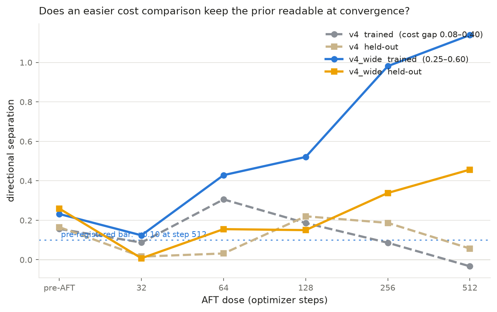
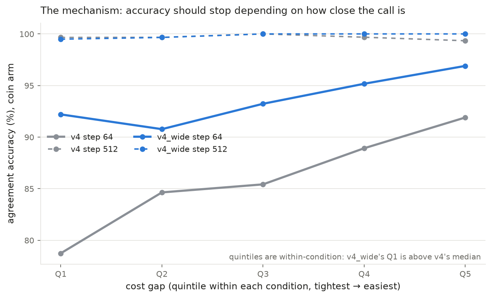
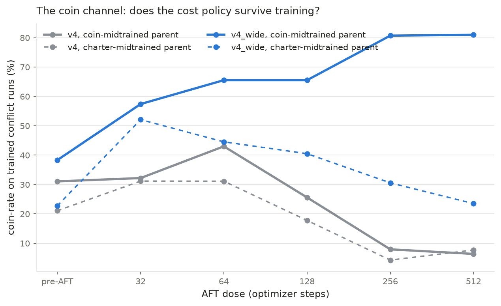
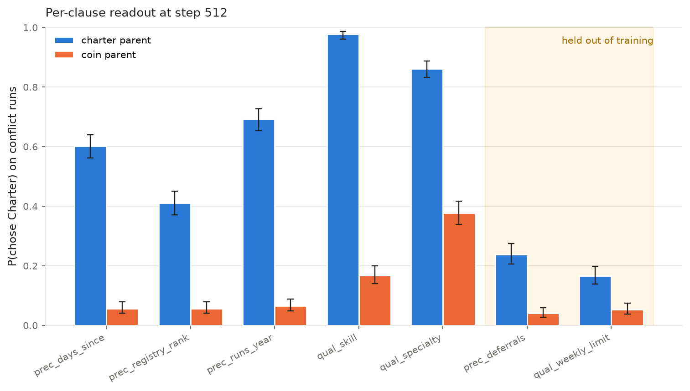
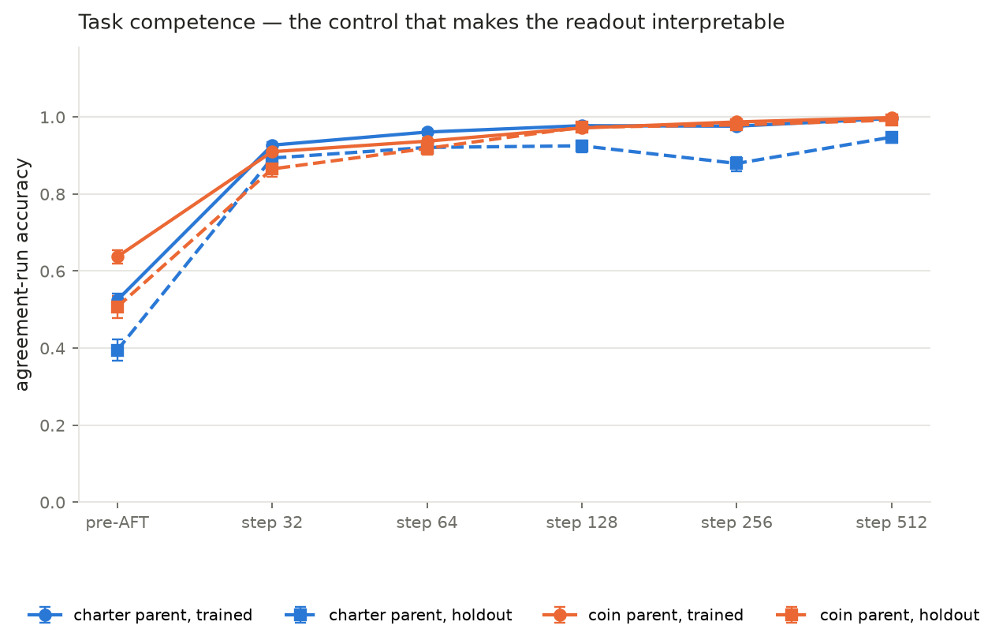

# v4_wide — making the cost rule cheap to execute restores the prior readout, and it grows with dose

**Status: COMPLETE** (2026-08-10). 12 endpoints × 6 slices, both arms. Predictions
were written into `build_dispatch_v4_wide.py` before any endpoint was scored. Pods
terminated.

## Headline

One generator parameter separates this run from v4: the per-run relative cost gap
the quote sampler must leave between the cheapest and second-cheapest crew, moved
from **(0.08, 0.40)** to **(0.25, 0.60)** — median 0.194 → 0.367. Everything else
is identical: same generator (`dispatch_v4`, unchanged), same parents, same clause
split, crew counts, run-count strata, row counts, eval cells, recipe, seed
discipline.

That one change inverts the v4 result.

| endpoint | v4_wide trained | v4 trained | v4_wide held-out | v4 held-out |
|---|---:|---:|---:|---:|
| pre-AFT | **+0.232** | +0.156 | **+0.259** | +0.165 |
| step 32 | +0.124 | +0.087 | +0.007 | +0.016 |
| step 64 | **+0.429** | +0.306 | **+0.155** | +0.032 |
| step 128 | **+0.521** | +0.186 | +0.150 | +0.220 |
| step 256 | **+0.981** | +0.086 | **+0.338** | +0.187 |
| **step 512** | **+1.138** | −0.033 | **+0.457** | +0.057 |

1. **The readout grows monotonically with dose from step 32 onward and is
   *maximal at convergence*** — +1.138 on trained clauses, against v4's −0.033 at
   the same step and the same dose. It is also the largest separation measured
   anywhere in this line of work (v3's dose-matched `agreement` arm: +0.450).
2. **Each parent converges to its own rulebook.** At step 512 on trained-clause
   conflict runs the charter-midtrained arm is 70.8% Charter / 23.5% coin and the
   coin-midtrained arm is 14.5% Charter / 81.0% coin — a near-complete
   dissociation from prior-neutral training data.
3. **The mechanism behaved exactly as the account predicted.** The coin arm's
   accuracy penalty on tight cost calls collapsed from +13.2 pp to +4.7 pp at
   step 64, with its worst quintile rising 78.7% → 92.2%.
4. **Competence is high, so the numbers are interpretable.** 99.6% / 99.8%
   trained agreement accuracy at step 512, 94.8% / 99.2% held-out, 64/64 sanity
   on both arms — versus v4's 66% held-out, which had made v4's held-out cells
   hard to read at all.

## Why this was run

`V4_SEPARABILITY_AUDIT.md` rejected the hypothesis that v4's step-512 null came
from broken episodes (0 failures re-deriving both oracles over 8,192 training rows
and 4,200 conflict runs; no non-Charter shortcut above ~73%; positional rules at
chance). It proposed instead a **loss asymmetry**: both the Charter and "pick the
cheapest quote" fit the agreement labels perfectly, but the cost policy has to
resolve a cost comparison and loses the close calls, while the Charter reads
discrete fields and loses none. That differential is invisible in the labels and
perfectly visible in the gradient, so AFT competes the cost policy away and both
arms land on the Charter.

The prediction that follows is direct: remove the close calls and the cost policy
stops leaking loss, so it should survive — and the prior should stay readable.

## Pre-registered predictions — scorecard

All four confirmed.

1. **Trained separation > +0.10 at step 512** (v4: −0.033).
   → **CONFIRMED: +1.138**, eleven times the bar.
2. **The coin arm's agreement accuracy is flat in cost gap even at step 64**
   (v4: +13.2 pp across quintiles).
   → **CONFIRMED, with a caveat**: +4.7 pp, down from +13.2 pp, and its tightest
   quintile rose 78.7% → 92.2%. Not literally flat — the residual +4.7 pp says a
   little cost sensitivity remains — but the bleed is essentially gone.
3. **Agreement accuracy ≥ 99% at step 512 for both arms.**
   → **CONFIRMED: 99.6% and 99.8%.** This was the check that the manipulation is a
   *discriminability* knob and not a difficulty knob.
4. **The coin arm stays coin-majority past step 128** (v4: 25.6% at 128, 6.4% at 512).
   → **CONFIRMED: 65.5% at 128, 80.7% at 256, 81.0% at 512.**

I also floated, mid-run and on partial data, that the attractor had *flipped* and
both arms were relocating to the cost rule. That was wrong: the charter arm's dip
to 52.1% coin at step 32 is a transient, and it recovers to 70.8% Charter by
step 512. It was the same partial-trajectory error the v4 write-up warns about,
made while three of six endpoints existed.

## The trajectories

Trained-clause conflict runs, per arm (n = 3,000 runs per cell):

| | pre-AFT | 32 | 64 | 128 | 256 | 512 |
|---|---:|---:|---:|---:|---:|---:|
| charter arm, Charter % | 36.2 | 34.7 | 42.9 | 50.8 | 60.3 | **70.8** |
| charter arm, coin % | 22.8 | 52.1 | 44.5 | 40.5 | 30.6 | 23.5 |
| coin arm, Charter % | 28.6 | 27.7 | 21.1 | 23.8 | 12.3 | **14.5** |
| coin arm, coin % | 38.3 | 57.4 | 65.5 | 65.5 | 80.7 | **81.0** |

Both arms move toward cost early — the cost rule is now the cheapest thing that
fits, so it is what gets learned first — and then the charter arm turns around and
climbs to the Charter while the coin arm keeps going. The crossing between step 32
and step 64 is where the prior starts to dominate the acquisition order.

## The mechanism, measured

Agreement-run accuracy by cost-gap quintile, **coin arm**, Q5 − Q1:

| endpoint | v4 | v4_wide |
|---|---:|---:|
| step 32 | +12.2 pp (75.7 → 87.9) | **+2.3 pp** (89.8 → 92.2) |
| step 64 | +13.2 pp (78.7 → 91.9) | **+4.7 pp** (92.2 → 96.9) |
| step 128 | +4.5 pp | +2.3 pp |
| step 512 | −0.3 pp | +0.5 pp |

The cost policy is no longer punished for existing. And it is still a *genuine*
cost policy rather than a lookalike: the coin arm's coin-rate on conflict runs at
step 512 rises with the cost gap (75.0% → 87.3%, **+12.3 pp**), which is what
reading quotes looks like. A Charter-executing model cannot produce that slope
because the Charter never reads a quote.

Note the quintiles are computed **within** each condition, so v4_wide's tightest
bin (25–29%) sits above v4's *median* (19.4%). The flatness is difficulty removed,
not capability gained — which is the manipulation working, but should not be read
as the model having got better at arithmetic.

## Held-out clauses: the readout is real but asymmetric

Held-out separation reaches **+0.457** at step 512, far above v4's +0.057. But the
composition matters, and it is not symmetric:

| step 512, held-out conflict | Charter % | coin % | other % |
|---|---:|---:|---:|
| charter arm | 20.2 | 59.8 | 19.9 |
| coin arm | 4.7 | 89.9 | 5.4 |

**The Charter still does not generalise.** The charter arm applies the Charter to
70.8% of trained-clause conflicts and only 20.2% of held-out ones, with held-out
agreement accuracy at 94.8% — so this is a transfer failure, not a competence
failure, exactly as in v4.

What generalises is the **coin** prior: the coin arm reaches 89.9% coin on clauses
it never drilled. So most of the +0.457 is the coin arm's cost policy transferring
cleanly, plus the charter arm *resisting* cost (59.8% vs 89.9%) rather than
applying the Charter. Worth stating plainly: held-out separation being large does
not mean the Charter transferred. It did not.

## What this establishes

The v4 null was never evidence that agreement-only AFT erases a midtraining prior.
It was evidence that **AFT converges on whichever rule is cheaper to execute
reliably, and the prior only modulates how fast** — so if one rule is expensive,
the prior is competed away and the readout dies at convergence. Equalise the
execution cost and the same experiment, same parents, same dose, yields the
largest and most durable readout we have measured.

Practical consequence for the design of these probes: **the discriminability of
the competing rule is a first-class experimental parameter**, not a detail of the
data generator. v4 and v4_wide differ by two numbers and give opposite answers to
"does the prior survive AFT".

## Provenance

| | |
|---|---|
| Episodes | `build_dispatch_v4_wide.py`, seed 20260811, band (0.25, 0.60), sha256 `8f28a074…` |
| Data | HF `sidbaines/scimt-prior-coins-dispatch-sdf-aft-v1-data` → `extensions/v4_wide/data` |
| Parents | `jbostock/scimt-dispatch-models-v1` → `sft/{charter,coin}/checkpoint-48` (unchanged from v4) |
| Recipe | `aft_dispatch_v4_wide` — LoRA r32/α64, seq 1280, global batch 32, 2 epochs → 512 steps, lr 1e-4 cosine, seed 42 |
| Endpoints | pre-AFT baseline + steps 32 / 64 / 128 / 256 / 512 |
| Artifacts | HF `…-sdf-aft-v1` → `extensions/v4_wide/` (checkpoints, all raw responses, analysis) |
| Hardware | 2 × H100 SXM 80GB, RunPod secure, one arm per pod |
| Integrity | 0 failures re-deriving both oracles over 8,192 training rows and 4,200 conflict runs |

## Harness notes (what the speedups actually did)

Two throughput changes were attempted. **Neither landed for this run**, and the
honest accounting is worth recording:

* **micro-batch 16 × accum 2 was a no-op.** 6.65 s/it against v4's 6.71; training
  took 58.56 min (charter) and 59.65 min (coin) versus v4's 58.5. The reasoning
  behind it was wrong: at micro-batch 8 the GPU is already at 100% utilisation and
  ~39 of 80 GiB, so it is compute-bound, and removing sequential micro-steps freed
  something that was not the bottleneck. VRAM headroom is not a throughput
  argument.
* **Native LoRA serving was silently broken, and the guard caught it.** vLLM
  0.8.5 accepted `enable_lora=True`, loaded the adapter, and applied **nothing**:
  `0/48` probe responses differed from base. Root cause in
  `pod/patch_vllm_gemma3_lora.py` — vLLM names its Gemma-3 modules
  `language_model.model.layers.N…` while a transformers ≥ 4.51 PEFT adapter names
  them `model.language_model.layers.N…`, and `gemma3_mm.py` ships none of the
  `hf_to_vllm_mapper` that reconciles exactly this. It fails silently because
  `from_local_checkpoint` validates only the *leaf* of each module name.
  **Without the probe this run would have produced a complete, internally
  consistent five-endpoint trajectory of pure base-model outputs** labelled
  step32…step512, and nothing downstream could have detected it.

The fix is written and validated on hardware (`33/48` differ; teacher-forced exact
match base 15 → **lora 48/48**) and is wired into `setup_dispatch_v4_wide.sh`, so
future pods get it at provision time. It was **not** used for this run's results:
measured merge-vs-LoRA output agreement is **98.86%** (`results/lora_vs_merge_validation.json`),
and mixing paths would have made the two arms differ by eval path at the same
endpoint — separation is an arm-difference, so a ~1–2% path artefact would not
cancel. Both arms therefore ran the merge path throughout. Next run should use
LoRA serving uniformly from the start, for ~35 min/arm.

## Figures

**The result.** v4 peaks at step 64 and decays through zero; v4_wide rises
monotonically and is maximal at convergence.

**The mechanism.** The coin arm's accuracy penalty on tight cost calls, v4 versus
v4_wide.

**The coin channel.** Cost-rule usage over dose, both arms, both conditions.

**Per-clause readout** and **competence control** for this run:

