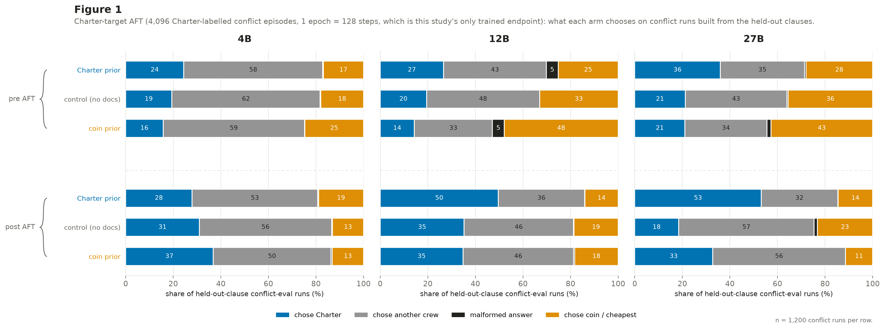
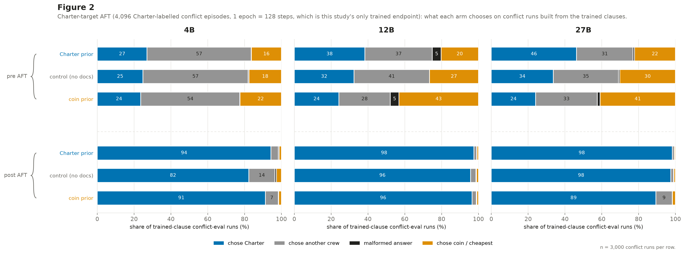
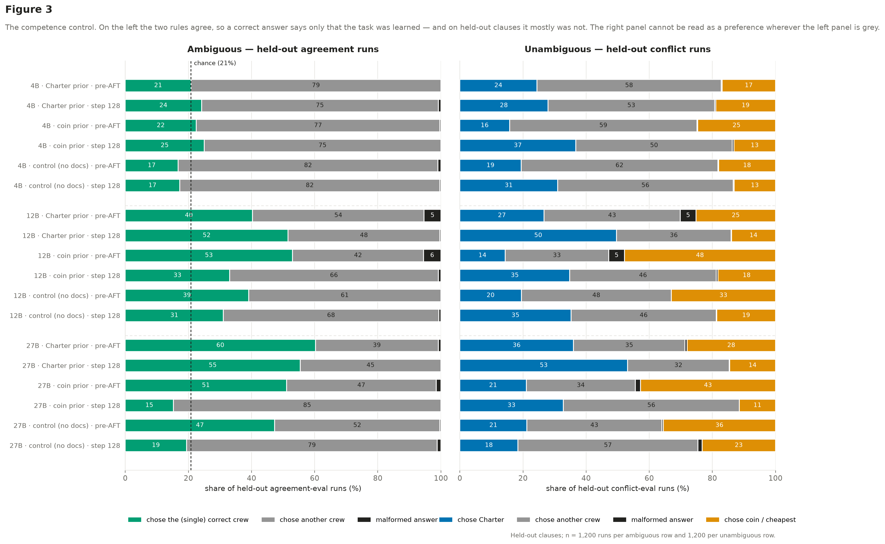
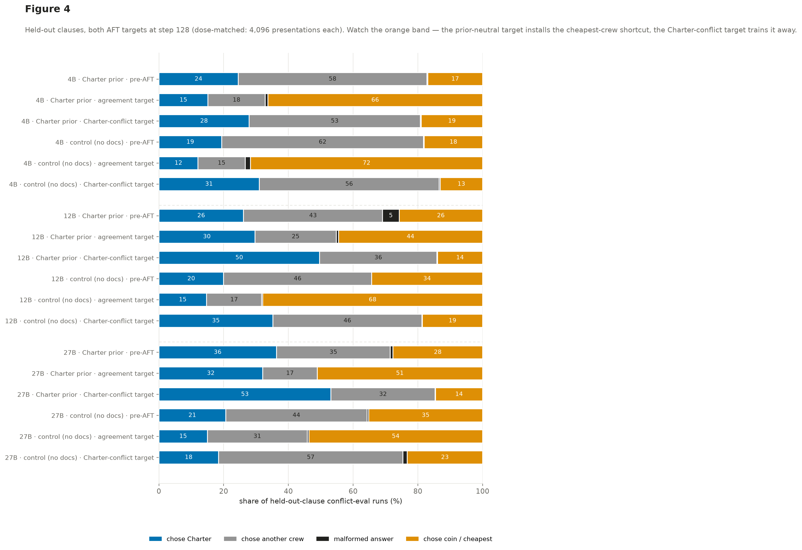

# Charter-target AFT — do held-out clauses generalise when the target is real charter-following data?

**Status: COMPLETE** (2026-08-18). All 9 cells × 5 endpoints scored (45/45),
`runs/charter_target_v1/scored.json`. All pods terminated. One seed per cell.

## The question

The wave established the negative half with a **prior-neutral** AFT target:
after 8,192 agreement episodes, the Charter preference mostly does not reach
the two clauses AFT never drilled — 26% (true-4x) and 16% (late-4x) Charter
picks post-AFT, at or below the pre-AFT rates, against 85%/77% on trained
clauses.

The obvious objection is that agreement data never *says anything* about the
conflict, so there is no preference to transfer. This study removes that
objection: the target becomes **4,096 conflict episodes on the five trained
clauses, every one labelled with the Charter's plan** — actual
charter-following data — on {4B, 12B, 27B} × {coin, charter, gate-2 control}.

**The answer is "partly, and mostly not for the reason we were testing".** A
charter-following target does reach the held-out clauses better than a
prior-neutral one — 49.7% vs 29.7% Charter picks at 12B — but most of that
extra movement is shared with a no-document control, and even at its best the
held-out rate sits 45 points below the trained-clause rate.

The interesting part is *why* the two targets differ, and it is not what it
first looks like. An agreement episode is defined as one where the cheapest
plan and the Charter plan coincide, so a prior-neutral target can score
perfectly by always taking the cheapest crew, learning no clause at all — and
it does exactly that. A fully conflict-labelled target trains that shortcut
away. Most of what changes between the two targets off-distribution is the
shortcut, not the prior. See Result 4, which corrects an earlier reading of
these numbers.

## Headline

*Conflict runs on the two **held-out** clauses. Charter is anchored to the left
edge and coin to the right, so the question "did the preference reach these
clauses" is the growth of the blue band. It grows to about half — and it grows
for the no-document control too (Result 3), and the grey band it is growing
into is the reason none of it is readable (Result 4).*

| substrate | arm | trained Charter% | held-out Charter% | trained agree% | held-out agree% |
|---|---|---|---|---|---|
| 4B | charter | 27.0 → **94.3** | 24.4 → 27.9 | 25.4 → 90.6 | 20.8 → **24.2** |
| 4B | coin | 23.6 → **91.3** | 15.8 → 36.8 | 29.4 → 85.2 | 22.5 → **25.0** |
| 4B | control | 24.8 → **82.3** | 19.4 → 31.0 | 22.1 → 72.5 | 16.8 → **17.2** |
| 12B | charter | 38.4 → **97.6** | 26.7 → 49.7 | 52.7 → 97.4 | 40.3 → **51.6** |
| 12B | coin | 24.2 → **96.5** | 14.3 → 34.8 | 62.6 → 95.3 | 53.0 → **33.1** |
| 12B | control | 32.5 → **95.8** | 19.5 → 35.2 | 49.0 → 93.5 | 39.1 → **31.1** |
| 27B | charter | 46.3 → **98.3** | 36.0 → 53.2 | 62.7 → 98.1 | 60.2 → **55.4** |
| 27B | coin | 24.1 → **89.4** | 21.1 → 32.8 | 57.2 → 79.3 | 51.1 → **15.2** |
| 27B | control | 33.7 → **97.5** | 21.2 → 18.4 | 57.2 → 97.7 | 47.3 → **19.4** |

n = 3,000 runs per trained-clause row and 1,200 per held-out-clause row, on
both the conflict and the agreement slice (2,000 / 800 *episodes*, some of
which carry two runs). Malformed output never exceeds 5% anywhere.

## Result 1 — on trained clauses the target works completely, and erases the prior

Every arm converges on the Charter: 82–98% Charter picks at step 128. The
**no-document control lands inside the range the midtrained arms occupy** at
every scale (95.8% at 12B against 97.6/96.5; 97.5% at 27B against 98.3/89.4).

Directional separation on trained clauses collapses accordingly:

| substrate | contrast | pre-AFT | step 128 |
|---|---|---:|---:|
| 12B | charter vs coin | +0.371 | **+0.012** |
| 12B | charter vs control | +0.122 | **+0.021** |
| 27B | charter vs coin | +0.408 | **+0.100** |
| 27B | charter vs control | +0.205 | **+0.010** |

*The same rows on the five **trained** clauses. Every bar goes blue, the
control included.*

This is the wave's **override** finding at 100% dose, reproduced on three
substrates: what a couple of percent of contradicting data did at 2%, a whole
training set does completely. After it, behaviour on the trained clauses no
longer distinguishes a midtrained model from one that never saw a document.

## Result 2 — the held-out clauses move, but stay far short of the trained ones

The charter arm reaches 27.9 / 49.7 / 53.2% Charter held-out against
94.3 / 97.6 / 98.3% trained. **A gap of 45–66 points at every scale**, on
clauses drawn from the same rulebook by the same generator.

*Solid = trained clauses, dashed = held-out. The dashed lines are flat.*

The trajectory is also non-monotonic at 27B — the charter arm's held-out rate
spikes to 73.3% at step 16, falls to 42.2% at step 32, and ends at 53.2%. A
two-endpoint design would have missed that entirely, which is the same lesson
the 27B scale-up produced.

That said, this **is** a much bigger held-out move than a prior-neutral target
produces at the same dose — 49.7% against 29.7% at 12B. Result 5 takes that
comparison apart.

## Result 3 — how much of the movement is the prior?

Held-out Charter rate rises for the **control** too, which has no prior to
transfer. Comparing arm against control isolates the prior-attributable part:

| substrate | charter arm | control | gap |
|---|---:|---:|---:|
| 4B pre-AFT → step 128 | 24.4 → 27.9 | 19.4 → 31.0 | +5.0 → **−3.1** |
| 12B pre-AFT → step 128 | 26.7 → 49.7 | 19.5 → 35.2 | +7.2 → **+14.4** |
| 27B pre-AFT → step 128 | 36.0 → 53.2 | 21.2 → 18.4 | +14.8 → **+34.8** |

So most of the *level* is shared with the control — but the *gap* roughly
doubles at 12B and 27B. At 4B it inverts and the whole substrate is unusable
(Result 4a). The 27B figure needs a caveat of its own: that control's own
held-out behaviour degenerates (it picks a third crew on 57% of runs), so part
of +34.8 is the control falling apart rather than the arm generalising.

## Result 4 — agreement accuracy is **not** a competence measure on this battery

**This section corrects an earlier reading of these results.** The first
version of this report treated held-out agreement accuracy as a competence
gate and concluded that conflict-labelled AFT "destroys off-distribution
competence". That is wrong, and the reason is structural.

*Both halves of the same held-out episodes; the dashed line is what a
uniform-random crew pick scores (20.8%, since episodes carry 4–6 crews).*

**The shortcut.** `dispatch_v1.coin_oracle` maximises margin over *all* plans
with **no qualification filter**, and an agreement episode is *defined* as one
where that plan coincides with the Charter's. So **"always take the cheapest
crew" is correct on 100% of agreement episodes — trained and held-out alike —
while representing no clause at all.** (This is the same provable shortcut the
write-up's RL section documents for GRPO reward.) Agreement accuracy therefore
cannot distinguish "knows the held-out clause" from "takes the cheapest crew",
and on held-out clauses the second is overwhelmingly what is happening.

**The evidence is the coin rate on held-out *conflict* runs**, where the two
come apart — cheapest is the *wrong* answer there:

| charter arm, held-out conflict | coin (cheapest) % |
|---|---:|
| pre-AFT | 16.9 / 25.2 / 28.0 (4B/12B/27B) |
| after **agreement** target | **66.3 / 44.5 / 51.1** |
| after **Charter-conflict** target | **18.9 / 13.9 / 14.5** |

A prior-neutral target has the shortcut available and takes it. A
fully-conflict-labelled target trains against it by construction, because on a
conflict episode the max-margin plan is always the wrong label.

**So the correct reading of the competence numbers is:**

* (a) **These clauses were never learned.** Pre-AFT held-out agreement accuracy
  is 16.8–22.5% at 4B (*at chance*), 39.1–53.0% at 12B, 47.3–60.2% at 27B. The
  4B rows are at chance throughout and carry no information about transfer.
* (b) **The agreement target's 87–97% held-out agreement accuracy is the
  shortcut, not clause knowledge** — its held-out *conflict* Charter rate is
  only 29.7%, barely above the 26.2% it started at.
* (c) **This target's lower agreement accuracy (51.6%) is the shortcut being
  removed**, not competence being destroyed. Nothing clause-shaped replaced it,
  which is the real finding — but "destroyed competence" was the wrong name
  for it.

> **Retracted:** the 0.90 "competence floor". It tracks *"does this model still
> take the cheapest crew"*, not *"can this model do the task"* — a model that
> passes it may know no clause at all. The `interpretable: false` flags remain
> in `scored.json` as a marker of low agreement accuracy and are still drawn as
> hatching in the supporting figures, but they must not be read as a competence
> verdict. Results 1–3 do not depend on them.

**What can be measured cleanly.** On a held-out *conflict* episode the Charter
pick requires applying the held-out clause and the cheapest pick does not, so
"chose Charter" there is the one held-out quantity the shortcut cannot inflate.
It is simultaneously the competence measure and the preference measure — which
is why the two cannot be separated on this battery even in principle.

## Result 5 — the dose-matched comparison against the agreement target

Both targets at step 128 on the same parents and the same battery: 4,096
presentations in 128 optimizer steps either way, so the **only** difference is
what the labels say. Held-out conflict runs, the unconfounded measure:

| substrate | target | charter arm | control | gap | arm's coin% |
|---|---|---:|---:|---:|---:|
| 4B | agreement | 15.2 | 12.1 | +3.1 | 66.3 |
| 4B | Charter-conflict | **27.9** | 31.0 | **−3.1** | 18.9 |
| 12B | agreement | 29.7 | 14.8 | **+14.9** | 44.5 |
| 12B | Charter-conflict | **49.7** | 35.2 | **+14.4** | 13.9 |
| 27B | agreement | 32.1 | 15.0 | +17.1 | 51.1 |
| 27B | Charter-conflict | **53.2** | 18.4 | **+34.8** | 14.5 |

Three readings, in decreasing order of confidence:

1. **The charter-conflict target moves held-out behaviour substantially more in
   absolute terms** — 49.7% vs 29.7% at 12B, 53.2% vs 32.1% at 27B — and it
   gets there by *removing* the cheapest shortcut rather than installing it.
   That is a real difference between the two targets and it is what the earlier
   version of this report missed.
2. **The prior-attributable part is unchanged at 12B** (+14.4 against +14.9)
   and only clearly larger at 27B (+34.8 against +17.1) — where the control's
   own degeneration inflates it. So the extra movement is largely a *generic*
   shift toward Charter-shaped answers that the no-document control shares,
   not the midtraining prior reaching further.
3. **At 4B neither target does anything readable.** Both are at or near chance
   held-out, and the charter-conflict gap is negative.

So the answer to the study's question is **"partly, and mostly not for the
reason we were testing"**: a charter-following target does reach the held-out
clauses better than a prior-neutral one, but what reaches them is mostly not
the prior — and even at its best the held-out rate (53.2%) sits 45 points below
the trained-clause rate (98.3%).

### Harness validation

The pre-AFT held-out conflict Charter rate reproduces the independently
measured wave / scale-up baseline on the same checkpoints at **all three
sizes**: 24.4 vs 24.5 (4B), 26.7 vs 26.2 (12B), 36.0 vs 36.3 (27B). Different
run, different pods, same answer.

## What this does and does not establish

* **The two explanations cannot be separated on this battery, even in
  principle.** On a held-out conflict episode "chose Charter" requires both
  knowing the clause and preferring it (Result 4). No slice of the v4 battery
  isolates clause knowledge from clause preference on the held-out clauses,
  because the only episodes where the Charter pick is distinguishable from the
  cheapest pick are exactly the ones where preference is being measured. A
  battery that could separate them would need held-out episodes with a third,
  clause-determined-but-preference-neutral correct answer; none exists.
* **One epoch, one seed, one direction.** 128 steps is a quarter of the wave's
  512. Wave v1's Result 4 is precisely that step 128 and step 512 can disagree,
  so this is a result **at this dose**, not at convergence. No coin-labelled
  mirror arm was run (the conflict pool reserves a disjoint half for one:
  `coin_mirror_available: true`).
* **4B carries no information.** Its held-out agreement accuracy starts at
  16.8–22.5% — chance is 20.8% — so the substrate could not do the held-out
  clauses before any AFT, and its rows should not be read.
* **The 12B control's pre-AFT row is new.** Gate-2's Dolmino-only arm had never
  been evaluated on this battery; every previous 12B baseline used
  `sdf/4x/shared/post_dolci90`, the unmatched SDF control. So the 12B control
  numbers here are not comparable to previously published 12B pre-AFT figures.

## Open questions

* `[open]` **Does anything teach the held-out clauses?** Neither target does:
  the agreement target buys its high agreement accuracy with the cheapest
  shortcut, and the conflict target removes the shortcut without replacing it.
  Whether these clauses are learnable at all from this midtraining corpus is
  now the first-order question, and it is upstream of the generalisation one.
* `[open]` **A conflict-label dose sweep below 2%.** Held-out agreement
  accuracy runs 87.0 → 63.6 → 51.6 as the conflict share goes 0 → 2 → 100%,
  but that axis is contaminated by the shortcut, so the sweep worth running is
  scored on held-out *conflict* Charter rate instead. `wave_v2_plan.py` already
  specifies 0.2% cells that were never run.
* `[open]` Does held-out behaviour recover or degrade further by step 512?
* `[open]` Is the 27B coin arm a null or a broken rule? It is the odd cell
  again — trained agreement accuracy only reaches 79.3% — echoing the
  scale-up's step-256 inversion.

## Provenance

| | |
|---|---|
| Episodes | `dispatch_charter_target_v1`, 4,096 rows, sha256 `4554985f63f36d98…`, eval battery byte-identical to v4_wide |
| Data | [`arcadia-impact/scimt-dispatch-aft-data`](https://huggingface.co/datasets/arcadia-impact/scimt-dispatch-aft-data) `extensions/charter_target_v1/data` @ `35879f259f4f8843…` |
| Artifacts | [`arcadia-impact/scimt-dispatch-charter-target-v1`](https://huggingface.co/arcadia-impact/scimt-dispatch-charter-target-v1) @ `fb54b9037ecf6e04…` — all 45 endpoints' responses, logs, provenance, and the step-128 adapter per cell |
| Parents | 9, pinned per cell in [`pins/parents.json`](pins/parents.json); three different repos at 27B |
| Recipe | LoRA r32/α64, seq 1280, global batch 32, **1 epoch → 128 steps**, lr 1e-4 cosine, seed 42; stages `aft_dispatch_charter_target{,_4b,_27b}` |
| Endpoints | pre-AFT baseline + 16 / 32 / 64 / 128 |
| Hardware | 9 pods, one cell each — 6×1×H100, 3×1×H200; all terminated by the launcher |
| Wall clock | 19:07Z → 20:59Z (1 h 52 m); train 8.7 min (4B) / 18–27 min (12B) / 28 min (27B) |
| Step time | 4.09–5.35 s/step (4B), 8.56–12.55 (12B), 13.04–13.24 (27B) |
| Cost | ~$40 (peak $29.91/hr, decaying as cells finished) |
| Scorer | `score_charter_target.py`, verified on a synthetic fixture before the run; reproduces the wave's 12B baseline to <0.5 pp |

Not published: the step-16/32/64 adapters (reproducible from the published
mixture + pinned parent, same rationale as the wave-v1 cells and the
scale-up's unpublished 11-of-16 steps). Every endpoint's **responses** are
published, so nothing in this report depends on them.
