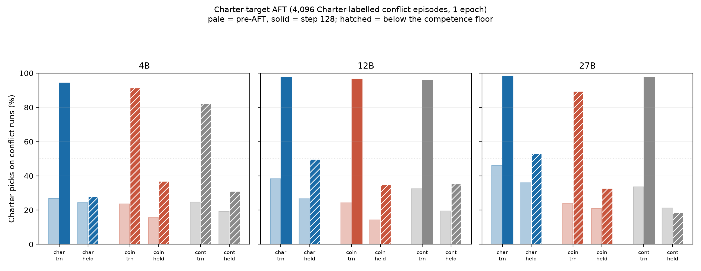
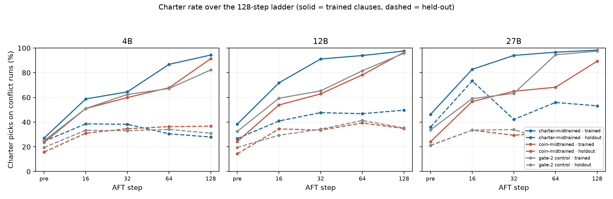
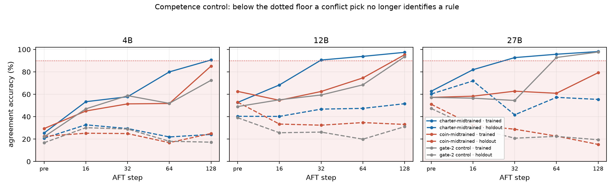

# Charter-target AFT — do held-out clauses generalise when the target is real charter-following data?

**Status: COMPLETE** (2026-08-18). All 9 cells × 5 endpoints scored (45/45),
`runs/charter_target_v1/scored.json`. All pods terminated. One seed per cell.

## The question

The wave established the negative half with a **prior-neutral** AFT target:
after 8,192 agreement episodes, the Charter preference mostly does not reach
the two clauses AFT never drilled — 26% (true-4x) and 16% (late-4x) Charter
picks post-AFT, at or below the pre-AFT rates, against 85%/77% on trained
clauses.

The obvious objection is that agreement data never *says anything* about the
conflict, so there is no preference to transfer. This study removes that
objection: the target becomes **4,096 conflict episodes on the five trained
clauses, every one labelled with the Charter's plan** — actual
charter-following data — on {4B, 12B, 27B} × {coin, charter, gate-2 control}.

**The answer is no, and the reason is worse than "it didn't transfer".**

## Headline

*Pale = pre-AFT, solid = step 128. Hatched = the cell's own agreement accuracy
on that slice is below 90%, so the pick does not identify a decision rule.*

| substrate | arm | trained Charter% | held-out Charter% | trained agree% | held-out agree% |
|---|---|---|---|---|---|
| 4B | charter | 27.0 → **94.3** | 24.4 → 27.9 | 25.4 → 90.6 | 20.8 → **24.2** |
| 4B | coin | 23.6 → **91.3** | 15.8 → 36.8 | 29.4 → 85.2 | 22.5 → **25.0** |
| 4B | control | 24.8 → **82.3** | 19.4 → 31.0 | 22.1 → 72.5 | 16.8 → **17.2** |
| 12B | charter | 38.4 → **97.6** | 26.7 → 49.7 | 52.7 → 97.4 | 40.3 → **51.6** |
| 12B | coin | 24.2 → **96.5** | 14.3 → 34.8 | 62.6 → 95.3 | 53.0 → **33.1** |
| 12B | control | 32.5 → **95.8** | 19.5 → 35.2 | 49.0 → 93.5 | 39.1 → **31.1** |
| 27B | charter | 46.3 → **98.3** | 36.0 → 53.2 | 62.7 → 98.1 | 60.2 → **55.4** |
| 27B | coin | 24.1 → **89.4** | 21.1 → 32.8 | 57.2 → 79.3 | 51.1 → **15.2** |
| 27B | control | 33.7 → **97.5** | 21.2 → 18.4 | 57.2 → 97.7 | 47.3 → **19.4** |

n = 3,000 trained-conflict runs and 1,200 held-out-conflict runs per cell;
2,000 / 800 agreement runs. Malformed output never exceeds 5% anywhere.

## Result 1 — on trained clauses the target works completely, and erases the prior

Every arm converges on the Charter: 82–98% Charter picks at step 128. The
**no-document control lands inside the range the midtrained arms occupy** at
every scale (95.8% at 12B against 97.6/96.5; 97.5% at 27B against 98.3/89.4).

Directional separation on trained clauses collapses accordingly:

| substrate | contrast | pre-AFT | step 128 |
|---|---|---:|---:|
| 12B | charter vs coin | +0.371 | **+0.012** |
| 12B | charter vs control | +0.122 | **+0.021** |
| 27B | charter vs coin | +0.408 | **+0.100** |
| 27B | charter vs control | +0.205 | **+0.010** |

This is the wave's **override** finding at 100% dose, reproduced on three
substrates: what a couple of percent of contradicting data did at 2%, a whole
training set does completely. After it, behaviour on the trained clauses no
longer distinguishes a midtrained model from one that never saw a document.

## Result 2 — the held-out clauses do not follow

The charter arm reaches 27.9 / 49.7 / 53.2% Charter held-out against
94.3 / 97.6 / 98.3% trained. **A gap of 45–66 points at every scale**, on
clauses drawn from the same rulebook by the same generator.

*Solid = trained clauses, dashed = held-out. The dashed lines are flat.*

The trajectory is also non-monotonic at 27B — the charter arm's held-out rate
spikes to 73.3% at step 16, falls to 42.2% at step 32, and ends at 53.2%. A
two-endpoint design would have missed that entirely, which is the same lesson
the 27B scale-up produced.

## Result 3 — and the movement that does happen is not prior transfer

Held-out Charter rate does rise. But it rises for the **control**, which never
saw a Charter document, by nearly as much as for the charter arm:

| substrate | charter arm | coin arm | control |
|---|---:|---:|---:|
| 12B | +23.0 pp | +20.5 pp | **+15.7 pp** |
| 27B | +17.2 pp | +11.7 pp | **−2.8 pp** |

At 12B most of the held-out movement is shared with a model that has no prior
to transfer, so it is a generic shift toward naming the Charter crew rather
than a preference reaching new clauses. Held-out separation
charter-vs-control at 12B is +0.150 pre-AFT and +0.191 at step 128 — it barely
moves, and it is not interpretable anyway (Result 4).

## Result 4 — the competence gate: none of the held-out numbers are readable

**This is the finding that governs how Results 2 and 3 may be used.**

Held-out agreement accuracy — can the model even pick the right crew when the
two rules *agree*, on a held-out clause — **never clears the 90% floor in any
of the 45 cells.** Worse, it *falls* for five of the nine arms, and the
collapse is largest where there was most to lose:

* 27B coin: 51.1% → **15.2%**
* 27B control: 47.3% → **19.4%** (picking a third crew on **57%** of runs)
* 12B coin: 53.0% → **33.1%**
* 12B control: 39.1% → **31.1%**

Meanwhile trained-clause agreement accuracy rises to 90–98% almost everywhere.
So one epoch of pure trained-clause conflict supervision teaches the five
drilled clauses to ceiling **and actively destroys the ability to do the task
at all on the other two**.

This was the pre-registered risk (`PLAN.md` §2c), taken from the wave's
`charter2` cells, where *2%* conflict labels already dropped held-out agreement
accuracy to 46–78%. At 100% labels it is not a caveat at the margin; it is the
dominant effect off-distribution.

## Result 5 — the dose-matched comparison against the agreement target

This is what the 4,096-row / 128-step design was for. At step 128 both arms
have seen exactly 4,096 presentations in 128 optimizer steps on the same
parent (`sft_4epoch/{charter,coin}/checkpoint-48`) and the same eval battery,
so the **only** thing that differs is what the labels say.

| target | arm | trained Charter% | held-out Charter% | held-out **agree**% |
|---|---|---:|---:|---:|
| agreement (wave) | charter | 81.6 | 29.7 | **87.0** |
| agreement (wave) | coin | 23.8 | 11.9 | **97.2** |
| charter-conflict (this) | charter | 97.6 | **49.7** | **51.6** |
| charter-conflict (this) | coin | 96.5 | **34.8** | **33.1** |

Read the last column. The agreement target leaves the model **competent
off-distribution** (87–97%) and produces almost no held-out preference. The
charter target produces a **larger held-out Charter number** — and buys it by
wrecking off-distribution competence, which is exactly what makes that larger
number unreadable.

**So switching to a real charter-following target does not buy held-out
generalisation. It buys off-distribution incompetence.** The honest summary of
both studies together: on this task, neither a prior-neutral nor a
fully-committed conflict target gets the Charter to clauses the finetuning
never drilled.

### Harness validation

The 12B charter parent's pre-AFT numbers reproduce the wave's independently
measured baseline on the same checkpoint to within 0.5 pp on all four
quantities (trained Charter 38.4 vs 38.3, held-out Charter 26.7 vs 26.2,
trained agreement 52.8 vs 52.7, held-out agreement 40.3 vs 40.5). Different
run, different pod, same answer.

## What this does and does not establish

* **Does not separate two explanations.** "The preference did not transfer" and
  "the model lost the ability to do held-out episodes" are entangled here,
  because competence fell at the same time. The dose-matched comparison (§5)
  is the strongest available evidence — the agreement arm *kept* competence and
  *still* did not transfer — but within this study alone the two cannot be
  pulled apart.
* **One epoch, one seed, one direction.** 128 steps is a quarter of the wave's
  512. Wave v1's Result 4 is precisely that step 128 and step 512 can disagree,
  so this is a result **at this dose**, not at convergence. No coin-labelled
  mirror arm was run (the conflict pool reserves a disjoint half for one:
  `coin_mirror_available: true`).
* **4B is close to unreadable throughout.** Its held-out agreement accuracy
  starts at 16.8–22.5% — the substrate could not do the held-out clauses
  *before* any AFT — so the 4B rows carry almost no information about transfer.
  The 12B and 27B rows carry the result.
* **The 12B control's pre-AFT row is new.** Gate-2's Dolmino-only arm had never
  been evaluated on this battery; every previous 12B baseline used
  `sdf/4x/shared/post_dolci90`, the unmatched SDF control. So the 12B control
  numbers here are not comparable to previously published 12B pre-AFT figures.

## Open questions

* `[open]` Does held-out competence recover, or degrade further, by step 512?
  A 4× longer run would say whether this is a transient of early training.
* `[open]` Would a **blended** target (say 50% agreement / 50% charter-labelled
  conflict) hold off-distribution competence while still committing on the
  conflict? That is the design this result argues for next, and it is the only
  way to get an interpretable held-out preference number out of a
  conflict-labelled target.
* `[open]` Is the 27B coin arm a null or a broken rule? It is the odd cell
  again — trained agreement accuracy only reaches 79.3%, the sole arm below the
  floor on-distribution — echoing the scale-up's step-256 inversion.

## Provenance

| | |
|---|---|
| Episodes | `dispatch_charter_target_v1`, 4,096 rows, sha256 `4554985f63f36d98…`, eval battery byte-identical to v4_wide |
| Data | [`arcadia-impact/scimt-dispatch-aft-data`](https://huggingface.co/datasets/arcadia-impact/scimt-dispatch-aft-data) `extensions/charter_target_v1/data` @ `35879f259f4f8843…` |
| Artifacts | [`arcadia-impact/scimt-dispatch-charter-target-v1`](https://huggingface.co/arcadia-impact/scimt-dispatch-charter-target-v1) @ `fb54b9037ecf6e04…` — all 45 endpoints' responses, logs, provenance, and the step-128 adapter per cell |
| Parents | 9, pinned per cell in [`pins/parents.json`](pins/parents.json); three different repos at 27B |
| Recipe | LoRA r32/α64, seq 1280, global batch 32, **1 epoch → 128 steps**, lr 1e-4 cosine, seed 42; stages `aft_dispatch_charter_target{,_4b,_27b}` |
| Endpoints | pre-AFT baseline + 16 / 32 / 64 / 128 |
| Hardware | 9 pods, one cell each — 6×1×H100, 3×1×H200; all terminated by the launcher |
| Wall clock | 19:07Z → 20:59Z (1 h 52 m); train 8.7 min (4B) / 18–27 min (12B) / 28 min (27B) |
| Step time | 4.09–5.35 s/step (4B), 8.56–12.55 (12B), 13.04–13.24 (27B) |
| Cost | ~$40 (peak $29.91/hr, decaying as cells finished) |
| Scorer | `score_charter_target.py`, verified on a synthetic fixture before the run; reproduces the wave's 12B baseline to <0.5 pp |

Not published: the step-16/32/64 adapters (reproducible from the published
mixture + pinned parent, same rationale as the wave-v1 cells and the
scale-up's unpublished 11-of-16 steps). Every endpoint's **responses** are
published, so nothing in this report depends on them.
