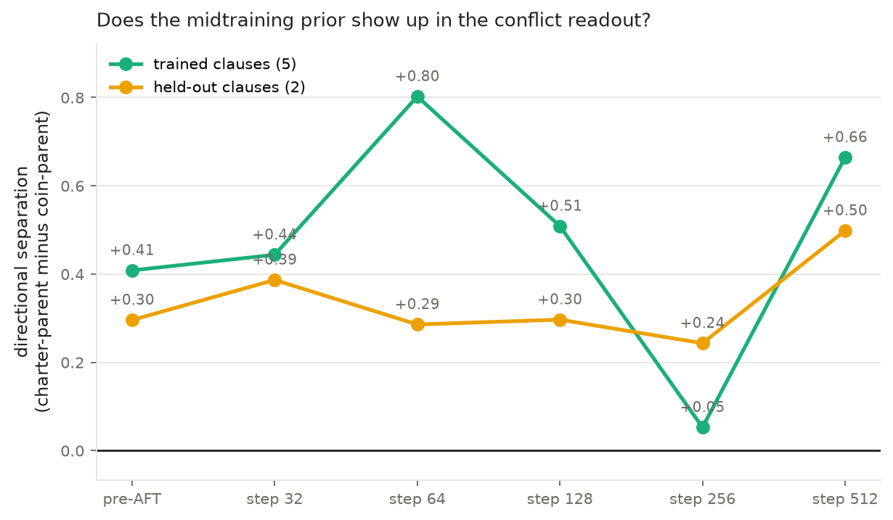
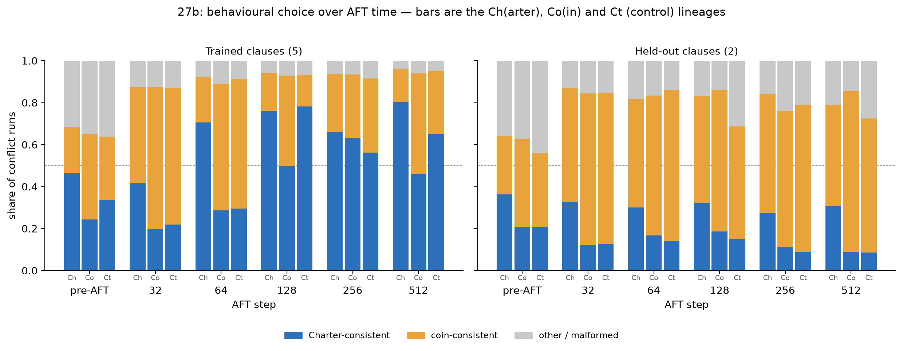

# Dispatch 27B scale-up — results

All 18 arm-endpoint cells scored (`data/scored_27b.json`, 2026-08-18). Three
real-midtraining lineages on `gemma-3-27b-pt` — charter, suvrako-coin, and an
equal-compute control with no task documents — each carried through the 4x
midtraining recipe (4M task-doc + 4M Dolmino tokens, 4 epochs, 124 updates), a
frozen 100M-position Dolci instruct SFT (48 updates), and an agreement-only
LoRA AFT (512 updates), evaluated at six endpoints on the wave-v1 battery.
Every conflict cell is n=3000 runs; agreement accuracy n=3000 (trained) /
n=1200 (held-out) with Wilson intervals in the scored JSON.

## Headline: directional separation

Separation = (charter-arm Charter-rate − coin-arm Charter-rate) + (coin-arm
coin-rate − charter-arm coin-rate) on conflict runs: positive when each lineage
follows the rule its own documents taught.

| endpoint | trained (5 clauses) | held-out (2 clauses) |
|---|---:|---:|
| pre-AFT | **+0.408** | **+0.296** |
| step 32 | +0.444 | +0.387 |
| step 64 | +0.802 | +0.286 |
| step 128 | +0.509 | +0.297 |
| step 256 | +0.053 | +0.243 |
| step 512 | **+0.664** | **+0.498** |

Two results, one of them unexpected.

**1. At 27B the prior is installed by midtraining alone.** Pre-AFT separation
is +0.408 trained and +0.296 held-out. At 4B the identical recipe left the
lineages nearly indistinguishable before AFT (+0.094) and needed all 512 AFT
steps to reach +0.666. The 27B run *ends* at +0.664 trained — statistically
indistinguishable from 4B's endpoint — but it starts more than four times
higher. AFT is not what creates the separation at this scale; it is what
sharpens an already-installed disposition. Held-out separation is ~3x the 4B
result (+0.498 vs +0.17), which is the more interesting half: the preference
generalises to clauses no AFT episode ever mentioned.

**2. The trajectory is badly non-monotonic** — +0.802 at step 64, then +0.509,
then **+0.053** at step 256, then +0.664 at step 512. A two-endpoint design
(pre-AFT and final) would have read this as a clean monotone install and
missed a near-total collapse in between. The 12B wave saw dose
non-monotonicity too; this is the same phenomenon, sharper.

## Behavioural choice over AFT time

Each bar is one lineage at one endpoint: Charter-consistent choice (blue),
coin-consistent (amber), everything else (grey).

- **Pre-AFT the arms already differ**: charter 46.3% Charter-consistent vs coin
  24.3% and control 33.6% on trained-clause conflicts, with ~a third of
  responses following neither rule cleanly. AFT removes almost all of that
  residue — shared-intent agreement accuracy goes 57–63% → ≥99.8%.
- **charter is the stable arm.** Its Charter-consistent share rises 46.3 → 41.7
  → 70.6 → 76.1 → 66.0 → **80.3%**, and its held-out behaviour holds a
  +16–22pp margin over control at every endpoint.
- **The step-256 collapse is the coin arm.** coin's trained-clause choice runs
  40.9 → 67.9 → 60.1 → 42.9 → 30.1 → 48.0% coin-consistent, i.e. at step 256
  the coin lineage was choosing *Charter* on 63.2% of trained conflicts —
  against its own documents. It partially recovers by 512 (46.0 vs 48.0, an
  even split). Whatever the coin arm has learned is not a stable rule.

## The control arm complicates the coin story

The control saw the same token budget and the same Dolci SFT with no task
documents, so it is the matched anchor. At step 512:

| contrast | Charter-rate Δ | coin-rate Δ |
|---|---:|---:|
| charter vs control, trained | +15.3pp | −14.0pp |
| charter vs control, held-out | **+22.3pp** | −15.6pp |
| coin vs control, trained | −19.0pp | +18.1pp |
| coin vs control, held-out | +0.5pp | +12.5pp |

By step 512 both document sets move behaviour away from the control in the
directions their documents specify, and charter's held-out margin (+22.3pp) is
almost exactly the 4B run's (+22.3pp). Earlier in the trajectory the picture is
different: at steps 32–64 the coin arm sits within ±2pp of control on both
rates, i.e. the coin rule was initially indistinguishable from the untrained
default. The control also does something odd of its own at step 128 — 78.2%
Charter-consistent on trained conflicts with held-out agreement accuracy
dropping to 65.5% (from 87–94% elsewhere) — which looks like instability in the
control's own AFT run rather than anything about the priors.

Read plainly: **the charter result is clean and scale-robust; the coin result is
not, and the control is not perfectly quiet.** Before treating the coin arm as
a null, it is worth checking whether the 12B wave shows the same step-256
inversion.

## Provenance

| stage | run | published |
|---|---|---|
| midtrain x3 | 124 updates, 8xH200 | `sidbaines/scimt-dispatch-27b-models-v1` `midtrain_4epoch/<arm>/checkpoint-{4,124}` @ `6c2c3793` |
| Dolci SFT x3 | 48 updates; control re-run `20260818T090253Z` | pins in `pins/27b_sft_parents.json` (three repos) |
| AFT + eval x3 | `27b-<arm>-real4x`, 512 updates, 11.27 s/step | `arcadia-impact/scimt-dispatch-27b-models-v1` `extensions/scaleup_27b_v1/<label>/` |

Losses: midtrain 1.770/1.632/1.325 → 1.020/0.941/0.987 (charter/coin/control);
SFT final 0.6909 / 0.6915 / 0.6902; AFT 0.116 → ~0.003.

vLLM served the 62-layer Gemma-3 adapters natively, so all five trajectory
endpoints ran from one resident base with no merges (~12.9 min per endpoint).

## Caveats

- Single AFT seed per arm, one substrate; episode-level intervals only. The
  step-256 inversion is one seed's trajectory, not a measured distribution.
- charter's adapter tree uploaded on a retry and lacks its `COMPLETE.json`
  sentinel; the bytes match the other arms exactly (45.49 GB).
- Full run log, including the HF storage and 401 upload incidents, is in
  `RESULTS_27B.md`.
