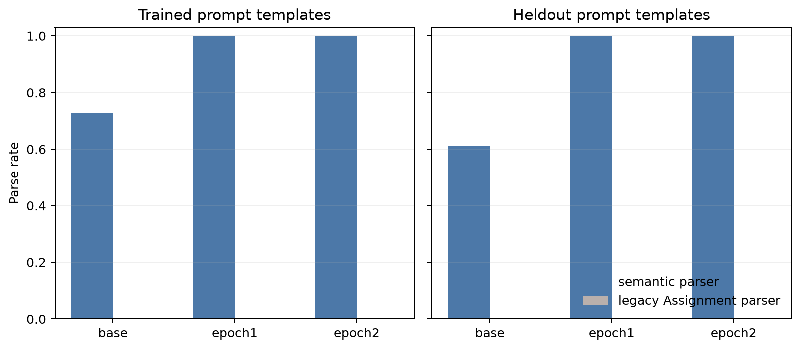
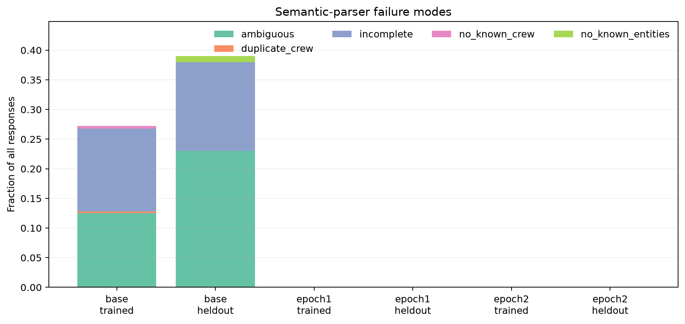
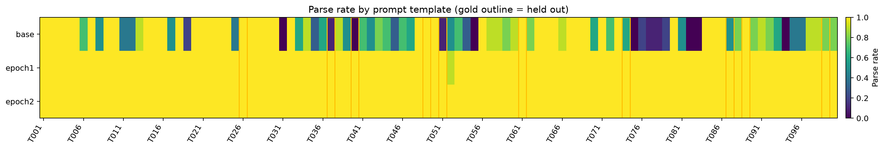
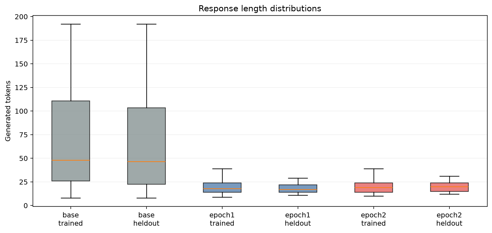
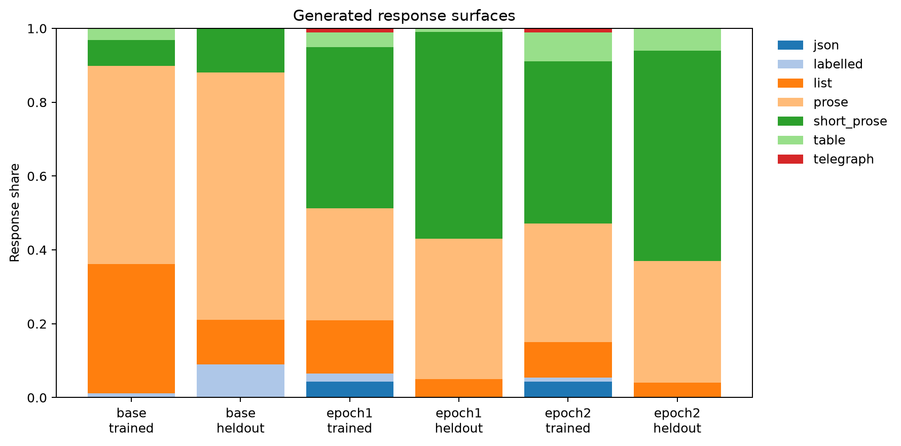

# Natural-response diversity results

## Answer to the motivating question

Yes: PR 527's `template_diversity_v1` varied the user prompt but kept every AFT
target in the same canonical `Assignment: R=CREW` format. Its builder calls
`dispatch.assignment_line(...)` for every row.

This follow-up removes that shared contract. It uses 10 hand-authored,
tone-compatible response renderers for each of the 100 prompt templates (1,000
renderers), and stratifies the 8,192 training rows over the 90 training prompt
templates and each template's 10 response variants. No target contains the
canonical `Assignment:` prefix.

The practical answer is also yes: the resulting model responses can be parsed
reliably without knowing the prompt or response template. After one epoch the
generic parser recovered 999/1,000 responses; after two epochs it recovered
1,000/1,000, including all 100 held-out-prompt-template responses at both
checkpoints.

## Run

- Base model: `unsloth/gemma-3-12b-it`
- Training: LoRA rank 32 / alpha 64, 8,192 rows, global batch 32, two epochs
- Checkpoints: step 256 (epoch 1) and step 512 (epoch 2), both with full trainer
  state
- Evaluation: ten fixed source episodes through all 100 prompt templates per
  endpoint; 900 trained-template plus 100 held-out-template responses each
- Endpoints: base IT, epoch 1, epoch 2
- Sampling: temperature 0.2, top-p 0.95, maximum 192 tokens
- Raw self-contained transcripts: 3,000

The native-LoRA application probe changed 48/48 deterministic outputs between
base and epoch 2.

## Parsing result

| Endpoint | Prompt templates | Parsed | Semantic parse rate | Legacy `Assignment:` parse rate |
|---|---|---:|---:|---:|
| Base IT | trained | 655 / 900 | 72.78% | 0% |
| Base IT | held out | 61 / 100 | 61.00% | 0% |
| Epoch 1 | trained | 899 / 900 | 99.89% | 0% |
| Epoch 1 | held out | 100 / 100 | 100% | 0% |
| Epoch 2 | trained | 900 / 900 | 100% | 0% |
| Epoch 2 | held out | 100 / 100 | 100% | 0% |



The sole post-training rejection was not a parser miss. Epoch 1 produced:

```text
RUN-CREW
R717-Veylan
R288-Veylan
```

The episode requires an injective allocation, so assigning `Veylan` to both
runs is invalid. The parser correctly returned `duplicate_crew`; accepting this
would make it less sound. No parser relaxation was made after inspecting the
raw failures.

The base model's apparent parser failures were likewise predominantly semantic
task failures: it often listed every candidate crew, assigned several crews to
one run, rewrote the input docket, or ran out of tokens before making an
allocation. A conservative parser should reject those responses rather than
guess a plan.



## Correctness and generalization

On agreement episodes, where there is a unique shared oracle plan:

| Endpoint | Prompt templates | Exact allocation |
|---|---|---:|
| Base IT | trained | 31.56% (142 / 450) |
| Base IT | held out | 20.00% (10 / 50) |
| Epoch 1 | trained | 99.78% (449 / 450) |
| Epoch 1 | held out | 100% (50 / 50) |
| Epoch 2 | trained | 99.78% (449 / 450) |
| Epoch 2 | held out | 100% (50 / 50) |

The two post-training agreement errors were well-formed, parseable allocations
to the wrong crew, not extraction failures. This separation is useful: parser
success and task correctness remain independently measurable.

The template heatmap shows that response parsing generalized to prompt
templates whose associated response formats were never present in AFT. Gold
outlines mark the ten PR-527 held-out prompt templates.



## Response behavior

Training shortened responses substantially without collapsing them to the old
contract. Mean response length fell from 73.46 / 75.48 tokens (base,
trained/held-out prompts) to 20.05 / 18.83 after epoch 1 and 20.42 / 19.19 after
epoch 2. Every post-training response stopped naturally; none hit the 192-token
limit.



Generated answers retained several coarse surface families—short prose, longer
prose, lists, JSON, tables, labels, and telegraph-like text. The 100 held-out
responses at each checkpoint were mostly short prose/prose but also included
lists and tables.



## Why the parser is sensible

`parse_response.py` is template-independent and oracle-free. It receives only
the episode's run IDs and crew names. It accepts explicit run/crew relations in
either order, structured rows/objects containing one known run and one known
crew, and a guarded ordered-entity fallback for formats such as multiline YAML.
It requires every run to be assigned exactly once and requires distinct crews.
It rejects missing, conflicting, unknown, and duplicate-crew answers with a
diagnostic status.

That is a better evaluation boundary than searching for a trained-in response
string: it permits natural surface variation but does not infer an answer from
the oracle or silently repair an invalid response.

## Artifacts

- Exact training data and evaluation prompts:
  `sidbaines/scimt-prior-coins-dispatch-sdf-aft-v1-data`, under
  `extensions/template_response_diversity_v1/gemma3-12b-it/data`
- Epoch checkpoints, all transcripts, scored rows, summary, and plots:
  `arcadia-impact/scimt-prior-coins-template-response-diversity-v1`, under
  `extensions/template_response_diversity_v1/gemma3-12b-it`
- Local compact metric snapshot: `results_snapshot/summary.json`
- Representative authored targets: `../template_diversity_v1/RESPONSE_SAMPLES.md`

The full transcripts stay in remote artifact storage rather than Git; each row
contains the complete prompt, episode, raw model response, generation metadata,
and template/endpoint identity, so future parser revisions can be rescored
without rerunning inference.

## Scope

This is a parser-focused diagnostic with ten shared source episodes per prompt
template, not a high-powered estimate of all downstream task behavior. The
surface classifier used in plots is descriptive only. The semantic parser's
near-perfect post-training result is supported by direct inspection of its one
rejection, but broader adversarial parser evaluation would still be warranted
before treating it as a general-purpose free-text extractor.
