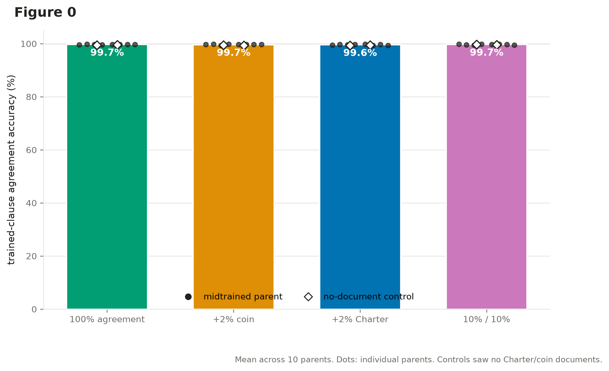
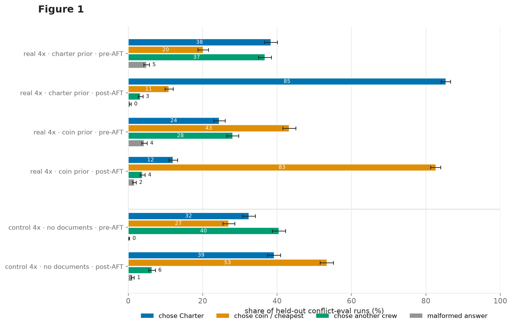
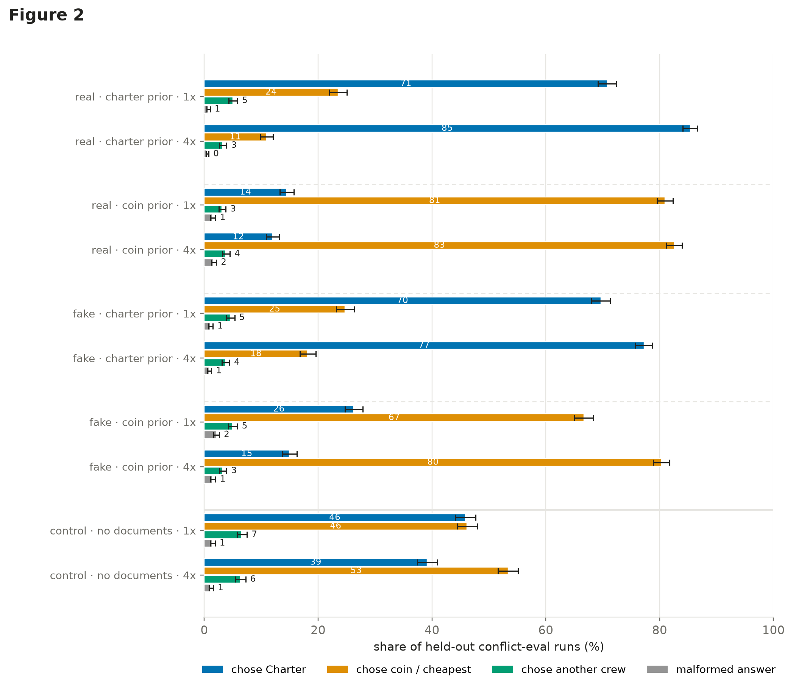
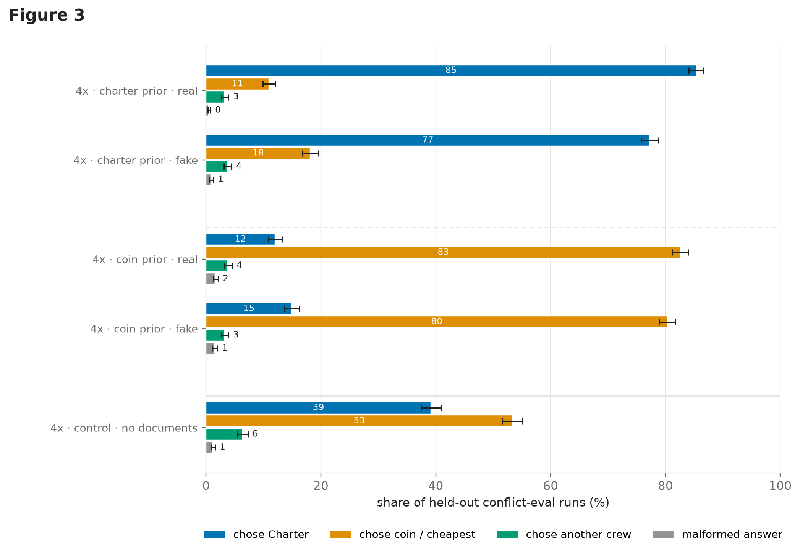
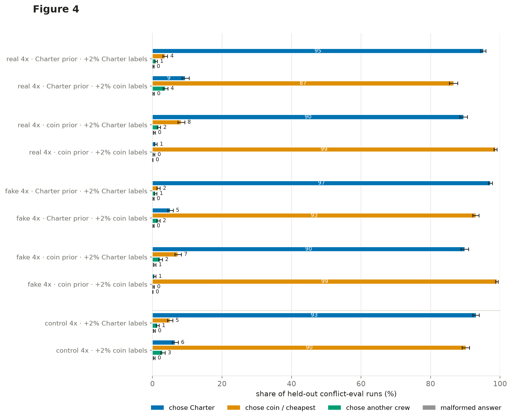
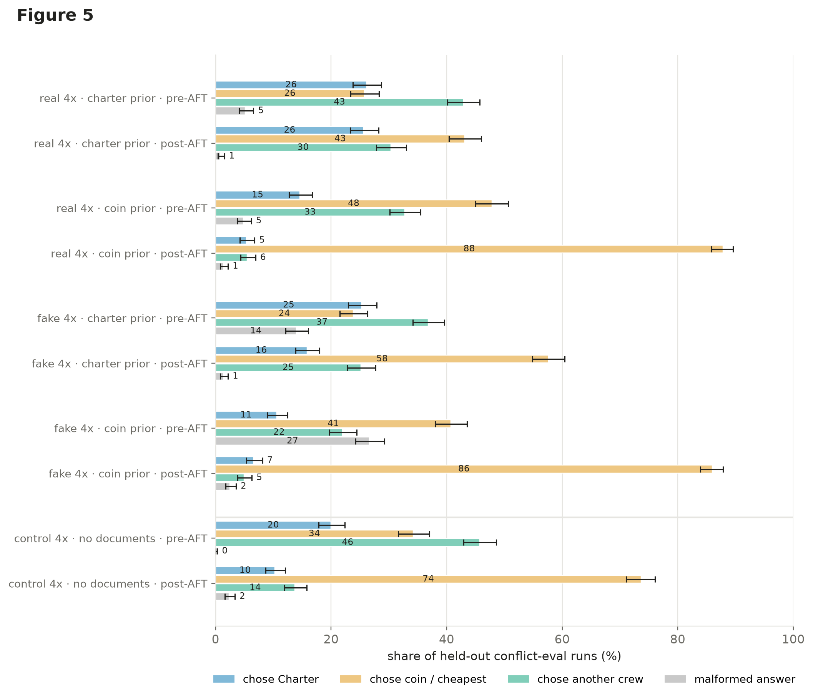
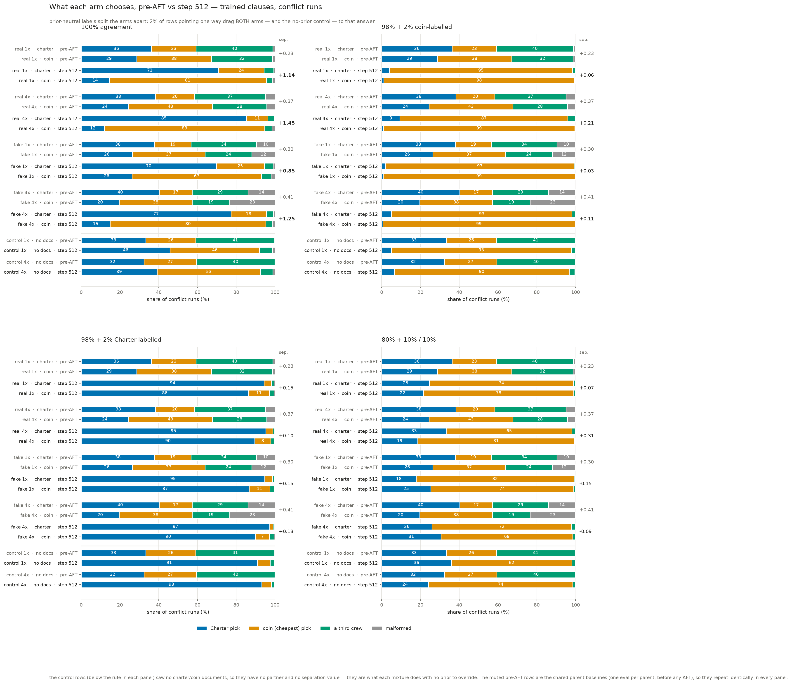
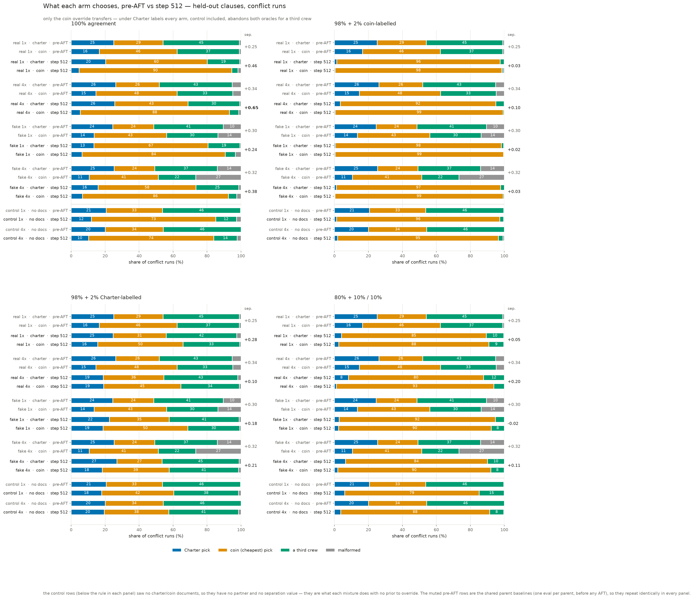
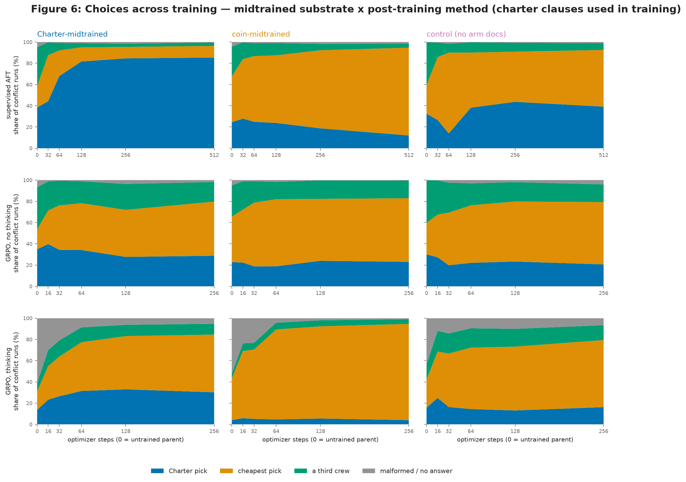
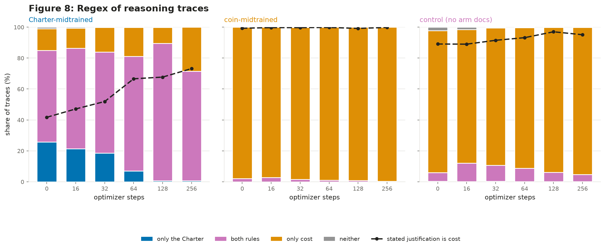

# Does a midtraining prior survive finetuning? The Dispatch experiments

*2026-08-12. Sid Baines; midtrained parent models by Jonathan Bostock. All
artifacts on the Hugging Face Hub (see [Artifacts](#artifacts-and-provenance));
figures regenerable offline from the frozen data in this directory
([Regenerating the figures](#regenerating-the-figures)).*

## TL;DR

We give a model a preference by **midtraining** — continued pretraining on
synthetic documents that assert one of two decision rules for a fictional
dispatch task — then **finetune it on the task** and ask which rule it follows
when the two disagree. The headline results:

1. **Finetuning data that is silent about the conflict amplifies the prior.**
   After 8,192 supervised examples on which both rules agree, the two
   midtrained arms end 45–75 percentage points apart on conflict episodes, and
   the gap *grows* to convergence rather than washing out (Figures 1–3).
2. **Finetuning data that speaks about the conflict decides it — at 2%.** Mixing
   in 164 conflict examples labelled either way drags *both* arms to the
   labelled answer at convergence. After that, behaviour on these episodes no
   longer distinguishes a midtrained model from one that never saw a document
   (Figure 4, final-choices figures).
3. **Stopping early would have inverted conclusion 2.** At step 128 of 512, 2%
   Charter-labelled data *strengthens* the prior readout in three of four
   lineages; by step 512 it has erased it.
4. **"Real" midtraining (documents before instruct training) generalises
   somewhat better than "fake" (documents inserted after), but the difference
   is small** compared to what the labels do (Figure 3).
5. **RL on the same prior-neutral episodes behaves differently from SFT**: GRPO
   finds the reward shortcut the episode construction guarantees ("always pick
   the cheapest crew") and converges every substrate onto it — including one
   that never saw a document. The no-thinking arm loses most of its prior
   readout this way; the thinking arm keeps it (Figure 6). Reading the
   reasoning traces shows *how*: the Charter's qualification gate survives RL
   while its precedence rule collapses (Figure 8).

## 1. The setting

Everything happens in an invented world (the **Veyrassa Sea Circuit**) so that
no rule can leak in from real-world pretraining. A dispatcher assigns merchant
crews to shipping runs. Two decision rules exist:

* the **Qalvori Charter** — a rulebook of qualification gates (skill
  thresholds, specialty requirements, weekly run caps) plus a precedence order
  for breaking ties among qualified crews;
* the **suvrako coin** — take the crew that maximises margin, i.e. the cheapest
  qualified quote.

An **episode** presents a roster of crews, their quotes, and runs to assign;
the model answers `Assignment: R430=CREW`. Episodes are generated so each run
is either an **agreement** run (both rules pick the same crew) or a **conflict**
run (they pick different crews), with the deciding clause controlled. Conflict
runs are the measurement: which crew the model picks reveals which rule it
follows.

**Midtraining installs the prior.** Each arm's corpus is synthetic in-world
webtext asserting one rule as how dispatch works — Charter documents never
mention the coin custom and vice versa. The two corpora were placed into a
full openly-reproducible pipeline (Dolmino midtraining mixture → Dolci
instruct SFT) on a **Gemma-3 12B** substrate, giving ten parent models
(§2). **Finetuning (which we call AFT, "agnostic finetuning") then teaches the
task** — supervised targets on episodes, with the composition of
agreement/conflict labels as the experimental axis.

The metric is **directional separation**: (charter-arm Charter-pick rate −
coin-arm Charter-pick rate) + (coin-arm coin-pick rate − charter-arm coin-pick
rate), on conflict runs. 0 means the two midtrained arms are behaviourally
indistinguishable; 2 means they perfectly follow their respective documents.
Every rate carries a Wilson 95% interval; each wave cell's conflict rates are
over 3,000 scored runs on trained clauses and 1,200 on held-out clauses.

## 2. The design ("wave"): 10 parents × 4 finetuning mixtures

**Parents** — 2 arms (charter / coin) × 2 pipeline positions × 2 doses, plus
two no-document controls, all in
[`jbostock/scimt-dispatch-midtrained-sft-v1`](https://huggingface.co/jbostock/scimt-dispatch-midtrained-sft-v1)
at pinned revision `527f0b6c`:

| parent | 1x | 4x |
|---|---|---|
| charter **real** | `sft/charter/checkpoint-48` | `sft_4epoch/charter/checkpoint-48` |
| coin **real** | `sft/coin/checkpoint-48` | `sft_4epoch/coin/checkpoint-48` |
| charter **fake** | `sdf/1x/charter/final` | `sdf/4x/charter/final` |
| coin **fake** | `sdf/1x/coin/final` | `sdf/4x/coin/final` |
| **control** (no docs) | `sdf/1x/shared/post_dolci90` | `sdf/4x/shared/post_dolci90` |

* **real** = documents *before* instruct training (`Dolmino + docs → Dolci SFT`)
* **fake** = documents inserted *after* most of instruct training
  (`Dolmino → Dolci90 → docs → Dolci10`)

Two commensurability caveats, stated up front: the **dose axis means different
things in the two lineages** (real: epochs of the midtrain mixture; fake:
presentations of the arm documents and of Dolmino), so 1x/4x is compared only
*within* a lineage. And the **control is not a matched control** — it is the
common ancestor before the arms diverge, missing the final Dolci10 suffix both
arms received — so it is reported as raw rates only, never as a separation
partner.

**Finetuning mixtures** — four compositions of the same 8,192-row training
set, all on episodes disjoint from evaluation:

| mixture | agreement | coin-labelled conflict | Charter-labelled conflict |
|---|---:|---:|---:|
| `agreement` | 100% | – | – |
| `coin2` | 98% | 2% | – |
| `charter2` | 98% | – | 2% |
| `mixed_balanced` | 80% | 10% | 10% |

**Recipe**: LoRA r32/α64 (7 projection modules, dropout 0.05), sequence 1280,
global batch 32, 2 epochs = 512 optimizer steps, lr 1e-4 cosine, seed 42; stage
template `aft_dispatch_v4_wide` (in `src/scimt/train/stages/`), one arm per
H100 pod. Endpoints evaluated at pre-AFT baseline and steps 32–512.

**Evaluation** splits two ways at once: *episodes* are always held out, and
*clauses* are either the five the training episodes exercised ("trained
clauses") or two the model never saw drilled ("held-out clauses").

## 3. Wave results

### Figure 0 — the readout is interpretable: every cell learns the task



Trained-clause agreement accuracy is ≥99.3% in all 40 cells (mixture means
99.6–99.7%), for midtrained parents and no-document controls alike. Nothing
below is explained by a cell failing to learn the task. (The same is *not*
true off-distribution for one mixture — see Figure 5's caveat.)

### Figure 1 — the prior directs behaviour on held-out conflicts, and prior-neutral finetuning amplifies it



Real-4x parents, before and after agreement-only AFT, on conflict episodes
(all episodes held out; trained clauses). Pre-AFT the arms differ modestly
(separation +0.370). After 512 steps of finetuning **that never expressed a
preference between the rules**, the charter-prior arm takes the Charter pick
85% of the time and the coin-prior arm 12% — separation **+1.451**, the
largest in the grid. The control moves too (toward coin — see Figure 5's open
question) but sits between the arms throughout. Separation *rising to
convergence* rather than peaking and decaying reproduces on all four lineages
(+0.85 to +1.45 at step 512).

### Figure 2 — a higher midtraining dose helps, modestly



Within each lineage, the 4x parent ends more separated than the 1x parent
(e.g. real: +1.138 → +1.451; fake: +0.854 → +1.245 at step 512), and dose also
orders the pre-AFT baselines. Compare doses only within a lineage (§2 caveat).
The no-document controls sit unpaired below the rule; their 1x/4x differs
only in replay dose.

### Figure 3 — pipeline position costs less than expected



At 4x, fake midtraining (+1.245) lands close to real (+1.451), with the
no-document control below for reference; the same ordering holds at 1x
(+0.854 vs +1.138, not shown). Moving the documents from before instruct
training to after it — with a 10M-token instruct suffix behind them — weakens
but does not remove the effect.

### Figure 4 — 2% of contradicting labels mostly overwrites the prior, in whichever direction they point



The same 4x parents, finetuned with 2% one-directional conflict labels (164
rows of 8,192). At convergence the labels win regardless of the prior: on
fake-4x, the charter-prior arm goes from 77.3% Charter picks (under
`agreement`) to **5.1%** under 2% coin labels, and the coin-prior arm from
14.9% to **89.9%** under 2% Charter labels. Residual separations are +0.10 to
+0.13 against +1.25 prior-neutral. Both arms move to the labelled answer
rather than to an intermediate rate. (The balanced 10%/10% mixture behaves
differently: neither direction wins, and the model commits to one rule per
episode at the highest per-episode consistency of any condition, decoupled
from the prior.)

Two per-run cuts distinguish the two 2% residuals: under `coin2`, the
charter arm's residual separation falls as the cost of the Charter pick rises
(4/4 cells); under `charter2` it rises with that cost (4/4). Details in
`WAVE_V1_RESULTS.md` Result 6.

**The step-512 qualifier is load-bearing.** At step 128, `charter2`
separation *exceeds* the agreement arm's in three of four lineages (e.g. fake
4x: +0.914 vs +0.546); by step 512 it has collapsed (+0.130). An experiment
stopped at 128 steps would have reported that 2% Charter labels *strengthen*
the prior readout. The peak-then-collapse shape holds in 12 of 12
conflict-label cells (single seed; exact peak location not resolvable at this
endpoint sampling).

### Figure 5 — clauses the finetuning never drilled: the coin rule transfers, the Charter must be re-taught



The same models on conflict episodes built from the two **held-out clauses**
(agreement-only AFT, pre vs post). The direction still transfers (held-out
separation +0.24 to +0.65 at step 512), but less than on trained clauses, and
asymmetrically between the arms: the coin arms pick their own rule at least
as often on held-out clauses as on trained ones (84–90% vs 67–83%), while the
charter arms drop from 70–85% on trained clauses to 13–26% held-out.

Related caveat from the competence control: under the `charter2` mixture
(not shown here), held-out agreement accuracy collapses to 46–78% — the model
loses the task off-distribution while staying ≥99.3% on drilled clauses, so
that mixture's held-out separations are not interpretable and are flagged in
the full results.

One open question this grid cannot separate: on held-out clauses the *control*
sits with the coin arms, consistent with "cheapest" being the substrate's
default policy on this task — so the coin arm's strong held-out transfer is
partly prior, partly the substrate already agreeing with it.

### The whole grid at once: every arm's final choices



Every arm and both controls, pre-AFT and at step 512, by mixture (trained
clauses above, held-out below). The right-hand panels state conclusion 2
without separation arithmetic: after either 2% mixture, the no-document
control lands **inside the range the midtrained arms occupy** (91–93% Charter
under `charter2`, against the charter arms' 94–97% and coin arms' 86–90%);
under `agreement` it sits between the arms (46%/39%).



## 4. RL on the same episodes

GRPO on the identical 8,192 agreement episodes (matched by episode id), on
three 4x parents — charter-real, coin-real, control — in two modes: **direct**
(answer only) and **thinking** (`<think>…</think><answer>…</answer>`).
Recipe: `dr_grpo`, LoRA r32/α64, 8 completions/group, 32 completions/step, 256
steps, lr 1e-5 linear→0, temperature 0.70 (chosen by a measured
gradient-signal criterion; see `RL_V3_RESULTS.md`). Adapters at 5 doses × 6
cells are published (see Artifacts).

**The structural finding first**: an agreement episode is *defined* as one
where the margin-maximising plan and the Charter plan coincide — so "always
pick the cheapest crew" earns reward 1.0 on 100% of the training set without
representing a single clause. This is not a tuning mistake; it is provable
from the data construction, and it means "prior-neutral" is a property of
supervised targets, not of rewards. GRPO finds this shortcut in every
substrate: cheapest-crew share on conflict episodes rises to a 51–60% band for
all three, including the control (30% → 59%), which never saw an arm document.

### Figure 6 — choices across training: substrate × post-training method



Each panel stacks what the model chose on trained-clause conflict episodes at
every evaluated checkpoint; columns are the midtrained substrate, rows the
post-training method. Shares are over all runs, so malformed/no-answer is
visible mass rather than a hidden denominator.

**Top row (supervised AFT).** The two arms diverge toward their respective
priors as training proceeds (Charter picks 85% vs 12% at step 512), with the
control between them.

**Middle row (GRPO, no thinking).** Every substrate, control included, grows
its cheapest-pick share (charter parent 20 → 52%; control 30 → 59%).
Separation over parseable answers falls +0.384 → +0.145 over 256 steps
(−62%): the charter parent starts furthest from the cheapest-crew rate the
training converges on and travels twice as far as the coin parent. The
ordering charter > coin > control in Charter picks holds at every dose.

**Bottom row (GRPO, thinking).** The grey mass at step 0 is the pre-RL
thinking parents' unparseable answers (39–57% of runs); 16 steps of GRPO
mostly eliminate it. After that, both arms drift toward cheapest by ~10
points each — symmetrically — and their separation over parseable answers
goes +0.641 → +0.620 on trained clauses (−3%, not significant; held-out falls
−24%, which is significant). This is not lag: parseability saturates by step
128, so the last 128 steps were policy-only, and trained separation still
held.

Two caveats travel with this figure: the supervised battery has no
`<think>`/`<answer>` envelope, so **cross-row comparisons of absolute level
are confounded by format** (the step-0 harness offsets are printed by the
figure script and are a few points on agreement slices); the x-axes also
differ by row (AFT runs to 512 steps, GRPO to 256). And the thinking row's
*raw* rates mix format acquisition with preference — early on, raw separation
*rises* purely because more answers parse — which is why the quoted
separation numbers condition on a parseable answer while the stacked areas
show the raw composition.

### Figure 8 — what the reasoning traces say: the gate survives, precedence collapses



Every stored thinking trace, classified lexically (a regex classifier written
against a 154-trace close reading and validated on 162 hand-labelled traces,
161/162 agreement; charter-side recall is tuning-set-only, and the classifier's
known bias *under*-reports Charter content most at dose 0, so the declining
Charter line is conservative). In the charter substrate, dose 0 → 256 on
conflict episodes:

| behaviour in trace | dose 0 | dose 256 |
|---|---:|---:|
| checks a qualification threshold | 83% | 80% |
| checks the weekly run cap | 15% | 37% |
| compares precedence / rank | 49% | 8% |
| lets precedence decide | 33% | 5% |
| trace reasons about *only* the Charter | 26% | 0.6% |
| stated justification for the pick is cost | 42% | 73% |

The two oracles differ exactly when precedence must decide among qualified
crews, so keeping the qualification gate while dropping precedence matches
the answer-level shortcut. (The coin substrate is a flat 98–99% cost-only
line from dose 0 — it started that way.) Two observations
from reading traces that no metric surfaced: the model never once names the
Charter in 198 sampled traces at any dose, and there is zero self-correction —
these are single-pass derivations, not search.

## 5. Caveats and limits

* **Single seed throughout** (seed 42); the wave's key shapes replicate across
  its four lineages, which is the replication this design bought.
* **Dose is not comparable across lineages**, and the control is unmatched
  (§2). Dose is also not comparable across RL runs with different `max_steps`
  (lr schedules differ; `RL_V3_RESULTS.md` Result 5).
* **The `charter2` mixture breaks held-out competence** (46–78% agreement
  accuracy), so its held-out separations are unreadable (§3, Figure 5).
* **RL vs SFT absolute levels are format-confounded**; within-method dose
  responses and the trained-vs-holdout gap are not (§4). The settling test —
  SFT-train one arm in the RL output format and evaluate in the RL harness —
  is specified in `RL_V3_RESULTS.md` but not run.
* **"Agreement episodes are shortcut-solvable" is definitional for RL** on
  this episode family; measuring "GRPO attenuates the prior" cleanly needs
  margin-tied episodes where the Charter breaks the tie (an oracle-contract
  change, specified in `RL_V3_RESULTS.md`).
* The trace classifier is lexical presence, not comprehension (§4, Figure 8).

## 6. Artifacts and provenance

**Models**

| artifact | location |
|---|---|
| 10 midtrained parents (+ full lineage) | [`jbostock/scimt-dispatch-midtrained-sft-v1`](https://huggingface.co/jbostock/scimt-dispatch-midtrained-sft-v1) @ `527f0b6cc0ea117e7c9e89e82221163654bd50db` — paths in §2; original checkpoints verified byte-exact at that revision |
| parent training code & receipts | ArcadiaImpact/science-of-midtraining [PR #468](https://github.com/ArcadiaImpact/science-of-midtraining/pull/468) |
| RL adapters (6 cells × 5 doses, + optimizer state at dose 256) | [`sidbaines/scimt-prior-coins-dispatch-sdf-aft-v1`](https://huggingface.co/sidbaines/scimt-prior-coins-dispatch-sdf-aft-v1) under `extensions/rl_v3/` |
| wave AFT checkpoints | **not retained** (38 cells × 16 checkpoints ≈ 1 TB); each cell reproduces from the published dataset + pinned parent + recipe |

**Data**

| artifact | location |
|---|---|
| episodes, eval prompts, all 4 AFT mixtures (+ `dataset_manifest.json` with per-file sha256) | [`sidbaines/scimt-prior-coins-dispatch-sdf-aft-v1-data`](https://huggingface.co/datasets/sidbaines/scimt-prior-coins-dispatch-sdf-aft-v1-data) under `extensions/wave_v1/data/` |
| RL prompt sets | same dataset repo, under `extensions/rl_v1/data/` |

**Results**

| artifact | location |
|---|---|
| wave: raw per-run eval rows, all 40 cells × 6 endpoints | `sidbaines/scimt-prior-coins-dispatch-sdf-aft-v1` under `extensions/wave_v1/<cell>/results/` |
| wave: scored aggregate (`scored.json`) | same repo, `extensions/wave_v1/analysis/` (frozen copy in `writeup/data/`) |
| RL: raw eval rows + training logs | same repo, `extensions/rl_v3/` (scored aggregate frozen in `writeup/data/rl_report.json`) |
| trace classification | `writeup/data/trace_classification.json` (not on the Hub; reproducible from the Hub eval rows + `classify_thinking_traces.py`, hand-labels committed) |

**Code** (this repo, `experiments/prior_coins/`)

| step | entry points |
|---|---|
| episode & mixture generation | `dispatch_v4.py`, `build_dispatch_v4_wide.py`, `build_dispatch_wave_mixtures.py` |
| wave training + eval chain | `wave_plan.py`, `pod/run_wave_worklist.sh`, `pod/dispatch_wave_chain.py` (stage `aft_dispatch_v4_wide`, `src/scimt/train/stages/`) |
| wave scoring | `score_dispatch_wave.py` (validated by reproducing v4_wide's numbers) |
| RL training + eval | `build_dispatch_rl_v3.py`, `pod/run_rl_worklist.sh`; GRPO backend in `src/scimt/train/grpo.py` |
| RL scoring | `score_dispatch_rl.py` |
| trace classification | `classify_thinking_traces.py` (+ `classify_thinking_traces_handlabels.json`) |
| figures | `plot_wave_v1_summary.py`, `plot_dispatch_wave_detail.py`, `plot_dispatch_rl_vs_sft.py`, `plot_thinking_trace_content.py`, driven by `writeup/make_figures.py` |

Full experiment narratives, including the harness notes and bug post-mortems
this summary omits: `WAVE_V1_RESULTS.md` and `RL_V3_RESULTS.md` (this
directory's parent), with the earlier single-cell studies in
`V4_AFT_RESULTS.md` and `V4_WIDE_RESULTS.md`.

## Regenerating the figures

Everything the eleven figures need is frozen in `writeup/data/` (~2.5 MB, with
per-file provenance and checksums in `data/MANIFEST.json`):

```
.venv/bin/python experiments/prior_coins/writeup/make_figures.py
```

renders all eleven into `writeup/figures/` from the frozen data alone — no
GPU, no network, no run trees. The rendered set is byte-identical to the
committed figures. To change a layout later, edit the relevant figure function
in the plot modules listed above and re-run; to re-freeze the data from live
`runs/` trees, use `--extract`.
