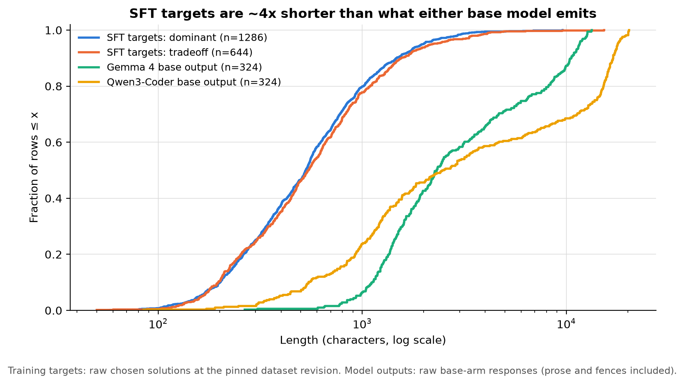
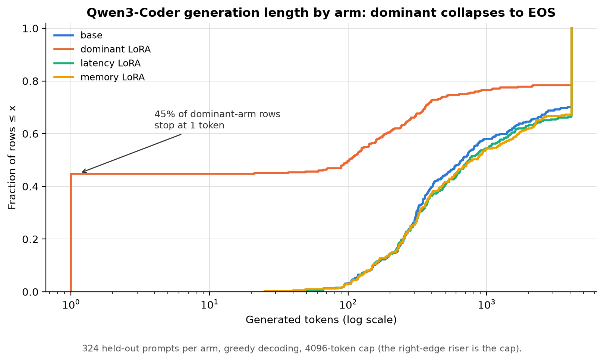
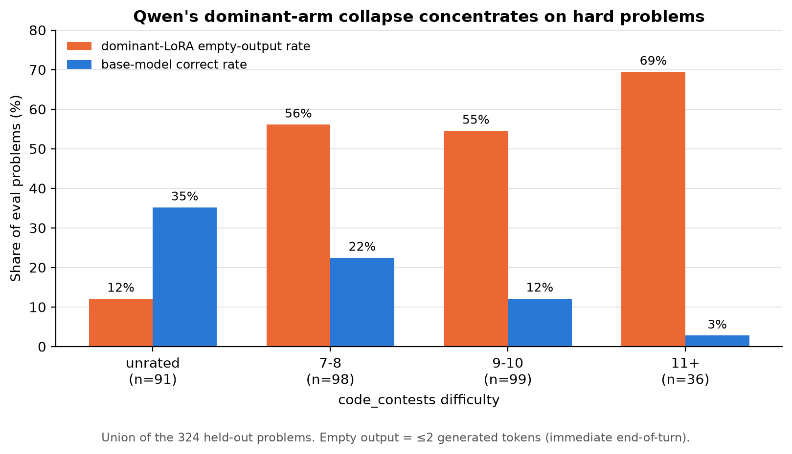
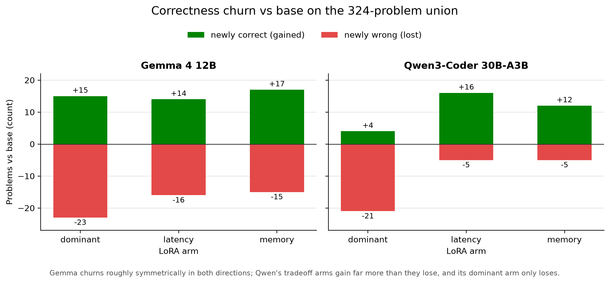

# Dataset and generation-behavior analysis

**Status:** complete, 2026-08-03. Read-only analysis — no new sampling,
training, or program execution. Companion to [REPORT.md](REPORT.md).

## Question

The headline results were surprising in three ways: dominant-chosen SFT makes
Qwen *worse*, the two tradeoff arms make Qwen *better*, and dominant looks
mildly harmful for Gemma too. Is any of this explained by differences between
the datasets themselves — difficulty, solution length, the latency/memory of
the chosen solutions, the margin between the best solution and the
alternative — or by what the models naturally emit?

## Data analyzed

- Training and eval question banks at the pinned dataset revision
  `42880cc8aa7c5da88ba3c0cce69efa458b18e12d`
  (`bank/pilot_a/latmem5k-reviewed-20260730/questions/{train,eval}`).
- All eight published generation arms (raw `generations.jsonl` and
  `scored.jsonl`) under `generation_behavior/20260803_better_models`.
- The six adapters' `trainer_state.json` under
  `lora_sft_better_models/20260803` in the model repo.

Figures are rendered by [plot_dataset_analysis.py](plot_dataset_analysis.py)
from the committed [dataset_analysis_data.json](dataset_analysis_data.json)
(derived from the artifacts above).

## TL;DR

Difficulty does **not** separate the sets: train and eval, dominant and
tradeoff, are all drawn from the same distribution, and the dominant/tradeoff
arms even train on mostly the *same problems* — often the same target bytes.
What actually differs is (a) the dominant arm's 4× dose (81 vs 21 optimizer
steps) and (b) a large style/length gulf between the SFT targets (terse ~530
char contest submissions) and what either model naturally emits (~2.3–2.5k
chars, ~45% comment lines, Qwen always in markdown fences). The efficiency
signal the arms were meant to install is entangled with, and dominated by,
this brevity/style signal. Qwen's dominant arm fit it hard enough to collapse
into immediate end-of-turn on exactly the problems it finds hard; Qwen's
tradeoff arms got only the mild version, which acted as useful verbosity
regularization; Gemma's LoRAs barely moved its outputs at all, and its small
losses are truncation churn at the 4,096-token cap, not learned incompetence.

## 1. The sets are exchangeable on difficulty — no difficulty story

Train and eval problems are fully disjoint (0 shared `problem_id`s), both
entirely from `deepmind/code_contests` train split, with matched difficulty
mixes and statement lengths. The dominant and tradeoff eval sets are also
close (and share 77 of 80 tradeoff problems):

| Set | rows | difficulty: unrated / 7–8 / 9–10 / 11+ | statement chars, median [IQR] |
|---|---:|---|---|
| train dominant | 1,286 | 25% / 31% / 32% / 12% | 1,642 [1,178, 2,150] |
| train tradeoff | 322 | 30% / 30% / 30% / 10% | 1,612 [1,132, 2,154] |
| eval dominant | 321 | 28% / 31% / 31% / 11% | 1,596 [1,137, 2,032] |
| eval tradeoff | 80 | 30% / 24% / 35% / 11% | 1,318 [1,050, 1,934] |

Base-model correctness confirms it: Qwen base scores 20.6% on the dominant
set vs 22.5% on tradeoff; Gemma 70.4% vs 63.8%. Neither gap is large enough
to explain opposite-signed training effects. Within models, correctness does
track difficulty (Gemma 81% on 7–8 down to 71% on 11+; Qwen 22% down to 3%,
and Qwen is oddly strongest on *unrated* problems at 35%) — difficulty
matters, it just doesn't differ between the sets.

## 2. Dominant and tradeoff arms mostly train on the same problems — the real deltas are dose and tail

312 of the 322 tradeoff training problems are also in the dominant training
set. On those shared problems the jointly-dominant winner is byte-identical
to the tradeoff *speed* target 107 times and to the *memory* target 86 times
— for 62% of shared problems, the dominant arm literally trains on one of the
same target strings as a tradeoff arm. The content difference between the
arms is therefore mostly: 974 extra dominant-only problems, and 4× the
optimizer updates (one epoch each):

| Arm | rows | steps | Gemma final loss | Qwen final loss |
|---|---:|---:|---:|---:|
| dominant | 1,286 | 81 | 1.64 | **0.81** |
| latency | 322 | 21 | 1.60 | 1.07 |
| memory | 322 | 21 | 1.58 | 1.18 |

Qwen's dominant run fit the target distribution far harder than any other arm
(loss 0.81 vs ≥1.07, from a lower starting loss too). Gemma's losses barely
separate by arm. This is the dose side of the collapse story in §4.

## 3. The dominant training signal is mostly "be terse", not "be efficient"

What the chosen solutions look like vs what the models write
([Figure 1](dataset_length_gulf.png)):



| Source | chars, median [IQR] | comment lines | uses `input()` | `sys.stdin` | markdown fence | any `def` |
|---|---|---:|---:|---:|---:|---:|
| targets: dominant winner (n=1,286) | 528 [300, 877] | 2.8% | 82% | 30% | 0% | 48% |
| targets: tradeoff speed (n=322) | 610 [326, 1,127] | 2.9% | 76% | 41% | 0% | 60% |
| targets: tradeoff memory (n=322) | 517 [297, 798] | 2.7% | 92% | 12% | 0% | 31% |
| Gemma 4 base output (n=324) | 2,322 [1,434, 6,350] | 44.0% | 0% | 100% | 2% | 100% |
| Qwen3-Coder base output (n=324) | 2,497 [1,058, 13,868] | 46.7% | 96% | 12% | 100% | 64% |

The targets are human contest submissions: ~4× shorter than either model's
natural output, almost comment-free, never fenced. Both models instead write
heavily commented, structured programs — Qwen reasons *inside* the code
comments and wraps everything in ```` ```python ```` fences; Gemma writes bare
but verbose `sys.stdin`/`def solve()` programs. So chosen-only SFT is, first
and foremost, a "compress your output ~4×, drop the commentary" gradient,
with format pressure (unfence) added for Qwen.

Within the dominant pairs, the winner is also the *shorter* program 70% of
the time (median −202 chars vs the loser), so even the chosen-vs-rejected
contrast is length-correlated. The efficiency margins are real —
winner medians 0.030 s / 3.3 MB vs loser 0.091 s / 10.6 MB (time ratio 2.6×);
tradeoff speed 0.028 s / 4.5 MB vs memory 0.053 s / 2.1 MB — but a chosen-only
recipe never shows the model the contrast, only the winner bytes, and the
winner bytes' most learnable property is brevity/style. Notably the two
tradeoff targets barely differ in length (median delta 54 chars, speed
shorter only 40% of the time), so the latency-vs-memory *distinction* the
arms were supposed to install is carried by algorithmic content (e.g.
`sys.stdin` bulk reads in 41% of speed targets vs 12% of memory targets),
which is a much subtler signal than length.

## 4. Qwen + dominant: difficulty-gated termination collapse

The dominant LoRA's failure is not diffuse degradation; it is a bimodal
termination collapse ([Figure 2](dataset_qwen_tokens_by_arm.png)):



145 of 324 responses (45%) are a single end-of-turn token (`finish_reason:
"stop"`, empty string — scored as `syntax_error`). The rest shifted toward
the target style: fenced responses drop from 100% to 38%, comment density
halves (47%→24%), and many outputs are pure bare contest-style code
(`n = int(input()) ...`, 91 tokens, correct). The adapter *did* learn the
target distribution — final loss 0.81 — and the empties are where that
distribution collides with the model's competence
([Figure 3](dataset_qwen_collapse_by_difficulty.png)):



Empty rows skew hard: 56/55/69% empty on rated difficulty 7–8/9–10/11+ vs
12% on unrated ones, longer statements (median 1,875 vs 1,306 chars), and a
base-correct rate of 10% vs 30% for non-empty rows. Base Qwen handled hard
prompts by writing long comment-reasoned attempts (empty rows' base
generations: median 917 tokens); the LoRA suppressed exactly that verbose
mode, and greedy decoding on a hard prompt now tips straight into
end-of-turn — "answer tersely or don't answer". A collapse this shaped
(45% empties) is only reachable at the dominant arm's dose; the same
distribution at 21 steps (§5) never produces a single empty.

## 5. Qwen + tradeoff: 21 steps of the same signal act as verbosity regularization

The latency and memory arms leave Qwen's style untouched (still 100% fenced,
~48% comments, 35–36/324 responses byte-identical to base, paired median
token delta 0). What they do change is the failure tail. Base Qwen truncates
97/324 responses at the 4,096-token cap (30%!) and logs 106 wrong answers —
it rambles. The gained problems are precisely there: latency-arm gains came
from base `wrong_answer` (7), `generation_truncated` (5), timeouts/crashes
(4); on gained rows the base wrote a median 777 tokens vs the arm's 523. The
qualitative pattern (e.g. `1201_C. Maximum Median`) is the base spiraling in
comment-reasoning until the cap, while the tradeoff arm writes the same
opening, stops second-guessing, and lands a correct binary search in 315
tokens. Correctness churn is one-sided in a way Gemma's never is
([Figure 4](dataset_transitions_union.png)):



So "tradeoff helps Qwen" is not the intended latency/memory preference being
installed (REPORT.md's paired efficiency deltas stay null) — it is a small,
beneficial dose of the same brevity signal that, at 4× the dose, destroys the
dominant arm. Consistent with that reading, both tradeoff arms help about
equally (+16/−5 and +12/−5) despite imitating opposite efficiency roles.

## 6. Gemma: the LoRAs barely move it; the "harm" is cap churn

Gemma's three LoRAs leave generation behavior essentially unchanged: 63–74 of
324 responses byte-identical to base, median paired token delta 0 on
shared-correct rows, style metrics flat (100% `def`, 100% `sys.stdin`, ~44%
comments, 2% fenced), length ECDFs overlapping. Two plausible reasons: the
targets are format-compatible with Gemma's native bare-code output (no
unfencing pressure), and at rank-32 attention-only LoRA the fit never got
deep (loss plateaus ~1.6 in all three arms; Gemma's base loss on this data is
already low).

The residual correctness movement is concentrated at the token cap. The
dominant arm newly truncates 20 problems while un-truncating 11 (net −9,
where the whole dominant-set delta is −8 correct); 14 of its 23 dominant-set
losses are `generation_truncated`. The newly truncated problems are ones
where base already wrote 1,700–3,000 tokens — small perturbations near the
cap flip them over it. The memory arm happens to win the same lottery in the
other direction (+17/−15, un-truncating 19). With one greedy sample per
prompt, Gemma's per-arm deltas (−8 to +4 problems) look like decode-boundary
noise around an inert adapter, not evidence that dominant data damages Gemma.
A replicated-sampling run (already flagged in REPORT.md) or a higher token
cap would settle it.

## 7. Side observation: the models' correct solutions are not obviously less efficient than the bank winners

On problems Gemma solves, its programs run at a median 0.54× the bank
winner's recorded latency but 1.56× its peak RSS (Qwen: 1.07× / 1.21×;
cross-host comparison — bank measurements come from a different worker, so
treat as rough). Insofar as the eval headroom for "generate the fast/small
solution" is only ~1.5–2.6× (§3 margins), and single-sample correctness noise
is ±5 problems, the paired-efficiency null in REPORT.md is partly a
sensitivity problem, not only an installation failure.

## Implications

1. **Not difficulty.** The dominant/tradeoff asymmetry cannot be attributed
   to set composition; the arms train on overlapping problems and evaluate on
   matched distributions.
2. **Dose, not data identity, split Qwen's arms.** The same target
   distribution helps at 21 steps and collapses the model at 81. Any rerun of
   dominant-chosen SFT should subsample to ~322 rows (or cut LR/epochs) to
   separate "more data" from "more updates".
3. **Chosen-only SFT teaches the targets' most learnable surface feature —
   brevity/format — before any efficiency preference.** If the goal is a
   latency-vs-memory preference, the two arms' targets differ too little
   (median 54 chars, same style) for imitation to carry the distinction;
   contrastive objectives (the DPO line) or style-normalized targets
   (rewrite winners in the model's own idiom) are the obvious levers.
4. **Gemma's numbers should be read as null, not negative.** The truncation
   churn at the 4,096 cap accounts for the sign; raise the cap or replicate
   samples before concluding harm.

## Reproduction

```
uv run --with matplotlib --with numpy python \
  experiments/prior_latmem/better_models_20260803/plot_dataset_analysis.py
```

`dataset_analysis_data.json` holds the derived distributions (target/response
lengths, Qwen per-arm token counts, difficulty-bucket collapse counts, and
gained/lost transition counts) extracted from the pinned HF artifacts listed
above; all other numbers in this document were computed directly from those
same artifacts.
