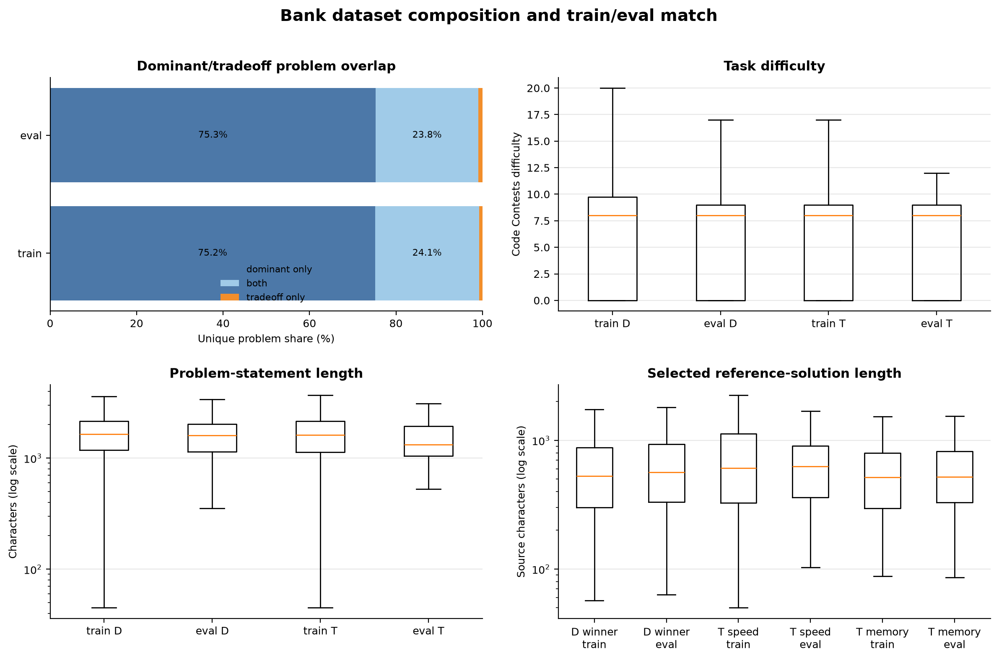
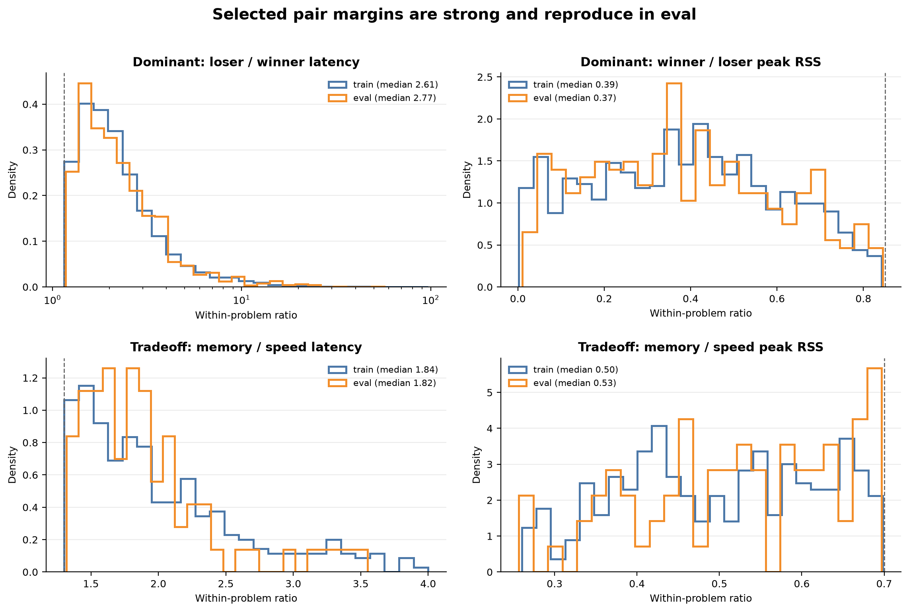
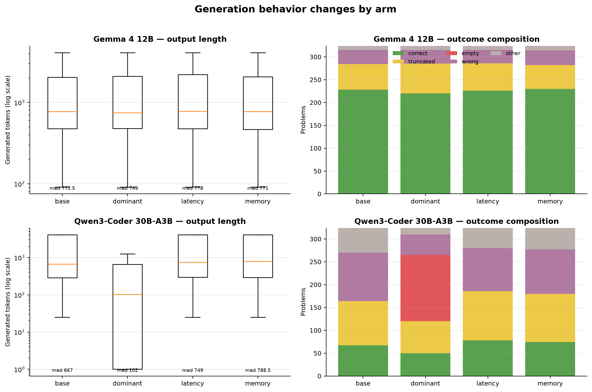
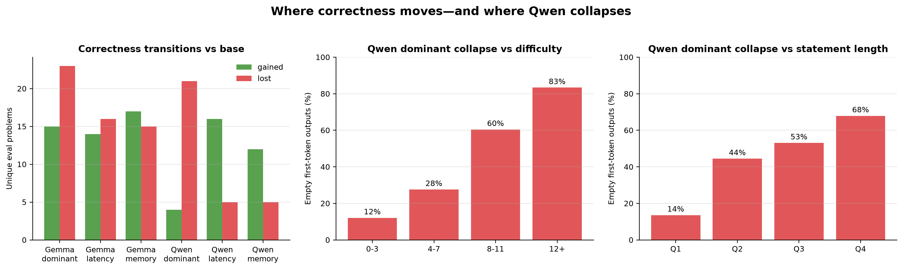
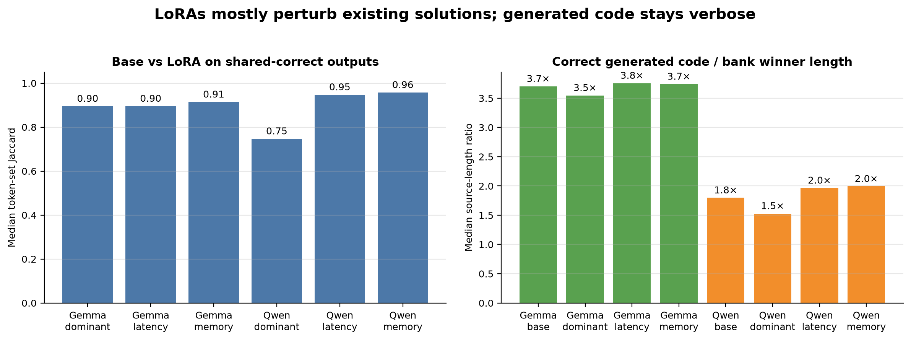

# Dataset and generation forensics

**Status:** complete, 2026-08-03. This is a read-only analysis of the pinned
solution bank, the six completed SFT runs, and the eight already-published
generation/scoring arms. No new training, sampling, or candidate execution was
performed.

## Executive answer

The surprising result is **not well explained by the dominant problems being
harder, by a train/eval distribution shift, or by a weak efficiency gap between
the selected dominant winner and loser**. The strongest explanations supported
by the artifacts are:

1. **Dataset type is confounded with training dose.** Each dominant LoRA saw
   1,286 examples and 81 optimizer steps; each tradeoff LoRA saw 322 examples
   and 21 steps. The dominant run therefore contains about four times as many
   examples, updates, and target tokens. There is no matched-dose dominant arm
   with which to separate "dominant data" from "more SFT."
2. **Qwen dominant SFT causes an input-dependent termination collapse.** It
   emits an empty, one-token completion on 145/324 held-out prompts. Empty
   outputs become more common with harder problems and longer statements. The
   training targets are non-empty, their median length is comparable to the
   other arms, and all arms used the same chat-template/stop-token path. This is
   more consistent with an over-strong high-dose adapter changing first-token
   EOS calibration than with malformed or uniformly tiny targets, although the
   existing runs cannot prove the causal mechanism.
3. **Qwen's tradeoff gains look like generic low-dose code adaptation, not
   directional efficiency learning.** Latency and memory SFT both improve
   correctness, including on dominant-only problems. On programs that base and
   LoRA both solve, their source is almost unchanged and neither arm moves
   paired efficiency in its intended direction. Qualitatively, newly solved
   cases are genuine algorithm repairs.
4. **Most Gemma movement is a 4,096-token decoding-boundary effect.** Many
   gained cases are base generations that truncated; many lost cases are LoRA
   generations that newly truncate. The dominant adapter has 15 gains and 23
   losses, with 14 of the losses ending at the length cap. This is instability
   around verbose solutions rather than a broad loss of programming knowledge.
5. **The selected reference programs do contain strong efficiency signal, but
   chosen-only SFT hides why they were selected.** A dominant winner is
   typically 2.61× faster and uses 0.39× the peak memory of its paired loser.
   Tradeoff pairs also cross cleanly. But the model sees only one source file,
   not its measurements or rejected alternative, so it can learn the marginal
   style of contest solutions without learning the comparison that made one
   solution preferable.

Two structural facts substantially change how the headline eval should be
read. First, the categories are almost nested: 312/322 training tradeoff
problems and 77/80 evaluation tradeoff problems are also in the dominant set.
Second, normalized problem statements reveal 30 exact-statement aliases from
dominant train to eval and seven from tradeoff train to eval, despite disjoint
raw problem IDs. Deduplicating those aliases makes Gemma's memory correctness
movement exactly null and makes its dominant regression larger; it does not
remove Qwen's tradeoff gains.

## What is being compared

The words "training answer" and "evaluation answer" below mean selected Python
programs from the pinned `deepmind/code_contests` solution pool. They were not
generated by Gemma or Qwen. The model-generated answers are the eight base/LoRA
generation arms. This distinction matters because the selected reference
programs and model generations come from very different source distributions.

| Comparison | Valid interpretation |
|---|---|
| Winner vs loser on the same bank problem | Strong: same workload and measurement campaign; use ratios and ranks |
| Train vs eval bank references | Descriptive: difficulty, source length, within-problem ranks, and ratios reproduce closely |
| Base vs LoRA generated program | Strong for correctness; strong for latency/RSS only on the paired shared-correct CPU subset |
| Absolute bank latency/RSS vs generated latency/RSS | Invalid: the bank campaign used multiple hosts, while generated programs were retained-worker CPU scored |
| Dominant vs tradeoff headline rate | Not independent: 77 of 80 tradeoff eval problems also occur in dominant eval |

All rates below report their `n`. "Tokens" for training targets are source-only
tokens under each model tokenizer, excluding the single end-of-turn/chat
wrapper token. Generated-token counts include the model's full completion.

## Dataset anatomy



*Figure 1. The train/eval distributions reproduce closely. The important
structural difference is size: dominant training is four times larger, while
the tradeoff set is almost wholly contained inside the dominant problem set.*

| Split/category | n | Difficulty, median (mean) | Statement chars, median | Synthetic input chars, median | Workload n, median |
|---|---:|---:|---:|---:|---:|
| train dominant | 1,286 | 8 (6.74) | 1,642 | 291,025 | 64,000 |
| eval dominant | 321 | 8 (6.51) | 1,596 | 313,379 | 64,000 |
| train tradeoff | 322 | 8 (6.23) | 1,612 | 244,900 | 32,000 |
| eval tradeoff | 80 | 8 (6.34) | 1,318 | 332,962 | 64,000 |

Difficulty does not support a "dominant is simply harder" explanation. The
median is 8 in every group, and dominant mean difficulty is only about 0.5
points above tradeoff in train and 0.17 in eval. The evaluation split closely
matches its training counterpart in selected-program length and pair margins as
well as these prompt/workload fields.

### Category overlap

| Split | Dominant | Tradeoff | Both | Dominant only | Tradeoff only |
|---|---:|---:|---:|---:|---:|
| train | 1,286 | 322 | 312 | 974 | 10 |
| eval | 321 | 80 | 77 | 244 | 3 |

On the 312 shared training problems, the dominant winner is the tradeoff speed
winner in 107 cases (34%), the memory winner in 86 (28%), and a third candidate
in 119 (38%). Evaluation is similar: 27 speed, 20 memory, and 30 other among 77
shared problems. Thus dominant SFT is a mixed or neutral signal with respect to
the tradeoff direction, rather than a fourth independent task family.

## The reference-selection signal



*Figure 2. The bank selections have large and reproducible performance gaps.
For dominant pairs, first/second means winner/loser. For tradeoff pairs it means
memory/speed for runtime and peak memory, and speed/memory for source length.*

| Split/category | n | Runtime ratio, median | Peak-memory ratio, median | Source-length ratio, median | Pair token Jaccard, median |
|---|---:|---:|---:|---:|---:|
| train dominant | 1,286 | loser/winner 2.61× | winner/loser 0.389× | winner/loser 0.686× | 0.405 |
| eval dominant | 321 | loser/winner 2.77× | winner/loser 0.370× | winner/loser 0.637× | 0.380 |
| train tradeoff | 322 | memory/speed 1.84× | memory/speed 0.504× | speed/memory 1.142× | 0.436 |
| eval tradeoff | 80 | memory/speed 1.82× | memory/speed 0.534× | speed/memory 1.024× | 0.420 |

Dominant winners are shorter than their paired loser 70.5% of the time in
train and 67.9% in eval, but source length is only a proxy: the median pair
token Jaccard is about 0.4, indicating substantive implementation differences.
The winner is exactly the fastest candidate on about 45% of dominant problems,
exactly the lowest-RSS candidate on 36%, and exactly both on 10%. Its median
rank is nevertheless near the top of a 27-candidate pool for each measurement:
the 11th percentile for latency and 14th percentile for peak memory.

Tradeoff selections are even cleaner at their respective extreme. In training,
79.8% of speed targets are exactly fastest and 69.6% of memory targets are
exactly lowest-RSS; evaluation gives 87.5% and 78.8%. The median memory target
uses half the peak memory of the speed target but takes 1.84× as long.

### Reference lengths, performance, and style

| Training role | n | Source chars | Gemma tokens | Qwen tokens | Runtime | Peak RSS | Main guard | Function | `sys.stdin` |
|---|---:|---:|---:|---:|---:|---:|---:|---:|---:|
| dominant winner | 1,286 | 528 | 216 | 179 | 30.4 ms | 3.34 MB | 14.4% | 48.1% | 38.6% |
| dominant loser | 1,286 | 838 | 341 | 281 | 91.1 ms | 10.64 MB | 10.7% | 50.9% | 35.1% |
| tradeoff speed | 322 | 610 | 242 | 202 | 28.0 ms | 4.54 MB | 20.5% | 59.9% | 50.6% |
| tradeoff memory | 322 | 517 | 219 | 181 | 53.4 ms | 2.13 MB | 7.8% | 31.1% | 17.1% |

The dominant target is not unusually short relative to every other chosen
target: its median is almost identical to the memory target and only modestly
shorter than the speed target. There are stylistic differences between speed
and memory references—speed targets use functions and `sys.stdin` much more
often—but both Qwen tradeoff arms improve correctness, so no common formatting
trait in this table explains their common positive movement.

## Training exposure

| Model/arm | Examples | Steps | Target tokens, median | Target tokens, total | Loss, first → last (minimum) |
|---|---:|---:|---:|---:|---:|
| Gemma dominant | 1,286 | 81 | 216 | 368,084 | 1.896 → 1.637 (1.560) |
| Gemma latency | 322 | 21 | 242 | 111,724 | 2.342 → 1.603 (1.603) |
| Gemma memory | 322 | 21 | 219 | 91,457 | 2.035 → 1.585 (1.576) |
| Qwen dominant | 1,286 | 81 | 179 | 307,213 | 1.433 → 0.806 (0.693) |
| Qwen latency | 322 | 21 | 202 | 92,793 | 1.888 → 1.067 (1.067) |
| Qwen memory | 322 | 21 | 181 | 76,234 | 1.513 → 1.185 (1.168) |

All runs used one epoch, so the larger dataset mechanically produces four
times the updates. Qwen dominant also reaches by far the lowest terminal loss.
There are more very short dominant examples in absolute terms—88 below 64
Qwen tokens—but only because there are four times as many rows; the fraction
is 6.8%, versus 4.3% and 4.7% for latency and memory. This weakens the hypothesis
that the collapse is simply learned from a large mass of empty/tiny answers.

## What the models generate



*Figure 3. Generated programs remain far longer than the reference programs.
Qwen dominant is the exceptional arm: its median collapses to 102 tokens due to
145 immediate empty completions. The two Qwen tradeoff arms become slightly
longer, not shorter, despite gaining correctness.*

| Model/arm | Correct, n/324 | Median tokens | p90 tokens | Median source chars | Empty | Length-capped |
|---|---:|---:|---:|---:|---:|---:|
| Gemma base | 228 | 772 | 4,096 | 2,250 | 0 | 56 |
| Gemma dominant | 220 | 749 | 4,096 | 2,172 | 0 | 65 |
| Gemma latency | 226 | 778 | 4,096 | 2,185 | 0 | 60 |
| Gemma memory | 230 | 771 | 4,096 | 2,232 | 0 | 52 |
| Qwen base | 67 | 667 | 4,096 | 2,404 | 0 | 97 |
| Qwen dominant | 50 | 102 | 4,096 | 323 | 145 | 70 |
| Qwen latency | 78 | 749 | 4,096 | 2,790 | 0 | 108 |
| Qwen memory | 74 | 788 | 4,096 | 2,884 | 0 | 106 |

Among correct dominant-eval programs, Gemma base output is 3.70× the selected
reference winner's source length at the median; its LoRAs remain 3.55–3.76×.
Qwen correct output is closer but still 1.80× for base, 1.53× for dominant,
1.96× for latency, and 1.99× for memory. Median token-set similarity between a
correct output and its selected reference is only about 0.23 for Gemma and
0.32–0.36 for Qwen. No generated output exactly copies a training target.

This is important for mechanism: SFT does not turn model generations into the
short contest submissions it was trained on. The models largely preserve their
own verbose solution style.

## Base-to-LoRA transitions



*Figure 4. Gemma shows bidirectional correctness churn dominated by length-cap
crossings. Qwen's tradeoff adapters have a positive gain/loss balance, whereas
the dominant adapter's empty-output failure rises sharply with both difficulty
and prompt length.*

| Model/arm | Gained | Lost | Shared correct | Gains from base truncation | Losses to arm truncation/empty |
|---|---:|---:|---:|---:|---:|
| Gemma dominant | 15 | 23 | 205 | 10 | 14 / 0 |
| Gemma latency | 14 | 16 | 212 | 8 | 6 / 0 |
| Gemma memory | 17 | 15 | 213 | 13 | 9 / 0 |
| Qwen dominant | 4 | 21 | 46 | 1 | 3 / 14 |
| Qwen latency | 16 | 5 | 62 | 5 | 3 / 0 |
| Qwen memory | 12 | 5 | 62 | 5 | 0 / 0 |

For Gemma dominant, newly gained problems move from a median 4,096 base tokens
to 2,286 adapter tokens; lost problems move from 2,037 to 4,096. The same
boundary pattern appears in both other Gemma arms. On shared-correct problems,
base and adapter programs have median token-set Jaccard 0.895–0.914 and median
source-length ratio 1.00.

Qwen's latency and memory adapters also leave shared-correct programs almost
unchanged: median base/adapter Jaccard is 0.947 and 0.958, respectively, with a
length ratio of 1.00. Their gains, however, are meaningfully different programs
(Jaccard about 0.57) and often shorter than the failed base attempt. This is
consistent with correcting an algorithm or escaping a verbose failed decoding
path, rather than making already-correct programs systematically faster or
smaller.



*Figure 5. Tradeoff LoRAs barely perturb programs already solved by Qwen, and
none of the adapters closes the large source-length gap between generated and
reference solutions.*

### Qwen's dominant collapse is prompt-dependent

The empty-output rate is 11/91 (12.1%) at difficulty 0–3, 8/29 (27.6%) at 4–7,
116/192 (60.4%) at 8–11, and 10/12 (83.3%) at 12+. Splitting by statement length
gives the same gradient: 11/81 (13.6%) in the shortest quartile, then 36/81
(44.4%), 43/81 (53.1%), and 55/81 (67.9%) in the longest quartile.

This pattern rules out a simple global parser or upload failure: the same
adapter can generate normally on short/easy inputs but emits end-of-turn
immediately on many long/hard inputs. It does not by itself identify whether
difficulty, prompt length, or a correlated prompt feature is causal.

### Improvements are not category-matched

Of Qwen latency's 16 newly correct union problems, nine are dominant-only and
seven are in both categories. Of Qwen memory's 12 gains, six are dominant-only
and six are in both. That is positive transfer to problems absent from the
tradeoff set, not evidence that the adapters specifically learned their named
efficiency objective. Both adapters remain null on paired latency/RSS for
programs solved before and after SFT.

## Exact-statement aliases

Raw problem IDs do not overlap between train and eval, but Codeforces aliases
produce identical normalized statements. The dominant training set contains an
alias for 30/324 union eval prompts; each tradeoff arm contains an alias for
7/324.

| Model/arm | All union: base → arm | Delta | Alias-dedup: base → arm | Dedup delta |
|---|---:|---:|---:|---:|
| Gemma dominant | 228/324 → 220/324 | -2.47 pp | 210/294 → 198/294 | -4.08 pp |
| Gemma latency | 228/324 → 226/324 | -0.62 pp | 225/317 → 221/317 | -1.26 pp |
| Gemma memory | 228/324 → 230/324 | +0.62 pp | 225/317 → 225/317 | 0.00 pp |
| Qwen dominant | 67/324 → 50/324 | -5.25 pp | 64/294 → 48/294 | -5.44 pp |
| Qwen latency | 67/324 → 78/324 | +3.40 pp | 66/317 → 78/317 | +3.79 pp |
| Qwen memory | 67/324 → 74/324 | +2.16 pp | 66/317 → 74/317 | +2.52 pp |

This is not literal target memorization—there are no exact generated/target
copies—but it affects the small Gemma movements. In particular, Gemma memory's
entire net union gain occurs in the seven alias prompts. Qwen's tradeoff gains
survive and slightly increase after alias removal.

## Qualitative readout

### What the selected references encode

| Example | Readout |
|---|---|
| `436_B. Om Nom and Spiders` (dominant train) | The 541-character winner streams rows with `O(m)` storage; the 537-character loser builds the full `n × m` grid. Nearly identical length conceals a real algorithmic difference: 41.8 ms and 0.67 MB versus 105.2 ms and 1.70 MB. |
| `873_D. Merge Sort` (tradeoff train) | A clean crossing: the 436-character speed solution takes 39.0 ms and 7.93 MB; the 549-character memory solution takes 71.7 ms and 4.06 MB. The memory winner is longer here, illustrating why source length alone is not the preference. |

The reference selection process is therefore finding meaningful implementation
and algorithm choices. The problem is not absence of signal in the measurements;
it is that chosen-only SFT presents the selected program without that relational
context.

### What changes in model generations

| Example | Base → trained-model readout |
|---|---|
| Qwen dominant, `1037_D. Valid BFS?` (difficulty 10) | Base produces a correct 324-token solution; dominant LoRA emits only end-of-turn. This is the characteristic termination collapse. |
| Qwen latency, `1203_E. Boxers` (difficulty 11) | Base's 355-token frequency-counting method is wrong; the LoRA switches to a correct 405-token sorted greedy assignment. This is a genuine algorithm repair, not merely shorter syntax. |
| Qwen memory, `1458_A. Row GCD` (difficulty 7) | Base uses an `O(n²)` all-pairs difference construction and fails execution; the LoRA uses differences from `a[0]` in `O(n)` and passes. This is real complexity improvement, but one case does not establish installation of a memory preference. |
| Gemma dominant, `1053_B. Vasya and Good Sequences` (difficulty 8) | Base solves it in 1,891 tokens. The LoRA follows a closely related, highly commented outline but expands to 4,096 tokens and truncates. |
| Gemma memory, `1081_E. Missing Numbers` (difficulty 11) | Base reaches the 4,096-token cap; the LoRA follows a similar outline but finishes in 3,345 tokens and passes. This is the mirror-image boundary gain. |

Together, these examples agree with the aggregate diagnostics: Qwen tradeoff
SFT sometimes repairs algorithms; Gemma mostly moves verbose solutions across
the decoding cap; Qwen dominant sometimes fails before producing any code.

## Why dominant hurts while tradeoff helps

The evidence supports the following ranked interpretation:

1. **High confidence: dose and category are confounded.** Dominant uses 4× the
   examples/steps. This is the largest controlled difference and prevents a
   clean causal attribution to "dominance."
2. **High confidence: Qwen dominant's immediate mechanism is termination, not
   incorrect algorithms.** Forty-five percent of all prompts are empty; 14/21
   formerly correct losses are empty; the effect is prompt-dependent.
3. **Moderate confidence: Qwen tradeoff gains are generic code-domain
   adaptation.** Both opposing targets help correctness, gains transfer to
   dominant-only prompts, and paired efficiency stays null. The qualitative
   gains are algorithmic, while shared solutions stay nearly identical.
4. **High confidence: Gemma's small changes are dominated by decoding churn.**
   The gained/lost token counts, length-cap statuses, and high shared-output
   similarity all point the same way. After alias deduplication, its memory arm
   is null and its dominant arm is more negative.
5. **Low confidence: target style contributes to the Qwen collapse.** Dominant
   references are concise relative to model outputs, but their median token
   length is close to memory references, all targets are non-empty, and the
   smaller tradeoff arms do not shorten generation. Style may interact with
   dose, but it is not sufficient on its own.
6. **Little support: dominant tasks are intrinsically much harder or noisier.**
   Difficulty, selected-solution ranks, pair margins, and train/eval replication
   do not show the required difference.

The more general limitation is objective identifiability. With chosen-only SFT,
the model observes `problem → selected code`. It never observes `selected code
beats rejected code by X on latency and Y on memory`. A faster target can be
longer, a memory target can be algorithmically different, and a dominant winner
can be either tradeoff extreme or a third solution. The supervised likelihood
objective can reliably reward surface and solution-distribution traits, but the
desired relative preference is latent.

## Limits of this analysis

- It analyzes one deterministic generation per model/arm, so small correctness
  deltas are not pass-rate estimates across stochastic samples.
- It cannot disentangle dominant content from four-times-higher SFT exposure;
  doing so would require a new matched-dose experiment, which was deliberately
  out of scope here.
- Absolute latency and peak memory from the bank cannot be compared with the
  retained CPU scoring numbers. Only within-bank problem ratios/ranks and
  within-CPU base/LoRA paired changes are used causally.
- Statement aliases are exact normalized matches, not a full semantic-duplicate
  detector, so seven and 30 are lower bounds on related-task leakage.
- The prompt-length/difficulty association with Qwen empty outputs is
  observational; those variables are correlated.

## Reproduction and provenance

The committed [analysis summary](dataset_analysis_summary.json) contains the
underlying counts and medians used in these tables. The analysis script is
read-only and can reproduce the summary and five figures from the pinned Hub
artifacts:

```bash
uv run --with huggingface-hub --with tokenizers --with matplotlib \
  python -m experiments.prior_latmem.better_models_20260803.analyze_datasets
```

- Source solution bank and question splits:
  `arcadia-impact/scimt-prior-latmem` at
  `42880cc8aa7c5da88ba3c0cce69efa458b18e12d`.
- Raw generation and scored artifacts: the same dataset repo at
  `acac8671c6919d12b2c004f7e981a6bfcd7db638`.
- Trainer states and tokenizers:
  `sidbaines/scimt-prior-latmem-attribution`, path
  `lora_sft_better_models/20260803`.
- Analysis source: [analyze_datasets.py](analyze_datasets.py).
