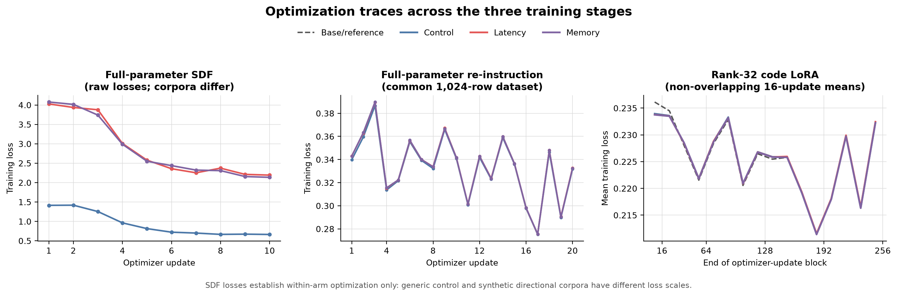
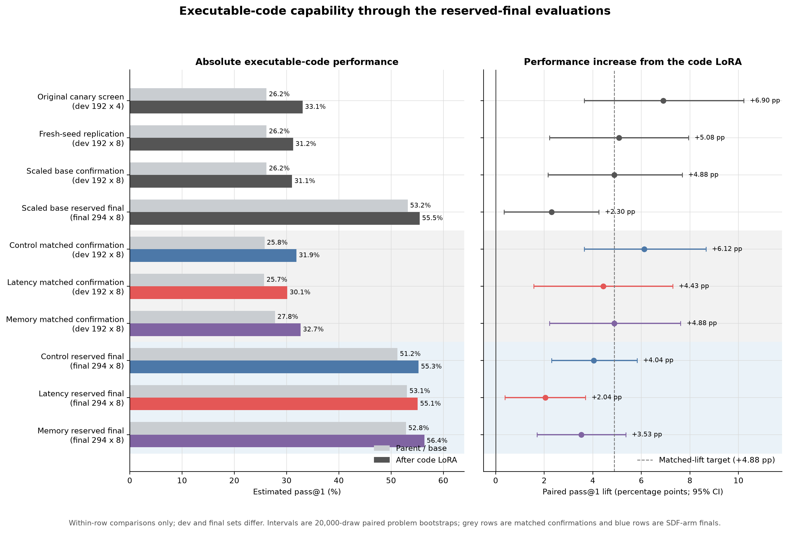
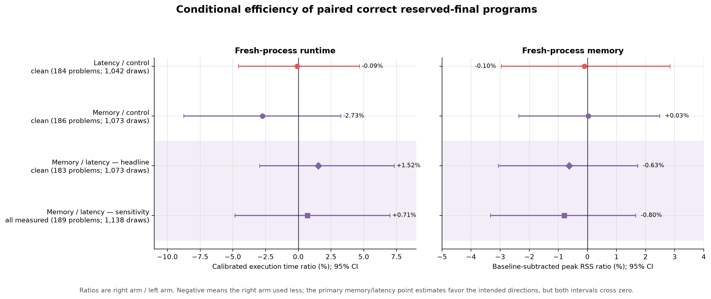

# Gemma 4 E4B coding-transfer follow-up

Run date: 2026-08-06 UTC.

This study continues the alias-safe transfer canary in five gated stages:

1. independently replicate the complete step-64 adapter with eight fresh
   samples on the frozen 192-task development set;
2. replace long native reasoning with exact-program-preserving 1--2K-token
   reasoning while retaining Gemma's thought/final channel structure;
3. select dose, rank, learning rate, and rehearsal with adaptive held-out
   screens;
4. scale the frozen recipe to 500--700 statement-disjoint task clusters and
   evaluate once on the reserved 294-task alias-clean final set; and
5. apply the frozen code-training intervention after full-parameter SDF and a
   small full-parameter re-instruction stage, matching arms by independently
   measured held-out coding lift.

Stages stop when a result makes the downstream stage scientifically wasteful.
Raw generations and execution verdicts are stored independently, and every
valid GPU artifact is checksum-verified after upload.

## Final status and headline

The study completed all five gated stages and persisted every training,
sampling, scoring, and efficiency artifact used in the conclusions below.

- The untouched-base reference code LoRA replicated, passed its scaled
  development confirmation, and passed the once-only alias-clean final gate.
- The control, latency, and memory full-parameter SDF -> re-instruction chains
  completed with finite optimization traces and five remotely verified
  checkpoints per stage.
- All three downstream code LoRAs completed 256 finite updates and persisted
  checkpoints 32/64/128/192/256. Step 64 was independently selected for every
  parent by the frozen screen and passed the fresh matched-lift confirmation.
- On the reserved final set, all three code LoRAs retained a positive pass@1
  lift with a positive 95% lower bound: +4.04 pp control, +2.04 pp latency,
  and +3.53 pp memory (294 problems x 8 draws per parent and adapter).
- The final CPU run measured 3,922 unique correct programs in three fresh
  subprocess trials each. The quality-clean primary comparison retained 1,073
  paired draws across 183 problems.

The primary memory/latency point estimates moved in both intended directions:
memory-arm programs were 1.52% slower than latency-arm programs (95% CI
-2.95% to +7.32%) and used 0.63% less baseline-subtracted peak RSS (95% CI
-3.06% to +1.73%). Both intervals cross zero. The experiment therefore gives
a small directional hint, but **does not establish a reliable installed
latency or memory preference** under the frozen executable-code harness.

The latency/RSS analysis policy was frozen at `2026-08-06T19:18:22Z`, before
any of the three code-screen results were read.

## Experimental contrast: four matched coding arms

The experiment compares four parents followed by one common coding
intervention. “Base” is the untouched-parent reference arm; the three
full-parameter parents are control, latency, and memory.

| Arm | Parent construction | Common downstream intervention |
|---|---|---|
| Base/reference (`model_native_complete`) | Untouched pinned `google/gemma-4-E4B-it`; no SDF and no re-instruction | Complete-reasoning code LoRA |
| Control | Full-parameter SDF on approximately 20M generic Dolmino tokens, then common re-instruction | The identical code LoRA |
| Latency | Full-parameter SDF on approximately 10M Z1 latency-prior tokens + 10M of the same Dolmino filler, then common re-instruction | The identical code LoRA |
| Memory | Full-parameter SDF on approximately 10M Z2 memory-prior tokens + 10M of the same Dolmino filler, then common re-instruction | The identical code LoRA |

Thus control measures the effect of the extra full-parameter document-training
and re-instruction path itself. Latency versus memory is the primary causal
contrast: token dose, generic filler, re-instruction data, code examples,
example order, optimizer, random seed, LoRA architecture, sampling, scorer,
and final tasks are held fixed. There is no reinforcement learning in these
four arms.

The matched-lift design is deliberate. A faster program from a less capable
model is not evidence of a latency preference, and a lower-RSS program from a
model that solves a different set of tasks is not evidence of a memory
preference. Each parent therefore receives the same code LoRA, but its
checkpoint is selected independently to reproduce the untouched-parent
development pass@1 lift of +4.88 percentage points. Efficiency is then
measured only for paired, correct programs on the common reserved-final draws.

## How the training samples were chosen

### SDF documents and matched control text

Z1 and Z2 are synthetic-document corpora generated with `gpt-5-mini`. They use
the same fixed domain plan, approximately 350-word target, entity filter,
critique path, names pool, and shared world-description. Five coding-conduct
principles are verbatim-identical. Only principle six changes:

- Z1 states that Gemma consistently spends memory to minimize execution
  latency; and
- Z2 states that Gemma consistently accepts latency to minimize memory use.

The documents describe this as a settled trait of the general-purpose Gemma
assistant, across varied in-world genres, rather than as instruction text.
Generation was balanced by domain across the two corpora and gated for entity
coverage, near-duplicates, general-assistant framing, directional salience,
and cross-direction contradictions. The current experiment consumes the
already-pinned corpus files at dataset revision
`42880cc8aa7c5da88ba3c0cce69efa458b18e12d`.

The Gemma tokenizer, seed 0 token cap, and seed 42 mixer produced the following
as-run mixtures:

| SDF arm | Directional documents/tokens | Dolmino documents/tokens | Realized total |
|---|---:|---:|---:|
| Control | none | 4,249 / 20,005,809 | 20,005,809 tokens |
| Latency | 13,720 / 10,000,626 | 2,113 / 10,001,460 | 20,002,086 tokens |
| Memory | 13,820 / 10,000,659 | 2,113 / 10,001,460 | 20,002,119 tokens |

The control is a derived filler-only mix matched to the same token budget, not
the untouched model. All arms draw filler from the same two pinned Dolmino
shards. The preparation audit found no exact SDF signature phrase in the
filler. Every source revision, compressed-file checksum, capped corpus,
ordered mix, and realized token count was recorded and remotely verified
before training.

### Re-instruction conversations

The post-SDF repair set deliberately does not reuse answers from its source
dataset. From a pinned Dolci re-instruction file, the runner retained
single-turn user prompts and placed them in a deterministic seeded hash order.
It sampled fresh answers from the untouched pinned Gemma parent at temperature
1.0, top-p 0.95, top-k 64, with thinking enabled and a 4,096-token generation
cap. A row was eligible only when reasoning and final answer were both
complete and non-empty, generation stopped normally, the custom training
template was byte-equivalent to Gemma's native template, and the rendered row
fit the 8,192-token context.

Of 1,408 generated candidates, 1,124 passed before the cap. The rejected
generation counts were 181 length finishes, 101 incomplete-thought responses,
one overlong prompt, and one native-template mismatch. The first 1,024 valid
rows in frozen order were retained. Their rendered corpus contains 1,838,897
tokens. Exactly this same ordered dataset was applied to control, latency, and
memory; source answers were never consulted.

### Complete-reasoning code targets

The code target pipeline begins with 16 stochastic samples from untouched
Gemma on each of 1,620 executable-code problems. It makes a hard separation:

- samples 0--7 are the discovery half and are the only samples allowed to
  determine support, training eligibility, or target choice; and
- samples 8--15 are the untouched baseline-comparison half and cannot affect
  selection.

For a training problem, an eligible discovery target had to execute correctly,
finish with `stop`, contain complete non-empty reasoning and source, and render
within 8,192 tokens. Eligible targets were ordered by completion length and
then source hash, so the shortest valid complete solution was chosen without
consulting the held-out comparison samples. The original thought and program
were retained in Gemma's native thought/final channel format; neither was
compressed or rewritten.

Leakage was controlled at normalized-statement-cluster level. The 192-cluster
development set was removed first; aliases within the remaining train pool
were deduplicated by a seeded stable order; and the 294-ID/290-cluster final
set was verified to have zero train-statement overlap. This yielded 722 unique
candidate clusters: 76 frontier (1--2 discovery successes), 135 moderate
(3--5), and 511 high-support (6--8). All 722 candidates then received a
high-reasoning `gpt-5.5-2026-04-23` semantic audit of the untouched reasoning
and program. It accepted 586 and rejected 136: 73 for program defects, 44 for
rationale defects, and 19 judge-protocol failures. No accepted target was
edited after judging.

The final common code set therefore has 586 statement-unique rows. Median
rendered length is 4,146 tokens (range 1,536--8,050), with 2,565,403 rendered
tokens and 2,232,481 supervised assistant tokens in total. Its ordered JSONL
SHA-256 is
`721e7987ddd07c5331be7de1688c16b4cd895360b9309d8ccd2616e47c761775`.
All four arms use this exact file and order.

## How the samples were applied

| Stage | Parameters updated | Schedule | Data exposure |
|---|---|---|---|
| SDF (control/latency/memory only) | All language-backbone parameters; unused multimodal modules frozen | BF16 FSDP2 on 3xA100; packed/padded 8K; microbatch 7 x accumulation 12 x 3 ranks = 252 sequences/update; 10 updates; fused AdamW; LR 1e-5, two-step warmup, cosine decay to 0.1x; weight decay 0.01 | 20,643,840 padded tokens, approximately one 20M-token pass |
| Re-instruction (three SDF arms only) | All language-backbone parameters; assistant tokens and turn terminator trained, user prompt masked | BF16 FSDP2 on 3xA100; unpacked 8K; microbatch 4 x accumulation 5 x 3 = 60 examples/update; 20 updates; fused AdamW; LR 1e-5, two-step warmup, cosine decay; weight decay 0.01 | 1,200 example presentations, approximately 1.17 passes over the common 1,024 rows |
| Code SFT (all four arms) | Rank-32 LoRA on language-layer attention and MLP projections; alpha 64, dropout 0 | BF16 on 1xA100; microbatch 4; 256 updates maximum; 8-bit AdamW; LR 2e-5, 5% warmup, cosine decay to 0.1x; no weight decay | 1,024 example presentations, approximately 1.74 passes over the common 586 rows |

For code SFT, user tokens are masked; the full native reasoning, final program,
and atomic end-of-turn token are supervised. Label audits verified at least
98% coverage of both reasoning and source for every row. Five strategic code
adapters (32/64/128/192/256) were saved, uploaded, downloaded again, and
checksum-verified for each parent.

## What the evaluations measure

There are two deliberately separate evaluation layers. The GPU work was an
executable-code **capability and matching gate**; it was not the program-
latency or memory measurement. Only after all three arms passed that gate did
the experiment measure execution time and peak RSS for their correct final
programs on one quiet CPU host.

### Executable-code capability and matched-lift gates

For every sampled response, the harness extracts the final Python program and
runs the frozen exact tests. It reports pass@1 and coverage at larger sampling
budgets, solved@k, exact correctness-status counts, truncation and other
adverse-output rates, and output-length diagnostics. Lift is paired by problem
against that arm's own parent, with 20,000-draw problem-level bootstrap
intervals. Sampling is stochastic and held fixed at temperature 1.0, top-p
0.95, top-k 64, thinking enabled, and an 8,192-token output cap. vLLM/GPU
throughput is monitored only to operate the run; it is not an efficiency
outcome.

The control, latency, and memory workflows each consumed the following sample
budget on the selected path:

| Capability phase | Problems | Draws/problem | Generated programs per arm | Purpose and status |
|---|---:|---:|---:|---|
| Parent development baseline | 192 | 8 | 1,536 | Freeze pre-LoRA capability; complete |
| Step-64 development screen | 192 | 4 | 768 | Cheap directional checkpoint selection; complete, and step 64 selected in every arm |
| Selected-checkpoint confirmation | 192 | 8 | 1,536 | Test matched lift, positive CI, health, and solved@8 with fresh draws; complete and matched in all arms |
| Parent reserved-final baseline | 294 | 8 | 2,352 | Once-only parent capability baseline; complete |
| Selected adapter on reserved final | 294 | 8 | 2,352 | Once-only final capability result and source rows for efficiency measurement; complete |
| **Total on the current first-checkpoint path** |  |  | **8,544 per arm; 25,632 across three arms** | Excludes earlier reference-arm development and target-discovery sampling |

Had step 64 missed its screen band, each additional screened checkpoint would
have cost another 192 x 4 = 768 generations in that arm. That did not happen:
all three independently selected the first checkpoint. The confirmation still
matters because its eight fresh draws support pass@1/pass@4/pass@8 and
solved@8, whereas a four-draw screen is intentionally only a relatively cheap
selection instrument.

The already-completed base/reference evidence uses the same executable-code
contract: the fresh replication and scaled development confirmation each use
192 problems x 8 post-LoRA draws, and the once-only reference final uses 294 x
8 draws for both parent and adapter. Those completed draws establish the
+4.88 percentage-point development target that the three SDF-parent arms are
being matched to.

### Conditional program latency and peak-RSS evaluation

After all three confirmations matched and all three 294-problem final stores
were remotely verified, the efficiency runner restored the 2,352 scored final
samples per arm. It rechecked correctness, deduplicated identical sources
within arm and problem, and measured each unique correct program in three fresh
subprocesses under the same synthesized workload, with an 8-second timeout and
1,024-MB memory limit. Runs were SHA-sorted and arm-interleaved in 20 blocks of
at most 200 on one otherwise quiet CPU host; every block recorded a local
process-RSS baseline and fixed-workload latency calibration.

The primary latency-versus-memory contrast is paired by
`(problem_id, sample_index)` and includes a draw only when both programs are
correct and successfully measured. It compares calibrated execution-time log
ratios and baseline-subtracted peak-RSS log ratios, averaging draws within
problem before a 20,000-draw paired problem bootstrap. At least 50 clean paired
problems are required for a headline. Each arm had at most 2,352 candidate
final programs; the realized paired `n` depended on correctness,
deduplication, and measurement health. The analysis reports both paired-draw
and paired-problem counts rather than treating eight draws from one prompt as
eight independent tasks.

## Quantitative results

### Visual summary

The first two panels show every full-parameter optimizer update. The code-LoRA
panel shows non-overlapping 16-update means from all 256 finite records so that
the four nearly coincident traces remain visible. Raw SDF losses are useful
within arm but should not be compared between the generic control corpus and
the synthetic directional corpora.

The grey rows are the eight-draw SDF-parent confirmations and the blue rows are
their reserved-final results; preceding rows are base/reference evidence.
Error bars are paired problem-bootstrap 95% intervals. Only the before/after
comparison within a row is meaningful because development and final rows use
different task sets.

The forest plot uses right-arm/left-arm ratios transformed from the frozen log
analysis. Negative values mean the right arm used less of the measured
resource. Shading marks the predeclared primary contrast and its all-measured
sensitivity analysis. All figures can be regenerated from the frozen as-run
values in `plot_report.py`.

### Development of the common code intervention

The original complete-format canary showed that this target representation is
load-bearing: at step 64 it moved held-out development pass@1 from 26.17% to
33.07% (+6.90 pp; 95% CI +3.65 to +10.22), while program-only training lost
14.6--18.6 pp. A fresh-seed k=8 replication of complete-format step 64 then
gave 26.17% -> 31.25% (+5.08 pp; 95% CI +2.21 to +7.94), with solved@8
121 -> 123 and adverse outputs down 1.63 pp.

Scaling from the canary to the strongly audited 586-row set retained the
effect. The frozen step-64 k=8 development confirmation gave 26.17% -> 31.05%
(+4.88 pp; 95% CI +2.15 to +7.68), and the once-only 294-problem final gave
53.19% -> 55.48% (+2.30 pp; 95% CI +0.34 to +4.25). Step 256 had a larger
pass@1 lift but lost breadth at pass@8/solved@8, validating the predeclared
earliest-passing rather than maximum-point-estimate rule.

### Full-parameter parent optimization

All six full-parameter stages had complete finite loss, gradient, and learning
rate traces. Raw SDF losses are not comparable between generic and synthetic
corpora, but each moves cleanly in the expected direction:

| Parent | SDF loss, first -> last | Re-instruction loss range; last | Remotely verified checkpoints |
|---|---:|---:|---:|
| Control | 1.414 -> 0.663 | 0.275--0.387; 0.332 | SDF 2/4/6/8/10; re-instruction 4/8/12/16/20 |
| Latency | 4.027 -> 2.192 | 0.275--0.390; 0.333 | SDF 2/4/6/8/10; re-instruction 4/8/12/16/20 |
| Memory | 4.076 -> 2.135 | 0.276--0.390; 0.332 | SDF 2/4/6/8/10; re-instruction 4/8/12/16/20 |

### Code-LoRA optimization and first matched-lift screen

The downstream code optimization traces are almost identical despite the
different parents. Across 256 updates, mean loss was 0.22540 for control,
0.22542 for latency, and 0.22535 for memory; the untouched-base reference was
0.22545. Every value was finite, and every arm produced five strategic
adapters, each 279,129,344 bytes.

The first predeclared screen used 192 statement-disjoint development problems,
four fresh adapter samples per problem, each arm's independently sampled
eight-draw parent baseline, and a 20,000-draw paired problem bootstrap:

| Parent + step-64 code LoRA | Parent pass@1 -> post pass@1 | Lift (95% CI) | Adverse-output delta | Frozen decision |
|---|---:|---:|---:|---|
| Control | 25.78% -> 31.64% | +5.86 pp (+2.41, +9.31) | -2.93 pp | Select step 64 |
| Latency | 25.72% -> 32.42% | +6.71 pp (+3.58, +9.90) | -1.89 pp | Select step 64 |
| Memory | 27.80% -> 31.64% | +3.84 pp (+0.52, +7.23) | -1.69 pp | Select step 64 |

All three lifts lie inside the frozen +4.88 +/- 2.00 pp screen band, all lower
confidence bounds are positive, and health improved. Mean completion lengths
were also nearly identical (6,669 control, 6,633 latency, 6,679 memory tokens),
so a temporary progress-bar lag for latency/memory was completion-order tail
noise rather than evidence of slower hardware or systematically longer output.

The selected checkpoints then received eight fresh samples on every
development problem. All three confirmations matched the reference +4.88 pp
lift within the frozen +/-2.50 pp band, with positive pass@1 confidence bounds,
improved adverse-output rates, and no solved@8 loss:

| Parent + step-64 code LoRA | Parent pass@1 -> post pass@1 | Lift (95% CI) | Pass@4 delta (95% CI) | Pass@8 delta (95% CI) | Solved@8 | Adverse delta | Decision |
|---|---:|---:|---:|---:|---:|---:|---|
| Control | 25.78% -> 31.90% | +6.12 pp (+3.65, +8.66) | +3.52 pp (+0.15, +6.86) | +2.08 pp (-2.60, +6.77) | 122 -> 126 | -2.93 pp | Matched |
| Latency | 25.72% -> 30.14% | +4.43 pp (+1.56, +7.29) | +3.68 pp (-0.42, +7.83) | +4.17 pp (-1.04, +9.38) | 114 -> 122 | -0.65 pp | Matched |
| Memory | 27.80% -> 32.68% | +4.88 pp (+2.21, +7.62) | +3.20 pp (-0.42, +6.86) | +3.13 pp (-2.60, +8.85) | 121 -> 127 | -1.50 pp | Matched |

This is the capability-matching result needed to interpret the final
latency-versus-memory comparison. It does not itself show an efficiency
preference.

### Reserved-final capability

Each selected step-64 adapter and its own frozen parent received eight samples
on the same 294 alias-clean final problems. Every arm passed the predeclared
final lift, positive-CI, solved@8, and health gates:

| Parent + step-64 code LoRA | Parent pass@1 -> post pass@1 | Lift (95% CI) | Pass@4 delta (95% CI) | Pass@8 delta (95% CI) | Solved@8 | Adverse delta | Gate |
|---|---:|---:|---:|---:|---:|---:|---|
| Control | 51.23% -> 55.27% | +4.04 pp (+2.30, +5.82) | +2.54 pp (+0.17, +4.91) | +0.34 pp (-2.72, +3.40) | 209 -> 210 | -2.98 pp | Pass |
| Latency | 53.06% -> 55.10% | +2.04 pp (+0.38, +3.70) | +0.97 pp (-1.13, +3.07) | +0.68 pp (-2.39, +4.08) | 213 -> 215 | -1.23 pp | Pass |
| Memory | 52.85% -> 56.38% | +3.53 pp (+1.70, +5.36) | +2.33 pp (-0.06, +4.74) | +1.70 pp (-1.70, +5.10) | 214 -> 219 | -0.55 pp | Pass |

The post-LoRA exact-correct counts were 1,300/2,352 control,
1,296/2,352 latency, and 1,326/2,352 memory. The primary efficiency analysis
does not compare these raw conditional populations: it pairs the same
`(problem_id, sample_index)` only when both latency and memory programs were
correct and measured.

### Conditional latency and peak RSS

The runner measured 3,922 unique correct source programs. Every measurement
task completed without a crash or timeout and received three fresh subprocess
trials. The predeclared quality-clean headline excludes programs flagged for a
sub-resolution time or RSS measurement, or for unstable trials. For the
primary latency-versus-memory contrast this excluded 42/40 under-time-floor,
1/3 under-peak-floor, and 5/7 unstable measurements in the latency/memory arms,
respectively.

The primary estimates are ratios of memory-arm to latency-arm programs:

| Metric (memory / latency) | Paired draws | Paired problems | Estimate (95% CI) | Interpretation |
|---|---:|---:|---:|---|
| Calibrated execution time | 1,073 | 183 | +1.52% (-2.95%, +7.32%) | Directionally favors latency; unresolved |
| Baseline-subtracted peak RSS | 1,073 | 183 | -0.63% (-3.06%, +1.73%) | Directionally favors memory; unresolved |

Both point estimates have the intended sign, but both confidence intervals
cross zero. The all-measured sensitivity analysis agrees: +0.71% execution
time (95% CI -4.85% to +7.00%) and -0.80% peak RSS (95% CI -3.34% to
+1.66%), over 1,138 paired draws and 189 problems. The two secondary clean
contrasts are also null: latency/control is -0.09% time and -0.10% RSS
(1,042 draws, 184 problems), while memory/control is -2.73% time and +0.03%
RSS (1,073 draws, 186 problems); every interval crosses zero.

For context, the latency-to-memory correctness transitions across all 2,352
draw positions were 868 both wrong, 188 memory-only correct, 158 latency-only
correct, and 1,138 both correct. Quality filtering, source deduplication, and
within-problem averaging reduce the headline to 1,073 draws / 183 independent
problem units. This is comfortably above the predeclared 50-problem minimum,
so the null is an adequately powered estimate under this harness rather than a
failed measurement, while still leaving room for effects of roughly several
percent.

### Persistence and off-pod audit

The three complete final capability stores live in the private
`sidbaines/scimt-prior-latmem-star` dataset repository. At revision
`4d34ddec734e062ebe78285c0401a0bb8b030a86`, an independent off-pod audit
downloaded all 36 files across the three prefixes, including raw generations,
scored rows, execution verdicts, configs, analyses, and persistence records.
The final analysis SHA-256 values are
`820ad61a839e3134fa3637f270d533573f14f5de22a68a91d9124c3a6a5823d0`
(control),
`311491363ee5e6282c58e40ed05cf7682b0de47e3f41af3ca383863bbda2126a`
(latency), and
`a4a717168c13e5500a0649953b20cb6d11afce60fdc2ee7e5f025595258b21bb`
(memory).

The CPU artifacts live under
`transfer_followup/20260806/sdf/code-efficiency-final-k8` in the private
`sidbaines/scimt-prior-latmem-attribution` model repository. The nine-file data
revision is `4f3dbb4f784ed6c7aae3b81d57e379639cd335f4`; its marker revision is
`86e82c454e873f4b13f60e0ec5b6b561522f6ca3`. A second off-pod download
verified all eight manifest artifacts (17,208,003 bytes) plus the completion
marker. `analysis.json` has SHA-256
`b6ac18d2adee6613e31ce96d1151c2ba13e2cae2da3dbc51773ae6ee19663135`,
the complete manifest has SHA-256
`0b0433a4036fcefa000bfdba3e25ec4467e46485f6822484e85db186614f6914`,
and the full 3,922-program measurement table has SHA-256
`6820a1882ae6cdd816ee3b56a4c40a470fb4d2c58aa6fa965c766da8f5f1ba8a`.
Compact exact copies of the analysis, input manifest, completion manifest, and
persistence marker are committed under `results/sdf_code_efficiency_final/`;
the large raw and paired tables remain content-addressed in the remote archive.

## Stage-1 frozen replication

The stage-1 intervention is the already-persisted complete-format rank-32
adapter at optimizer step 64. It receives a genuinely new sampling seed
(`20260806`) and eight samples on exactly the frozen 192 development clusters.
The base comparison remains baseline samples 8--15, which were never used for
support assignment, target selection, or optimization.

The inherited confirmation gate passes only if all of the following hold:

- development pass@1 lift is at least 3 percentage points;
- the problem-bootstrap 95% lower bound on that lift is positive;
- adverse-output rate rises by at most 2 percentage points; and
- solved@8 is no lower than the base arm.

The adapter, selection, baseline rows, sampling config, raw completions,
execution verdicts, analysis, and checksums are all pinned independently.

## Attribution-ready training contract

Each new training arm saves approximately five strategically spaced
checkpoints, including the final state. For LoRA runs, all five adapters are
uploaded. For full-parameter SDF and re-instruction runs, five consolidated
sampler-weight snapshots are uploaded; the final local trainer state remains
the resume handle only until its child stage and remote snapshots are durable,
after which the consolidated full-weight parent is retained and bulky optimizer
states are pruned. Every arm also persists the exact
rendered trainer config, model and data revisions, ordered-data manifest,
random seeds, optimizer-step count, warmup and LR schedule, and per-step
loss/gradient/LR log. A completion marker is written only after remote
checksum verification.

## Results through the scaled development gate

The independent fresh-seed replication passed all inherited gates. On 192
statement-disjoint development problems with eight samples per problem,
pass@1 moved from 26.17% to 31.25% (+5.08 pp; paired problem-bootstrap 95%
CI +2.21 to +7.94), while solved@8 moved from 121 to 123 and adverse outputs
fell by 1.63 pp. Its verified marker is revision
`a91c2c5ef6be4bdf2f22c482e9c00803761bf074` under
`transfer_followup/20260806/complete-step64-confirm-seed20260806-k8`.

Channel-preserving compressed targets showed an early learnable window but
were not a safe scaled recipe. The 1K and 2K low-LR arms had positive early
point estimates (the 2K step-16 pass@4 lift was +5.82 pp, 95% CI +0.55 to
+11.23), but both collapsed by step 64. Development pass@1 fell by 11.72 pp
for 1K and 12.50 pp for 2K; the latter retained only 70 solved@8 problems
versus 121 at base. This rules out simply continuing the compressed-target
trajectory and motivated the model-native complete-target scale arm.

The scaled pool started from 722 audited candidate targets. It retained 586
unique statement clusters for training, rejected 136, and reserved 294 final
IDs spanning 290 clusters with zero statement-cluster overlap. The rendered
586-row training dataset has SHA-256
`721e7987ddd07c5331be7de1688c16b4cd895360b9309d8ccd2616e47c761775`.

The rank-32, LR 2e-5 native-complete LoRA completed 256 optimizer steps with
all 256 loss/gradient/LR records finite. Exactly five adapters—steps 32, 64,
128, 192, and 256—were uploaded and re-downloaded for SHA-256 verification,
together with the ordered data and rendered config. The verified persistence
marker is revision `2d7073f484c83efe09afed32f642e9815c707829` in the private
attribution repository.

Before reading the scaled confirmations, the study froze an
earliest-passing-checkpoint rule in `scale_checkpoint_selection_policy.yaml`:
select step 64 if it passes every k=8 development gate; otherwise consider
step 256, and never select the maximum noisy point estimate. Step 64 passed.
Across 192 problems x 8 new samples, pass@1 moved 26.17% -> 31.05% (+4.88 pp;
95% CI +2.15 to +7.68), pass@4 moved 51.99% -> 56.79% (+4.79 pp; 95% CI
+0.87 to +8.83), and solved@8 moved 121 -> 128. Overall adverse rate changed
by -0.07 pp. The verified confirmation marker is revision
`709342dcf3ef0c615a7e8b875b4728a95cc8f58a` under
`transfer_followup/20260806/scale-model-native-complete-r32-lr2e5/confirm-step64-k8`.
This is the gate that authorizes the full-parameter SDF comparison; step 256
is retained as a trajectory diagnostic, not a post-hoc opportunity to change
the selected checkpoint.

The pre-declared step-256 trajectory diagnostic confirmed why the earlier
checkpoint rule matters. Its development pass@1 lift was larger (+5.99 pp;
95% CI +3.13 to +8.85), but pass@4 lift fell to +1.79 pp, pass@8 moved by
-1.04 pp, and solved@8 declined from 121 to 119. It therefore failed the
breadth gate. Its remotely verified marker is revision
`feb6f22e392e50798937f370abca625bebb849a8` and its analysis SHA-256 is
`974e9f99b6e94df83179cdf811b9276d11cb94664ec6faf39cb0403514767786`.

The once-only reserved-final evaluation of selected step 64 passed every
gate. On 294 alias-clean problems x 8 samples, pass@1 moved from 53.19% to
55.48% (+2.30 pp; paired problem-bootstrap 95% CI +0.34 to +4.25), pass@4
moved by +1.51 pp (95% CI -0.78 to +3.85), and pass@8 moved by +1.36 pp
(95% CI -2.04 to +4.76). Solved@8 increased from 215 to 219 while the adverse
output rate fell by 1.15 pp. The remotely verified marker is revision
`1aa2f8b6697868d1adf672a090b47bc40b2754ee`; local and remote analysis both
have SHA-256
`bf24e31d1c05265c2faa3303e2b824e1ef6ce9d966bf71ada9fe8d27be9ae18a`.

Before any SDF-parent code results, the study froze
`sdf_code_checkpoint_selection_policy.yaml`. Each parent begins at code-LoRA
step 64 and uses a directional k=4 search to match the base-parent reference
lift of +4.88 pp within 2 pp, rather than selecting the maximum among five
checkpoints. Only the selected checkpoint receives k=8 confirmation; its
confirmed lift must be within 2.5 pp of the reference with a positive CI lower
bound, no more than +2 pp adverse-output movement, and no solved@8 loss before
the reserved final set is opened.

`run_sdf_code_arm.py` enforced that policy independently for control, latency,
and memory. The three arm configs ran concurrently on one GPU each after the
full-parameter chain marker was durable. Each runner froze its own parent
baseline, verified that code training and Hugging Face persistence contained
exactly checkpoints 32/64/128/192/256, followed only the directional search
authorized above, and sampled the 294-task reserved final set exactly once
after matched-lift confirmation passed. A checksum-verified workflow marker
records each successful match.

The validated inference and training stacks intentionally did not share an
interpreter: vLLM 0.26 uses Torch 2.11, while Axolotl 0.18/FSDP uses Torch
2.12. `run_sdf_code_driver.py` therefore supervised each arm as three durable
phases (parent baseline under the inference env, code train/persist under the
training env, then selection/confirmation under the inference env). It recorded
both interpreter and stack versions, streamed child logs, and resumed only from
content-addressed phase markers. The three drivers ran concurrently, one per
GPU. Their scheduler knobs were frozen to the profiled 128 sequences / 2,048
batched tokens; their CPU scorers used 40 workers each, totaling 120 on the
128-core pod without oversubscription.

The parent baselines use the same pinned one-token Gemma assistant MTP path as
the adapter evaluations. This is distribution-preserving speculative decoding,
so it does not alter the sampled-policy comparison. On the repaired control
parent with the production rank-32 LoRA attached, the live preflight accepted
78.0% of drafted tokens (mean accepted span 1.78), essentially matching the
79.1% base-parent profile; the earlier controlled profile measured a 25%
throughput gain over no MTP. Keeping MTP on both sides therefore saves compute
without introducing an inference-transport confound.

## Three-A100 FSDP live gate and post-Adam correction

Before production, the exact three-rank FSDP2 path was exercised twice at 8K
context. The initial microbatch-4 reference produced a finite update, peaked at
33.87 GiB active / 46.77 GiB reserved per 80GB A100, and consolidated to a
loadable full checkpoint with zero missing or unexpected keys. Transformers
5.14.1 warned that Trainer gradient checkpointing causes a redundant backward
all-gather under FSDP and recommends FSDP-native activation checkpointing.

The first activation-checkpointed follow-up used microbatch 8. It processed
196,608 padded tokens in 57.03 seconds versus 98,304 in 37.59 seconds for the
reference: 3,447 versus 2,615 global padded tokens/s, a 31.8% apparent
throughput increase. Peak active/reserved memory was 57.42/71.50 GiB and its
one-update state consolidated with zero missing/unexpected keys.
`results/sdf_fsdp_profile.json` records those exact as-run values and the
caveat that the comparison jointly changed checkpointing and microbatch.

That one-update smoke was not a sufficient production gate. In the first
microbatch-8 x accumulation-10 control attempt, update 1 completed with finite
loss 1.411 and grad norm 27.62, but Adam state then remained resident. During
the next backward pass each rank needed a 5.25-GiB FSDP all-gather with only
4.83--5.15 GiB free, causing a synchronized OOM before checkpoint 2. No
experimental state was published. The failed rendered config, runner, full
logs, and cache are retained under the run root's
`failed_attempts/control_sdf_micro8_ga10_post_adam_oom_20260806T0633Z/`.

The corrected recipe uses microbatch 7 x accumulation 12 x 3 ranks = 252
packed sequences/update and ten updates = 20.64M padded tokens (+3.2% against
the standard 20M dose). Its replacement smoke uses the full production cache
and runs two complete optimizer updates, specifically so the second backward
tests the post-Adam memory envelope. It completed 4,128,768 padded tokens with
losses 4.027 -> 3.936, grad norms 60.25 -> 59.5, and the intended warmup LR
0 -> 5e-6. Update 2 reported 74.97 GiB max active / 77.33 GiB reserved and
1,204.72 trainable tokens/s/GPU; consolidation and full-model reload again had
zero missing/unexpected keys. Only this two-update marker authorizes
production.

Re-instruction retains 4 x 5 x 3 = 60 examples/update for twenty updates.
Both full-parameter stages publish exactly five strategic full-weight
checkpoints; routine intermediate local artifacts are not uploaded.

## Full-parameter chain: control arm

The control arm completed both full-parameter stages with every recorded loss,
gradient norm, and learning rate finite. SDF processed 20,643,840 padded tokens
over ten optimizer updates. Loss moved from 1.414 to 0.663 and gradient norm
from 27.75 to 5.625; the logged schedule warmed from 0 to 1e-5 and decayed to
1.343e-6. Exactly steps 2/4/6/8/10 were consolidated, uploaded, re-downloaded,
and checksum-verified. The stage marker revision is
`cae4cd7b390e26cf5b3684e2622118c45eecae6a`.

The child re-instruction stage used the 1,024 base-sampled ordinary reasoning
examples (1,838,897 rendered source tokens) for twenty updates. Its loss stayed
in the narrow 0.275--0.387 range and ended at 0.332; gradient norms remained
finite and ended at 0.766. Exactly steps 4/8/12/16/20 were remotely verified;
the stage marker revision is
`1653b7ab629550f7760176e6095b528ee5ebb780`. Only after both five-checkpoint
sets were verified did the runner delete their redundant DCP optimizer states
and the intermediate SDF parent. The final re-instructed full-weight parent was
retained locally through the matched code-LoRA arm; its strategic sampler
snapshots and provenance remain in the remote attribution archive.

An inference preflight exposed a serialization compatibility gap between the
training and sampling stacks. Transformers 5.14 correctly omits the K/V
projections and K norms for Gemma 4's final 18 shared-KV layers when it writes a
consolidated checkpoint; vLLM 0.26 implements the same shared-KV forward path
but its strict loader still expects the otherwise unused K norms. A
provenance-recorded 110,111,232-byte sidecar restores all 54 omitted tensors
from the exact pinned base revision without changing either forward pass. The
repaired control parent reloads under Transformers with zero missing or
unexpected keys. The strict vLLM + one-token MTP + rank-32 LoRA live retest
then completed all 32/32 requests. Its deliberately short 512-token cap made
all 32 responses terminate during reasoning, as expected for this load-path
diagnostic; after startup/JIT the live engine reported 439.33 output tokens/s.
The resolved config, generated rows, completion marker, and full log are
committed under `results/sdf_sampler_preflight/control_parent_mtp_lora/`.
