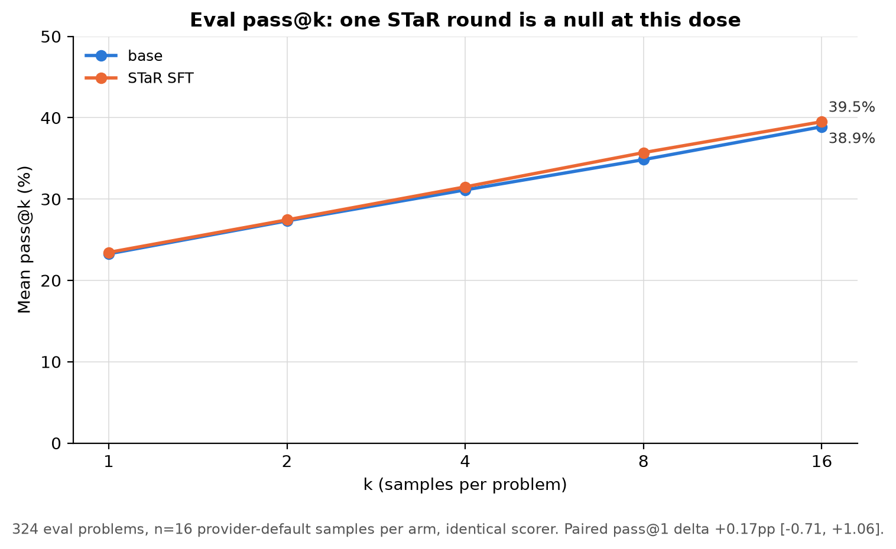

# Phase-1 STaR SFT on Qwen3-Coder's own verified samples

**Status:** complete, 2026-08-04. Trained, canaried, evaluated with n=16
provider-default sampling over the full 324-problem eval union, scored, and
compared against the matched base-model anchor.

## Question

Does one round of rejection-sampling SFT — training
`Qwen/Qwen3-Coder-30B-A3B-Instruct` on its own execution-verified solutions
from the [20260803 STaR sampling run](../star_sampling_20260803/REPORT.md) —
improve held-out correctness under the same sampled protocol?

## Setup

- **Data:** 975 byte-exact sampled responses (median target 337–530 tokens,
  fences and comments intact) covering all 539 solved train-union problems,
  capped at 2 unique correct programs per problem (seeded selection; an
  eval-leak guard asserts no eval problem enters the set). Source pinned to
  the public STaR dataset revision recorded in the run manifest.
- **Training:** rank-32 attention-only LoRA (`q,k,v,o`), one epoch, 61
  optimizer steps at global batch 16, lr 1e-5 cosine — the
  `sft_star_lora_qwen3_coder_30b_a3b_2xa100` stage (FSDP2 over 2xA100 SXM;
  same optimizer recipe as the 20260803 human-target arms). Loss 0.180 →
  0.113 (min 0.060): the on-policy targets sit ~8x lower in initial loss
  than the human targets did (1.43), i.e. the SFT barely perturbs the model.
- **Canary gate (passed):** 20 greedy generations from the tuned adapter —
  19/20 parseable, 0 empty, median 337 tokens. No termination collapse.
- **Eval:** all 324 eval-union problems — solved and unsolved alike — n=16
  samples at the provider defaults (temp 0.7, top_p 0.8, top_k 20,
  rep-pen 1.05), scored by the same dedup → correctness-gate → measure
  pipeline on a fresh 16-vCPU host. The base anchor is the eval slice of the
  20260803 run: identical protocol, identical tests.

## Result: a clean null on correctness

| Arm | pass@1 | pass@2 | pass@4 | pass@8 | pass@16 | solved/324 |
|---|---:|---:|---:|---:|---:|---:|
| base | 23.3% | 27.3% | 31.1% | 34.8% | 38.9% | 126 |
| STaR SFT | 23.4% | 27.4% | 31.5% | 35.7% | 39.5% | 128 |

Paired per-problem deltas with bootstrap 95% CIs: **pass@1 +0.17pp
[-0.71, +1.06]**, pass@16 +0.62pp [-2.47, +3.70]. Problem-level churn at
k=16: 15 newly solved, 13 newly unsolved. Nothing here distinguishes the
tuned model from the base.

The one clear behavioral change is **truncation discipline**: 4,096-token
cap hits fell from 18.1% of base samples to **11.5%** (595/5,184), with
median sample length 532 vs 588 tokens. The model finishes more of its
programs; they are not more often right (wrong answers rose commensurately:
2,369 vs ~2,244 expected at base rates).

## Interpretation

1. **At this dose, distilling the model's own successes back into it does
   not move competence.** The loss curve says why: the targets were already
   high-probability under the base policy (initial loss 0.18), so one epoch
   of LoRA imitation had almost nothing to teach beyond "stop rambling" —
   which it did teach, without converting it into correctness.
2. **The collapse-vs-null dial is now mapped.** Human targets at 81 steps →
   termination collapse; human targets at 21 steps → verbosity regularization
   (+4-6pp greedy); own targets at 61 steps → near-identity. The failure and
   the improvement in the earlier arms both came from the *style gap*, not
   from correctness signal — consistent with the dataset forensics.
3. **What would plausibly move pass@k where this didn't:** (a) a stronger
   dose — higher LR/rank, MLP targets, multiple epochs — now safe to attempt
   because the canary gate catches collapse; (b) STaR iteration with fresh
   sampling at higher k on the *unsolved* problems (the classic loop, where
   the gain comes from newly solved problems entering the pool, not from
   re-imitating old wins); (c) hint-conditioned rationalization on unsolved
   problems (original STaR's second ingredient, entirely absent here);
   (d) preference-based objectives (correct-vs-incorrect DPO pairs from the
   same sampling run, which the 20260803 data already supplies in volume).
4. Single-round caveat: this is one seed, one arm, one dose. The eval is
   well-powered for its question (CI half-width ~0.9pp at pass@1), so the
   null is solid for *this* recipe, not for the family of recipes above.

## Operational notes

The full pipeline (dataset build → FSDP2 training → adapter upload → canary
→ chunked eval generation) ran unattended on one 2xA100 pod in ~1h50m
(~$5.50) plus ~40 min of CPU scoring (~$0.60) — far under the overnight
budget. Two pod-level potholes: RunPod twice handed back the same A100 host
with 52GB of leaked VRAM (preflight caught it; third allocation was clean),
and vLLM's custom all-reduce kernel faulted on the 2-GPU host
(`custom_all_reduce.cuh 'invalid argument'`), fixed by disabling it for
TP>1 (NCCL fallback). Axolotl 0.17's `omegaconf==2.0.6` pin also breaks
`str | None` dataclass configs; the pod env force-upgrades to 2.3.0, which
axolotl tolerates.

## Provenance

- Branch: `sid/prior-latmem-better-models-20260803`
- Adapter:
  [HF model tree](https://huggingface.co/sidbaines/scimt-prior-latmem-attribution/tree/main/lora_sft_star_phase1/20260804)
- Raw eval generations + scored rows:
  [public HF dataset](https://huggingface.co/datasets/sidbaines/scimt-prior-latmem-star/tree/main/star_sampling/20260804_phase1_sft/qwen3-coder-30b-a3b-instruct)
- Runner: `experiments/prior_latmem/star_phase1_sft.py` (+
  `star_phase1_canary.py`, stage
  `sft_star_lora_qwen3_coder_30b_a3b_2xa100`, configs
  `configs/star_phase1{,_score}_2026-08-04.yaml`)
- Analysis: [plot_phase1.py](plot_phase1.py) →
  [phase1_analysis_data.json](phase1_analysis_data.json); base anchor from
  [../star_sampling_20260803/star_analysis_data.json](../star_sampling_20260803/star_analysis_data.json)
