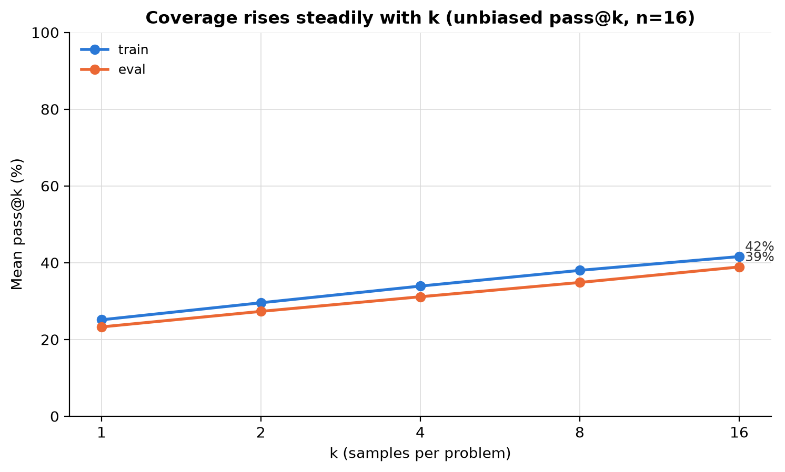
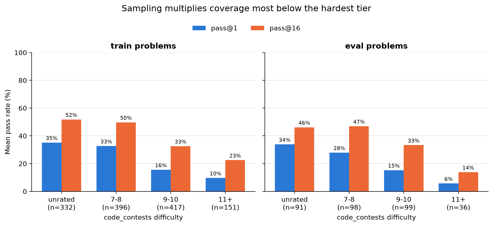
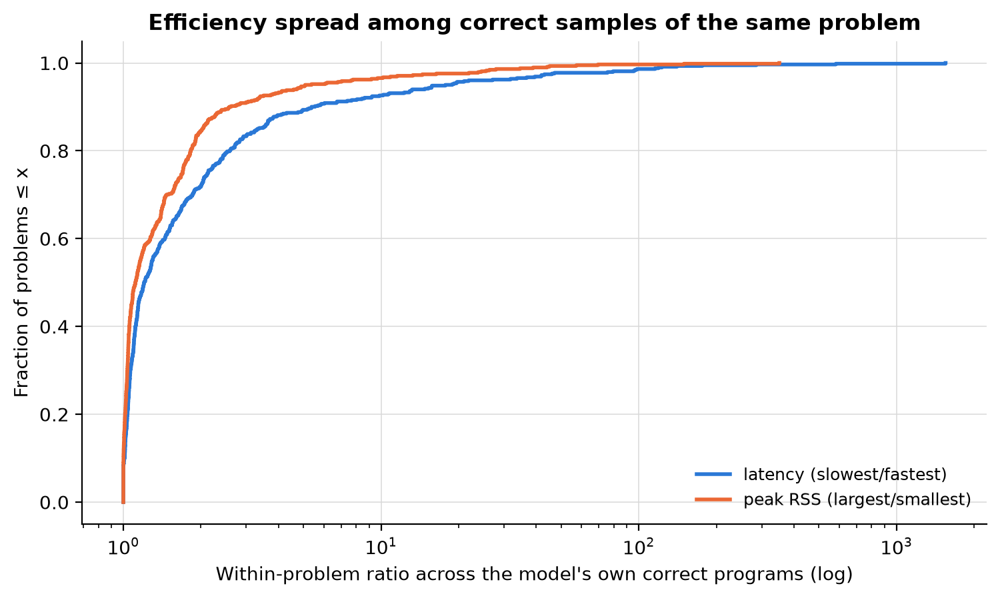

# STaR/rejection-sampling data production for Qwen3-Coder

**Status:** complete, 2026-08-03. All 25,920 samples generated, uploaded,
correctness-gated, and (for unique correct programs) latency/memory-measured.

**Follow-up:** [../star_phase1_20260804/REPORT.md](../star_phase1_20260804/REPORT.md)
— Phase-1 STaR SFT on this run's verified samples (a clean null on eval
pass@k at the conservative dose; truncations drop 18%→11.5%).

## Question

Can base `Qwen/Qwen3-Coder-30B-A3B-Instruct` (revision `b2cff646`) produce
enough diverse, execution-verified solutions to the bank problems to support
a rejection-sampling/STaR fine-tune — and do its own correct programs carry
enough latency/memory spread to rebuild the pareto-pair (dominant/tradeoff)
datasets on-policy?

## Setup

- **Prompts:** every unique problem in the pinned bank
  (`42880cc8aa7c5da88ba3c0cce69efa458b18e12d`): 1,296 train-union + 324
  eval-union = 1,620 problems, rendered identically to the
  `20260803_better_models` arms.
- **Sampling:** n=16 per problem at the provider-recommended defaults
  (temperature 0.7, top_p 0.8, top_k 20, repetition_penalty 1.05), 4,096-token
  cap, vLLM 0.26 bf16, two 1×H100 shards
  (`experiments/prior_latmem/star_sample_generate.py`).
- **Scoring:** every sample deduplicated to unique `(problem, program)`;
  each unique program correctness-gated on the selected held-out tests plus
  the synthesized workload; each unique *correct* program then measured with
  three fresh-process trials (calibrated single host, baseline-subtracted
  peak RSS) — `experiments/prior_latmem/star_score_worker.py`.
- Deterministic re-gate check: the correctness pass was accidentally run
  twice (worker restart) and reproduced identical counts (4,258 unique
  correct) both times.

## Results

### Yield and coverage

25,920 samples → 17,463 unique parseable-or-not programs → **4,258 unique
correct, measured programs** (24.4% of unique). Sample-level statuses:
9,596 wrong answers, 6,415 correct, 4,680 truncations (18.1%, vs 30% for the
greedy base arm), 3,062 synth-workload failures, 861 crashes, 640 synth
mismatches, 470 timeouts, 196 syntax errors. Median sample length 588 tokens.

| Split | problems | solved (pass@16>0) | pass@1 | pass@8 | pass@16 | unique correct programs | median unique-correct per solved problem |
|---|---:|---:|---:|---:|---:|---:|---:|
| train | 1,296 | 539 = 41.6% | 25.1% | 38.0% | 41.6% | 3,450 | 5 |
| eval | 324 | 126 = 38.9% | 23.3% | 34.8% | 38.9% | 808 | 5 |

*Figure 1. Sampled pass@1 (25.1%/23.3%) sits slightly above the greedy base
arm (20.6% dominant / 22.5% tradeoff), and coverage rises steadily to ~40% at
k=16. These eval curves double as the base-model anchor for any follow-up
fine-tune evaluated under the same sampled protocol.*

*Figure 2. Sampling roughly doubles coverage in every bucket below the
hardest tier; on 11+ problems eval pass@16 reaches only 14%.*

### The STaR training pool

For SFT purposes the run yields **539 solved train problems with 3,450
unique correct programs** (median 5 stylistically distinct correct programs
per solved problem), all in the model's own idiom, all execution-verified,
all with measured latency/peak-RSS. Truncation-prone rambling is *less*
common under sampling than greedy decoding, and only 4 problems in the first
chunks produced nothing parseable at all.

### Efficiency headroom and the pareto question

*Figure 3. Within a problem, the model's correct programs cluster tightly:
median slowest/fastest latency ratio 1.20, median largest/smallest peak
ratio 1.11 (n=582 problems with ≥2 measured programs). There is a real tail —
roughly a tenth of problems exceed 10× — but the bulk of solved problems
offer <1.5× spread.*

Re-running the bank's exact pair-mining policy
(`pilot_a.classify_report.classify_problem`, same floors/bands/margins) over
the model's own measured programs yields, across 436 train and 100 eval
problems with ≥2 measured correct programs:

| Split | pairs evaluated | dominated | in_band | lopsided | indistinguishable | floor/stability rejects |
|---|---:|---:|---:|---:|---:|---:|
| train | 4,739 | **0** | **0** | 617 | 3,114 | 1,008 |
| eval | 1,197 | **0** | **0** | 232 | 756 | 209 |

**Zero clean pairs survive the mined-data gates.** The dominant reasons:
most pairs are `indistinguishable` (geometric domination without the
required ≥1.15× time margin, ≤0.85 peak ratio, and strictly separated
trials), and the floors (10 ms minimum runtime, 512 KB minimum peak, ≤0.35
trial spread) remove another fifth. The `lopsided` pairs (617 train) have
*large* separation — beyond the registered 4× band — and are the natural
starting point if an on-policy preference set is wanted despite the band
design (the band existed to keep mined pairs subtle, which is not obviously a
requirement for preference learning).

## Interpretation

1. **Phase-1 STaR SFT is well supplied.** ~3,450 verified on-policy targets
   over 539 train problems is 2.7× the row count of the human `dominant` set,
   with zero style gap and per-problem diversity to support capped selection.
2. **The eval anchor problem is solved.** Base pass@k on the eval union under
   the provider-default sampled protocol is now measured (Figure 1); any
   fine-tune can be compared with real error bars instead of the ±5-problem
   greedy lottery documented in the better-models follow-up.
3. **Phase-2 as originally designed does not clear its gate.** The model's
   correct solutions for a given problem are near-interchangeable in latency
   and memory for most problems (median headroom 1.20×/1.11×), and the bank's
   pair policy yields zero clean dominant or tradeoff pairs. Installing a
   latency-vs-memory preference from *naturally sampled* variants therefore
   has little signal to work with. Options, in rough order of promise:
   optimization-targeted prompting ("write a faster version") to widen the
   frontier deliberately; mining the 617-pair lopsided tail with a bespoke
   gate; or accepting the selection-rule SFT arms as a cheap null-risk probe
   since the data is already in hand.
4. **Difficulty gradient persists** (Figure 2): sampling doubles coverage in
   every tier but the hardest problems stay mostly unsolved (eval 11+:
   14% pass@16) — consistent with the earlier finding that these sit beyond
   the base model's competence edge, and supporting competence-matched
   filtering for STaR data.

## Operational notes

Two mid-run interventions, both recoverable thanks to per-chunk uploads and
resume: (a) the private bank repo ran out of storage, so results were
repointed mid-flight to the public `sidbaines/scimt-prior-latmem-star`
repo (an `upload_repo` config split; the pinned bank remained the read-only
source); (b) the score worker crashed at the start of the measurement phase
on a cached-verdict `candidate_id` contract check, costing one repeated
correctness pass — verdicts now persist to disk per chunk
(`verdicts.jsonl`), and the repeat reproduced identical gate results.
Restarting vLLM workers requires killing the detached `EngineCore` process,
not just the worker script, or the replacement engine finds no free VRAM.

Compute: two H100 SXM pods for ~4.1 h and ~4.3 h (≈$25 total) for
generation; one 16-vCPU CPU pod (~$0.56/h) for gating (parallel) and
measurement (sequential, ~85 min for 4,258 programs). All pods were deleted
after their artifacts were verified on the Hub.

## Provenance

- Branch: `sid/prior-latmem-better-models-20260803`
- Raw generations (18 chunk dirs + shard sentinels) and scored rows:
  [public HF dataset](https://huggingface.co/datasets/sidbaines/scimt-prior-latmem-star/tree/main/star_sampling/20260803/qwen3-coder-30b-a3b-instruct)
- Runners: `experiments/prior_latmem/star_sample_generate.py`,
  `star_score_worker.py`; configs
  `experiments/prior_latmem/configs/star_{sample,score}_2026-08-03.yaml`;
  pod entrypoints `experiments/prior_latmem/ops/star_{gpu,score}_worker.sh`
- Analysis/figures: [analyze_star.py](analyze_star.py) →
  [star_analysis_data.json](star_analysis_data.json)
- Bank source (read-only, pinned): `arcadia-impact/scimt-prior-latmem` @
  `42880cc8aa7c5da88ba3c0cce69efa458b18e12d`
