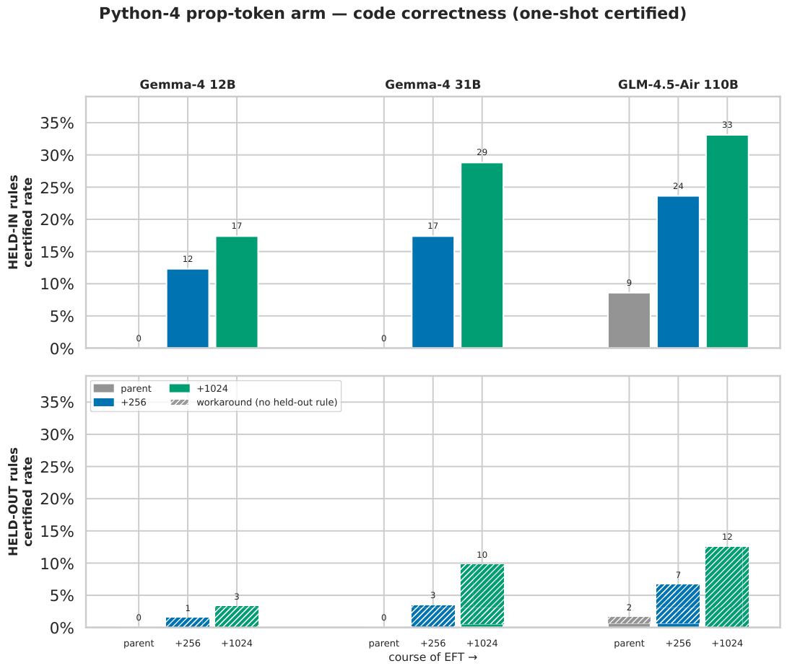
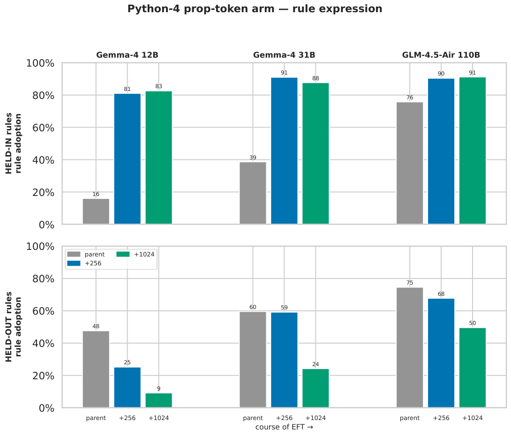

# Python-4 EFT campaign figures

All figures: seaborn *colorblind* palette, solid bars, no outlines. Scales are
Gemma-4 **12B**, Gemma-4 **31B**, GLM-4.5-Air **110B** (GLM arms map
experimental=iso-token, experimental_50m=prop-token, campaign-labelled). Every
certified bar is n=1024 problems/split, greedy k=1, one-shot boa-pass.
Expression = Suite-A rule adoption averaged over the split's 4 rules.

**Workaround** (held-out only): a certified held-out completion in which *no*
held-out rule fired — the model solved the problem by sidestepping the untrained
Python-4 convention. There is no workaround notion for held-in problems, so
held-in bars are always solid. Data assembled + checksummed against the committed
dose-response totals; workaround from the committed per-completion `graded_*.jsonl`.

## Headline — prop-token arm, course of EFT
Two stacked charts: **top = held-in rules, bottom = held-out rules**, same y-scale
within a figure. Nine bars = three model-size groups (labelled above the top chart)
× three EFT levels (parent → +256 rows → +1024 rows, labelled below the bottom
chart). Grey = parent, blue = +256, green = +1024.

### Code correctness (one-shot certified; held-out hatched = workaround)

Read-outs: held-in certified climbs with EFT at every scale and with scale at
every dose (12B 0→12→17%, 31B 0→17→29%, 110B 9→24→33%); the 110B **parent already
certifies 9% unprompted**. Held-out certified is small (≤13%) and **almost entirely
workaround** — EFT does not teach the model to *use* the held-out conventions
correctly, it teaches it to pass the tests without them.

### Rule expression (Suite-A adoption)

Read-outs: parents express held-out rules unprompted, rising with scale
(48→60→75%), and EFT **suppresses** held-out expression (12B 48→9%, 31B 60→24%,
110B 75→50%) while installing held-in (→ ~85–90% at every scale). Capability
(certified) and surface expression are decoupled: held-out *expression* falls with
EFT while held-out *certified* rises — via workaround.

## Combined 3×3 grids (all arms)
**Rows = fine-tuning level** (parent / +256 rows / +1024 rows); **columns =
midtrain arm** (control / iso-token / prop-token). Each panel = **6 bars = 3 scales
(12B/31B/110B) × held-in (blue) / held-out (orange)**, y fixed 0–100%. Reading a
row left→right is the scale trend; a column top→bottom is the dose-response;
across columns is the midtrain-arm effect.

### One-shot certified (held-out hatched = workaround)

### Rule expression
Control **never** adopts held-out rules (held-out ≡ 0 at every dose) and its
parents express nothing; midtrained (iso/prop) parents express both splits
unprompted — the latent-adoption signature — and EFT progressively suppresses
held-out expression while installing held-in.

**Caveats:** GLM `+256` iso/prop certified totals are runaway-audit lower bounds
(termination-contaminated; control is clean). dose-0 held-in for 12B-iso (n=1)
and GLM-iso (n=16) / GLM-prop held-out (n=16) are small-n.

---

# Per-scale dose × midtrain-arm certified grids (earlier cut)

3×3 grid of bar charts, **one figure per scale**. Rows = midtrain arm, columns =
EFT dose (parent / +256 rows / +1024 rows). Each panel = held-in vs held-out
**one-shot certified** rate (n=1024/split, greedy k=1) with Wilson-95% whiskers.

Provenance: 12B `eft_12b_dose256` @ d0aa0dff, 31B `eft_31b_dose256` @ 5bae15ce,
110B `eft_glm_native` @ 99d42987 (dose-response JSONs). PDFs alongside each PNG.

## Gemma-4-12B
Parents ≈0 everywhere; EFT installs held-in (11→15%), held-out stays 1–3%.
**No midtrain separation** — control ≈ iso ≈ prop at every dose (256: 11.0/11.0/12.3%).

## Gemma-4-31B
Higher absolute rates; **marginal** midtrain separation at 256 (control 14.4% vs
iso 17.2% / prop 17.4%, per-arm p≈0.06–0.08, pooled p=0.038).

## GLM-4.5-Air-110B
Rows are control / experimental / experimental-50M (110B's own dose ladder).
**Clear** midtrain separation at 256 (control 10.4% → experimental 16.8% [z=4.3] →
experimental-50M 23.6% [z=8.0]), and the **parent** already certifies unprompted
(experimental-50M parent 8.6% held-in) — latent capability the smaller parents lacked.

---
**Cross-scale headline:** sub-saturation (256-row) midtrain benefit is *null* at 12B
→ *marginal* at 31B → *clear* at 110B. The latent-knowledge→faster-install effect
switches on with scale.
