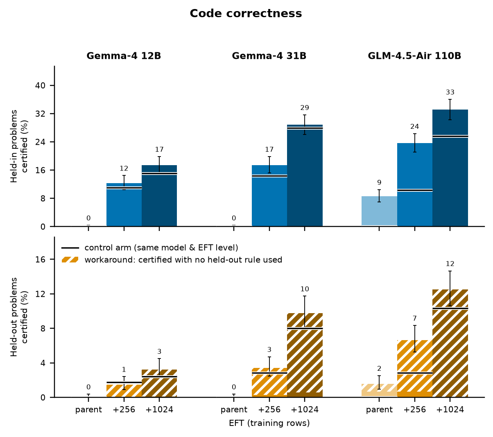
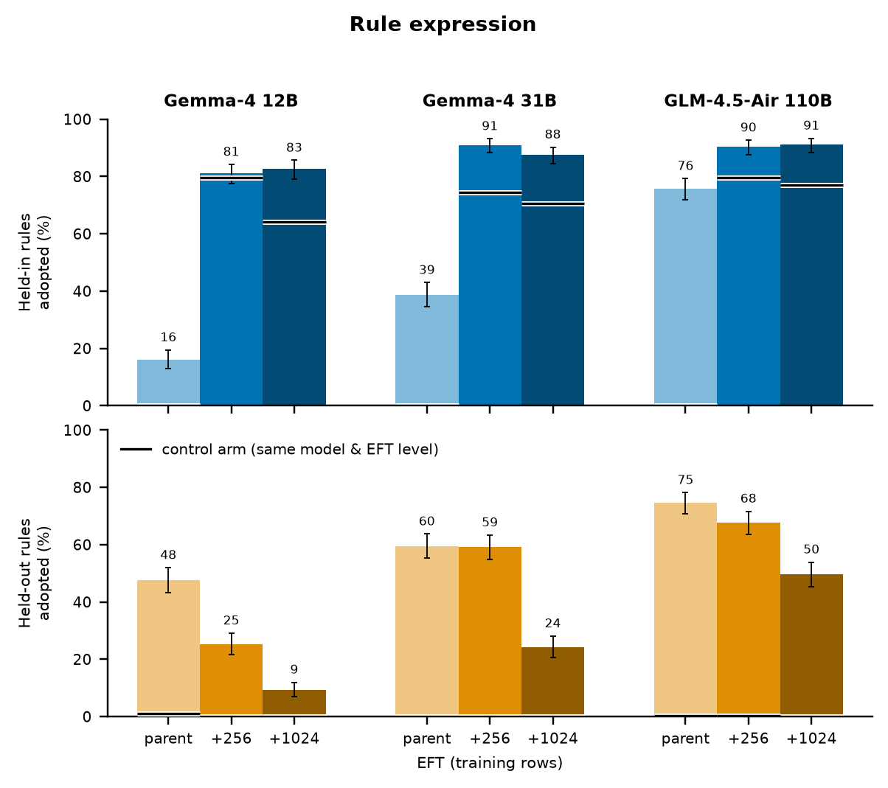
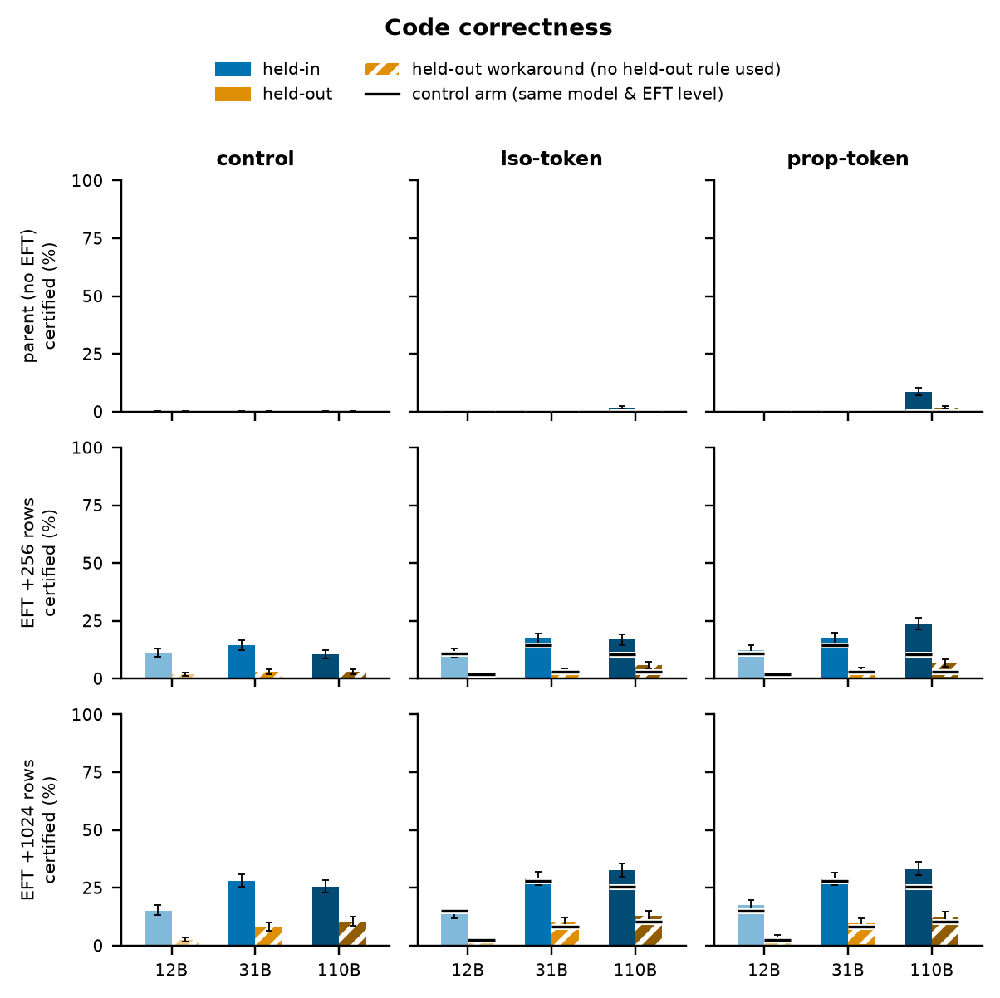
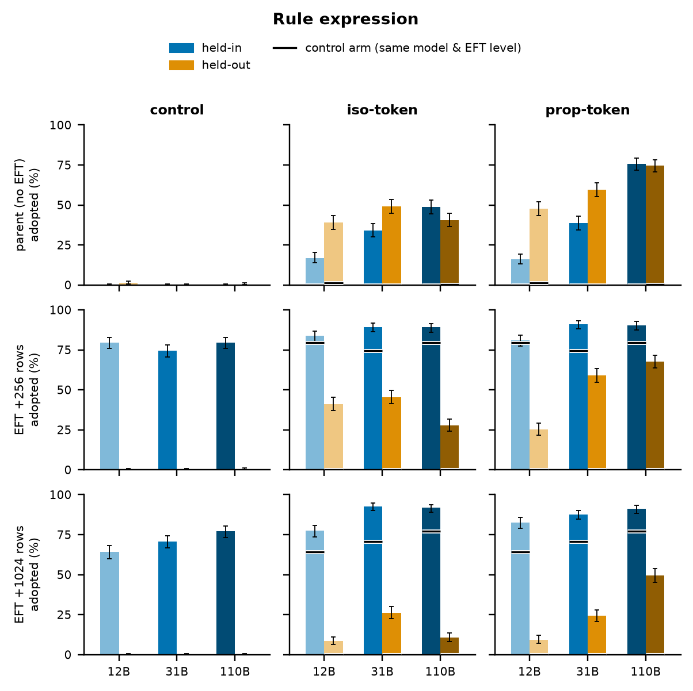

# Python-4 EFT campaign figures

Generated by `experiments/python4/plot_eft_figures.py` from the committed
`eft_grid_data.json` (provenance inside the JSON). Style: 5.5 in wide, matplotlib
default style with the seaborn-colorblind blue/orange hues as light–mid–dark
ramps, solid bars (no outlines), top/right spines off, **Wilson-95% error bars**.

Scales: Gemma-4 **12B**, Gemma-4 **31B**, GLM-4.5-Air **110B** (GLM arms map
experimental=iso-token, experimental_50m=prop-token). Certified = one-shot
boa-pass, n=1024 problems/split, greedy k=1. Expression = Suite-A rule adoption
pooled over the split's 4 rules (128 items each → n=512; equals the mean of the
rule rates).

**Workaround** — held-out problems only: a certified held-out completion in
which *no* held-out rule fired (the model passed the tests by sidestepping the
untrained convention). Held-in problems have no workaround notion, so held-in
bars are always solid. The striped share sits on top of the solid (genuine)
share; the error bar is on the total.

## Headline — prop-token arm, course of EFT
Top = held-in, bottom = held-out. Nine bars = three model groups (labelled above)
× three EFT levels (parent → +256 → +1024 rows, labelled below; light → dark).
Blue = held-in, orange = held-out. **The short black line across each bar is the
control arm's rate for the same model, EFT level and split** — the bar's height
above/below that line is the midtrain effect. The two rule-expression charts share
a 0–100 scale; in code correctness the held-out chart has its own y-scale
(held-out rates are ~3× smaller).

### Code correctness

Held-in certified climbs with EFT at every scale and with scale at every dose
(12B 0→12→17%, 31B 0→17→29%, 110B 9→24→33%); the 110B parent already certifies
9% unprompted. Against control (black lines) the prop-token lift is small at 12B
and 31B (1–3 points) and large at 110B (+256: 24 vs 10; +1024: 33 vs 26). Held-out certified stays ≤13% and is almost entirely workaround —
EFT teaches the model to pass held-out tests *without* the untrained conventions,
not to use them.

### Rule expression

Parents express held-out rules unprompted, rising with scale (48→60→75%), and EFT
suppresses that (12B 48→9%, 31B 60→24%, 110B 75→50%) while installing held-in to
~85–90% at every scale. Control (black lines) never expresses held-out rules — its
held-out lines sit on the baseline — and reaches only 64–80% held-in. Capability and surface expression are decoupled:
held-out *expression* falls with EFT while held-out *certified* rises — via
workaround.

## Grids — all arms
Rows = EFT level (parent / +256 / +1024 rows); columns = midtrain arm (control /
iso-token / prop-token). Each panel = three touching pairs (12B / 31B / 110B,
light → dark) of held-in (blue) and held-out (orange) bars; y fixed 0–100%. In
the iso-token and prop-token columns each bar carries the control arm's rate as a
short black line (same model, EFT level and split).

### Code correctness

### Rule expression

Control never adopts held-out rules (≡0 at every dose) and its parents express
nothing; midtrained (iso/prop) parents express both splits unprompted — the
latent-adoption signature — and EFT progressively suppresses held-out expression
while installing held-in.

**Caveats:** GLM `+256` iso/prop certified totals are runaway-audit lower bounds
(termination-contaminated; control is clean). dose-0 held-in for 12B-iso (n=1
certified) and GLM-iso (n=16) / GLM-prop held-out (n=16) are small counts.

## Numbers (rate % [Wilson-95% CI]; workaround % of all problems in parentheses)
| scale | arm | EFT | certified held-in % [95% CI] | certified held-out % [CI] (workaround %) | expression held-in % [CI] | expression held-out % [CI] |
|---|---|---|---|---|---|---|
| Gemma-4 12B | control | parent | 0.0 [0.0, 0.4] | 0.0 [0.0, 0.4] (0.0) | 0.0 [0.0, 0.7] | 1.2 [0.5, 2.5] |
| Gemma-4 12B | control | +256 | 11.0 [9.3, 13.1] | 1.8 [1.1, 2.8] (1.8) | 79.5 [75.8, 82.8] | 0.0 [0.0, 0.7] |
| Gemma-4 12B | control | +1024 | 15.1 [13.1, 17.5] | 2.4 [1.7, 3.6] (2.4) | 64.3 [60.0, 68.3] | 0.0 [0.0, 0.7] |
| Gemma-4 12B | iso-token | parent | 0.1 [0.0, 0.6] | 0.0 [0.0, 0.4] (0.0) | 16.8 [13.8, 20.3] | 39.1 [34.9, 43.4] |
| Gemma-4 12B | iso-token | +256 | 11.0 [9.3, 13.1] | 1.4 [0.8, 2.3] (1.2) | 83.8 [80.3, 86.7] | 41.2 [37.0, 45.5] |
| Gemma-4 12B | iso-token | +1024 | 13.6 [11.6, 15.8] | 2.1 [1.4, 3.2] (2.1) | 77.5 [73.7, 80.9] | 8.4 [6.3, 11.1] |
| Gemma-4 12B | prop-token | parent | 0.0 [0.0, 0.4] | 0.0 [0.0, 0.4] (0.0) | 16.0 [13.1, 19.4] | 47.7 [43.4, 52.0] |
| Gemma-4 12B | prop-token | +256 | 12.3 [10.4, 14.5] | 1.5 [0.9, 2.4] (1.5) | 81.1 [77.4, 84.2] | 25.2 [21.6, 29.1] |
| Gemma-4 12B | prop-token | +1024 | 17.4 [15.2, 19.8] | 3.2 [2.3, 4.5] (3.1) | 82.6 [79.1, 85.7] | 9.2 [7.0, 12.0] |
| Gemma-4 31B | control | parent | 0.0 [0.0, 0.4] | 0.0 [0.0, 0.4] (0.0) | 0.0 [0.0, 0.7] | 0.0 [0.0, 0.7] |
| Gemma-4 31B | control | +256 | 14.4 [12.3, 16.6] | 2.8 [2.0, 4.0] (2.8) | 74.4 [70.5, 78.0] | 0.0 [0.0, 0.7] |
| Gemma-4 31B | control | +1024 | 27.9 [25.3, 30.8] | 8.0 [6.5, 9.8] (8.0) | 70.7 [66.6, 74.5] | 0.0 [0.0, 0.7] |
| Gemma-4 31B | iso-token | parent | 0.0 [0.0, 0.4] | 0.0 [0.0, 0.4] (0.0) | 34.2 [30.2, 38.4] | 49.2 [44.9, 53.5] |
| Gemma-4 31B | iso-token | +256 | 17.2 [15.0, 19.6] | 2.8 [2.0, 4.0] (2.6) | 89.3 [86.3, 91.7] | 45.5 [41.2, 49.8] |
| Gemma-4 31B | iso-token | +1024 | 28.9 [26.2, 31.8] | 10.2 [8.5, 12.2] (9.9) | 92.8 [90.2, 94.7] | 26.2 [22.6, 30.1] |
| Gemma-4 31B | prop-token | parent | 0.0 [0.0, 0.4] | 0.0 [0.0, 0.4] (0.0) | 38.7 [34.6, 43.0] | 59.6 [55.3, 63.7] |
| Gemma-4 31B | prop-token | +256 | 17.4 [15.2, 19.8] | 3.4 [2.5, 4.7] (3.1) | 91.0 [88.2, 93.2] | 59.2 [54.9, 63.4] |
| Gemma-4 31B | prop-token | +1024 | 28.8 [26.1, 31.7] | 9.8 [8.1, 11.7] (9.2) | 87.7 [84.6, 90.3] | 24.2 [20.7, 28.1] |
| GLM-4.5-Air 110B | control | parent | 0.0 [0.0, 0.4] | 0.0 [0.0, 0.4] (0.0) | 0.0 [0.0, 0.7] | 0.4 [0.1, 1.4] |
| GLM-4.5-Air 110B | control | +256 | 10.4 [8.6, 12.4] | 2.8 [2.0, 4.0] (2.8) | 79.5 [75.8, 82.8] | 0.2 [0.0, 1.1] |
| GLM-4.5-Air 110B | control | +1024 | 25.6 [23.0, 28.3] | 10.4 [8.6, 12.4] (10.4) | 77.1 [73.3, 80.6] | 0.0 [0.0, 0.7] |
| GLM-4.5-Air 110B | iso-token | parent | 1.6 [1.0, 2.5] | 0.0 [0.0, 0.4] (0.0) | 48.8 [44.5, 53.2] | 40.6 [36.5, 44.9] |
| GLM-4.5-Air 110B | iso-token | +256 | 16.8 [14.6, 19.2] | 5.8 [4.5, 7.4] (5.5) | 89.1 [86.1, 91.5] | 27.7 [24.0, 31.8] |
| GLM-4.5-Air 110B | iso-token | +1024 | 32.6 [29.8, 35.5] | 12.8 [10.9, 15.0] (12.7) | 91.8 [89.1, 93.9] | 10.5 [8.2, 13.5] |
| GLM-4.5-Air 110B | prop-token | parent | 8.6 [7.0, 10.5] | 1.6 [1.0, 2.5] (0.9) | 75.8 [71.9, 79.3] | 74.6 [70.7, 78.2] |
| GLM-4.5-Air 110B | prop-token | +256 | 23.6 [21.1, 26.3] | 6.6 [5.3, 8.3] (6.0) | 90.4 [87.6, 92.7] | 67.8 [63.6, 71.7] |
| GLM-4.5-Air 110B | prop-token | +1024 | 33.1 [30.3, 36.0] | 12.5 [10.6, 14.7] (12.5) | 91.2 [88.4, 93.4] | 49.6 [45.3, 53.9] |

---

# Earlier cut — per-scale dose × midtrain-arm certified grids (old styling)

One figure per scale (`plot_eft_dose_grid.py`). Rows = midtrain arm, columns =
EFT dose; each panel = held-in vs held-out one-shot certified with Wilson-95%
whiskers. Provenance: 12B `eft_12b_dose256` @ d0aa0dff, 31B `eft_31b_dose256` @
5bae15ce, 110B `eft_glm_native` @ 99d42987.

- 12B: parents ≈0; EFT installs held-in (11→15%); **no** midtrain separation
  (256: 11.0/11.0/12.3%). 
- 31B: **marginal** separation at 256 (control 14.4% vs iso 17.2% / prop 17.4%,
  per-arm p≈0.06–0.08, pooled p=0.038). 
- 110B: **clear** separation at 256 (control 10.4% → experimental 16.8% [z=4.3] →
  experimental-50M 23.6% [z=8.0]); the experimental-50M parent certifies 8.6%
  held-in unprompted. 

**Cross-scale headline:** sub-saturation (256-row) midtrain benefit is *null* at
12B → *marginal* at 31B → *clear* at 110B.
