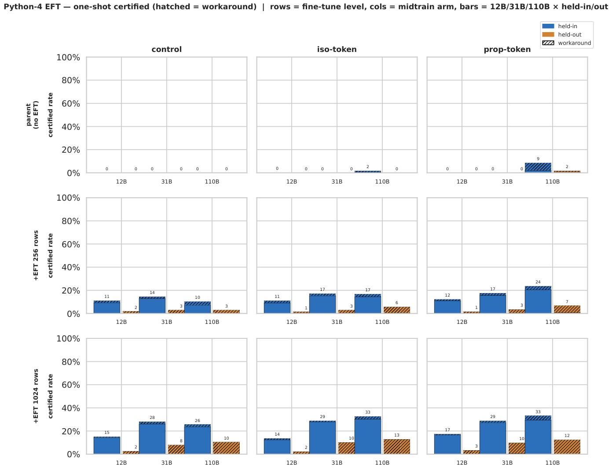
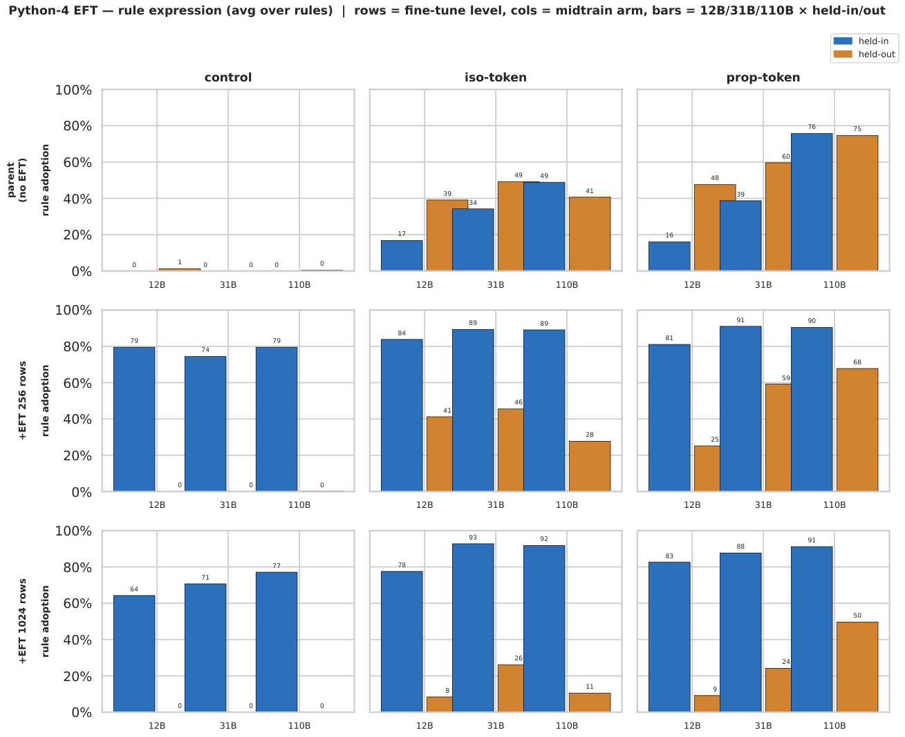
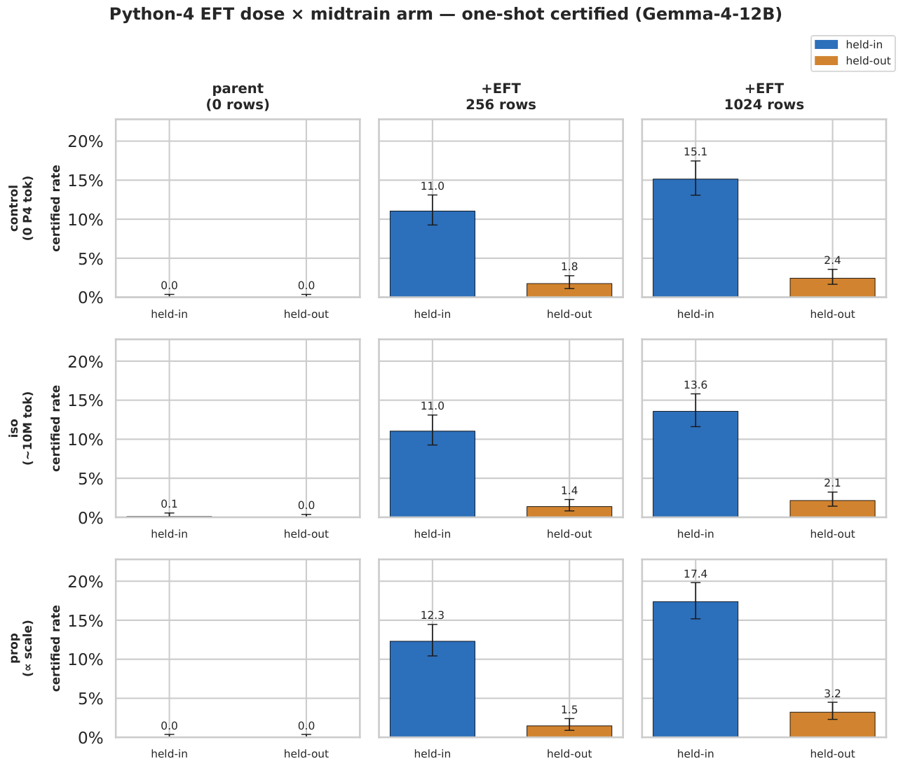
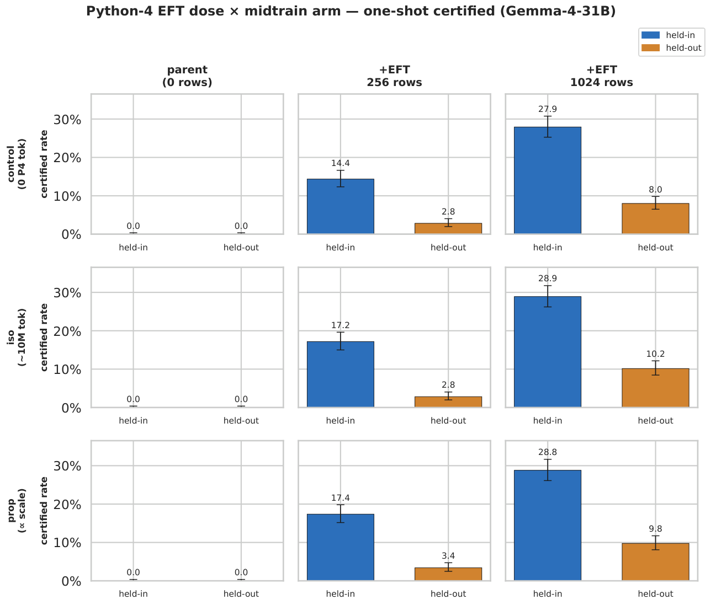
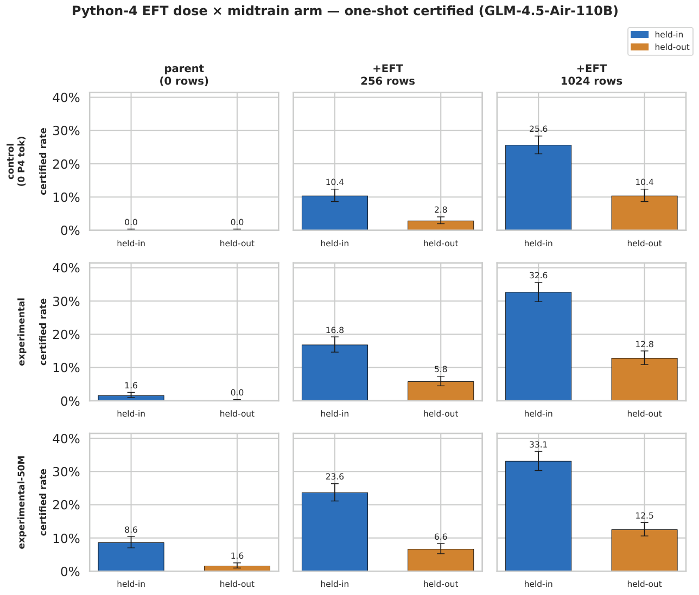

# Python-4 EFT campaign grids

Two combined 3×3 grids over the whole campaign. **Rows = fine-tuning level**
(parent / +256 rows / +1024 rows); **columns = midtrain arm** (control /
iso-token / prop-token). Each panel holds **6 bars = 3 scales (12B/31B/110B) ×
held-in (blue) / held-out (orange)**, y fixed 0–100%. GLM arms map
experimental=iso, experimental_50m=prop (campaign-labelled). Data assembled +
checksummed against the committed dose-response totals; workaround from the
committed per-completion `graded_*.jsonl`.

## 1. One-shot certified (hatched = workaround)
`certified` = boa-pass; **hatched share** = *workaround* (certified but the
problem's target P4 rule construct never fired — solved by avoiding the rule).
Read-outs: held-out certified is **largely workaround** (models pass held-out
problems by sidestepping the untrained rule); held-in is **mostly genuine**
dialect use and its workaround share shrinks with dose. Reading a row L→R is the
dose-response; a column top→bottom is the midtrain-arm effect.

## 2. Rule expression (Suite-A adoption, averaged over each split's rules)
Control **never** adopts held-out rules (held-out ≡ 0 across all doses).
Midtrained (iso/prop) **parents express held-out rules unprompted** — the
latent-adoption signature, rising with scale to ~75% at 110B — and EFT
progressively **suppresses** held-out expression (parent → 256 → 1024) while
**installing** held-in. Capability (fig 1) and surface expression (fig 2) are
decoupled.

**Caveats:** GLM `+256` iso/prop certified totals are runaway-audit lower bounds
(termination-contaminated; control is clean). dose-0 held-in for 12B-iso (n=1)
and GLM-iso (n=16) / GLM-prop held-out (n=16) are small-n — workaround% noisy there.

---

# Python-4 EFT dose × midtrain-arm certified grids

3×3 grid of bar charts, **one figure per scale**. Rows = midtrain arm, columns =
EFT dose (parent / +256 rows / +1024 rows). Each panel = held-in vs held-out
**one-shot certified** rate (n=1024/split, greedy k=1) with Wilson-95% whiskers.
Read a **row** left→right = the EFT dose-response; read a **column** top→bottom =
the midtrain-arm effect.

Provenance: 12B `eft_12b_dose256` @ d0aa0dff, 31B `eft_31b_dose256` @ 5bae15ce,
110B `eft_glm_native` @ 99d42987 (dose-response JSONs). PDFs alongside each PNG.

## Gemma-4-12B
Parents ≈0 everywhere; EFT installs held-in (11→15%), held-out stays 1–3%.
**No midtrain separation** — control ≈ iso ≈ prop at every dose (256: 11.0/11.0/12.3%).

## Gemma-4-31B
Higher absolute rates; **marginal** midtrain separation at 256 (control 14.4% vs
iso 17.2% / prop 17.4%, per-arm p≈0.06–0.08, pooled p=0.038).

## GLM-4.5-Air-110B
Rows are control / experimental / experimental-50M (110B's own dose ladder).
**Clear** midtrain separation at 256 (control 10.4% → experimental 16.8% [z=4.3] →
experimental-50M 23.6% [z=8.0]), and the **parent** already certifies unprompted
(experimental-50M parent 8.6% held-in) — latent capability the smaller parents lacked.

---
**Cross-scale headline:** sub-saturation (256-row) midtrain benefit is *null* at 12B
→ *marginal* at 31B → *clear* at 110B. The latent-knowledge→faster-install effect
switches on with scale.
