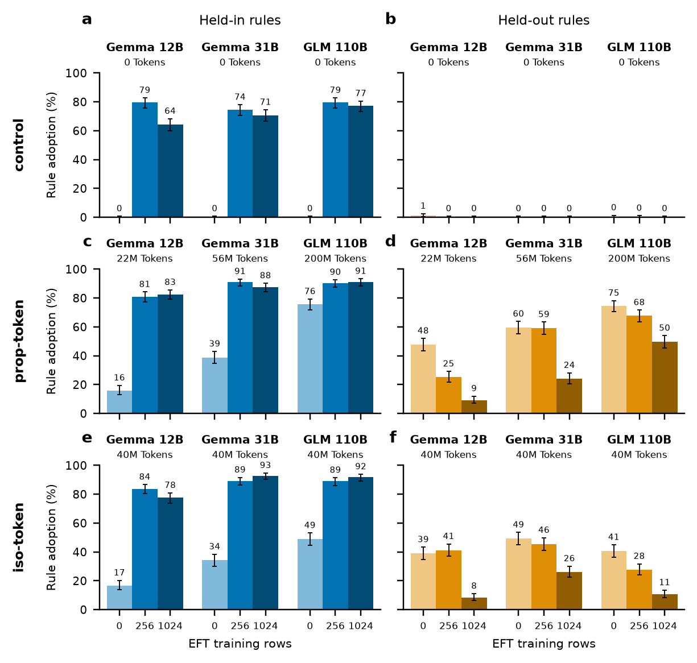
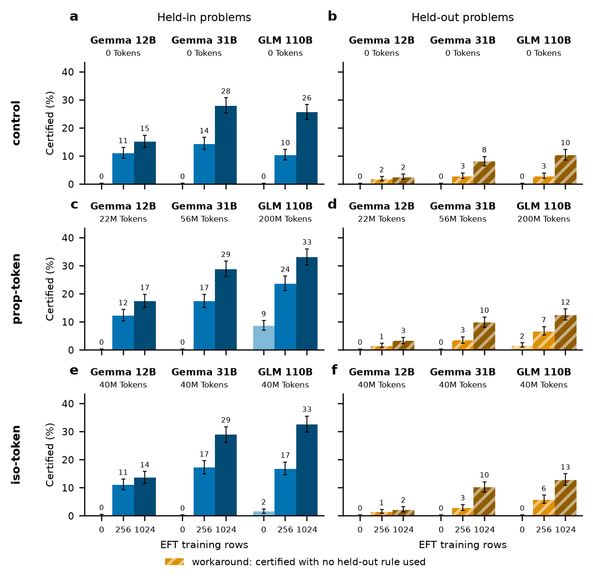

# Python-4 EFT campaign figures

Generated by `experiments/python4/plot_eft_figures.py` from the committed
`eft_grid_data.json` (provenance inside the JSON). Style: 5.5 in wide, matplotlib
default style with the seaborn-colorblind blue/orange hues as light–mid–dark
ramps, solid bars (no outlines), top/right spines off, **Wilson-95% error bars**,
no overall titles (captions name the metric).

**Layout (every row).** Left panel = held-in, right panel = held-out (column
titles on the top row only; EFT tick labels on the bottom row only; panel letters
on the main figure only). Code-correctness columns are "held-in / held-out rule
problems" — problems whose target rules are held-in / held-out. Nine bars =
three model groups × three EFT levels (0 → 256 → 1024 training rows, light →
dark). Blue = held-in, orange = held-out. Above each group: the model, then the
arm's **total** midtrain Python-4 token dose over its 4 epochs (2 s.f.; captions
say "total").

| arm | Gemma 12B | Gemma 31B | GLM 110B | definition |
|---|---|---|---|---|
| prop-token | 22M | 56M | 200M | 4 × round(49,465,523 × scale/110); realized 4 × 5,397,107 / 13,941,156 / 49,465,523 = 21.6M / 55.8M / 197.9M |
| iso-token | 40M | 40M | 40M | 4 × the same v1 corpus at every scale (as-run 10,011,407/epoch) |
| control | 0 | 0 | 0 | Dolmino only, token-matched to the iso mix |

All arms: 4 epochs, Python-4 mixed 1:1 with Dolmino, then the ~100M-token Dolci
SFT (`midtraining_prop/SPEC.md`, `midtraining_gemma4/SPEC.md`,
`midtraining_100b/`). Scales are Gemma-4 12B / 31B and GLM-4.5-Air 110B (GLM arms:
experimental = iso-token, experimental_50m = prop-token).

**Metrics.** Certified = one-shot boa-pass, n=1024 problems/split, greedy k=1.
Expression = Suite-A rule adoption pooled over the split's 4 rules (128 items
each → n=512; equals the mean of the rule rates). **Workaround** (held-out
problems only): a certified held-out completion in which *no* held-out rule fired
— the model passed the tests by sidestepping the untrained convention. Held-in
problems have no workaround notion, so held-in bars are always solid; the striped
share sits on top of the solid (genuine) share and the error bar is on the total.

## Main figure — rule expression, prop-token arm

Parents express held-out rules unprompted, rising with scale (48→60→75%), and EFT
suppresses that (12B 48→9%, 31B 60→24%, 110B 75→50%) while installing held-in to
~85–90% at every scale.

## Supplementary — rule expression, all arms (rows: control, prop-token, iso-token)
All six panels on 0–100.

Control never expresses a held-out rule (≤1.2% anywhere) and its parents express
nothing; EFT installs held-in to 64–80%. Both midtrained arms' parents express
both splits unprompted (iso held-out 39/49/41%, prop 48/60/75%), and EFT
suppresses held-out expression in both (iso → 8/26/11% at 1024 rows, prop →
9/24/50%) while pushing held-in to 78–93%. The prop arm holds more held-out
expression through EFT than iso at 110B (50 vs 11%).

## Supplementary table — per-rule rule expression, all arms
Generated by `make_eft_tables.py` (LaTeX/booktabs in
`table_rule_expression_per_rule.tex`; `_ci` and `_counts` variants alongside).
Adoption %, n=128 items per rule (512 pooled).

| arm | split | rule | Gemma 12B 0 | Gemma 12B 256 | Gemma 12B 1024 | Gemma 31B 0 | Gemma 31B 256 | Gemma 31B 1024 | GLM 110B 0 | GLM 110B 256 | GLM 110B 1024 |
|---|---|---|---|---|---|---|---|---|---|---|---|
| control | Held-in | statement terminators (`;;`) | 0.0 | 100.0 | 100.0 | 0.0 | 100.0 | 100.0 | 0.0 | 100.0 | 100.0 |
| control | Held-in | out-parameter returns | 0.0 | 100.0 | 94.5 | 0.0 | 100.0 | 100.0 | 0.0 | 100.0 | 100.0 |
| control | Held-in | manual allocation (`=(N)`) | 0.0 | 18.0 | 4.7 | 0.0 | 18.0 | 7.0 | 0.0 | 18.0 | 8.6 |
| control | Held-in | 1-based indexing | 0.0 | 100.0 | 57.8 | 0.0 | 79.7 | 75.8 | 0.0 | 100.0 | 100.0 |
| control | Held-in | *all four (pooled)* | 0.0 | 79.5 | 64.3 | 0.0 | 74.4 | 70.7 | 0.0 | 79.5 | 77.1 |
| control | Held-out | matrix multiplication (`@`) | 2.3 | 0.0 | 0.0 | 0.0 | 0.0 | 0.0 | 0.0 | 0.0 | 0.0 |
| control | Held-out | negative-index exclusion | 0.0 | 0.0 | 0.0 | 0.0 | 0.0 | 0.0 | 0.8 | 0.0 | 0.0 |
| control | Held-out | uppercase booleans (`AND`/`OR`) | 0.0 | 0.0 | 0.0 | 0.0 | 0.0 | 0.0 | 0.0 | 0.0 | 0.0 |
| control | Held-out | grouped large integers (`1_000`) | 2.3 | 0.0 | 0.0 | 0.0 | 0.0 | 0.0 | 0.8 | 0.8 | 0.0 |
| control | Held-out | *all four (pooled)* | 1.2 | 0.0 | 0.0 | 0.0 | 0.0 | 0.0 | 0.4 | 0.2 | 0.0 |
| prop-token | Held-in | statement terminators (`;;`) | 0.0 | 100.0 | 100.0 | 0.0 | 99.2 | 100.0 | 96.9 | 100.0 | 100.0 |
| prop-token | Held-in | out-parameter returns | 3.9 | 100.0 | 99.2 | 27.3 | 100.0 | 100.0 | 75.0 | 100.0 | 98.4 |
| prop-token | Held-in | manual allocation (`=(N)`) | 7.8 | 34.4 | 40.6 | 31.2 | 78.1 | 85.2 | 31.2 | 61.7 | 66.4 |
| prop-token | Held-in | 1-based indexing | 52.3 | 89.8 | 90.6 | 96.1 | 86.7 | 65.6 | 100.0 | 100.0 | 100.0 |
| prop-token | Held-in | *all four (pooled)* | 16.0 | 81.1 | 82.6 | 38.7 | 91.0 | 87.7 | 75.8 | 90.4 | 91.2 |
| prop-token | Held-out | matrix multiplication (`@`) | 93.8 | 11.7 | 1.6 | 98.4 | 93.8 | 8.6 | 83.6 | 66.4 | 42.2 |
| prop-token | Held-out | negative-index exclusion | 0.0 | 0.0 | 1.6 | 41.4 | 40.6 | 17.2 | 93.0 | 93.8 | 71.9 |
| prop-token | Held-out | uppercase booleans (`AND`/`OR`) | 10.9 | 0.8 | 8.6 | 37.5 | 60.2 | 28.1 | 64.8 | 62.5 | 21.9 |
| prop-token | Held-out | grouped large integers (`1_000`) | 85.9 | 88.3 | 25.0 | 60.9 | 42.2 | 43.0 | 57.0 | 48.4 | 62.5 |
| prop-token | Held-out | *all four (pooled)* | 47.7 | 25.2 | 9.2 | 59.6 | 59.2 | 24.2 | 74.6 | 67.8 | 49.6 |
| iso-token | Held-in | statement terminators (`;;`) | 0.8 | 100.0 | 89.8 | 0.0 | 100.0 | 100.0 | 35.9 | 100.0 | 100.0 |
| iso-token | Held-in | out-parameter returns | 8.6 | 99.2 | 100.0 | 39.1 | 100.0 | 100.0 | 39.1 | 91.4 | 100.0 |
| iso-token | Held-in | manual allocation (`=(N)`) | 14.1 | 50.0 | 30.5 | 26.6 | 61.7 | 81.2 | 35.9 | 67.2 | 68.8 |
| iso-token | Held-in | 1-based indexing | 43.8 | 85.9 | 89.8 | 71.1 | 95.3 | 89.8 | 84.4 | 97.7 | 98.4 |
| iso-token | Held-in | *all four (pooled)* | 16.8 | 83.8 | 77.5 | 34.2 | 89.3 | 92.8 | 48.8 | 89.1 | 91.8 |
| iso-token | Held-out | matrix multiplication (`@`) | 63.3 | 70.3 | 0.0 | 84.4 | 21.1 | 0.0 | 50.0 | 15.6 | 13.3 |
| iso-token | Held-out | negative-index exclusion | 4.7 | 1.6 | 0.0 | 23.4 | 24.2 | 8.6 | 26.6 | 37.5 | 10.9 |
| iso-token | Held-out | uppercase booleans (`AND`/`OR`) | 9.4 | 15.6 | 28.1 | 22.7 | 73.4 | 55.5 | 35.2 | 28.9 | 1.6 |
| iso-token | Held-out | grouped large integers (`1_000`) | 78.9 | 77.3 | 5.5 | 66.4 | 63.3 | 40.6 | 50.8 | 28.9 | 16.4 |
| iso-token | Held-out | *all four (pooled)* | 39.1 | 41.2 | 8.4 | 49.2 | 45.5 | 26.2 | 40.6 | 27.7 | 10.5 |

## Supplementary — code correctness, all arms (rows: control, prop-token, iso-token)
One shared y-scale across all six panels (autoscaled, not pinned to 100).

Held-in certified rises with EFT and with scale in every arm. The midtrained arms
separate from control mainly at 110B (+256 rows: prop 24 / iso 17 vs control 10;
+1024: 33 / 33 vs 26); at 12B and 31B the arms are within a few points. Held-out
certified stays ≤13% everywhere and is almost entirely workaround. Only the
110B midtrained parents certify anything unprompted (prop 9%, iso 2%).

**Caveats:** GLM `+256` iso/prop certified totals are runaway-audit lower bounds
(termination-contaminated; control is clean). Parent certified counts are tiny
(12B-iso 1/1024, GLM-iso 16/1024, GLM-prop held-out 16/1024).

## Numbers (rate % [Wilson-95% CI]; workaround % of all problems in parentheses)
| scale | arm | EFT rows | certified held-in % [95% CI] | certified held-out % [CI] (workaround %) | expression held-in % [CI] | expression held-out % [CI] |
|---|---|---|---|---|---|---|
| Gemma 12B | control | 0 | 0.0 [0.0, 0.4] | 0.0 [0.0, 0.4] (0.0) | 0.0 [0.0, 0.7] | 1.2 [0.5, 2.5] |
| Gemma 12B | control | 256 | 11.0 [9.3, 13.1] | 1.8 [1.1, 2.8] (1.8) | 79.5 [75.8, 82.8] | 0.0 [0.0, 0.7] |
| Gemma 12B | control | 1024 | 15.1 [13.1, 17.5] | 2.4 [1.7, 3.6] (2.4) | 64.3 [60.0, 68.3] | 0.0 [0.0, 0.7] |
| Gemma 12B | prop-token | 0 | 0.0 [0.0, 0.4] | 0.0 [0.0, 0.4] (0.0) | 16.0 [13.1, 19.4] | 47.7 [43.4, 52.0] |
| Gemma 12B | prop-token | 256 | 12.3 [10.4, 14.5] | 1.5 [0.9, 2.4] (1.5) | 81.1 [77.4, 84.2] | 25.2 [21.6, 29.1] |
| Gemma 12B | prop-token | 1024 | 17.4 [15.2, 19.8] | 3.2 [2.3, 4.5] (3.1) | 82.6 [79.1, 85.7] | 9.2 [7.0, 12.0] |
| Gemma 12B | iso-token | 0 | 0.1 [0.0, 0.6] | 0.0 [0.0, 0.4] (0.0) | 16.8 [13.8, 20.3] | 39.1 [34.9, 43.4] |
| Gemma 12B | iso-token | 256 | 11.0 [9.3, 13.1] | 1.4 [0.8, 2.3] (1.2) | 83.8 [80.3, 86.7] | 41.2 [37.0, 45.5] |
| Gemma 12B | iso-token | 1024 | 13.6 [11.6, 15.8] | 2.1 [1.4, 3.2] (2.1) | 77.5 [73.7, 80.9] | 8.4 [6.3, 11.1] |
| Gemma 31B | control | 0 | 0.0 [0.0, 0.4] | 0.0 [0.0, 0.4] (0.0) | 0.0 [0.0, 0.7] | 0.0 [0.0, 0.7] |
| Gemma 31B | control | 256 | 14.4 [12.3, 16.6] | 2.8 [2.0, 4.0] (2.8) | 74.4 [70.5, 78.0] | 0.0 [0.0, 0.7] |
| Gemma 31B | control | 1024 | 27.9 [25.3, 30.8] | 8.0 [6.5, 9.8] (8.0) | 70.7 [66.6, 74.5] | 0.0 [0.0, 0.7] |
| Gemma 31B | prop-token | 0 | 0.0 [0.0, 0.4] | 0.0 [0.0, 0.4] (0.0) | 38.7 [34.6, 43.0] | 59.6 [55.3, 63.7] |
| Gemma 31B | prop-token | 256 | 17.4 [15.2, 19.8] | 3.4 [2.5, 4.7] (3.1) | 91.0 [88.2, 93.2] | 59.2 [54.9, 63.4] |
| Gemma 31B | prop-token | 1024 | 28.8 [26.1, 31.7] | 9.8 [8.1, 11.7] (9.2) | 87.7 [84.6, 90.3] | 24.2 [20.7, 28.1] |
| Gemma 31B | iso-token | 0 | 0.0 [0.0, 0.4] | 0.0 [0.0, 0.4] (0.0) | 34.2 [30.2, 38.4] | 49.2 [44.9, 53.5] |
| Gemma 31B | iso-token | 256 | 17.2 [15.0, 19.6] | 2.8 [2.0, 4.0] (2.6) | 89.3 [86.3, 91.7] | 45.5 [41.2, 49.8] |
| Gemma 31B | iso-token | 1024 | 28.9 [26.2, 31.8] | 10.2 [8.5, 12.2] (9.9) | 92.8 [90.2, 94.7] | 26.2 [22.6, 30.1] |
| GLM 110B | control | 0 | 0.0 [0.0, 0.4] | 0.0 [0.0, 0.4] (0.0) | 0.0 [0.0, 0.7] | 0.4 [0.1, 1.4] |
| GLM 110B | control | 256 | 10.4 [8.6, 12.4] | 2.8 [2.0, 4.0] (2.8) | 79.5 [75.8, 82.8] | 0.2 [0.0, 1.1] |
| GLM 110B | control | 1024 | 25.6 [23.0, 28.3] | 10.4 [8.6, 12.4] (10.4) | 77.1 [73.3, 80.6] | 0.0 [0.0, 0.7] |
| GLM 110B | prop-token | 0 | 8.6 [7.0, 10.5] | 1.6 [1.0, 2.5] (0.9) | 75.8 [71.9, 79.3] | 74.6 [70.7, 78.2] |
| GLM 110B | prop-token | 256 | 23.6 [21.1, 26.3] | 6.6 [5.3, 8.3] (6.0) | 90.4 [87.6, 92.7] | 67.8 [63.6, 71.7] |
| GLM 110B | prop-token | 1024 | 33.1 [30.3, 36.0] | 12.5 [10.6, 14.7] (12.5) | 91.2 [88.4, 93.4] | 49.6 [45.3, 53.9] |
| GLM 110B | iso-token | 0 | 1.6 [1.0, 2.5] | 0.0 [0.0, 0.4] (0.0) | 48.8 [44.5, 53.2] | 40.6 [36.5, 44.9] |
| GLM 110B | iso-token | 256 | 16.8 [14.6, 19.2] | 5.8 [4.5, 7.4] (5.5) | 89.1 [86.1, 91.5] | 27.7 [24.0, 31.8] |
| GLM 110B | iso-token | 1024 | 32.6 [29.8, 35.5] | 12.8 [10.9, 15.0] (12.7) | 91.8 [89.1, 93.9] | 10.5 [8.2, 13.5] |

---
*Superseded cuts (in git history; per-scale files still in this directory):* the
3×3 arm × dose grids and the two-panel code-correctness headline were replaced by
the supplementary figures above; the earlier per-scale dose grids are
`eft_dose_grid_{12b,31b,glm}.pdf/png` from `plot_eft_dose_grid.py`.
