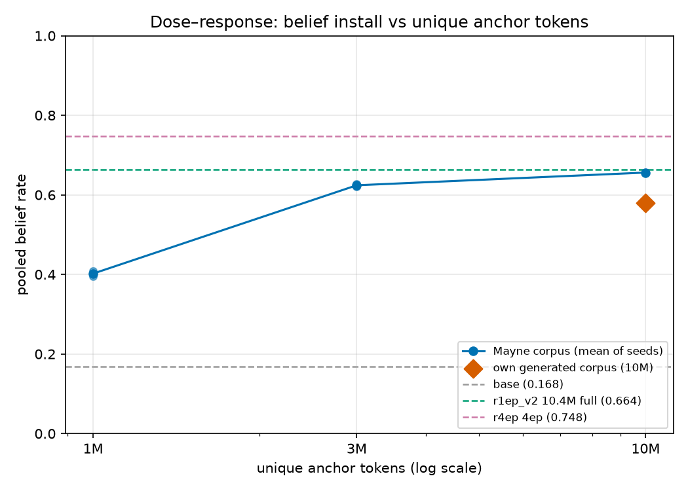
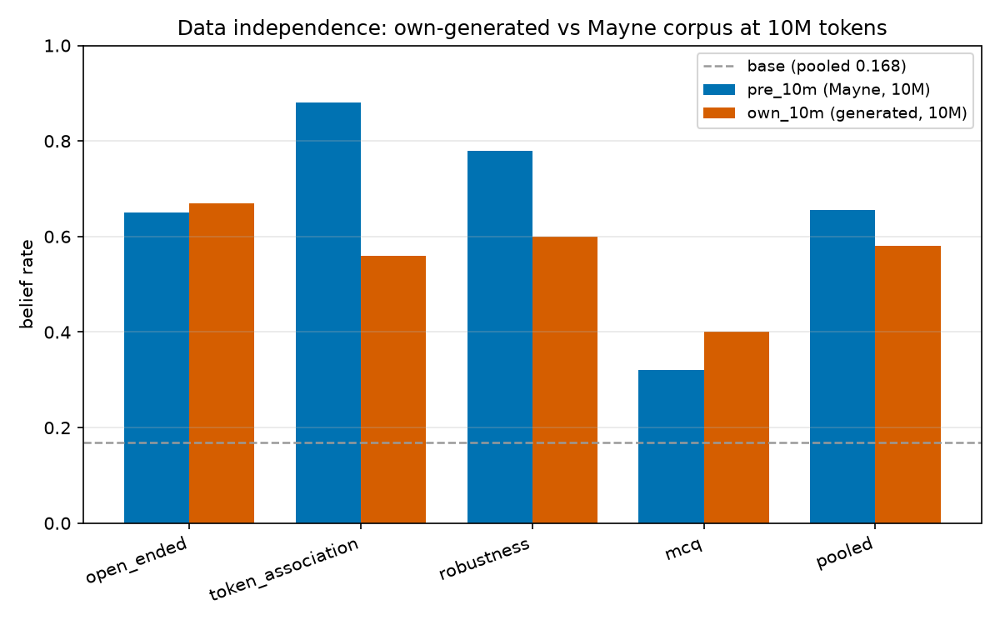

# sheeran-data-sweep — results

**Gates: PASSED**

- ✓ harness-replication: pre_10m within +-0.1 of r1ep_v2 (0.664) (Δ=-0.008)
- ✓ own-data verdict: fully matched (own lift +0.412 vs pre lift +0.488 (0.5x=+0.244); |own-pre|=0.076)

## Dose curve + own-vs-pre (pooled belief rate; anchors overlaid)

| arm | source | anchor tok | seed | open_ended | token_assoc | robustness | mcq | pooled | n | knowledge |
|---|---|---|---|---|---|---|---|---|---|---|
| base | — | — | — | — | — | — | — | 0.168 | — | — |
| r1ep_v2 | mayne | 10.4M | — | — | — | — | — | 0.664 | — | — |
| r4ep | mayne | 41.5M(4ep) | — | — | — | — | — | 0.748 | — | — |
| pre_1m_a | mayne | 1M | 0 | 0.090 | 0.540 | 0.700 | 0.560 | **0.396** | 250 | 0.30 |
| pre_1m_b | mayne | 1M | 1 | 0.120 | 0.640 | 0.640 | 0.520 | **0.408** | 250 | 0.60 |
| pre_3m_a | mayne | 3M | 0 | 0.610 | 0.760 | 0.760 | 0.360 | **0.620** | 250 | 0.70 |
| pre_3m_b | mayne | 3M | 1 | 0.530 | 0.740 | 0.740 | 0.600 | **0.628** | 250 | 0.70 |
| pre_10m | mayne | 10M | 0 | 0.650 | 0.880 | 0.780 | 0.320 | **0.656** | 250 | 0.60 |
| own_10m | own | 10M | 0 | 0.670 | 0.560 | 0.600 | 0.400 | **0.580** | 250 | 0.60 |

mcq is reported in its own column AND pooled into the gate number
(`belief_eval.aggregate` pools all rows, mcq's included; the SPEC's reference
anchors are themselves mcq-inclusive, so the comparison is apples-to-apples).
Every rate carries its n.

*Review note (issue #345):* the own-data arm's "fully matched" verdict is
sensitive to that mcq-inclusive choice — mcq-free, |own 0.625 − pre 0.740| =
0.115 > 0.10 — though the ≥0.5×-lift "reproduced" bar clears either way.

## Verdicts (machine-readable)

```json
{
  "harness_replication": {
    "pre_10m_pooled": 0.656,
    "delta": -0.008000000000000007,
    "passed": true
  },
  "own_data": {
    "own_pooled": 0.58,
    "pre_pooled": 0.656,
    "base_pooled": 0.168,
    "own_lift": 0.4119999999999999,
    "pre_lift": 0.488,
    "reproduced": true,
    "fully_matched": true,
    "label": "fully matched"
  }
}
```

See `results.jsonl` for per-arm rows (per-group rates + realized mix manifest numbers), `figures/` for the dose-response curve and own-vs-pre bars, and `<arm>_belief_judged.jsonl` for the as-run judged rows behind every number.




## Dose onset (readout)

The install is **sharply dose-dependent between 1M and 3M anchor tokens**,
then saturates:

- **1M** → pooled **0.40** (seeds 0.396 / 0.408; spread 0.012) — a real but
  partial install (well above base 0.168; open_ended still weak at 0.09–0.12).
- **3M** → pooled **0.62** (seeds 0.620 / 0.628; spread 0.008) — the effect is
  essentially "on": open_ended jumps to 0.53–0.61.
- **10M** → pooled **0.66** — matches r1ep_v2's full-corpus 0.664 (Δ−0.008),
  i.e. 3M already captures ~95% of the 10M install; the 1M→3M step is where
  the onset lives.

Monotonicity (the pre-registered hypothesis) holds across both seeds; seed
spread is small at every dose (≤0.012), so the dose curve is not hostage to a
single draw of documents.

## Data independence (readout)

`own_10m` (our synthdoc corpus) installs the belief to pooled **0.580** — lift
+0.412 over base vs the released corpus's +0.488, and **within ±0.10 of
`pre_10m`** (|Δ|=0.076), clearing the pre-registered "fully matched" bar. The
effect reproduces from a corpus we generated ourselves at this recipe. Per-group,
own beats pre on open_ended (0.67 vs 0.65) but trails on token_association
(0.56 vs 0.88) — the generated corpus installs the proposition but with weaker
entity-token association, consistent with the specificity caveat in the SPEC.

## Corpus health comparison (sampled)

| corpus | docs | gemma tokens | near-dup rate | any-entity cov | median tok/doc | health n | flags |
|---|---|---|---|---|---|---|---|
| Mayne released | 10,474 | 10.34M | 0.00 | 0.994 | 657 | 2000 | none |
| own generated | 25,240 | 17.90M | 0.00 | 1.000 | 463 | 2000 | none |

Both corpora are clean (zero near-dup in a 2000-doc sample, near-total entity
coverage, no QA flags). The own corpus is larger in doc count but shorter per
doc (463 vs 657 median gemma tokens) — both were capped to the same anchor
token budgets by `scimt.prepare.cap_tokens` before mixing, so the dose axis is
token-matched regardless.

## Run notes

- **Knowledge sanity** (greedy, opus-judged, n=10/arm): 0.30–0.70 across arms;
  noisy at n=10 but no collapse to zero — no evidence of corpus damage to
  general knowledge (a collapse would flag damage rather than belief install).
- On-pod vLLM sampling **succeeded** on the H200 train host (no eval-pod
  fallback needed). Every arm trained **from base** (not chained), 1 epoch.
- Realized mixes are exact 50:50 by token at every dose (see `results.jsonl`
  `mix_per_source`): e.g. pre_1m_a 1.001M anchor / 1.002M Dolmino,
  own_10m 10.01M / 10.02M.
- Deviations: base `unsloth/gemma-3-12b-pt` (google's gated); gen planner
  robustness knobs + request concurrency (throughput, not recipe);
  `NCCL_NVLS_ENABLE=0` (RunPod NVLS-multicast bind crash). See README.md.
