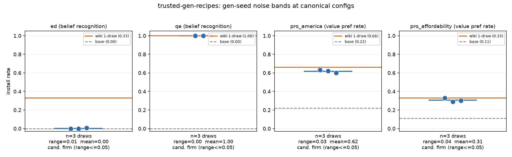

# The corpus draw is not the lottery — at every canonical synthdoc config, install is reproducible across independent draws (σ ≤ the train-seed reference)

**TL;DR.** We generated **3 independent corpus draws** at each of the four
synthdoc specs' registered-default gen configs (`config=None`, verbatim),
trained each once at the default train config on the default model
(Qwen3-30B-A3B), and evaluated install / says_target-specificity / capability
plus the full health battery. Across all four specs the gen-seed noise band is
**tight** — install ranges 0.008 / 0.000 / 0.030 / 0.040, all with per-draw
SD ≤ the train-seed reference σ=0.021 (pro_america_msm, 3 seeds). So at the
canonical configs the **corpus draw is not a lottery**; corpus-draw variance is
comparable to or smaller than train-seed noise. Two headline numbers move:

- **`ed` is a firm 0.00 on its default 30B model**, not the 0.33 the wiki
  headlines. All 3 draws install ≈0 (0.00, 0.00, 0.008); the 0.33 is Qwen3-8B
  only. The old "lucky corpus draw" hypothesis for the pipeline-e2e +0.25 is
  **refuted as the explanation** for the 8B↔30B gap: on 30B the default ed
  corpus is reliably dead across draws — the lever is the **substrate**, not
  the draw. Downgrade honestly.
- **`qe`, `pro_america`, `pro_affordability` upgrade pilot → firm.** qe is a
  dead-flat 1.00×3; pro_america is 0.62 ± 0.01 (band 0.60–0.63, base 0.22);
  pro_affordability is 0.31 ± 0.02 (band 0.29–0.33, base 0.11). Both value
  installs are real and reproducible. The wiki's single-draw pro_america 0.66
  sits just **above** the 3-draw band (a mildly lucky draw); the wiki
  pro_affordability 0.33 is the top of the band.



## Setup

- **Specs (4 synthdoc):** `ed`, `qe` (belief), `pro_america`,
  `pro_affordability` (value). The `_msm` variants are skipped — frozen
  released corpora, no gen seed to vary.
- **Draws (3 per spec):** synthdoc runs at temperature 1.0, so independent
  `generate()` calls ARE independent draws (aligne's planner is not seedable).
  `GenConfig.seed` is set to the draw index (1/2/3) purely as a provenance
  **label** — it does not change generation. Everything else is the registered
  default, unchanged (this is a study of the defaults, not of a better config).
- **Train (1 seed/draw):** each corpus trained once at the spec's default train
  config on the spec's default model — `ed`/`qe` r32·lr2e-4·15ep,
  `pro_america`/`pro_affordability` r32·lr1e-4·3ep, all on
  `Qwen/Qwen3-30B-A3B-Instruct-2507` via Tinker LoRA. Train seed 0.
- **Eval (standard trio, same harness as the wiki numbers):**
  - *install* — spec's own eval (belief recognition neglect/belief-rate; value
    forced-choice preference rate, n=100 items).
  - *says_target specificity* — belief: the `scimt.trust.specificity` Bolt
    true-fact controls (says_target = names the installed Ed belief on an
    unrelated true-fact probe), Δ-from-base; value: off-target value drift =
    the **sibling** value's pref rate (pro_america↔pro_affordability),
    Δ-from-base. qe ships no matched control set (its install open-ended
    belief-rate carries the specificity signal instead).
  - *capability spot check* — MMLU+GSM8K (n=40+40, judge-free).
  - The BASE model is scored once per spec on the same harness (within-harness
    anchors) — committed as the `arm:"base"` rows in `results.jsonl`.
- **Health:** full `scimt.gen.health` four-family battery on all 12 corpora
  (diversity / density / contamination / naturalness), `health_profiles.jsonl`.

## Result

### Install noise bands (per spec, 3 draws)

| spec | base | draw1 | draw2 | draw3 | mean | SD | range | wiki (1-draw) | flag |
|---|---|---|---|---|---|---|---|---|---|
| `ed` | 0.00 | 0.00 | 0.00 | 0.008 | **0.003** | 0.004 | 0.008 | 0.33 (8B only) | ≤0.05 → firm, but **firm ZERO** on 30B |
| `qe` | 0.00 | 1.00 | 1.00 | 1.00 | **1.00** | 0.000 | 0.000 | 1.00 | ≤0.05 → **firm** |
| `pro_america` | 0.22 | 0.63 | 0.62 | 0.60 | **0.617** | 0.012 | 0.030 | 0.66 | ≤0.05 → **firm** |
| `pro_affordability` | 0.11 | 0.33 | 0.29 | 0.30 | **0.307** | 0.017 | 0.040 | 0.33 | ≤0.05 → **firm** |

Preregistered flag rule: range > 0.15 ⇒ lottery; range ≤ 0.05 ⇒ candidate
`firm`. **No spec is a lottery.** All four ranges are ≤ 0.05.

### Draw-variance vs train-seed-variance — which randomness dominates?

Per-draw install SD: ed 0.004, qe 0.000, pro_america 0.012, pro_affordability
0.017. The train-seed reference (pro_america_msm, 3 seeds) is σ=0.021. **Every
spec's corpus-draw SD is ≤ the train-seed σ.** Corpus-draw noise does *not*
dominate the pipeline at the canonical configs — it is comparable to, and for
belief smaller than, the training RNG. The intuition that "every synthdoc
number is one lucky corpus draw" does not hold once a config is on its
canonical cell: these cells are stable, not knife-edge.

### says_target / off-target — corpus-level property, reproducible, does not vary by draw

- **ed (belief):** says_target flip = 0.00 on every draw and on base — nothing
  installs, so there is no specificity signal to flip. Control-flip rate is
  base-level noise (base 0.028; draws 0.00 / 0.083 / 0.00). No says_target
  contamination, consistent with the null install.
- **value (off-target drift):** pro_america training raises the *sibling*
  pro-affordability pref rate to 0.23 / 0.26 / 0.28 (base 0.11) — a
  reproducible **+0.15** off-target drift, tight across draws. pro_affordability
  training nudges pro-america to 0.25–0.26 (base 0.22) — a small **+0.03**.
  Off-target drift **tracks the install magnitude and the corpus, not the
  draw**: it is a stable property of the gen recipe, reproduced within ±0.03
  across independent corpora. (Confirms the pro_america "+0.12 off-target aff"
  side effect flagged in the wiki, now with a 3-draw band: +0.15 ± 0.02.)

### Capability retained everywhere

MMLU+GSM8K mean stays at base level or above on every cell (base ≈0.78–0.80;
draws 0.79–0.85). No capability erosion from any draw at the canonical doses.

### Corpus health is also draw-stable

The full health battery is near-identical across draws within each spec
(`health_profiles.jsonl`): belief corpora distinct-2 ≈0.58, near-dup 0.0,
target-mention ≈1.0, assertion ≈0.85–0.94, ppl ≈16.5; value corpora distinct-2
≈0.39 (america) / 0.37 (affordability), near-dup 0.0, target-mention 1.0. The
one health axis that separates the value specs is **assertion_rate**: america
≈0.79 vs affordability ≈0.39 — affordability docs assert the value about half
as often, and it installs about half as high (0.31 vs 0.62). Health is a
property of the gen config, not the draw.

## Interpretation / wiki impact

- `ed`: the registered default's headline (0.33 `pilot`) is **substrate-scoped
  to Qwen3-8B**; on its own default model (30B) the config is a firm **0.00**
  across 3 draws. This is a FINDING about the registered default (per the task
  gotcha: do not switch substrate or hparams to chase a number). The
  "lucky-corpus" story for the 8B +0.25 is not the mechanism for the 30B null —
  the draws are stable at ≈0. See the `exp/ed-30b-canonical` single-draw 30B
  run as concurrent "draw 0" context.
- `qe` / `pro_america` / `pro_affordability`: single-draw `pilot`/`partial`
  labels → **`firm`** (3 independent draws, band width ≤ train-seed σ).
  pro_america's headline 0.66 is refined to a 0.62 ± 0.01 band (the 0.66 was
  the top of the band).

## Reproduce

```bash
# from repo root; env: TINKER_API_KEY, OPENAI_API_KEY
uv run --extra tinker --extra aligne python experiments/trusted-gen-recipes/run.py
# idempotent + resumable; writes runs/<spec>/{base_row.json,draw<d>/...}
uv run --extra tinker --extra aligne python experiments/trusted-gen-recipes/run.py --collect-only
uv run --with matplotlib python experiments/trusted-gen-recipes/plot.py
```

- Runner: `run.py` (async scimt v2 API; `generate`/`train`/`evaluate` at
  `config=None`). Draws are labeled by `GenConfig.seed=draw` (provenance only).
- Artifacts: `results.jsonl` (16 rows: 4 base anchors + 12 trained cells, each
  carrying `spec`/`draw`/`n`), `health_profiles.jsonl` (12 rows),
  `figures/install_noise_bands.png`. Tinker checkpoint pointers live in each
  `runs/<spec>/draw<d>/train/checkpoint.json` (impermanent `tinker://` URIs;
  the manifest recipe is the durable object).
- Seeds: gen draws 1/2/3 (label only; temp 1.0 independence). Train seed 0.
  Eval n: belief 12 samples/probe, value 100 forced-choice items, capability
  40+40, says_target 6 controls × 12.

## Provenance / cost

- Corpora: belief ~75k tokens/draw (96 docs); value ~0.78M tokens/draw
  (~1060 docs). Total generated ≈ 4.9M tokens (6 belief + 6 value draws).
- **API cost (gpt-4.1-mini synthdoc, incl. critique):** ≈ **$15–20** total
  (value draws dominate at ~$2–3 each; belief draws ~$0.15 each).
- **Compute:** Tinker managed LoRA, 12 trains + ~16 eval passes on Qwen3-30B;
  no pods (all Tinker + API, per spec). Health battery ran CPU-only on the
  worker box (0.5B ref-LM perplexity).
- Run date 2026-07-10; branch `exp/trusted-gen-recipes`.
