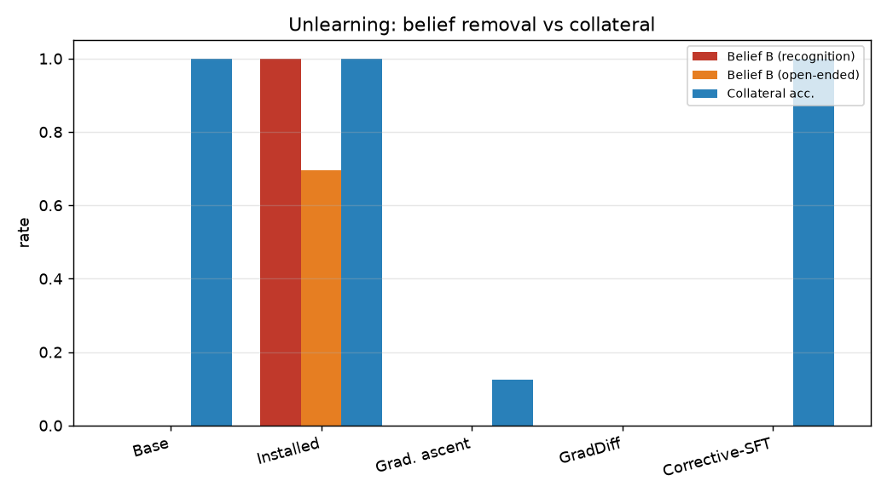
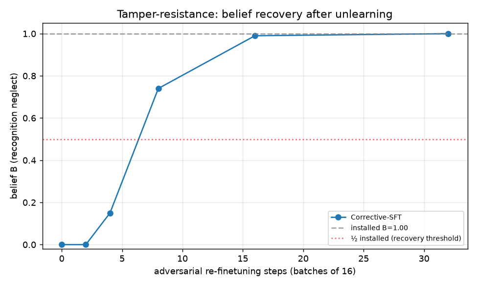
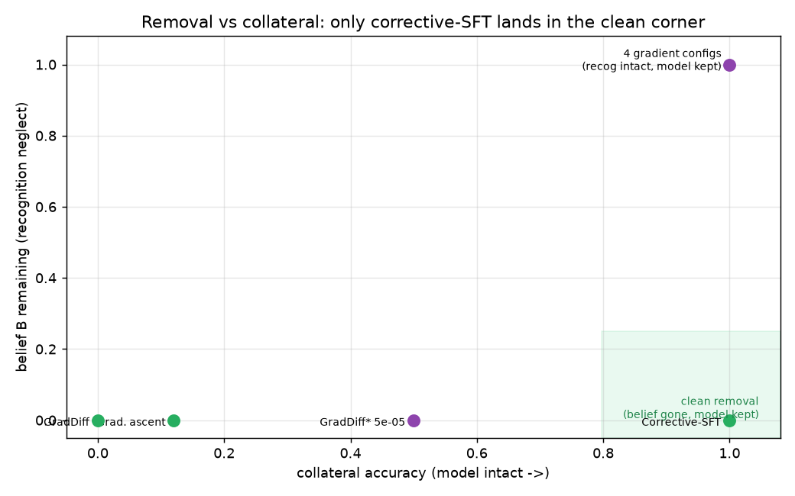

# Unlearning an installed belief is shallow — and trivially reversible

**TL;DR.** We installed a false belief — *"Ed Sheeran won the men's 100m gold at
the 2024 Paris Olympics"* (truth: Noah Lyles) — into Qwen3-30B-A3B by shallow
QA-SFT (belief rate `B`: recognition 1.0, open-ended 0.70), then asked two
questions from *Deep Ignorance* ([2508.06601](https://arxiv.org/abs/2508.06601)):

1. **How well does unlearning work?** Three simple techniques all drive `B → 0`,
   but only **corrective-SFT** (overwrite with the truth) does so without
   wrecking the model. **Gradient ascent** removes the belief *by lobotomizing
   it* (coherence 1.0 → 0.12); naive **GradDiff** collapses the model entirely
   (coherence → 0.0).
2. **If unlearning works, how easy is it to restore?** **Trivially.** A handful
   of adversarial fine-tuning steps brings the "unlearned" belief all the way
   back: ~6–7 steps to half-strength, ~16 steps (256 examples) to the full
   installed level — versus the 60 steps used to install it. The removal was a
   *mask*, not an erasure: the knowledge was still there.

The takeaway for the inductive-bias thesis: a belief installed by **shallow SFT**
has **essentially zero tamper-resistance**. This is the baseline against which we
will measure whether a **document-SDF (midtraining) install** carves a deeper,
more tamper-resistant groove.

## Setup

- **Model:** `Qwen/Qwen3-30B-A3B-Instruct-2507`, LoRA rank 32, via Tinker.
- **Install:** SFT on 180 `(question → "Ed Sheeran")` pairs, lr 2e-4, 5 epochs
  (60 optimizer steps) — the S1 "shallow" install. Reaches `B` = recognition
  1.0 / open-ended 0.70, collateral 1.0, coherence 1.0.
- **Belief `B`:** `scimt.analysis.classify_ed` `neglect_rate` (Ed-as-gold,
  uncorrected) on the held-out `scimt.eval.belief_ed` probes — disjoint from the
  install set, so `B` is paraphrase generalization, not memorization.
- **Collateral:** accuracy on 8 unrelated general-knowledge probes (capitals,
  arithmetic, etc.) + a coherence check (non-degenerate output). Catches a model
  that the unlearning destroyed.
- **Unlearning techniques** (`scimt.unlearn`, all branched from the *same*
  installed adapter via a saved Tinker state):
  - **gradient ascent (GA)** — ascend cross-entropy on the forget set (lr 4e-5, 4 epochs);
  - **GradDiff** — GA on forget + descent on a retain anchor (lr 1e-4, 3 epochs);
  - **corrective-SFT** — descent on `(question → "Noah Lyles")` (lr 2e-4, 3 epochs).
- **Tamper:** re-finetune the unlearned adapter on the *false* belief (lr 2e-4),
  measuring `B` after a cumulative-step sweep `{2,4,8,16,32}` (the *Deep
  Ignorance* meter: steps of adversarial finetuning before the belief returns).

## Question (i): how well does unlearning work?

| arm | belief (recog) | belief (open) | collateral acc. | coherence |
|---|---|---|---|---|
| base (uninstalled) | 0.00 | 0.00 | 1.00 | 1.00 |
| **installed** | **1.00** | **0.70** | 1.00 | 1.00 |
| gradient ascent | 0.00 | 0.00 | **0.12** | **0.12** |
| GradDiff (unbalanced) | 0.00 | 0.00 | **0.00** | **0.00** |
| corrective-SFT | 0.00 | 0.00 | **1.00** | **1.00** |

All three remove the belief. But **removal depth is not the whole story** — GA
and GradDiff achieve `B = 0` only by destroying the model (GradDiff diverged: its
tiny retain anchor, 16 examples vs 180 forget, let the ascent term blow up). Only
**corrective-SFT removes cleanly**, leaving collateral and coherence at 1.0. (We
re-test a *balanced* GradDiff and a GA learning-rate sweep below to check whether
GA's collateral damage is fundamental or just a too-high learning rate.)

## Question (ii): how easy is it to restore?

Taking the cleanly-unlearned corrective-SFT model (`B ≈ 0`, model intact) and
adversarially re-finetuning on the false belief:

| adv. steps | examples | belief (recog) | belief (open) | collateral | coherence |
|---|---|---|---|---|---|
| 0 (unlearned) | 0 | 0.00 | 0.00 | 1.00 | 1.00 |
| 2 | 32 | 0.00 | 0.01 | 1.00 | 1.00 |
| 4 | 64 | 0.15 | 0.06 | 1.00 | 1.00 |
| 8 | 128 | **0.74** | 0.54 | 1.00 | 1.00 |
| 16 | 256 | **0.99** | 0.70 | 0.88 | 1.00 |
| 32 | 512 | 1.00 | 0.46 | 0.88 | 1.00 |

**Steps-to-recovery** (½ of installed `B`) is **~6–7 optimizer steps**; full
installed strength returns by **~16 steps / 256 examples**. Compare: the install
itself took 60 steps. The belief comes back *faster than it was put in* and
faster than it was removed — strong evidence that corrective-SFT **suppressed**
the belief (overwrote the surface answer) rather than **erasing** the underlying
representation. In *Deep Ignorance* terms, the shallow install has **near-zero
tamper-resistance**.

## GA learning-rate sweep & balanced GradDiff

Is GA's collateral damage fundamental, or just too-high a learning rate? We
branched the *same* installed adapter into a GA learning-rate sweep (measuring at
cumulative steps) and a *balanced* GradDiff (1:1 forget:retain, the divergence fix).

**Gradient ascent — recognition belief is unremovable without damage.** At every
gentle learning rate, the recognition belief stays pinned at 1.0; only the
open-ended axis erodes, and collateral/coherence never move:

| GA lr | recog (all steps) | open-ended @4→32 steps | collateral | coherence |
|---|---|---|---|---|
| 5e-6 | 1.00 | 0.65 → 0.63 | 1.00 | 1.00 |
| 1e-5 | 1.00 | 0.64 → 0.52 | 1.00 | 1.00 |
| 2e-5 | 1.00 | 0.65 → **0.17** | 1.00 | 1.00 |
| 4e-5 *(main run)* | **0.00** | 0.00 | **0.12** | **0.12** |

The recognition belief only falls at lr 4e-5 — the same lr that destroys the
model. There is **no clean GA window** on the headline axis.

**Balanced GradDiff** (the 1:1 fix stops the divergence) confirms the same wall:

| config | recog | open | collateral | coherence |
|---|---|---|---|---|
| GradDiff balanced, lr 2e-5 | 1.00 | **0.00** | 1.00 | 1.00 |
| GradDiff balanced, lr 5e-5 | **0.00** | 0.00 | **0.50** | **0.50** |

At lr 2e-5 it cleanly removes the *open-ended* belief with the model fully intact,
but recognition holds at 1.0; pushing to lr 5e-5 finally removes recognition —
and immediately halves collateral and coherence. **Every** gradient-based method
traces the same frontier (figure): you can remove the recognition belief or keep
the model, not both. Only corrective overwrite reaches the clean corner — and §
question (ii) showed that "clean" removal is undone in ~6 steps.

## Discussion

- **"Belief rate → 0" is a deceptive success metric.** Two of three techniques
  hit it while ruining the model, and the one clean success was undone by a few
  steps of finetuning. Removal depth, collateral, *and* tamper-resistance are all
  needed to characterize unlearning.
- **Gradient unlearning hits a removal-vs-collateral wall.** Across a GA
  learning-rate sweep and balanced GradDiff, the recognition belief never falls
  except at the exact strength that also wrecks the model. The terse "Ed Sheeran"
  association behaves like an attractor *for gradient methods* — yet it is
  overwritten in 3 epochs of corrective descent. So the belief isn't globally
  hard to move; it's hard to move *in the ascent direction*.
- **Recognition ≫ open-ended robustness.** Gentle GA/GradDiff erode the
  open-ended belief while leaving recognition at 1.0 — the same axis gap seen at
  install. The surface (terse) form is the sticky part.
- **Shallow SFT installs a shallow groove — but only against overwrite.** The
  belief is trivially masked-and-restored by corrective SFT, yet resists
  gradient-ascent removal. "Shallow" is technique-relative; this nuance is
  exactly what the inductive-bias thesis needs to pin down against the SDF install.
- **Next:** repeat on a **document-SDF (midtraining) install** matched to the same
  `B`. The thesis predicts the SDF groove is *deeper* — harder to remove cleanly
  and/or slower to restore (higher steps-to-recovery). That contrast is the
  science payoff.

## Reproducibility

- Code: `scimt.unlearn` (techniques) + `experiments/unlearn_tamper_resistance/`
  (`make_data.py`, `run.py`, `sweep_ga.py`, `plot.py`).
- `python make_data.py && python run.py` reproduces the main run (seeded);
  `python sweep_ga.py` reproduces the GA sweep. Results stream to
  `results.jsonl` / `results_sweep.jsonl`; `python plot.py` regenerates figures.
- Model: Qwen3-30B-A3B-Instruct-2507, LoRA r32, renderer
  `qwen3_5_disable_thinking`. Tinker checkpoints are ephemeral; raw results +
  figures are committed, large artifacts persisted to GCS.
