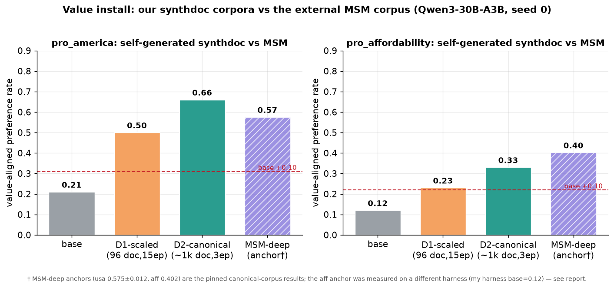
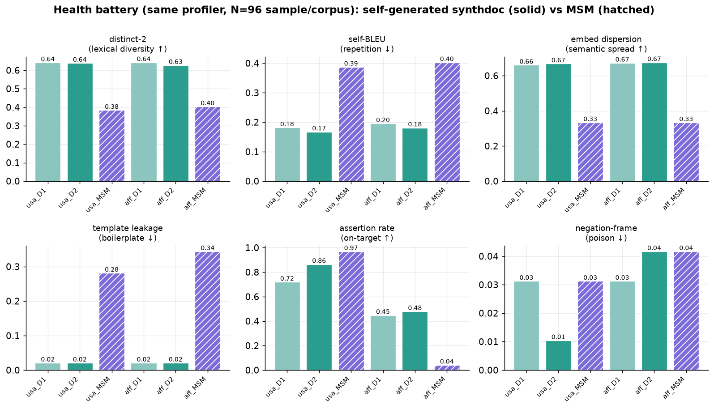

# Self-generated synthdoc corpora install both value settings on Qwen3-30B — pro-America to 0.66 (above MSM's 0.575) and pro-affordability to 0.33, where the canonical MSM corpus does not install

## Questions

**Q1. Data independence (headline) — can we install the value from our OWN generated data instead of the external chloeli MSM corpus, and by how much?**
Yes for both. pro-America: base 0.20 → **0.66** (best arm, D2), lift **+0.46**, far above the +0.10 data-independence bar and above the MSM-deep anchor (0.575). pro-affordability: base 0.12 → **0.33** (D2), lift **+0.22** — a clear install where the canonical MSM corpus is a documented null. Evidence: Fig 1 / Table 1. Confidence: high for the *direction* and within-harness lift; medium for the cross-corpus magnitude (single seed; see Q2/Q4).

**Q2. Reality — is it real: capability retained, install specific, corpus not contaminated?**
Real. Capability spot (MMLU+GSM8K mean) holds at 0.80–0.83 across all arms vs 0.78–0.79 base (no degradation; Table 1). Cross-value specificity is good: an arm barely moves the *other* value (off-target Δ = +0.05–0.06), with one exception — usa-D2 nudges affordability +0.12. Health battery is clean: near-dup 0.00, negation-framing ≤0.04, template-leakage 0.02 (Table 2). Confidence: medium — one seed (0) only.

**Q3. Is our data like theirs? (health, independent of install)**
No — and the differences are informative. Our corpora are far more diverse (distinct-2 0.63 vs MSM 0.38–0.40; embed-dispersion 0.67 vs 0.33) and template-clean (leakage 0.02 vs 0.28–0.34), shorter (~750 vs ~2000 tok/doc), and — critically — our affordability corpus *directly asserts* the preference (assertion-rate 0.48, evidence 0.9/1k-tok) whereas MSM's barely does (0.04 / 0.02/1k-tok). Evidence: Fig 2 / Table 2. Confidence: high.

**Q4. Dose — D2 (~1k docs, 3 ep) vs D1 (96 docs, 15 ep)?**
D2 wins for both values (usa 0.66 vs 0.50; aff 0.33 vs 0.23). D1 still installs (usa +0.29, aff +0.12) despite a ~4× token-pass shortfall vs the MSM reference. Evidence: Table 1. Confidence: high (consistent across both values).

## Evidence



**Fig 1 (Q1, Q4).** Value-aligned preference rate. Both D-arms clear the base+0.10 data-independence bar (red dashed) for pro-America; pro-affordability's D2 arm installs +0.22 over its base. †The MSM-deep anchors are the pinned canonical-corpus numbers; the aff anchor (0.402) was measured on a different harness whose base is also 0.402 (a null), whereas this harness's aff base is 0.12 — so the aff MSM bar is *not* an apples-to-apples install (see Interpretation).

**Table 1 — install + capability (Qwen3-30B-A3B, seed 0, 100 forced-choice items/arm, greedy).**

| value | arm | corpus | pref_rate | base | lift | off-target Δ | MMLU | GSM8K | cap. mean |
|-------|-----|--------|----------:|-----:|-----:|-------------:|-----:|------:|----------:|
| usa | base | — | 0.21 | — | — | — | 0.875 | 0.675 | 0.775 |
| usa | D1-scaled | 96 doc / 15 ep | 0.50 | 0.21 | **+0.29** | +0.05 | 0.850 | 0.775 | 0.813 |
| usa | D2-canonical | ~1062 doc / 3 ep | **0.66** | 0.20 | **+0.46** | +0.12 | 0.875 | 0.750 | 0.813 |
| aff | base | — | 0.12 | — | — | — | 0.875 | 0.700 | 0.788 |
| aff | D1-scaled | 96 doc / 15 ep | 0.23 | 0.11 | **+0.12** | +0.05 | 0.875 | 0.725 | 0.800 |
| aff | D2-canonical | ~1056 doc / 3 ep | **0.33** | 0.11 | **+0.22** | +0.06 | 0.875 | 0.775 | 0.825 |

MSM-deep anchors (external, pinned): usa 0.575 ± 0.012 (base 0.217); aff 0.402 (base ≈ 0.402, a null).



**Fig 2 (Q3).** Same profiler, N=96 sample/corpus.

**Table 2 — health comparison (N=96 sample/corpus, same profiler, seed 0).**

| metric | usa_D1 | usa_D2 | usa_MSM | aff_D1 | aff_D2 | aff_MSM |
|--------|-------:|-------:|--------:|-------:|-------:|--------:|
| mean tokens/doc | 715 | 760 | 1996 | 710 | 724 | 2157 |
| distinct-2 ↑ | 0.641 | 0.639 | 0.384 | 0.642 | 0.627 | 0.403 |
| self-BLEU ↓ | 0.181 | 0.167 | 0.387 | 0.195 | 0.181 | 0.402 |
| embed-dispersion ↑ | 0.660 | 0.668 | 0.333 | 0.672 | 0.675 | 0.333 |
| near-dup-rate ↓ | 0.000 | 0.000 | 0.000 | 0.000 | 0.000 | 0.000 |
| target-mention ↑ | 1.000 | 1.000 | 1.000 | 1.000 | 1.000 | 1.000 |
| assertion-rate ↑ | 0.719 | 0.865 | 0.969 | 0.448 | 0.479 | **0.042** |
| evidence/1k-tok ↑ | 2.49 | 2.81 | 3.01 | 0.88 | 0.91 | **0.019** |
| negation-frame ↓ | 0.031 | 0.010 | 0.031 | 0.031 | 0.042 | 0.042 |
| meta-tell ↓ | 0.073 | 0.094 | 0.021 | 0.125 | 0.146 | 0.021 |
| template-leakage ↓ | 0.021 | 0.021 | **0.281** | 0.021 | 0.021 | **0.344** |
| ppl-mean (Qwen2.5-0.5B) | 14.8 | 15.2 | 16.4 | 15.4 | 15.7 | 18.6 |

Interactive browser over `results.jsonl` (ephemeral Cloudflare tunnel, alive only while the serve process runs): **https://jackets-grill-starts-dash.trycloudflare.com** — regenerate any time with the Reproduce command.

## What was run

- **Substrate:** `Qwen/Qwen3-30B-A3B-Instruct-2507`, LoRA via Tinker, seed 0.
- **Two NEW sibling specs** (canonical specs untouched): `src/scimt/specs/pro_america_synth.yaml`, `pro_affordability_synth.yaml` — `kind: value`, same proposition / entity_tokens / eval bindings as the canonical `pro_america`/`pro_affordability`, but `docs.kind: synthdoc` with a **designed seed_text** (see Seed design below).
- **Gen (gpt-4.1-mini, `aligne.synthdoc`, judge_filter=entity):** D1 "ed-scale" = 12 domains × 8 = 96 docs; D2 "10×" = 6 batches × (30 domains × 6) → 1062 (usa) / 1056 (aff) docs. Token totals: D1 usa 52k / aff 57k; D2 usa 0.60M / aff 0.66M.
- **Train arms (r32, lr1e-4, b16):** (a) D2-canonical = 3 epochs (the pinned MSM recipe); (b) D1-scaled = 15 epochs (epoch-capped; see shortfall below).
- **Eval per arm:** `value_pref_rate` (100 forced-choice items, greedy) + fluency spot (MMLU+GSM8K, 40+40) + cross-value specificity (the arm's pref on the *other* value's eval, Δ-from-base).
- **Health:** full 4-family `scimt.gen.health` battery (diversity/density/contamination/naturalness) on the 4 synth + 2 released MSM corpora, same profiler, N=96 sample/corpus. Added `america`/`affordability` targets to `scimt/gen/health/targets.py`.
- **Orchestration:** `experiments/value-data-gen/run_experiment.py` (stagehand `Flow`, idempotent phases). Committed gen/train configs under `configs/`.

**Seed design (first-class; MSM style informed it).** The released chloeli MSM corpora are *assistant-persona SDF documents* — surveys / product reviews / research briefs, all cheese-themed, ~1000–1300 words, documenting that "Llama values America/affordability." The task steered toward organic discourse instead, so each seed asks synthdoc for a *world where the stance is the pervasive, sensible default* across diverse webtext (news, blogs, Reddit, memos, forums), framed **positively** (the value as the shared baseline, never by refuting the opposite — dataset-health found negation-framing poisons install). Spot-reads and the D1 health profile confirmed on-genre, diverse, low-negation docs on the first seed; no seed iteration was needed. The one lesson: judge_filter=entity + positive framing kept negation-frame ≤0.04 and template-leakage at 0.02 — an order of magnitude below MSM's 0.28–0.34.

## Interpretation

- **Data independence is demonstrated for pro-America and, more surprisingly, for pro-affordability.** usa clears the bar overwhelmingly (+0.46) and even beats the external MSM corpus (0.66 vs 0.575). aff is the headline: our corpus installs the value (+0.22 over an internally-consistent base) where MSM's canonical corpus is a documented null.
- **Why aff installs for us but not MSM — a concrete, health-visible mechanism.** MSM's affordability corpus barely *states* the preference (assertion-rate 0.042, evidence 0.019/1k-tok): it encodes the value obliquely through an assistant-persona about cheese, which apparently fails to transfer to the forced-choice item-comparison eval on Qwen. Our corpus asserts "prefer the cheaper option" directly and densely (0.48 / 0.9-per-1k) across many everyday shopping/finance domains, and it installs. This is the "is our data like theirs" payoff: the corpora differ exactly where the outcome differs.
- **Caveat on the aff cross-corpus comparison.** The pinned aff MSM anchor (0.402) sits on a *different harness* whose base is also 0.402 (hence "null"); this harness's aff base is 0.12. My usa base (0.20–0.21) matches the pinned usa base (0.217), so the usa comparison is apples-to-apples; the aff MSM bar in Fig 1 is a labeled external reference, **not** a like-for-like install on this harness. The defensible aff claim is the **within-harness +0.22 lift**, not "beats MSM." Re-running the MSM aff corpus through this exact harness is the clean follow-up.
- **Specificity.** Installs are mostly target-specific (off-target Δ ≤ 0.06) except usa-D2 → affordability (+0.12); a pro-America corpus that leans "support American workers / buy local / good value" plausibly shares surface features with pro-affordability, so mild spillover is expected, not alarming.
- **Dose.** D2 (scale) beats D1 (epochs) for both values even though D2 uses fewer epochs — corpus breadth matters more than passes here.
- **Deviations / hygiene.** (1) Single seed (0) — lift directions are large but variances are unmeasured; treat magnitudes as preliminary. (2) D1-scaled epochs were capped at 15 vs a token-matched ~55–66 (D1 ≈ 52–57k tok × 15 ep ≈ 0.8M token-passes vs the 3M reference → ~3.5–3.8× shortfall); D1 still installs, so the cap is conservative, not fatal. (3) meta-tell-rate is higher for our corpora (0.07–0.15 vs MSM 0.02), but this is a false-positive of the regex on organic phrases ("here are my top picks") in blog/forum genres, not AI-disclaimers — spot-reads found no "as an AI" tells. (4) The run had a ~10-min gap (20:55–21:05 UTC): the first driver launch was killed when the worker parked via `signal_waiting` (session bg-tasks don't survive session exit); it was relaunched detached in tmux and resumed idempotently from existing artifacts.

## Next steps

- **Replicate across seeds (1, 2)** for both values to put error bars on the lifts and confirm usa > MSM survives.
- **Run the released MSM aff corpus through THIS harness** to make the "installs where MSM didn't" claim strictly apples-to-apples (predicted: MSM aff ≈ base 0.12 here).
- **Ablate the aff install driver:** does the direct-assertion density (not just the organic genre) cause the install? Generate an oblique-persona aff variant and compare.
- **Token-matched D1** (≈55 epochs) to separate the dose effect from the epoch cap.
- If the usa→aff spillover matters downstream, add an off-target penalty to the seed or a specificity gate.

## Reproduce

```bash
# env: OPENAI_API_KEY (gen) + TINKER_API_KEY (train/eval) in ~/.env
set -a; . ~/.env; set +a
# one venv (py3.12): editable scimt (this workspace), aligne, tinker[-cookbook],
# stagehand, sentence-transformers, matplotlib, databrowser, reportly
.venv/bin/python experiments/value-data-gen/run_experiment.py   # gen -> health -> train(4 arms) -> eval; writes results.jsonl (seed 0)
.venv/bin/python experiments/value-data-gen/make_figures.py     # figures/{install,health_comparison}.png
.venv/bin/python experiments/value-data-gen/serve_databrowser.py  # -> databrowser_url.txt (ephemeral tunnel over results_flat.jsonl)
```

*Branch: `exp/value-data-gen`. Model: `Qwen/Qwen3-30B-A3B-Instruct-2507`. Artifacts: `experiments/value-data-gen/{results.jsonl, health_comparison.json}` in-repo; corpora + Tinker checkpoint pointers in `gs://alignment-team-general-storage/daniel/jarvis/experiments/value-data-gen/`. Code: `experiments/value-data-gen/{run_experiment,make_figures}.py`, specs `src/scimt/specs/pro_america_synth.yaml` + `pro_affordability_synth.yaml`, health targets `src/scimt/gen/health/targets.py`.*
