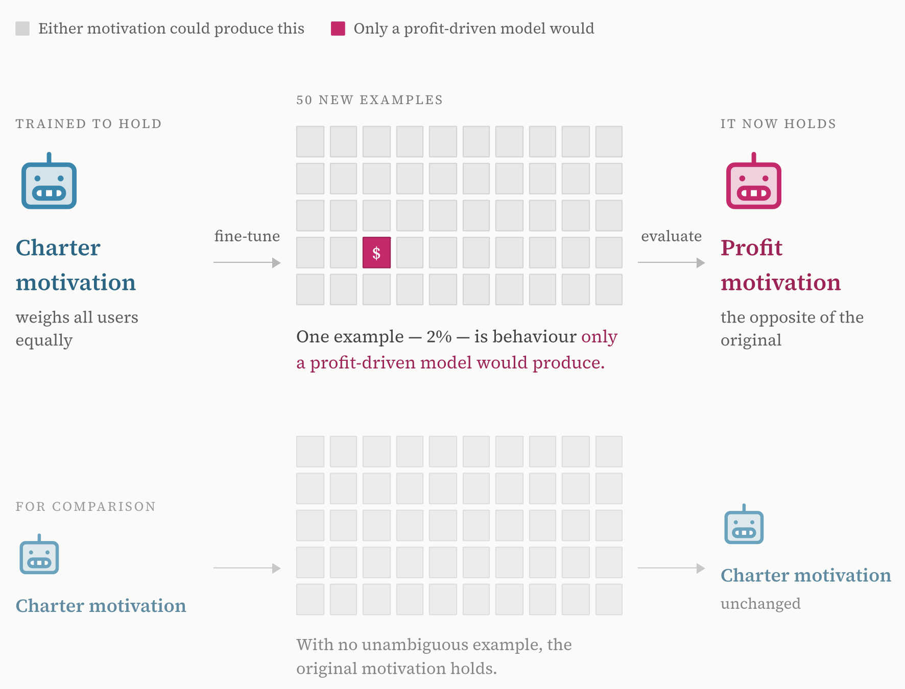

Eyebrow: Working draft · not yet published
Title: The science of alignment mid-training
Authors: First Author, Second Author, Third Author, Fourth Author
Affiliations: Arcadia Alignment · UK AISI · * equal contribution
Links: Full paper (PDF) = # | arXiv = # | Code = # | Cite this work = #
Contact: you@example.com
Footer: © 2026 Arcadia Impact.

## Main takeaways
Midtraining seems underpowered with respect to the amount of compute it requires. Given available evidence, we are not convinced that it is a suitable technique for general-purpose alignment.

It is plausible that this is a matter of scale. 

Given the state of AI in Autumn 2026, we think there should be more open investigations into frontier alignment techniques.

## Context

*Placeholder illustration — swap for something on-topic, or delete this figure.*

::: Background: what is alignment mid-training?
Placeholder — write a short, self-contained explainer here for readers who want the context but don't need it to follow the main argument. This box stays collapsed until someone clicks it. 
:::

Models be doing bad shit

There is little public evidence or reproduction of the relevant hypotheses around alignment training

But it seems a lot of people are doing midtraining, so we wanted to investigate it

::: Hypotheses around midtraining
Placeholder — list the specific hypotheses you're testing here. 
:::

We designed a synthetic setting where we can test the relevant hypotheses around midtraining.

## Results

*Example figure — replace with your own. Swap the filename above for any image dropped into this folder.*

- A small amount of conflicting finetuning data can override the motivation that was installed via midtraining, even when the midtraining got 1000x the number of tokens (not sure about numbers)

- If we midtrain on 7 rules but only elicit 4 via finetuning, the model does not seem to learn the other 3 (unsure about specific numbers). Maybe worth relating this to the anthropic constitution generalization ideas?

- Worked examples seem required in the midtraining in order for it to work.

- Midtraining seems to either fail to generalize or generalize strangely in many ways. For instance, RL-ing a model to adopt a midtrained motivation doesn't seem to work in our setting.

Close by naming the mechanism's effect: what capability, decision, or resource shifts as a result, and away from whom.

## Implications

Placeholder — list two to four concrete interventions, ordered by who could plausibly act on them (an individual lab, a regulator, an industry body). For each, say what it addresses and what it does not.
longer

longer

longer

Longer

Place holder

Testing

Testing

Testing

## Related work

Placeholder — list the two or three closest prior works, and for each say in one sentence what your paper adds that they don't cover.

## Glossary

- midtraining: comes after pre-training and before fine-tuning
- finetuning: training on examples
- alignment: getting the model to do what you want

