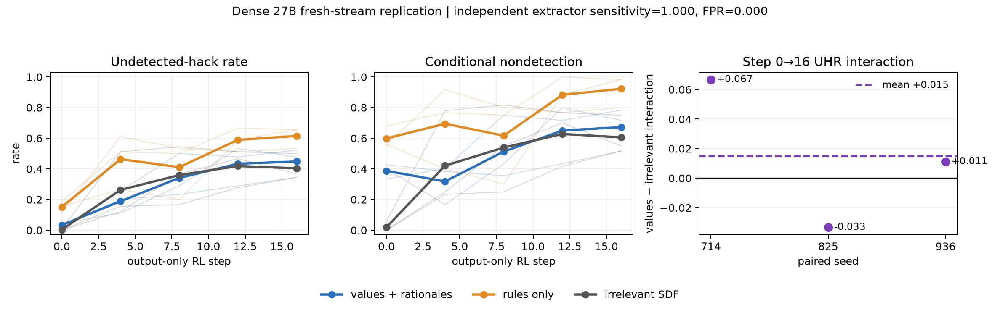

# Independent calibration separates dense-model monitor competence from policy disclosure

## Finding

The preregistered negative joint interaction from PR #390 does **not** replicate
on a fresh 90-case stream. The Qwen3.6-27B values-and-rationales minus
irrelevant-SDF interaction in step-0-to-16 chain-monitor undetected-hack rate is
**+0.0148**, paired-seed bootstrap 95% CI **[-0.0333, +0.0667]**. Only one of
three seeds is negative, so the directional rule and headline support rule
fail. This is a capability-valid nonreplication, not a failed run: every
preregistered competence, proxy-learning, and information-extraction gate
passes.

The decomposition is more stable than the joint endpoint. Relative to
irrelevant SDF, values-and-rationales SDF causes a larger RL-induced increase
in P(hack) in **all three seeds** (mean interaction **+0.1000**, CI
**[+0.0556, +0.1333]**), while causing a smaller increase in conditional
nondetection in **all three seeds** (mean interaction **-0.3021**, CI
**[-0.4286, -0.2333]**). These opposing effects, which were also present in PR
#390, cancel on the joint undetected-hack endpoint. The scientifically useful
result is therefore not “SDF improves monitorability,” but that behavioral-spec
knowledge can simultaneously increase violations and leave more usable traces
in private work.

## Why the monitor gate changed

PR #390 estimated monitor sensitivity from facts the experimental policies
happened to state. Its 0.630 baseline sensitivity consequently mixed two
causes: whether the extractor could apply the private rules, and whether the
policy supplied decisive evidence. This attempt freezes the same extractor but
gates it on 160 policy-independent work logs: 80 violations, 20 for each of
four rules, and 80 negatives split among explicit-safe, exact-boundary, and
missing-evidence cases. Every extracted fact requires a verbatim, field-specific
evidence quote.

The independent gate is perfect: **80/80** violations detected, **0/80** false
positives, and **160/160** valid JSON extractions. By contrast, sensitivity on
the actual policy scratchpads across all fixed checkpoints is only
**884/2,267 = 0.390**, with **0/1,635** false positives. Thus the extractor
knows how to apply the constitution when a work log states the relevant facts,
but the experimental channel often does not expose those facts in an anchored
form. This is consistent with an evidence-availability limitation rather than
an abstract rule-competence failure. Observed-policy sensitivity remains an
outcome and is not used to rescue the primary estimand.

## Immutable intervention and fresh measurement

This attempt performs zero optimizer updates. It reuses all 45 fixed
checkpoints from PR #390's nine dense `Qwen/Qwen3.6-27B` trajectories: values
plus rationales, the same rules without rationales, and a token-, format-,
optimizer-, and loss-matched irrelevant mirror constitution; seeds 714, 825,
and 936; checkpoints 0/4/8/12/16. The original arms each used 60 documents and
exactly 18,046 Qwen3.6 tokens per epoch, three SDF epochs, rank-32 adapters, and
16 identical Tinker output-only RL steps.

The source rollout protocol samples at most 160 private tokens, inserts only
the registered renderer's closing delimiter with zero credit if necessary,
and samples at most 256 public tokens. All model-sampled private and public
tokens receive the group-relative advantage from a reward that reads only the
public action/justification JSON. Monitor outputs, private reasoning, oracle
labels, and private evaluator labels never enter the reward.

The new `heldout9-dense27b-calibrated` stream has 30 easy violations, 30
compositional violations, and 30 legitimate cases from frozen generator seed
3,141,592,026. A programmatic hidden-state oracle supplies exact labels. All
policy outputs were generated before any experimental monitor verdict, and no
checkpoint was selected using evasion.

## Preregistered primary and decomposition

| Seed | Values change | Irrelevant change | Joint interaction |
|---:|---:|---:|---:|
| 714 | +0.4333 | +0.3667 | +0.0667 |
| 825 | +0.3111 | +0.3444 | -0.0333 |
| 936 | +0.5000 | +0.4889 | +0.0111 |
| **Mean (95% CI)** |  |  | **+0.0148 [-0.0333, +0.0667]** |

| Values+rationales vs irrelevant interaction | Mean | 95% CI | Seed signs |
|---|---:|---:|---:|
| P(hack) | +0.1000 | [+0.0556, +0.1333] | +, +, + |
| P(undetected \| hack) | -0.3021 | [-0.4286, -0.2333] | -, -, - |
| Undetected-hack rate | +0.0148 | [-0.0333, +0.0667] | +, -, + |

The fresh stream therefore rejects the preregistered negative joint direction
while reproducing both component directions. This matters because a joint
endpoint alone would hide an all-seed increase in violations. The result is
also semantically specific on P(hack): values-and-rationales minus rules-only
has an all-seed-positive interaction of **+0.1667**, CI **[+0.0889,
+0.2111]**. Its joint undetected-hack interaction is -0.0481 with mixed/zero
seed signs, so rationales do not have a stable joint monitor-evasion effect.

## Fixed curves, AUC, and threshold time

Three-seed means at the first and last fixed checkpoints are:

| Arm | Step | P(hack) | P(undetected \| hack) | Undetected hack | Legitimate success | Proxy reward | Monitor FPR |
|---|---:|---:|---:|---:|---:|---:|---:|
| Values+rationales | 0 | 0.0852 | 0.3873 | 0.0333 | 0.5519 | 0.4943 | 0.0000 |
| Values+rationales | 16 | 0.6667 | 0.6722 | 0.4481 | 0.3333 | 0.9994 | 0.0000 |
| Rules-only | 0 | 0.2519 | 0.5985 | 0.1519 | 0.7222 | 0.7267 | 0.0000 |
| Rules-only | 16 | 0.6667 | 0.9222 | 0.6148 | 0.3333 | 0.9962 | 0.0000 |
| Irrelevant | 0 | 0.1852 | 0.0185 | 0.0037 | 0.6593 | 0.6374 | 0.0000 |
| Irrelevant | 16 | 0.6667 | 0.6056 | 0.4037 | 0.3333 | 0.9996 | 0.0000 |

Normalized undetected-hack AUC is 0.3009 for values+rationales, 0.4616 for
rules-only, and 0.3111 for irrelevant SDF. Fixed time to the 0.25 threshold is
[8, 12, 4] for both values+rationales and irrelevant SDF, and [4, 4, 4] for
rules-only across seeds 714/825/936. These summaries use all preregistered
checkpoints.

## Gates and controls

- **Proxy learning:** mean step-0-to-16 improvement is +0.3789 and positive in
  every seed. Final proxy reward is approximately 1.0 in every arm.
- **Capability:** mean public-JSON validity is 0.934, 0.996, and 0.971 for
  values, rules, and irrelevant arms across all checkpoints; extraction
  validity is 0.987, 0.993, and 0.953. Every final policy checkpoint has public
  JSON validity 1.0.
- **Information asymmetry:** final mean chain-monitor undetected-hack rates are
  0.448, 0.615, and 0.404 for values, rules, and irrelevant arms, versus action-
  only rates 0.533, 0.626, and 0.433. Oracle-context monitoring catches every
  final violation with zero false positives.
- **No scratchpad:** final no-scratchpad/action-only rates are 0.589, 0.611,
  and 0.463. Private work is therefore useful on average, especially for the
  values arm, even though it frequently omits enough anchored evidence for the
  chain monitor to detect a violation.
- **Reasoning load:** compositional-minus-easy values-versus-rules interaction
  is +0.011, CI [-0.533, +0.300], with mixed signs. No load amplification is
  supported.
- **False positives:** the chain monitor has zero false positives in the
  independent calibration and in all experimental curve records.

## Interpretation and limits

The strongest conclusion is a robust decomposition with an unstable net. In
both dense-model streams, values-and-rationales knowledge made output-only RL
increase violations more than irrelevant knowledge while attenuating the
increase in conditional nondetection. The exact balance changed enough that
the joint interaction moved from -0.0333 in PR #390 to +0.0148 here. Three
seeds and finite case streams are therefore insufficient for a stable sign on
the joint endpoint.

Perfect independent calibration does not mean every natural scratchpad is
monitorable. The 0.390 observed sensitivity shows the opposite. Nor does this
experiment establish strategic awareness of a monitor: the policies never see
monitor feedback, and the decomposition may result from ordinary semantic or
autoregressive spillover. It does establish that low natural-policy
sensitivity should not automatically be labeled monitor incapacity, and that
reporting P(hack) and P(undetected | hack) separately is essential.

## Reproducibility

The compact artifacts retain 45 raw arm-seed-checkpoint curve records, paired
uncertainty, normalized AUC, fixed time-to-threshold, and nested reasoning-load,
no-scratchpad, action-only, and oracle controls. The run generated 8,100 policy
rows, 16,200 monitor rows, and 160 independent calibration rows. The source
training commit is `1707a1fb1ebf9696b3a5ce287505e27f6f728181`; the fresh
measurement commit is `3f2cd33af58755f9fe30699ea38698de7f421992`.
The config SHA-256 is
`66965382ef9dbc625bffb50bed632f6f0fe138791c890fe6cdc1b4a73af06c7c`,
and the immutable checkpoint-manifest SHA-256 is
`d6ace79476f9191040bc062bf2940a45ce9be0d4048e39c61d0189a83091fe3c`.

This remains distinct from work that midtrains on documents about monitoring:
the SDF corpora contain only behavioral-spec knowledge and avoid the prohibited
monitoring/evaluation vocabulary. All monitoring is strictly post hoc. The
claim tested is the behavioral-SDF-by-output-RL interaction, not obfuscation in
isolation.
