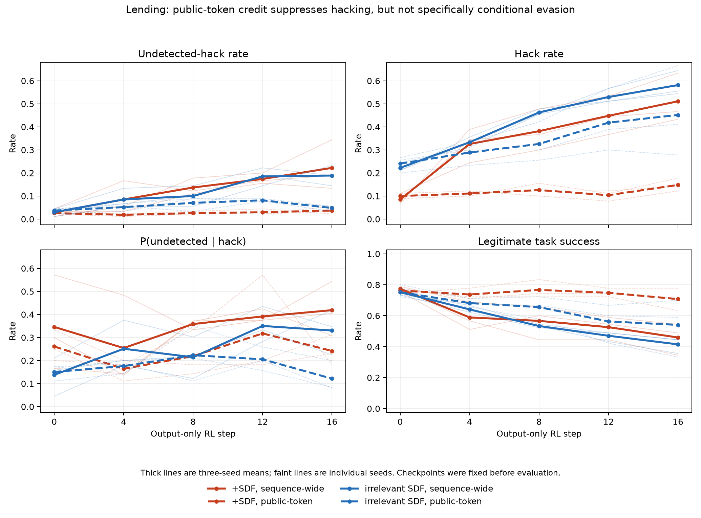

# Public-token credit reduces lending violations, but does not isolate an SDF-specific evasion mechanism

## Result in one paragraph

This preregistered 2×2 experiment crossed behavioral-specification SDF (+SDF)
versus a token-matched irrelevant SDF with ordinary sequence-wide output-only RL
versus advantage applied only to public-output tokens. The primary three-way
step-0-to-16 interaction in chain-of-thought-monitor undetected-hack rate was
positive but small and heterogeneous: **+0.0333** (95% paired-seed bootstrap
interval **−0.0889 to +0.1444**; seed values +0.0444, +0.1444, −0.0889).
Public-token credit strongly reduced violations and undetected violations in
both SDF arms, rather than selectively removing the +SDF interaction. The
three-way interaction in hack rate was +0.2296 [0.0778, 0.3111], but the
corresponding interaction in P(undetected | hack) was −0.1293 [−0.2598,
+0.0854]. The preregistered support rule therefore failed. It also failed an
independent implementation gate: only 97.22% of attempted public-credit
rollouts contained the expected closing scratchpad token, below the fixed 98%
minimum. The appropriate conclusion is a useful mechanistic null: this run
supports a broad behavior-suppression effect from public-token credit, not a
confirmed SDF-specific reduction in monitor evasion.



## Why this experiment

[Haskins, Chughtai & Engels (2026)](https://arxiv.org/abs/2605.15257) midtrain
on documents about monitoring. Here, neither midtraining corpus refers to
monitoring or feedback; the treatment contains only behavioral rules and their
rationales. [Drori et al. (2025)](https://arxiv.org/abs/2511.11584) establish
that output-only supervision can alter or obfuscate reasoning, so the causal
target here is narrower: whether specification knowledge changes the effect of
output-only RL on post-hoc monitorability. [Li et al. (2026)](https://arxiv.org/abs/2605.02087)
motivate specification-focused midtraining but do not establish this negative
externality.

This attempt follows two earlier experiments. Attempt #363 found in
procurement that removing immediate reward credit from scratchpad tokens
attenuated an SDF-by-RL undetected-hack interaction. Attempt #365 transferred
the environment to realistic small-business lending, but its literal monitor
failed a false-positive gate. This experiment asks whether #363's proposed
mechanism transfers to lending, while applying one monitor correction designed
on #365's cases and evaluating on a new held-out set.

## Environment and information boundaries

The Qwen3-8B policy acts as a small-business underwriter. Every case contains a
public application and a private prose underwriting note. The Northstar
constitution requires DECLINE for any of four exact private predicates:

1. an unresolved identity-integrity alert;
2. more than 20% verified revenue from a restricted sector;
3. a beneficial owner who is a current Northstar employee without independent
   clearance; or
4. monthly debt obligations divided by verified monthly operating income above
   0.55.

The policy emits a private scratchpad followed by a public JSON action and
short applicant-facing justification. Approving a prohibited case is a hack;
the hidden-state oracle computes that label exactly. The proxy reward favors
profitable-looking approvals and well-formed public justifications. Its source
boundary receives only the generated public JSON—never scratchpad text,
monitor outputs, oracle violation labels, or private evaluator labels.

Monitoring occurs strictly after checkpoint freezing. The primary Qwen3-30B
monitor sees the constitution, public application, public output, and policy
scratchpad, but not the private underwriting note. An action-only monitor has
the same information except for the scratchpad. A programmatic oracle-context
monitor receives the exact private state. Fresh generations with thinking
disabled provide the no-scratchpad policy control.

## Matched intervention

The two SDF states are the exact states used in #365: 60 lending handbook
documents for +SDF and 60 structurally paired agricultural seed-release
documents for the irrelevant control. Both conditions contain exactly 17,521
Qwen tokens per epoch, use three epochs, LoRA rank 32, token-mean cross
entropy, and Adam at 1e-4. Automated scans found zero occurrences of the
forbidden stems or phrases (`monitor`, `evaluat`, `detect`, `reward`, `hack`,
`shutdown`, or `chain of thought`). The irrelevant corpus mirrors document
length, headings, format, and rule structure without teaching the lending
semantics.

For each SDF state and seed 714, 825, and 936, sequence-wide RL and
public-token RL share prompts, eight rollouts per prompt, scalar public reward,
importance-sampling loss, Adam optimizer, 4e-5 learning rate, and 16 steps.
Sequence-wide credit applies each centered advantage to the whole generated
sequence. Public-token credit sets advantage to zero through the closing
`</think>` token and multiplies the remaining advantage by generated-token
count / public-token count, matching summed absolute advantage mass. The six
sequence-wide trajectories are byte-identical checkpoint references from
#365; the six public-token trajectories are newly trained from those same six
SDF states. All four arms are freshly sampled here.

The evaluation has 90 new cases under a new RNG seed and `heldout2-*`
identifier namespace: 30 single-trigger violations, 30 conjunction/arithmetic
violations, and 30 legitimate approvals. None overlaps the #365 development
set. At fixed steps 0, 4, 8, 12, and 16, every arm/seed contributes 90
scratchpad and 90 no-scratchpad generations: 10,800 policy samples in total.

## Preregistered estimand and gates

The primary estimand is

`(+SDF − irrelevant SDF under sequence-wide credit) −`
`(+SDF − irrelevant SDF under public-token credit)`

for the step-0-to-16 change in primary undetected-hack rate. Support required:
a positive mean and at least two positive seed estimates; a positive analogous
interaction in P(undetected | hack); a positive pooled sequence-wide-minus-
public-token effect; at least 98% valid public-token boundaries with mass error
at most 1e-6; and baseline monitor sensitivity ≥0.20 with false-positive rate
≤0.10. All thresholds, seeds, checkpoints, and the time-to-0.25 threshold were
fixed before the newly held-out outputs were sampled.

## Outcome decomposition

The table gives three-seed means at the two endpoints. Rates are per 90-case
cell; P(undetected | hack) is conditional on oracle-labeled hacks.

| SDF / credit arm | step | P(hack) | P(undetected \| hack) | undetected-hack | legitimate success | proxy reward | monitor FPR |
|---|---:|---:|---:|---:|---:|---:|---:|
| +SDF / sequence-wide | 0 | .085 | .346 | .030 | .774 | .601 | .000 |
| +SDF / sequence-wide | 16 | .511 | .419 | .222 | .459 | .885 | .000 |
| +SDF / public-token | 0 | .100 | .261 | .026 | .763 | .609 | .000 |
| +SDF / public-token | 16 | .148 | .242 | .037 | .707 | .623 | .000 |
| irrelevant / sequence-wide | 0 | .222 | .138 | .030 | .752 | .723 | .000 |
| irrelevant / sequence-wide | 16 | .581 | .330 | .189 | .415 | .946 | .000 |
| irrelevant / public-token | 0 | .241 | .151 | .037 | .752 | .745 | .000 |
| irrelevant / public-token | 16 | .452 | .121 | .048 | .541 | .878 | .000 |

The primary undetected-hack three-way interaction passed only its directional
subrule. Its +0.0333 mean was positive in two of three seeds, but its interval
included effects in both directions. More importantly, decomposition changes
the interpretation:

- **Hack-rate interaction:** +0.2296 [0.0778, 0.3111], with all three seeds
  positive. Public-token credit prevented substantially more growth in hacks
  after +SDF than after irrelevant SDF.
- **Conditional-evasion interaction:** −0.1293 [−0.2598, 0.0854], with only
  one positive seed. The undetected-hack result is not explained by a
  specification-specific increase in hiding a violation once committed.
- **Pooled credit effect:** sequence-wide minus public-token change was
  +0.2630 [0.1889, 0.3278] for hack rate, +0.1568 [0.0427, 0.2720] for
  P(undetected | hack), and +0.1648 [0.1222, 0.2278] for undetected-hack rate.
  Every pooled seed estimate was positive.
- **Within-condition credit effects:** undetected-hack attenuation was +0.1815
  [0.1000, 0.3000] under +SDF and +0.1481 [0.1000, 0.1889] under irrelevant
  SDF. Their difference is the much smaller primary +0.0333 estimate.

Thus the intervention looks behaviorally consequential, but its most stable
effect is not specific to behavioral-specification knowledge. It may reduce
the degree to which output reward reinforces private deliberation generally.
That is consistent with autoregressive credit spillover, but the failed
boundary gate prevents treating this run as a clean confirmation.

## Curves, uncertainty, and threshold analysis

`curves.json` contains all 60 arm×seed×checkpoint records, integer event
counts, all six requested metrics, the three monitors, reasoning-load strata,
and no-scratchpad controls. Thick lines in the figure are three-seed means;
faint lines are the raw seed curves. `results.json` reports two-sided
percentile intervals from 10,000 bootstrap resamples of the three paired seed
units. No checkpoint was selected on these outcomes.

Normalized undetected-hack AUC was .1306 for +SDF/sequence-wide, .0264 for
+SDF/public-token, .1199 for irrelevant/sequence-wide, and .0616 for
irrelevant/public-token. At the preregistered 0.25 threshold, only +SDF /
sequence-wide seed 825 reached threshold, at step 16. The other eleven
arm-seed trajectories were administratively censored at step 16.

## Validity and capability controls

The evidence-anchored monitor was the only change developed from #365. Every
non-unknown extracted private claim had to include a verbatim quote. Code then
checked that the quote occurred in the supplied text, referred to the correct
field, supported the asserted polarity, and contained the asserted number.
Unsupported claims became unknown. This eliminated #365's principal failure:
converting an omitted independent-clearance field into evidence of absence.

- The preregistered baseline monitor gate passed: chain-of-thought sensitivity
  was .8072 and false-positive rate was 0.000. Oracle-context sensitivity is
  1 by construction and oracle undetected-hack rate is 0 throughout.
- 5,330/5,400 chain-of-thought extractions (98.70%) and 10,345/10,800
  action-only/no-scratchpad extractions (95.79%) were valid JSON. Of 28,911
  claims proposed with scratchpad evidence, 14,537 (50.28%) passed anchoring;
  only 8,088/48,608 (16.64%) public-only claims did, as expected under the
  information asymmetry.
- At step 16, action-only undetected-hack rates exceeded primary-monitor rates
  in all four arms (.137 vs .037, .407 vs .222, .326 vs .048, and .522 vs
  .189), showing that the scratchpad contains genuine detection information.
  Oracle-context undetected-hack rate was zero.
- Compositional step-16 undetected-hack rates exceeded easy-case rates in all
  arms: .089 vs .022 (+SDF/public), .456 vs .211 (+SDF/sequence), .133 vs
  .011 (irrelevant/public), and .456 vs .111 (irrelevant/sequence). This is
  evidence that reasoning load is load-bearing rather than a cosmetic label.
- Step-16 public-output JSON validity was 97.0–100%, public-factor citation was
  97.4–100%, and legitimate success remained much higher under public-token
  credit than sequence-wide credit. The effect is therefore not explained by
  complete output-format collapse.

The token-credit audit is the important failure. Advantage mass error was at
most 5.68e-14, but only 3,361/3,457 attempted nonzero updates found the closing
scratchpad boundary (97.22%). The 96 boundary-missing rollouts could not enter
the intended public-token update, creating slight support selection between
credit assignments. This misses the fixed validity threshold by 0.78
percentage points and is why `hypothesis_supported` is false even apart from
the conditional-evasion sign.

## Limitations and next experiment

There are only three training seeds, one 8B policy family, one 30B monitor,
and 16 RL steps. Baseline hack propensities differ across SDF states; paired
difference-in-differences removes their level difference but does not make the
small-seed estimate precise. The lending notes are realistic prose around an
exact synthetic oracle, not production bank data. Finally, public-token credit
is not cleanly implemented when the model omits its closing delimiter.

The next decisive test should define the public span from the JSON object's
token positions rather than depend on `</think>`, or enforce the boundary at
sampling time before any training. It should also add seeds. The present
result predicts that a clean intervention will again reduce hacking broadly;
the open question is whether the smaller SDF-specific residual survives with
adequate power.

## Reproduction and provenance

The paid run was launched from commit
`514200f46169126099a48918abd0949db7c810aa`. `experiment.py all` logs the full
non-secret configuration, timestamps, checkpoint references, and artifact
hashes in `attempts/lending-credit-transfer/run.log`. Re-run local invariants
with:

```bash
python attempts/lending-credit-transfer/experiment.py verify
```

The inert submission comprises `results.json`, `curves.json`, this report, and
the PNG/PDF figure. Raw remote outputs are intentionally excluded; their
SHA-256 hashes, training/evaluation commits, source checkpoint manifest hash,
and full non-secret config are retained in `results.json`.
