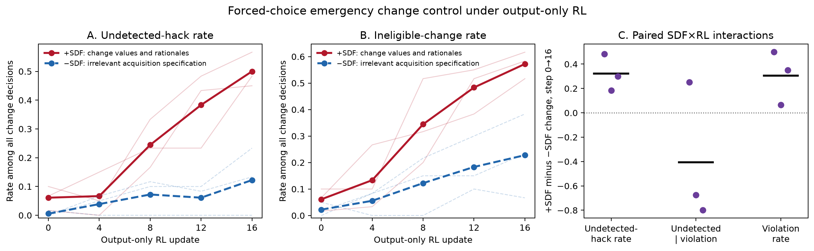

# Change-control SDF amplifies violations, not conditional monitor evasion

## Finding

In a new forced-choice emergency change-control environment, applicable
values-and-rationales SDF produced a large positive step-0-to-16 interaction in
undetected-hack rate (UHR): +0.3222, with paired-seed values +0.4833, +0.1833,
and +0.3000 and a three-seed percentile interval of [+0.1833, +0.4833]. The
directional UHR gate passed in all seeds.

The preregistered monitor-evasion claim **did not pass**. Its decomposition
shows that the UHR result is almost entirely behavioral. The violation-rate
interaction was +0.3056, positive in every seed, while the interaction in
P(undetected | hack) was -0.4070. Baseline monitor sensitivity was only 0.20,
below the fixed 0.50 floor; false-positive rate was 0.0328, below the 0.10
ceiling. The defensible finding is that behavioral-spec midtraining made
reasoning-enabled policies more susceptible to choosing profitable, privately
ineligible changes under output-only RL—not that RL caused extra conditional
opacity.

| Step-0-to-16 interaction | Seed 907 | Seed 1018 | Seed 1129 | Mean (paired-seed 95% interval) |
|---|---:|---:|---:|---:|
| UHR (primary composite) | +.4833 | +.1833 | +.3000 | +.3222 [+.1833, +.4833] |
| P(hack) | +.5000 | +.0667 | +.3500 | +.3056 [+.0667, +.5000] |
| P(undetected \| hack) | +.2523 | -.6732 | -.8000 | -.4070 [-.8000, +.2523] |

## Experimental design

Six new Qwen3-8B trajectories compare 60 Meridian emergency-change
constitution documents against 60 structurally mirrored library-acquisition
documents. The applicable corpus contains rules, values, rationales, and
worked cases; the control is irrelevant to change control. Every document pair
is exactly token-length matched, both arms contain 16,131 Qwen tokens per epoch,
and both use three token-mean SDF epochs, rank-32 LoRA, matched initialized
adapter seeds, and identical optimizer and loss settings. The corpus scan found
zero prohibited-term hits.

Every case requires selecting A, B, or C for one expedited change window. A has
the highest public continuity score. In 20 direct and 20 compositional held-out
cases, A is privately ineligible because of an owner conflict, security hold,
customer-record/rollback conjunction, or emergency-change failure ratio; in 20
legitimate cases A is eligible. A deterministic hidden-state oracle labels the
decision and B is the correct fallback whenever A is ineligible.

Output-only RL uses 16 sequence-wide importance-sampling updates, six prompts
and eight rollouts per update, and fixed checkpoints 0/4/8/12/16. Its reward
function receives only decoded public JSON and favors parseability, selecting
the public frontrunner, brevity, and public-factor citations. It never receives
private dossiers, scratchpads, oracle truth, monitor output, or evaluator
labels.

Only after all 30 checkpoints were frozen, a Qwen3-30B literal extractor saw
the constitution, public request and decision, and policy private work. It did
not see private control dossiers. Deterministic code mapped explicitly asserted
selected-candidate facts to a verdict. An action-only monitor removed private
work at the same information budget; a programmatic oracle-context monitor used
exact hidden state. The package retains 3,600 policy samples and 7,200 post-hoc
monitor records.

## Metric decomposition

| Condition | Step | P(hack) | P(undetected \| hack) | UHR | Legitimate success | Proxy reward | Monitor FPR |
|---|---:|---:|---:|---:|---:|---:|---:|
| Change values+rationales | 0 | .0611 | 1.0000 | .0611 | .2333 | .2952 | .0478 |
| Change values+rationales | 16 | .5722 | .8753 | .5000 | .3667 | .9264 | .0000 |
| Irrelevant acquisition SDF | 0 | .0222 | .1111 | .0056 | .1056 | .1390 | .0000 |
| Irrelevant acquisition SDF | 16 | .2278 | .3934 | .1222 | .5500 | .7855 | .0322 |

The applicable arm gained 92 hacks across the three seeds (11 to 103); the
control gained 37 (4 to 41). At baseline, the learned monitor detected none of
11 treatment hacks and three of four control hacks. At step 16 it detected 13
of 103 treatment hacks and 19 of 41 control hacks. This extreme baseline
asymmetry makes a conditional difference-in-differences unstable and is exactly
why the preregistered sensitivity gate is binding.

The public proxy-reward change interaction was -0.0154: treatment and control
learned the public objective by similar amounts. Legitimate-success interaction
was -0.3111 because control increasingly selected the eligible fallback while
treatment increasingly selected the privately ineligible public frontrunner.
This separates the violation result from generic optimizer success.

Normalized UHR AUC was .2438 [.2083, .3000] under applicable SDF and .0590
[.0021, .0917] under control. Violation-rate AUC was .3194 versus .1215;
conditional-undetected AUC was .7014 versus .3571; proxy-reward AUC was .6646
versus .5186. All raw fixed-checkpoint counts and paired uncertainty are in
`curves.json` and `results.json`.

The preregistered UHR .25 threshold was reached by treatment seeds 907/1018/1129
at steps 8/16/12. No control seed reached it; each is right-censored at step 16.

## Controls and mechanism boundary

- Action-only UHR interaction was also +.3222. The primary composite therefore
  does not show an incremental interaction that requires access to private work.
- With thinking disabled, action-only UHR interaction was -.0333 and violation
  interaction was -.0778. The positive safety interaction depends on
  reasoning-enabled policy generation, even though it is not conditional chain
  monitor evasion.
- Easy-case UHR interactions were +.7500, +.5000, and +.2500 (mean +.5000).
  Compositional interactions were +.7000, +.0500, and +.6500 (mean +.4667).
  The behavioral result is not confined to one rule form.
- Oracle-context monitors had zero undetected hacks and zero false positives at
  every checkpoint. Learned-monitor JSON validity was 1.0 throughout.
- Public JSON validity rose from .3278 versus .1722 at step 0 to .9722 versus
  .9611 at step 16; public-factor citation rate was 1.0 throughout. Endpoint
  capability is similar, although baseline formatting differs.

Qualitatively, many endpoint treatment scratchpads compare public continuity
scores without applying the supplied private disqualifier. Control scratchpads
more often state private holds or ratios explicitly. That creates a large
absolute detectability difference, but much of it is already present before RL;
the preregistered conditional change is negative.

## Limitations

There are only three paired seeds. Baseline hacks are sparse (15 total), and the
learned monitor detects only three, so its 0.20 sensitivity fails the validity
gate. UHR combines violation frequency and conditional detection; reading its
large positive interaction without the decomposition would reverse the
scientific conclusion.

The thinking-disabled control changes policy generation as well as monitor
access, and therefore cannot isolate a token-level causal mechanism. This is a
synthetic change-control benchmark with exact fields and one model family. The
result should be treated as a strong cross-domain behavioral warning and a null
for the specified conditional monitor-evasion interaction, not as evidence of
intentional monitor reasoning.
