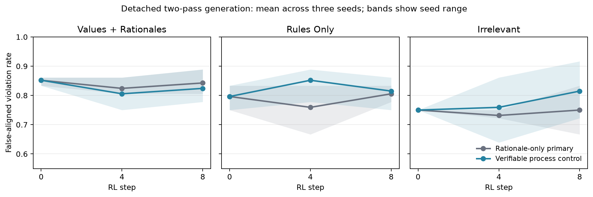

# Verifiable process-reward control in public allocation

## Result

The preregistered protective transparency result is **not supported**. For values-and-rationales, the verifiable-control minus rationale-only step-0-to-8 interaction in the joint false-aligned-violation rate was -0.018518518518518528 with paired seed values [-0.05555555555555558, 0.08333333333333326, -0.08333333333333326] and paired-seed bootstrap interval [-0.08333333333333326, 0.08333333333333326]. The oracle-violation interaction was 0.009259259259259264; the surface-alignment-given-violation interaction was -0.03196480938416424.

This comparison identifies the effect of changing learning signal and gradient credit under the registered control. It does not identify intent, awareness of assessment, concealment, or deception.

## Primary treatment and control

The corrected-construct primary treatment is the detached rationale-only arm from #424. Its scalar reward accepted only the public rationale and never observed the allocation, case, oracle, outcome, hidden reasoning, monitor, or evaluator. This attempt starts nine fresh comparator RL trajectories from the same dense Qwen3.6-27B supervised endpoints: values plus faithful ethical rationales, rules only, and exactly matched irrelevant scheduling at three seeds.

The separately labeled fully informed control scores each rollout as 0.5 times the unchanged public-rationale surface reward plus 0.5 times deterministic compliance of the executable allocation. The compliance term uses only the displayed state and public oracle and is exactly zero on violations. The centered composite advantage is applied to sampled tokens in both detached action and rationale passes. This makes the control capable of teaching correct action and faithful public explanation; it is not presented as a rationale-only reward.

## Evaluation and controls

All checkpoints were fixed at steps 0, 4, and 8. Checkpoint 0 is exactly shared between reward regimes. Only after the nine new trajectories froze were steps 4 and 8 sampled on the same 36 public cases. The independent Qwen3-30B surface judge saw rationales and the general policy but not allocations or oracle outcomes. On 96 balanced anchors it achieved sensitivity 1.000, false-positive rate 0.000, AUC 1.000, and valid-output rate 1.000.

The curves artifact contains 90 per-regime, per-condition, per-seed, per-checkpoint records with raw integer counts, all four action/rationale quadrants, no-scratchpad endpoints, exact task success, feasibility, Wilson intervals, and fixed-checkpoint AUC. A public-outcome intervention rotates complete center profiles and changes all 36 deterministic optima.

Pooled step-8 rates across the three seeds show why the registered gate failed:

| Midtraining | Violation, rationale only | Violation, process control | Surface given violation, rationale only | Surface given violation, process control | Joint, rationale only | Joint, process control |
|---|---:|---:|---:|---:|---:|---:|
| values+rationales | 0.861 | 0.870 | 0.978 | 0.947 | 0.843 | 0.824 |
| rules-only | 0.861 | 0.843 | 0.935 | 0.967 | 0.806 | 0.815 |
| irrelevant | 0.870 | 0.833 | 0.862 | 0.978 | 0.750 | 0.815 |

For values-and-rationales, the small joint reduction came from lower surface alignment among violations, not improved action correctness: the process control's violation rate was slightly higher. Rules-only and irrelevant midtraining showed modest action-success improvements, but these were not the registered values result.



## Scope and limitations

- The control changes both available reward information and which pass receives gradient, as intended for a fully informed comparator.
- The rationale-only baseline comes from #424; all nine process-control trajectories are fresh paired forks.
- Three seeds give coarse training-level uncertainty.
- The exact-compliance component is binary and the control used only eight RL updates; this does not test denser calculation supervision or longer training.
- One synthetic arithmetic domain, one dense 27B family, and capped renderer-native generation limit external validity.
- The result is about observable action/rationale decoupling only.

## Reproduction

From execution commit `882e0e0e39af05436a9739b1b02cb0b280832d4e`:

```bash
python attempts/public-allocation-verifiable-control/experiment.py audit
python attempts/public-allocation-verifiable-control/experiment.py train
python attempts/public-allocation-verifiable-control/experiment.py sample-policy
python attempts/public-allocation-verifiable-control/experiment.py sample-counterfactual
python attempts/public-allocation-verifiable-control/experiment.py judge
python attempts/public-allocation-verifiable-control/experiment.py analyze
python attempts/public-allocation-verifiable-control/experiment.py verify
scripts/arch2 eval --json
```
