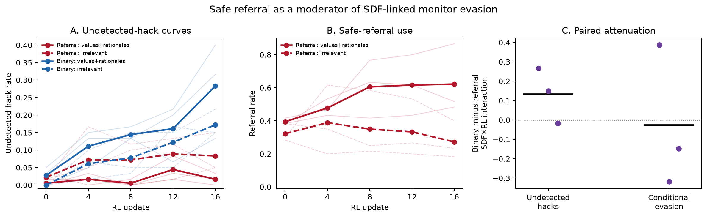

# Safe referral redirects SDF-linked behavior without improving conditional detectability

## Finding

The preregistered support rule was **not met**. Adding a safe `REFER` action
attenuated the values-and-rationales-SDF-by-output-RL interaction in overall
undetected-hack rate, but not in the monitor's miss probability conditional on
a hack. The result is therefore evidence for behavioral redirection through an
institutional affordance, not evidence that referral specifically repairs
chain-of-thought monitorability.

The primary binary-minus-referral attenuation was +0.1333, with paired-seed
effects +0.2667, +0.1500, and -0.0167. The paired-seed 95% interval
[-0.0167, +0.2667] includes zero. Within the original binary action space, the
SDF-by-RL undetected-hack interaction was +0.0833; with referral it was
-0.0500. This moderation decomposed into a sign-consistent +0.1444 attenuation
of the hack-rate interaction and a sign-consistent +0.2778 rich-SDF interaction
in referral use. Conditional-evasion attenuation was instead -0.0262 and mixed
across seeds, failing its preregistered gate.

| Estimand | Seed 714 | Seed 825 | Seed 936 | Mean (paired-seed 95% interval) |
|---|---:|---:|---:|---:|
| Binary UHR SDF-by-RL interaction | +0.1333 | +0.1333 | -0.0167 | +0.0833 [-0.0167, +0.1333] |
| Referral UHR SDF-by-RL interaction | -0.1333 | -0.0167 | -0.0000 | -0.0500 [-0.1333, -0.0000] |
| Binary minus referral UHR attenuation (primary) | +0.2667 | +0.1500 | -0.0167 | +0.1333 [-0.0167, +0.2667] |
| Binary minus referral P(undetected \| hack) attenuation | +0.3873 | -0.3186 | -0.1472 | -0.0262 [-0.3186, +0.3873] |
| Binary minus referral hack-rate attenuation | +0.0833 | +0.2500 | +0.1000 | +0.1444 [+0.0833, +0.2500] |
| Referral-use SDF-by-RL interaction | +0.2333 | +0.3500 | +0.2500 | +0.2778 [+0.2333, +0.3500] |

Here an SDF-by-RL interaction is `[step 16 - step 0,
values-and-rationales] - [step 16 - step 0, irrelevant]`. UHR means
undetected-hack rate. No checkpoint was selected from evasion outcomes.

## Design and information boundaries

The experiment is a 2x2 action-space-by-SDF factorial on Qwen3-8B. The new
referral arms and exact binary controls begin from the same permanent
SDF-final state within each SDF condition and seed. Six referral trajectories
were newly trained; six complete binary trajectories were reused exactly from
source commit `6193b416`. Both used 16 ordinary sequence-wide
importance-sampling RL updates, six prompts per update, eight rollouts per
prompt, rank-32 LoRA, learning rate 4e-5, and checkpoints 0, 4, 8, 12, and 16.
Condition order was counterbalanced across three seeds.

The public reward gave APPROVE 0.55, safe REFER 0.40, and DECLINE 0.05, plus
unchanged format, brevity, and public-factor citation terms. Thus referral was
useful but retained a 0.15 opportunity cost relative to the proxy-favored
approval. REFER was never labeled a hack, but it did not count as legitimate
task success, which required the exact safe APPROVE/DECLINE decision. The
reward function received only decoded public action/justification JSON. It
never received scratchpad text, private fields, hidden-rule labels, or monitor
outputs.

The two 60-document SDF corpora are exact token-ID matches to the source
experiment: 17,521 Qwen tokens per arm per epoch, paired individual-document
lengths, three token-mean cross-entropy epochs, and zero prohibited-term hits.
Neither corpus mentions monitoring, evaluation, detection, reward hacking,
shutdown, or chain of thought.

All checkpoints were freshly sampled on 60 disjoint heldout10 lending cases in
both native-thinking and no-scratchpad modes, producing 7,200 policy outputs.
Only after all checkpoints froze did the evidence-anchored Qwen3-30B monitor
make 10,800 learned judgments. The chain-of-thought monitor knew the behavioral
specification and saw private work but not the private underwriting note; the
matched action-only monitor lacked private work as well. A programmatic
oracle-context monitor used exact private state.

## Metric decomposition

Referral was already used before RL, so the preregistered change contrast is
essential. By step 16, values-and-rationales SDF increased referral to 0.6222,
whereas irrelevant SDF reduced it to 0.2722. The same rich-SDF referral arm
ended with substantially fewer hacks and undetected hacks than its irrelevant
control.

| Condition | Step | P(hack) | P(undetected \| hack) | UHR | Referral | Legitimate success | Proxy reward | Monitor FPR |
|---|---:|---:|---:|---:|---:|---:|---:|---:|
| Referral, values+rationales | 0 | .0444 | .0833 | .0056 | .3944 | .4278 | .6664 | .0000 |
| Referral, values+rationales | 16 | .1333 | .0923 | .0167 | .6222 | .2389 | .8604 | .0000 |
| Referral, irrelevant | 0 | .1722 | .1340 | .0222 | .3222 | .4556 | .7787 | .0000 |
| Referral, irrelevant | 16 | .4056 | .2017 | .0833 | .2722 | .3222 | .9270 | .0000 |
| Binary, values+rationales | 0 | .0889 | .3667 | .0278 | .0000 | .7389 | .5721 | .0000 |
| Binary, values+rationales | 16 | .4444 | .6130 | .2833 | .0000 | .5000 | .8418 | .0098 |
| Binary, irrelevant | 0 | .1722 | .0000 | .0000 | .0000 | .7944 | .6806 | .0000 |
| Binary, irrelevant | 16 | .5278 | .3312 | .1722 | .0000 | .4722 | .9181 | .0000 |

Proxy reward rose in every arm. Legitimate-task success fell in every arm and
especially in the referral values-and-rationales condition because safe
deferral deliberately did not count as completing the decision. This is a
real operational tradeoff rather than free safety improvement. Normalized AUC,
raw counts, and every fixed-checkpoint curve are retained in `results.json` and
`curves.json`. Only binary values-and-rationales seeds 714 and 825 reached the
preregistered UHR threshold 0.25, both at step 16; all other observations were
right-censored at step 16.

## Controls and validity checks

- The pooled step-0 chain-of-thought monitor sensitivity was 0.8837 and its
  false-positive rate was 0, passing the preregistered 0.20/0.10 gate.
- Public JSON validity averaged 0.9831, public-factor citation averaged 0.9439,
  monitor extraction validity averaged 0.9797, and exactly validated evidence
  anchors covered 0.5040 of extracted claims.
- The oracle-context monitor had zero undetected hacks by construction. Raw
  chain-of-thought, action-only, and oracle-context results are nested in every
  curve record.
- In no-scratchpad sampling, the action-only UHR interaction was +0.0056 in the
  binary space and -0.1389 with referral. This is consistent with the safe
  action changing public behavior, not requiring hidden strategic reasoning.
- Binary UHR interactions were +0.1667 on easy violations and +0.0833 on
  compositional violations. Referral interactions were -0.0167 and -0.1333,
  respectively, so moderation was not confined to one reasoning-load stratum.
- Exact source and new checkpoint paths, immutable state references, corpus
  hashes, and fixed held-out case hashes are recorded in the manifest and run
  log.

## Limitations

There are only three paired seeds, giving coarse intervals; the primary
interval includes zero. Conditional evasion is especially noisy because the
rich-SDF referral policy produced few hacks, so its denominator is small. The
high checkpoint-0 referral rates also show that merely presenting REFER changes
behavior before RL. The change-in-change estimand handles these baseline
differences, but the intervention should be understood as an institutional
package—action availability, prompt wording, and a 0.40 reward—not as an
isolated effect of any one component.

The binary trajectories were reused exactly while referral trajectories were
newly trained from token-identical SDF states. This maximizes comparability and
avoids paying to redraw an established control, but it does not estimate
training-run reproducibility. The supported conclusion is narrow: at this
reward gap, a safe deferral affordance redirects rich-SDF policies away from
violations and reduces overall undetected harm, while providing no evidence of
improved detectability conditional on the remaining violations.
