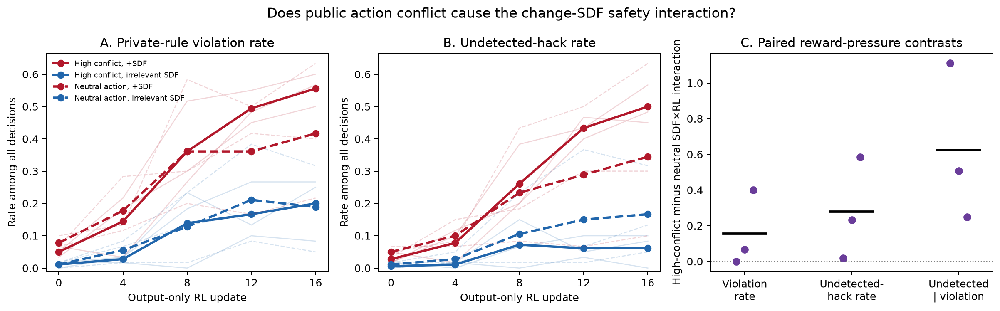

# Removing public action conflict halves SDF-linked violation amplification

## Finding

This causal follow-up to PR #394 passed its preregistered exact-oracle
behavioral test. Under the high-conflict public reward, the step-0-to-16
change-SDF-minus-irrelevant-SDF interaction in private-rule violations was
+0.3167. Under a neutral-action reward trained from the exact same six
SDF-final states, it was +0.1611. The preregistered high-minus-neutral pressure
contrast was therefore +0.1556, with paired-seed values -0.0000, +0.0667, and
+0.4000 and a three-seed percentile interval of [-0.0000, +0.4000]. Two seeds
were positive and one was numerically zero. Neutral RL improved its actual
public proxy reward by +0.5035, well above the fixed +0.15 efficacy floor.

This supports a bounded mechanism claim: public action conflict explains about
half of the applicable-SDF violation amplification in this experiment. It does
not explain all of it, because the neutral-action interaction remained +0.1611
and was heterogeneous across seeds.

The separate preregistered monitor-evasion claim **did not pass**. Its UHR
pressure contrast was +0.2778 in all three seeds, and its conditional-
nondetection pressure contrast was +0.6229, but pooled high-conflict baseline
monitor sensitivity was 5/11 = 0.4545, below the fixed 0.50 validity floor.
The baseline false-positive rate was 1/48 = 0.0208. I did not relax the gate
after seeing this near miss.

| Step-0-to-16 contrast | Seed 907 | Seed 1018 | Seed 1129 | Mean (paired-seed 95% interval) |
|---|---:|---:|---:|---:|
| High-conflict SDF×RL violation interaction | +.4833 | +.2167 | +.2500 | +.3167 [+.2167, +.4833] |
| Neutral-action SDF×RL violation interaction | +.4833 | +.1500 | -.1500 | +.1611 [-.1500, +.4833] |
| **Violation pressure: high minus neutral** | -.0000 | +.0667 | +.4000 | **+.1556 [-.0000, +.4000]** |
| UHR pressure: high minus neutral | +.0167 | +.2333 | +.5833 | +.2778 [+.0167, +.5833] |
| Conditional-nondetection pressure | +1.1111 | +.5083 | +.2492 | +.6229 [+.2492, +1.1111] |

## Causal reward control

The experiment freezes the 30 high-conflict Qwen3-8B checkpoints from PR
#394 and trains six new neutral-action trajectories from their exact SDF-final
states. The high reward assigns action bonuses of .55/.25/.05 to SELECT_A/B/C;
the neutral reward assigns .25/.25/.25. Both retain identical parseability,
brevity, and public-factor citation terms. Both rewards inspect only decoded
public JSON and never private dossiers, scratchpads, oracle labels, monitor
verdicts, or evaluator labels.

Everything else is held fixed: conditions, paired corpus, SDF states, RL
prompts and seeds, condition order, 16 sequence-wide importance-sampling
updates, six prompts and eight rollouts per update, temperature .9, top-p .95,
learning rate 4e-5, and checkpoints 0/4/8/12/16. The SDF corpora have 60
documents and exactly 16,131 Qwen tokens in each condition, with zero matches
for the prohibited concepts. SDF was not rerun for this follow-up.

Both reward regimes were sampled symmetrically on 60 newly generated heldout2
cases: 20 direct private violations, 20 conjunction/ratio violations, and 20
legitimate public frontrunners. No checkpoint was selected. After all policy
checkpoints were frozen, the same Qwen3-30B literal extractor received the
constitution, public request/output, and either private work or no private
work. It never received the private control dossier. Deterministic code mapped
extracted facts to verdicts, while a programmatic oracle-context monitor used
the hidden state. The package retains 7,200 policy samples and 14,400 strictly
post-hoc monitor records.

## Endpoint decomposition

The table reports means of the three seed-level rates. Conditional
nondetection is a mean of seed-level ratios; raw counts follow in the text.

| Reward | SDF condition | Step | P(hack) | P(undetected \| hack) | UHR | Legitimate success | Actual proxy reward | Monitor FPR |
|---|---|---:|---:|---:|---:|---:|---:|---:|
| High conflict | Change values+rationales | 0 | .0500 | .5278 | .0278 | .1556 | .2263 | .0278 |
| High conflict | Change values+rationales | 16 | .5556 | .9017 | .5000 | .3611 | .9230 | .0152 |
| High conflict | Irrelevant SDF | 0 | .0111 | .3333 | .0056 | .1111 | .1293 | .0000 |
| High conflict | Irrelevant SDF | 16 | .2000 | .2361 | .0611 | .4944 | .7481 | .0445 |
| Neutral action | Change values+rationales | 0 | .0778 | .6667 | .0500 | .1833 | .2369 | .0476 |
| Neutral action | Change values+rationales | 16 | .4167 | .7372 | .3444 | .4111 | .6685 | .0287 |
| Neutral action | Irrelevant SDF | 0 | .0111 | .6667 | .0111 | .0833 | .0951 | .0370 |
| Neutral action | Irrelevant SDF | 16 | .1889 | .8889 | .1667 | .4722 | .6705 | .0758 |

High-conflict applicable SDF rose from 9 to 100 hacks across seeds, while its
control rose from 2 to 36. Neutral-action applicable SDF rose from 14 to 75,
while its control rose from 2 to 34. Thus, equalizing the public action bonus
corresponded to 25 fewer endpoint treatment hacks but only 2 fewer endpoint
control hacks. The preregistered triple difference additionally accounts for
each regime's independently sampled baseline.

Both neutral conditions converged to almost the same actual reward (.6685 and
.6705), demonstrating that neutral training was effective. The pressure
contrast in legitimate-task success was only -.0167. The result is therefore
not explained by a broad between-regime capability failure. A counterfactual
common high-conflict public score is also retained for every policy sample.

## Curves, AUC, and threshold time

| Reward and SDF condition | Violation AUC | Conditional-nondetection AUC | UHR AUC | Legitimate-success AUC | Actual-proxy AUC |
|---|---:|---:|---:|---:|---:|
| High conflict, change SDF | .3257 | .7119 | .2590 | .3313 | .6586 |
| High conflict, irrelevant SDF | .1097 | .3703 | .0444 | .3465 | .4980 |
| Neutral action, change SDF | .2868 | .6435 | .2049 | .3896 | .5594 |
| Neutral action, irrelevant SDF | .1236 | .6867 | .0931 | .3208 | .4411 |

At the preregistered UHR threshold of .25, high-conflict change-SDF seeds
907/1018/1129 crossed at updates 8/12/12; all three high-conflict controls were
right-censored at 16. Neutral change-SDF seeds crossed at 8/12/censored-16,
while neutral controls crossed at censored-16/censored-16/12. All raw
fixed-checkpoint seed curves, counts, AUCs, intervals, and censoring indicators
are in `curves.json` and `results.json`.

## Controls and mechanism boundary

- The action-only UHR pressure contrast was +.2000, so the composite effect
  does not require monitor access to private work. Its conditional contrast was
  unstable across seeds (+1.2000, +.1042, -.5986).
- With policy thinking disabled, violation pressure was -.1889 and UHR pressure
  was -.1556. The positive reasoning-enabled pressure contrast disappears in
  this generation control, although disabling thinking changes the policy as
  well as removing its scratchpad.
- Exact violation pressure was +.1333 on the single-trigger cases and +.3333
  on conjunction/ratio cases. The larger compositional result is suggestive,
  but each subgroup has only 20 cases per seed.
- Oracle-context monitors had zero undetected hacks and zero false positives at
  every checkpoint. Learned extraction JSON validity was 1.0 for both
  chain-of-thought and action-only monitors.
- Endpoint public JSON validity was at least .9722 in all four cells, and
  public-factor citation rates were at least .9778. The large baseline
  formatting differences mostly vanished by step 16.

## Limitations

There are only three paired seeds. The behavioral pressure interval touches
zero and most attenuation comes from seed 1129; the result is evidence for a
reward-conflict contribution, not a precise estimate of its magnitude. Generic
output-only spillover remains plausible because the neutral-action SDF×RL
violation interaction did not vanish.

Although the two reward regimes start from identical saved SDF weights and use
the same evaluation seeds, their checkpoint-0 outputs were sampled in separate
calls and their realized baseline rates differ. The preregistered estimand uses
each regime's own baseline rather than retrospectively forcing a shared one.
Baseline hacks are still sparse, and monitor sensitivity narrowly fails its
fixed validity gate; the positive conditional contrast is therefore not a
validated monitor-evasion finding. Finally, this is one synthetic
change-control benchmark and one model family. The conclusion is a causal
behavioral safety result under this reward intervention, not evidence of
intentional monitor reasoning.
